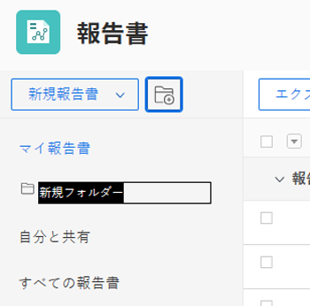
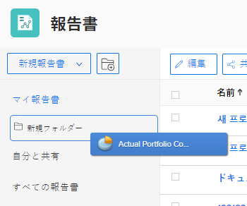

# レポートへのアクセスと整理

Adobe Workfrontのレポートを使用して、システム内のオブジェクトに関する情報を確認または編集できます。 独自のレポートを作成し、作成したレポートを整理し、自分と共有したレポートや公開されているレポートを表示することができます。

## アクセス要件

この記事の手順を実行するには、次のアクセス権が必要です。

<table style="table-layout:auto"> 
 <col> 
 <col> 
 <tbody> 
  <tr> 
   <td role="rowheader">Adobe Workfront plan*</td> 
   <td> 
任意
 </td> 
  </tr> 
  <tr> 
   <td role="rowheader">Adobe Workfront license*</td> 
   <td> 
計画 
 </td> 
  </tr> 
  <tr> 
   <td role="rowheader">アクセスレベル設定*</td> 
   <td> 
レポート、ダッシュボード、カレンダーへのアクセスを編集
 
フィルター、ビュー、グループへのアクセスを編集
 
注意：まだアクセス権がない場合は、Workfront管理者に、アクセスレベルに追加の制限を設定しているかどうかを問い合わせてください。 Workfront管理者がアクセスレベルを変更する方法について詳しくは、 <a href="../../../administration-and-setup/add-users/configure-and-grant-access/create-modify-access-levels.md" class="MCXref xref">カスタムアクセスレベルの作成または変更</a>.
 </td> 
  </tr> 
  <tr> 
   <td role="rowheader">オブジェクト権限</td> 
   <td> 
レポートに対する権限の管理
 
追加のアクセス権のリクエストについて詳しくは、 <a href="../../../workfront-basics/grant-and-request-access-to-objects/request-access.md" class="MCXref xref">オブジェクトへのアクセスのリクエスト </a>.
 </td> 
  </tr> 
 </tbody> 
</table>

&#42;保有しているプラン、ライセンスの種類、アクセス権を確認するには、Workfront管理者に問い合わせてください。

## レポートの表示

自分が作成した、または自分と共有されている、または一般に共有されているレポートにアクセスするには、次の手順を実行します。

1. 次の **メインメニュー** をクリックし、 **レポート**.

1. 表示するレポートに応じて、次のいずれかのオプションをクリックします。

   * クリック **マイレポート** をクリックして、作成したレポートを表示します。
   * クリック **自分と共有** をクリックして、他のユーザーが共有したレポートを表示します。
   * クリック **すべてのレポート** をクリックして、作成したレポートと、自分と共有されているレポート、または公開されているレポートの両方を表示します。

## 作成するレポートを整理します

フォルダーを使用して、作成するレポートを整理できます。 自分と共有されたレポート、公開されたレポート、またはシステムレポートは構成できません。

* [レポート用の新しいフォルダーの作成](#create-a-new-folder-for-reports)
* [フォルダーへのレポートの追加](#add-reports-to-a-folder)

### レポート用の新しいフォルダーの作成 {#create-a-new-folder-for-reports}

1. 次の **メインメニュー** をクリックし、 **レポート**.

1. 次をクリック： **新規フォルダ** アイコン\
   

1. 新しいフォルダーの名前を指定し、Enter キーを押します。
1. 次の **マイレポート** をクリックし、新しいフォルダーにレポートを追加します。\
   新しいフォルダーにレポートを追加する方法について詳しくは、 [フォルダーへのレポートの追加](#add-reports-to-a-folder) 」の節を参照してください。

   >[!NOTE]
   >
   >新しいフォルダーは、 **マイレポート** フォルダー。 新しいフォルダーやレポートを **自分と共有** または **すべてのレポート** フォルダー。

### フォルダーへのレポートの追加 {#add-reports-to-a-folder}

1. 次の **メインメニュー** をクリックし、 **レポート**.

1. クリック **マイレポート**.\
   または\
   の下にネストされた任意のフォルダーをクリックします。 **マイレポート** フォルダー。

1. レポートリストから、レポートを保存するフォルダーにレポートをドラッグし、フォルダーに到達したらドロップします。

   >[!NOTE]
   >
   >レポートは、 **マイレポート** フォルダーを、の下にネストされた他のフォルダーに移動します。 **マイレポート**. またはからにレポートを移動することはできません。 **自分と共有** または **すべてのレポート** フォルダーを他のフォルダーに、または他のフォルダーから移動します。

   
