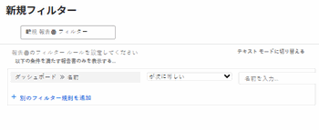

# ダッシュボードでレポートを整理する方法を説明します。

## レポートリスト内のダッシュボード情報へのアクセス

レポートがAdobe Workfrontのダッシュボードに追加されているかどうかを確認できます。 これは、保持できるレポートとシステムから削除できるレポートを決定する際に役立ちます。 レポートがダッシュボード上にある場合、ユーザーは依然としてレポートに依存している可能性があります。 ユーザーが使用しているダッシュボードに一覧表示されているレポートは削除しないことをお勧めします。\
ダッシュボードへのレポートの追加について詳しくは、 [ダッシュボードへのレポートの追加](../../../reports-and-dashboards/dashboards/creating-and-managing-dashboards/add-report-dashboard.md).

次のいずれかの方法で、レポートがダッシュボードに追加されているかどうかを確認できます。

* レポートのリストのビューの作成と、列にダッシュボード情報を含める
* 現在アクティブに使用されていることがわかっている 1 つまたは複数のダッシュボードによるレポートのリストのフィルタリング
* レポートオブジェクトのレポートを作成し、ダッシュボード情報を含むビューまたはフィルタを使用する

誰でもビューやフィルターを作成できますが、レポートを作成するには、アクセスレベルでレポートの編集アクセス権が必要です。\
レポートへのアクセスについて詳しくは、 [レポート、ダッシュボード、カレンダーへのアクセス権の付与](../../../administration-and-setup/add-users/configure-and-grant-access/grant-access-reports-dashboards-calendars.md).\
レポートの作成について詳しくは、 [カスタムレポートの作成](../../../reports-and-dashboards/reports/creating-and-managing-reports/create-custom-report.md).

## アクセス要件

この記事の手順を実行するには、次のアクセス権が必要です。

<table style="table-layout:auto"> 
 <col> 
 <col> 
 <tbody> 
  <tr> 
   <td role="rowheader">Adobe Workfront plan*</td> 
   <td> 
任意
 </td> 
  </tr> 
  <tr> 
   <td role="rowheader">Adobe Workfront license*</td> 
   <td> 
計画 
 </td> 
  </tr> 
  <tr> 
   <td role="rowheader">アクセスレベル設定*</td> 
   <td> 
レポート、ダッシュボード、カレンダーへのアクセスを編集
 
フィルター、ビュー、グループへのアクセスを編集
 
注意：まだアクセス権がない場合は、Workfront管理者に、アクセスレベルに追加の制限を設定しているかどうかを問い合わせてください。 Workfront管理者がアクセスレベルを変更する方法について詳しくは、 <a href="../../../administration-and-setup/add-users/configure-and-grant-access/create-modify-access-levels.md" class="MCXref xref">カスタムアクセスレベルの作成または変更</a>.
 </td> 
  </tr> 
  <tr> 
   <td role="rowheader">オブジェクト権限</td> 
   <td> 
レポートに対する権限の管理
 
追加のアクセス権のリクエストについて詳しくは、 <a href="../../../workfront-basics/grant-and-request-access-to-objects/request-access.md" class="MCXref xref">オブジェクトへのアクセスのリクエスト </a>.
 </td> 
  </tr> 
 </tbody> 
</table>

&#42;保有しているプラン、ライセンスの種類、アクセス権を確認するには、Workfront管理者に問い合わせてください。

## 「レポートリストの表示」でのダッシュボード情報の表示

>[!WARNING]
>
>ダッシュボード列をレポートリストに含めると、特に長いレポートリストの場合に、読み込み時間が大幅に長くなる可能性があります。

レポートリストのダッシュボード情報を使用してビューを作成するには：

1. 次をクリック： **メインメニュー** アイコン  Workfrontの右上隅で、 **レポート**.
1. レポートのリストで、 **表示** ドロップダウンメニュー。
1. クリック **新しいビュー**.
1. 「**列を追加**」をクリックします。 
1. 「ダッシュボード」と入力し、 **フィールド名の入力を開始** フィールドに入力します。
1. 以下 **レポート** オブジェクト、選択 **ダッシュボード**.

1. クリック **ビューを保存**.\
   レポートが表示されるダッシュボードは、レポートリストの「ダッシュボード」列に表示されます。\
   

## ダッシュボード情報によるレポートリストのフィルタリング

ダッシュボード情報でレポートのリストをフィルタするには：

1. 次をクリック： **メインメニュー** アイコン  Workfrontの右上隅で、 **レポート**.

1. レポートのリストで、 **フィルター** ドロップダウンメニュー。
1. クリック **新しいフィルター**&#x200B;を選択し、「 **フィルタールールを追加**.

1. 「ダッシュボード」と入力し、 **フィールド名の入力を開始** フィールドに入力します。

1. 以下 **ダッシュボード** オブジェクト、選択 **名前**.

1. 選択 **次と等しい** 「修飾子」ドロップダウンメニューで、フィルターに使用するダッシュボードの名前を入力します。 フィルターには複数のダッシュボードを選択できます。\
   

1. 「**保存して閉じる**」をクリックします。\
   指定したダッシュボードにのみ表示されるレポートのリストが表示されます。\
   また、レポートオブジェクトのレポートを作成し、このフィルターをレポートで使用することもできます。
