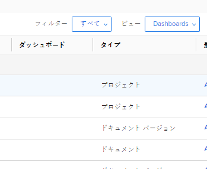

# ダッシュボードでレポートを整理する方法について

## レポートリスト内のダッシュボード情報へのアクセス

レポートが Adobe Workfront のダッシュボードに追加されているかどうかを確認できます。これは、保持できるレポートとシステムから削除できるレポートを決定する際に役立ちます。レポートがダッシュボード上にある場合、ユーザーは依然としてレポートを頼りにしている可能性があります。ユーザーが使用しているダッシュボードに一覧表示されているレポートは削除しないことをお勧めします。\
ダッシュボードにレポートを追加する方法について詳しくは、[ダッシュボードへのレポートの追加](../../../reports-and-dashboards/dashboards/creating-and-managing-dashboards/add-report-dashboard.md)の記事を参照してください。

次のいずれかの方法で、レポートがダッシュボードに追加されているかどうかを確認できます。

* レポートのリストのビューを作成し、列にダッシュボード情報を含める
* 現在アクティブに使用されていることがわかっている 1 つまたは複数の特定のダッシュボードによるレポートのリストのフィルタリング
* レポートオブジェクトのレポートを作成し、ダッシュボード情報を含むビューまたはフィルターを使用

誰でもビューやフィルターを作成できますが、レポートを作成するには、アクセスレベルでレポートの編集アクセス権が必要です。\
レポートへのアクセスについて詳しくは、[レポート、ダッシュボード、カレンダーへのアクセス権の付与](../../../administration-and-setup/add-users/configure-and-grant-access/grant-access-reports-dashboards-calendars.md)の記事を参照してください。\
レポートの作成について詳しくは、[カスタムレポートの作成](../../../reports-and-dashboards/reports/creating-and-managing-reports/create-custom-report.md)を参照してください。

## アクセス要件

この記事の手順を実行するには、次のアクセス権が必要です。

<table style="table-layout:auto"> 
 <col> 
 <col> 
 <tbody> 
  <tr> 
   <td role="rowheader">Adobe Workfront プラン*</td> 
   <td> 
任意
 </td> 
  </tr> 
  <tr> 
   <td role="rowheader">Adobe Workfront ライセンス*</td> 
   <td> 
プラン 
 </td> 
  </tr> 
  <tr> 
   <td role="rowheader">アクセスレベル設定*</td> 
   <td> 
レポート、ダッシュボード、カレンダーへのアクセスの編集
 
フィルター、ビュー、グループへのアクセスを編集
 
メモ：まだアクセス権がない場合は、アクセスレベルに追加の制限が設定されていないかどうか Workfront 管理者にお問い合わせください。Workfront 管理者がユーザーのアクセスレベルを変更する方法については、<a href="../../../administration-and-setup/add-users/configure-and-grant-access/create-modify-access-levels.md" class="MCXref xref">カスタムアクセスレベルの作成または変更</a>を参照してください。
 </td> 
  </tr> 
  <tr> 
   <td role="rowheader">オブジェクト権限</td> 
   <td> 
レポートに対する権限を管理します。
 
追加のアクセス権のリクエストについて詳しくは、<a href="../../../workfront-basics/grant-and-request-access-to-objects/request-access.md" class="MCXref xref">オブジェクトへのアクセス権のリクエスト</a>を参照してください。
 </td> 
  </tr> 
 </tbody> 
</table>

&#42;保有するプラン、ライセンスタイプ、アクセス権を確認するには、Workfront 管理者にお問い合わせください。

## ダッシュボードに関する情報をレポートリストのビューに表示する

>[!WARNING]
>
>ダッシュボード列をレポートリストに含めると、特に長いレポートリストの場合に、読み込み時間が大幅に長くなる可能性があります。

レポートリストのダッシュボード情報を使用してビューを作成するには：

1. Workfront の右上隅で&#x200B;**メインメニュー**&#x200B;アイコン  をクリックし、「**レポート**」をクリックします。
1. レポートのリストで、**表示**&#x200B;ドロップダウンメニューをクリックします。
1. 「**新しいビュー**」をクリックします。
1. 「**列を追加**」をクリックします。
1. 「**フィールド名の入力を開始**」フィールドに「ダッシュボード」と入力し始めます。
1. 「**レポート**」オブジェクトの下で、「**ダッシュボード**」を選択します。

1. 「**ビューを保存**」をクリックします。\
   レポートが表示されるダッシュボードは、レポートリストのダッシュボード列に表示されます。\
   

## ダッシュボード情報によるレポートリストのフィルタリング

ダッシュボード情報でレポートのリストをフィルタリングするには：

1. Workfront の右上隅で&#x200B;**メインメニュー**&#x200B;アイコン  をクリックし、「**レポート**」をクリックします。

1. レポートのリストで、**フィルター**&#x200B;ドロップダウンメニューをクリックします。
1. 「**新規フィルター**」をクリックしたあと、「**フィルター規則の追加**」をクリックします。

1. 「**フィールド名を入力...**」フィールドに「ダッシュボード」と入力していきます。

1. 「**ダッシュボード**」オブジェクトで「**名前**」を選択します。

1. 修飾子ドロップダウンメニューで「**が次に等しい**」を選択し、フィルタリングの条件となるダッシュボードの名前を入力していきます。フィルターには複数のダッシュボードを選択できます。\
   

1. 「**保存して閉じる**」をクリックします。\
   これにより、指定したダッシュボードにのみ一覧表示されているレポートのリストが表示されます。\
   また、レポートオブジェクトのレポートを作成し、このフィルターをレポートで使用することもできます。
