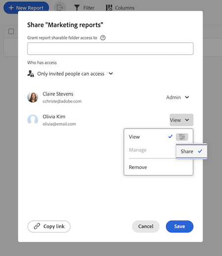

# 共有可能なレポートフォルダーの使用

このページの情報は、まだ一般に提供されていない機能を指します。プレビューサンドボックス環境でのみ使用できます。

<!-- This article is linked in the UI -->

共有可能なレポートフォルダーを使用してレポートを整理し、それらのフォルダーを他のユーザーと共有できます。 この機能は、大量のレポートを管理し、スケーラブルで一貫性のあるアクセス制御を必要とするチーム向けに設計されています。

## アクセス要件

+++ 展開すると、この記事の機能のアクセス要件が表示されます。 

<table style="table-layout:auto"> 
 <col> 
 <col> 
 <tbody> 
  <tr> 
   <td role="rowheader">Adobe Workfront パッケージ</td> 
   <td> 
任意
 </td> 
  </tr> 
  <tr> 
   <td role="rowheader">Adobe Workfront プラン</td> 
   <td> 
   
任意
 </td> 
  </tr> 
  <tr> 
   <td role="rowheader">アクセスレベル設定</td> 
   <td> 
レポート、ダッシュボード、カレンダーへのアクセス権を編集
 
フィルター、ビュー、グループへのアクセスを編集
</td> 
  </tr> 
  <tr> 
   <td role="rowheader">オブジェクト権限</td> 
   <td> 
レポートに対する権限を管理します。
</td> 
  </tr> 
 </tbody> 
</table>

この表の情報について詳しくは、[Workfront ドキュメントのアクセス要件](/help/quicksilver/administration-and-setup/add-users/access-levels-and-object-permissions/access-level-requirements-in-documentation.md)を参照してください。

+++

## フォルダーの権限について

共有可能なレポートフォルダーには、次の2つの権限レベルが使用されます。

* **表示**: ユーザーはフォルダー内でレポートを開くことができますが、フォルダーの詳細の編集、アイテムの追加または削除、フォルダーの削除はできません。 表示アクセス権を持つユーザーにフォルダーの共有を許可するには、アクセス権を付与するときに&#x200B;**共有**&#x200B;設定を有効にします。
* **管理**: ユーザーはフォルダーの詳細を編集し、レポート項目を追加または移動できます。 また、フォルダー内のレポートへの管理アクセス権も付与されます。 管理アクセス権を持つユーザーに、アクセス権を付与するときに&#x200B;**共有**&#x200B;および&#x200B;**削除**&#x200B;設定を有効にすることで、フォルダーの共有または削除を許可できます。

追加の動作：

* システム管理者は、すべてのフォルダーを表示できます。
* 他のユーザーには、アクセス権のあるフォルダーのみが表示されます。
* 親フォルダーに付与された権限は、そのフォルダーツリー内のすべてのサブフォルダーとレポートに適用されます。
* サブフォルダーへのアクセス権を持つユーザーは、その親フォルダーを参照して移動できますが、アクセス権が付与されない限り、兄弟フォルダーは表示されません。

## 共有可能なレポートフォルダーの作成

最上位レベルでフォルダーを作成できるのは、システム管理者のみです。 共有可能なフォルダーを作成した後、管理アクセス権を持つユーザーは、そのフォルダー内にサブフォルダーを作成できます。

{{step1-to-reports}}

1. **共有可能なレポートフォルダー**&#x200B;切り替えをオンにします。
1. 「**フォルダーを作成**」をクリックします。
1. フォルダーの名前を入力します。
1. 「**作成**」をクリックします。

## 共有可能なレポートフォルダーにサブフォルダーを作成する

共有可能なレポートフォルダー内に、最大3つのレベルのサブフォルダーを作成できます。 サブフォルダーは、親フォルダーから権限を継承しますが、各サブフォルダーに一意の権限を設定することもできます。

{{step1-to-reports}}

1. サブフォルダーを作成するフォルダーを見つけます。
1. **詳細** > **サブフォルダーを追加**&#x200B;をクリックします。
1. サブフォルダーの名前を入力します。
1. 「**作成**」をクリックします。

## レポートフォルダーを他のユーザーと共有

ユーザーとフォルダーを共有すると、そのフォルダーツリー内のすべてのサブフォルダーへのアクセスが継承されます。

{{step1-to-reports}}

1. 共有するフォルダーを見つけます。
1. **詳細** > **共有**&#x200B;をクリックします。
1. ユーザー、チーム、役割、グループまたは会社を追加します。
1. **表示**&#x200B;または&#x200B;**管理** アクセスを選択してください：
   * 表示アクセスを使用すると、ユーザーはフォルダー内でレポートを開くことができます。 表示アクセス権を持つユーザーが、追加設定で「**共有**」を選択して、フォルダーを再共有することを許可することもできます。
   * 管理アクセスを使用すると、ユーザーはフォルダーの詳細を編集したり、アイテムを追加または削除したりできます。 管理アクセス権を持つユーザーに、追加の設定で「**削除**」と「**共有**」を選択して、フォルダーを削除または共有する権限を付与することもできます。
1. 「**保存**」をクリックします。

   

## レポートを共有可能なフォルダーに移動する

レポートをフォルダーに移動するには、レポートと共有可能なフォルダーの両方に&#x200B;**管理**&#x200B;権限が必要です。

{{step1-to-reports}}

1. 移動するレポートの横にあるチェックボックスをオンにします。
1. 画面下部のアクションバーで「**フォルダーに移動**」をクリックします。
1. レポートを移動するフォルダーを見つけて、**移動**&#x200B;をクリックします。 レポートツリーはデフォルトで折りたたまれるので、目的のフォルダーを見つけるためにフォルダーを展開する必要がある場合があります。

   

## 共有可能なレポートフォルダーの削除

フォルダーを削除すると、そのフォルダー内のサブフォルダーも削除されます。 フォルダーを削除するには、**管理**&#x200B;のアクセス権が必要です。 フォルダー内のレポートは削除されず、メインレポートリストに残ります。

フォルダー権限を通じて付与されたレポート権限は、フォルダーが削除されると削除されます。 レポートから直接付与された権限、またはダッシュボードから継承された権限は引き続き有効です。

{{step1-to-reports}}

1. **詳細** > **削除**&#x200B;をクリックします。
1. 「**はい、削除**」をクリックして確認します。

## 共有可能なフォルダーの新しいリストエクスペリエンス

レポート エリアで共有可能なフォルダーにアクセスすると、フォルダーとレポートを簡単に表示および管理できる新しいリスト エクスペリエンスが表示されます。 新しいリスト エクスペリエンスについて詳しくは、[拡張リストの使用](/help/quicksilver/workfront-basics/navigate-workfront/use-lists/enhanced-lists.md)を参照してください。

>[!NOTE]
>
>拡張リストエクスペリエンスでは、詳細フィールドはサポートされていません。 これらのフィールドを操作するには、レポートを作成します。
