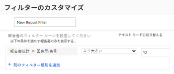

# レポートの使用状況の表示

<!--

(NOTE: : *** DO NOT CHANGE, REMOVE, CHANGE LINK, RENAME THIS ARTICLE- IT IS LINKED TO THE PENDO GUIDE FOR THE MAIN REPORTS AREA***)

-->

システムでのレポートの広範な使用状況を把握するために、次の情報をレポートのリストに表示できます。

* レポートを表示した最近 10 人のユーザー
* 指定した期間内の閲覧数

   >[!NOTE]
   >
   >Adobe Workfrontは、1 日に 1 人のユーザーにつき 1 つのビューをカウントします。 同じレポートに 1 日に複数回アクセスする場合、Workfrontはこれをそのレポートの 1 つのビューとしてカウントします。 同じレポートが別のユーザーが同じ日にアクセスした場合、Workfrontはこれを 2 番目のユーザーの新しい表示としてカウントします。

* 最終表示日
* 最終閲覧者
* レポートを含むダッシュボードのリスト\
   レポートのリストにレポートを追加できるダッシュボードの名前を表示する方法について詳しくは、この記事を参照してください。 [ダッシュボードでレポートを整理する方法を説明します。](../../../reports-and-dashboards/reports/report-usage/understand-how-organize-reports-dashboard.md).

この情報を表示できるレポートのリストのビューを作成できます。\
レポートのリストは、これらのフィールドの一部でフィルタリングできます。\
レポートにフィルターを適用する方法の詳細については、「 [使用状況情報に基づいてレポートリストをフィルタリングする](#filter-a-report-list-by-usage-information).

## アクセス要件

この記事の手順を実行するには、次のアクセス権が必要です。

<table style="table-layout:auto"> 
 <col> 
 <col> 
 <tbody> 
  <tr> 
   <td role="rowheader">Adobe Workfront plan*</td> 
   <td> 
任意
 </td> 
  </tr> 
  <tr> 
   <td role="rowheader">Adobe Workfront license*</td> 
   <td> 
計画 
 </td> 
  </tr> 
  <tr> 
   <td role="rowheader">アクセスレベル設定*</td> 
   <td> 
レポート、ダッシュボード、カレンダーへのアクセスを編集
 
フィルター、ビュー、グループへのアクセスを編集
 
注意：まだアクセス権がない場合は、Workfront管理者に、アクセスレベルに追加の制限を設定しているかどうかを問い合わせてください。 Workfront管理者がアクセスレベルを変更する方法について詳しくは、 <a href="../../../administration-and-setup/add-users/configure-and-grant-access/create-modify-access-levels.md" class="MCXref xref">カスタムアクセスレベルの作成または変更</a>.
 </td> 
  </tr> 
  <tr> 
   <td role="rowheader">オブジェクト権限</td> 
   <td> 
レポートに対する権限の管理
 
追加のアクセス権のリクエストについて詳しくは、 <a href="../../../workfront-basics/grant-and-request-access-to-objects/request-access.md" class="MCXref xref">オブジェクトへのアクセスのリクエスト </a>.
 </td> 
  </tr> 
 </tbody> 
</table>

&#42;保有しているプラン、ライセンスの種類、アクセス権を確認するには、Workfront管理者に問い合わせてください。

## レポートの使用状況に関する情報をレポートリストの表示に表示する

1. 次をクリック： **メインメニュー** アイコン  Workfrontの右上隅で、 **レポート**.

1. レポートのリストで、 **表示** ドロップダウンメニュー。
1. （オプション） **レポートの使用状況** 表示をクリックすると、最も一般的なレポート使用状況情報が表示されます。\
   または

1. クリック **新しいビュー** をクリックして、カスタムビューを作成します。
1. クリック **列を追加**.
1. 次のフィールドのいずれかを入力し始め、リストの下に表示されたら、それらを選択します。 **レポート** オブジェクトを使用して新しい列に追加します。

   * **最近の 10 人のユーザー**:レポートを閲覧した直近 10 人のユーザーの名前が表示されます。
   * **件数**:次のいずれかの期間内のビュー数を表示します。

      * **今月、四半期、年**
      * **先月、四半期、年**
      * **すべてのビュー**:レポートのすべてのビューの総数を表示
   * **最終閲覧者**:最後にレポートを表示したユーザーに関する情報を表示します
   * **最終閲覧日**:レポートが最後に表示された日付を表示します

1. クリック **ビューを保存**.\
   レポートの使用状況情報が、ビューに追加した列に表示されます。\
   また、レポートオブジェクトのレポートを作成し、このビューをレポートで使用することもできます。\
   レポートの作成について詳しくは、 [カスタムレポートの作成](../../../reports-and-dashboards/reports/creating-and-managing-reports/create-custom-report.md).\
   レポートを作成するには、アクセスレベルでレポートに対する編集アクセス権が必要です。\
   レポートへのアクセスについて詳しくは、 [レポート、ダッシュボード、カレンダーへのアクセス権の付与](../../../administration-and-setup/add-users/configure-and-grant-access/grant-access-reports-dashboards-calendars.md).

## 使用状況情報に基づいてレポートリストをフィルタリングする {#filter-a-report-list-by-usage-information}

1. 次をクリック： **メインメニュー** アイコン  Workfrontの右上隅で、 **レポート**.
1. レポートのリストで、 **フィルター** ドロップダウンメニュー。
1. クリック **新しいフィルター**&#x200B;を選択し、「 **フィルタールールを追加**.
1. 次のフィールドのいずれかを入力し始め、リストの下に表示されたら、それらを選択します。 **レポート** オブジェクトを使用して、新しいフィルター規則として追加できます。

   * **件数**:次のいずれかの期間内のビュー数を表示します。

      * **今月、四半期、年**
      * **先月、四半期、年**
      * **すべてのビュー**
   * **最終閲覧者**:最後にレポートを表示したユーザーに関する情報を表示します
   * **最終閲覧日**:レポートが最後に表示された日付を表示します

1. フィールドの修飾子を選択し、プロンプトが表示されたら値を指定します。\
   

1. クリック **フィルターを保存**.\
   定義した使用状況の情報を満たすレポートのリストが表示されます。\
   また、レポートオブジェクトのレポートを作成し、このフィルターをレポートで使用することもできます。\
   レポートの作成について詳しくは、 [カスタムレポートの作成](../../../reports-and-dashboards/reports/creating-and-managing-reports/create-custom-report.md). レポートを作成するには、アクセスレベルでレポートに対する編集アクセス権が必要です。\
   レポートへのアクセスについて詳しくは、 [レポート、ダッシュボード、カレンダーへのアクセス権の付与](../../../administration-and-setup/add-users/configure-and-grant-access/grant-access-reports-dashboards-calendars.md).

## レポート使用状況情報を表示する際の例外

>[!IMPORTANT]
>
>レポートの使用状況に関する情報は、2018 年 3 月以降に収集されています。 この日より前の情報は使用できません。

レポート使用状況情報を使用する際に注意すべき例外を次に示します。

* レポートがダッシュボードまたはカスタムタブに表示されるたびに、1 つのビューとしてカウントされます。 そのレポートをダッシュボードに表示しているユーザーは、「最終表示者」として表示されます。ユーザー名とダッシュボードが表示された日付が、最終閲覧日として表示されます。
* Workfrontでは、組み込みレポートの使用状況情報は収集されません。\
   Workfrontの組み込みレポートについて詳しくは、 [Adobe Workfrontの組み込みレポートの使用](../../../reports-and-dashboards/reports/using-built-in-reports/use-workfront-built-in-reports.md).

* Workfrontは、配信されたレポートの使用状況情報を収集しません。 配信されたレポートは 1 つのビューとしてカウントされません。\
   配信されるレポートについて詳しくは、 [レポート配信の概要](../../../reports-and-dashboards/reports/creating-and-managing-reports/set-up-report-deliveries.md).

* システム管理者またはグループ管理者が別のユーザーとしてログインすると、ビューがカウントされ、システム管理者またはグループ管理者に関連付けられます。
* Workfrontは、レポートの使用状況情報をカスタム四半期ごとに収集しません。 レポート使用フィールドでは、標準の組み込みの四半期のみが参照されます。
* Workfrontは、公開されて表示されるレポートの使用情報を収集しません。 Workfrontにログインせずに公開レポートを表示した場合、そのレポートの表示回数はカウントされません。\
   レポートの共有の詳細については、「 [Adobe Workfrontでのレポートの共有](../../../reports-and-dashboards/reports/creating-and-managing-reports/share-report.md).
