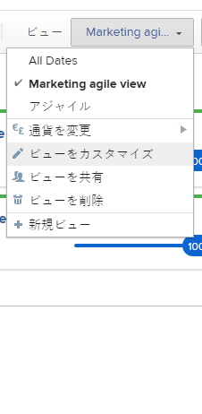

# Adobe Workfrontでビューを作成または編集

ビューを使用して、画面に表示する情報の種類をカスタマイズできます。 Adobe Workfrontでは、複数のタイプのビューを使用できます。

この記事では、リストとレポートの標準ビューを作成および編集する方法と、アジャイルビューを作成する方法について説明します。 詳しくは、 [Adobe Workfrontの概要を表示](../../../reports-and-dashboards/reports/reporting-elements/views-overview.md).

## アクセス要件

この記事の手順を実行するには、次のアクセス権が必要です。

<table style="table-layout:auto"> 
 <col> 
 <col> 
 <tbody> 
  <tr> 
   <td role="rowheader"><strong>Adobe Workfront plan*</strong></td> 
   <td> 
任意
 </td> 
  </tr> 
  <tr> 
   <td role="rowheader"><strong>Adobe Workfront license*</strong></td> 
   <td> 
リクエスト以上
 </td> 
  </tr> 
  <tr> 
   <td role="rowheader"><strong>アクセスレベル設定*</strong></td> 
   <td> 
フィルター、ビュー、グループへのアクセスを編集
 
レポート、ダッシュボード、カレンダーへのアクセスを編集して、レポートのビューを作成します
 
注意：まだアクセス権がない場合は、Workfront管理者に、アクセスレベルに追加の制限が設定されているかどうかを問い合わせてください。 Workfront管理者がアクセスレベルを変更する方法について詳しくは、 <a href="../../../administration-and-setup/add-users/configure-and-grant-access/create-modify-access-levels.md" class="MCXref xref">カスタムアクセスレベルの作成または変更</a>.
 </td> 
  </tr> 
  <tr> 
   <td role="rowheader"><strong>オブジェクトの権限</strong></td> 
   <td> 
レポートに対する権限を管理して、レポートのビューを作成または編集します
 
ビューに対する権限を管理して編集
 
追加のアクセス権のリクエストについて詳しくは、 <a href="../../../workfront-basics/grant-and-request-access-to-objects/request-access.md" class="MCXref xref">オブジェクトへのアクセスのリクエスト </a>.
 </td> 
  </tr> 
 </tbody> 
</table>

&#42;保有するプラン、ライセンスの種類、アクセス権を確認するには、Workfront管理者に問い合わせてください。

## ビューの作成またはカスタマイズ

ビューの作成またはカスタマイズのプロセスは、標準ビューを作成するか、アジャイルビューをカスタマイズするかによって異なります。

* [標準ビューを作成またはカスタマイズする](#create-or-customize-a-standard-view)
* [アジャイルビューの作成またはカスタマイズ](#create-or-customize-an-agile-view)

### 標準ビューを作成またはカスタマイズする {#create-or-customize-a-standard-view}

新しい標準ビューを作成するか、以前に作成した既存の標準ビューをカスタマイズすることができます。

1. 次をクリック： **表示** ビューを作成またはカスタマイズする任意のリストのドロップダウンメニュー。
1. （オプション）既存のビューをカスタマイズするには、カスタマイズする標準ビューを選択します。\
   標準ビューは、Workfrontの任意のタイプのリスト（レポート、プロジェクトリスト、タスクリストなど）で使用できます。
1. 次をクリック： **表示** ドロップダウンメニューから、 **表示をカスタマイズ** または **新しいビュー**.\
   The **表示をカスタマイズ** ダイアログボックスが表示されます。

1. Adobe Analytics の **列のプレビュー** セクションで、次のいずれかの操作を行います。

   * 列タイトルをクリックし、新しいフィールドを選択して、列の値を変更します。
   * 列を追加するには、 **列を追加**&#x200B;をクリックし、追加する列の名前を入力し、ドロップダウンリストに表示されたらクリックします。
   * 列タイトルを新しい場所にドラッグして、列の表示順を調整します。

      * （オプション） **列設定** 「 」領域で、 **この列の要約基準** 」ドロップダウンリストから、情報を要約するための使用可能なオプションの 1 つを選択します。 このオプションを選択すると、列の情報がレポートのグループ化で集計されます。\
        日付フィールドの場合、次のオプションで値を要約できます。

         * 最大
         * 最小

        数値フィールドと通貨フィールドの場合、次のオプションで値を要約できます。

         * カウント
         * Sum
         * 平均
         * 最大
         * 最小

        >[!NOTE]
        >
        >次の例外は、グループ化で次のフィールドの値を集計する場合に親オブジェクト（親タスクなど）に適用されます。
        >   
        >   * 「実績時間」（「計画/実績労務費」、「計画/実費原価」、「計画/実費」、「計画/実費」、「計画時間」など）を除くすべての数値および通貨フィールドは、子タスクとスタンドアロンタスクの値のみを集計します。 親タスクや親の値は集計されません。
        >   * [ 実績時間 ] は、メインの親タスクとスタンドアロンのタスクの値を集計します。親タスクの親や子タスクの数値は集計されません。
        >   * 数値および通貨値のカスタムデータフィールドは、親、子、親の親、スタンドアロンタスクのすべてのタスクを集計します。
        >   
        >

        レポートでのグループ化の使用について詳しくは、 [Adobe Workfrontでのグループ化の概要](../../../reports-and-dashboards/reports/reporting-elements/groupings-overview.md).

      * （オプション）「 **詳細オプション** 列に次の情報を指定するには：

        <table style="table-layout:auto"> 
         <col> 
         <col> 
         <tbody> 
          <tr> 
           <td role="rowheader"><strong>カスタム列ラベル</strong></td> 
           <td>
列のカスタムラベルを指定します。 このラベルは、デフォルトのラベルを置き換えます。
</td> 
          </tr> 
          <tr> 
           <td role="rowheader"><strong>フィールド形式</strong></td> 
           <td>列のフィールドに値を表示する形式を選択します。</td> 
          </tr> 
          <tr> 
           <td role="rowheader"><strong>ダッシュボードにこのカラムを表示</strong></td> 
           <td>
このオプションを選択すると、レポートが別のレポートと並べて表示される場合に、この列がダッシュボードに表示されます。 このオプションを選択しない場合、レポートが並べて表示されるダッシュボードでレポートを表示する際に、この列は表示されません。
</td> 
          </tr> 
          <tr> 
           <td role="rowheader"><strong>カラムのルール</strong></td> 
           <td>
クリック <strong>この列にルールを追加する</strong> 」をクリックして、列のルールを定義します。 ルールを追加した後、そのルールに一致するフィールドの表示方法に対して、フィールドおよびテキストスタイルを定義できます。 クリック <strong>ルールを追加</strong> ルールの定義が完了したら、次の手順に従います。
</td> 
          </tr> 
         </tbody> 
        </table>

        レポートのビューを条件付きで書式設定する方法について詳しくは、この記事を参照してください。 [テキストモードでの条件付き書式の使用](../../../reports-and-dashboards/reports/text-mode/use-conditional-formatting-text-mode.md).

1. （条件付き）クリックした場合 **詳細オプション**&#x200B;をクリックし、 **完了**.

1. クリック **ビューを保存** をクリックして新しいビューを作成するか、現在のビューを変更に置き換えます。\
   または\
   クリック **新しいビューとして保存** 変更を新しいビューとして保存します。

   >[!TIP]
   >
   >The **新しいビューとして保存** は、組み込みのWorkfront表示をカスタマイズした場合に使用できる唯一のオプションです。

   アクセス権は、ビューの保存方法を示します。 最初にビューを作成した場合は、変更を保存できます。それ以外の場合は、バージョンを保存するよう求められます。 ビューに加えた変更は、そのビューが共有されているユーザーに影響を与えることに注意してください。

### アジャイルビューの作成またはカスタマイズ {#create-or-customize-an-agile-view}

アジャイルビューを作成したり、以前に作成した既存のアジャイルビューをカスタマイズしたりできます。

>[!IMPORTANT]
>
>「アジャイルビュー」は、プロジェクトの表示時にのみ使用できます。

アジャイルビューの詳細については、「 [アジャイルビューでのプロジェクト管理](../../../manage-work/projects/manage-projects/manage-projects-in-agile-view.md).

>[!NOTE]
>
>この手順は、レガシーのアジャイルビューにのみ適用され、プロジェクトのボードビューには適用されません。

アジャイルビューを作成またはカスタマイズするには：

1. プロジェクトのタスクのリストに移動します。
1. 次をクリック： **ボード** アイコン をクリックし、 **レガシーアジャイルを使用** をボードビューに追加します。

1. （条件付き）既存のアジャイルビューをカスタマイズするには：

   1. 次をクリック： **表示** ドロップダウンメニューから、カスタマイズする「アジャイルビュー」を選択します。\
      デフォルトのアジャイルビューはカスタマイズできません。

   1. 次をクリック： **表示** ドロップダウンメニューを再度表示し、「 **表示をカスタマイズ**.\
      

1. （条件付き）新しいアジャイルビューを作成するには、 **新しいビュー**.\
   The **アジャイルビューのカスタマイズ** ダイアログボックスが表示されます。

1. Adobe Analytics の **アジャイルビューのカスタマイズ** ダイアログボックスで、アジャイルビューの名前を指定します。\
   ビュー名には「アジャイル」という単語を含めることをお勧めします。これはアジャイルビューであることをユーザーが認識できるようにするためです。\
   この名前は、 **表示** ドロップダウンメニューを使用してビューを選択できます。

1. ステータス列を定義して、アジャイルビューのストーリーボードに表示します。 これらは、Workfront管理者が定義したタスクステータスです。詳しくは、 [ステータスの作成または編集](../../../administration-and-setup/customize-workfront/creating-custom-status-and-priority-labels/create-or-edit-a-status.md).

   アジャイルストーリーボードで使用できるのは、システムステータスのみです。 自分が属する個々のグループに対してのみステータスが使用可能な場合は、アジャイルストーリーボードではステータスは使用できません。 さらに、カスタムグループでのみ使用可能なステータスのタスクは、プロジェクトをアジャイルビューで表示するときには表示されません。

   ユーザーは、アジャイルストーリーボード上のステータス列間でストーリーを移動できます。\
   ステータス列を定義する際に、次の操作を実行できます。

   <table style="table-layout:auto"> 
    <col> 
    <col>
    <tbody> 
     <tr> 
      <td role="rowheader"><strong>ステータス列の並べ替え：</strong> </td> 
      <td> ステータス列を、表示する順序にドラッグします。 </td> 
     </tr> 
     <tr> 
      <td role="rowheader"><strong>ステータス列を削除：</strong> </td> 
      <td>削除する列の (x) アイコンをクリックします。 カスタムステータスが「新規」と等しく、カスタムステータスがビューに追加されていない場合は、「新規」ステータスを削除できません。 カスタムステータスの作成について詳しくは、 <a href="../../../administration-and-setup/customize-workfront/creating-custom-status-and-priority-labels/create-or-edit-a-status.md" class="MCXref xref">ステータスの作成または編集</a>.</td> 
     </tr> 
     <tr> 
      <td role="rowheader"><strong>ステータス列を追加：</strong> </td> 
      <td> 
次をクリック： <strong>プラス</strong> アイコンをクリックし、追加するステータスを選択します。 すべてのデフォルトのシステムステータスと、自分と共有されているカスタムステータスが表示されます。 表示するステータスは最大 10 個まで設定できます。
</td> 
     </tr> 
    </tbody> 
   </table>

   <!--
        
(NOTE FOR ADD STATUS COLUMNS: research this and add: [! What if the status has been shared with me or a group I'm in (so I can see it here), but the status hasn't been shared with another user who also has access to a project where I later apply this view? Can that user still see this status on the project?]) 

       -->

1. Adobe Analytics の **カードの色の関連付け先** 「 」領域で、次のオプションから選択します。

   <table style="table-layout:auto"> 
    <col> 
    <col>
    <tbody> 
     <tr> 
      <td role="rowheader"><strong>ストーリー：</strong> </td> 
      <td>サブタスクはすべて親タスクの色に一致するので、特定のスイムレーン内のすべてのストーリーの色が同じになります。 色は、タスクにサブタスクがない場合や親タスクがない場合に、タスクを作成するときにランダムにタスクに割り当てられます。</td> 
     </tr> 
     <tr> 
      <td role="rowheader"><strong>フリーフォーム：</strong> </td> 
      <td> ユーザーが手動で色を変更するまでは、すべてのカードはデフォルトで青で表示されます。詳しくは、この記事を参照してください <a href="../../../agile/use-scrum-in-an-agile-team/scrum-board/categorize-stories-by-color.md" class="MCXref xref">スクラムボード上でストーリーを色別に分類する</a>. </td> 
     </tr> 
     <tr> 
      <td role="rowheader"><strong>優先度：</strong> </td> 
      <td> 
 色は、次のようにストーリーの優先度に関連付けられます。
 
       <ul> 
        <li>高=赤</li> 
        <li>中=黄</li> 
        <li>低=緑 Workfrontの管理者がWorkfrontシステムに対してカスタムの優先度を設定している場合、最も優先度が高いのは赤、2 番目に高いのは黄、残りのは緑です。</li> 
       </ul> </td> 
     </tr> 
     <tr> 
      <td role="rowheader"><strong>タスク所有者：</strong> </td> 
      <td> 同じ主な担当者を持つすべてのストーリーは同じ色です。 主な担当者は、最初にタスクに割り当てられたユーザーです。 </td> 
     </tr> 
    </tbody> 
   </table>

1. Adobe Analytics の **アジャイル** セクション内の **追加のフィールド** 領域、クリック **フィールドを追加**&#x200B;をクリックし、ストーリーカードに追加するフィールドを選択します。 （これらは、ビューのカスタマイズ時やレポートの列の作成時に追加できるフィールドと同じです）。\
   この手順を繰り返して、ストーリーカードに最大 3 つのフィールドを追加します。\
   ストーリーカードにフィールドを追加すると、フィールドは表示のみで、フィールドに値が入力された場合にのみ表示されます。

   デフォルトでは、次のタイプのデータがストーリーカードに表示されます。

   * タスクに直接リンクされたストーリー名
   * プロジェクトに直接リンクされたプロジェクト名\
     このリンクは、反復でアジャイルビューを使用する場合にのみ表示されます。プロジェクトでアジャイルビューを使用する場合は表示されません。
   * タスクの説明
   * 現在のコミットメント
   * 完了率を表示および編集するには、完了率自体を調整するか、完了したポイント数または時間数を調整します
   * 割り当てられたユーザー

   追加のデータ（カスタムデータを含む）をストーリーカードに表示できます。 ストーリーカードに追加のフィールドを表示する理由はいくつでもあります。 例えば、プロジェクト内で複数の顧客のストーリーを扱う場合には、顧客 ID を表示したい場合や、タスクの開始日を表示したい場合があります。

1. 「**保存**」をクリックします。\
   アクセス権は、ビューの保存方法を示します。 最初にビューを作成した場合は、変更を保存できます。それ以外の場合は、バージョンを保存するよう求められます。 ビューに加えた変更は、そのビューが共有されているユーザーに影響を与えることに注意してください。

1. （オプション） **リスト** アイコンをクリックして、タスクのリストに戻ります。
