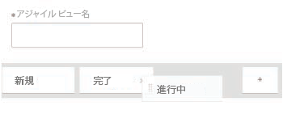

# Adobe Workfront でのビューの作成または編集

<!-- Audited: 11/2024 -->

ビューを使用して、画面に表示する情報のタイプをカスタマイズできます。Adobe Workfront では、複数のタイプのビューを使用できます。

この記事では、リストとレポートの標準ビューを作成および編集する方法と、アジャイルビューを作成する方法について説明します。詳しくは、[Adobe Workfront のビューの概要](../../../reports-and-dashboards/reports/reporting-elements/views-overview.md)を参照してください。

## アクセス要件

+++ 展開すると、この記事の機能のアクセス要件が表示されます。

この記事の手順を実行するには、次のアクセス権が必要です。

<table style="table-layout:auto"> 
 <col> 
 <col> 
 <tbody> 
  <tr> 
   <td role="rowheader"><strong>Adobe Workfront プラン</strong></td> 
   <td> 
任意
 </td> 
  </tr> 
  <tr> 
   <td role="rowheader"><strong>Adobe Workfront プラン*</strong></td> 
   <td> 
      
新規：

         <ul>
         <li>
投稿者以上
</li>
         </ul>
      
現在：

         <ul>
         <li>
リクエスト以上
</li>
         </ul>
   </td>
  </tr> 
  <tr> 
   <td role="rowheader"><strong>アクセスレベル設定*</strong></td> 
   <td> 
フィルター、ビュー、グループへのアクセスを編集
 
レポートのビューを作成するために、レポート、ダッシュボード、カレンダーへの編集アクセス権

   </td> 
  </tr> 
  <tr> 
   <td role="rowheader"><strong>オブジェクトの権限*</strong></td> 
   <td> 
レポートのビューを作成または編集するために、レポートに対する管理権限
 
編集するために、ビューに対する管理権限

   </td> 
  </tr> 
 </tbody> 
</table>

*詳しくは、[Workfront ドキュメントのアクセス要件 ](/help/quicksilver/administration-and-setup/add-users/access-levels-and-object-permissions/access-level-requirements-in-documentation.md) を参照してください。

+++

## ビューの作成またはカスタマイズ

ビューの作成またはカスタマイズのプロセスは、標準ビューとアジャイルビューのどちらを作成またはカスタマイズしているかによって異なります。

* [標準ビューを作成またはカスタマイズ](#create-or-customize-a-standard-view)
* [アジャイルビューを作成またはカスタマイズ](#create-or-customize-an-agile-view)

### 標準ビューを作成またはカスタマイズ {#create-or-customize-a-standard-view}

標準ビューを新規作成するか、以前作成した既存の標準ビューをカスタマイズすることができます。

1. ビューを作成またはカスタマイズするリストの&#x200B;**表示**&#x200B;ドロップダウンメニューをクリックします。

1. 「**+新規ビュー**」ボタンをクリックして、新規ビューを作成します。
または
編集する既存のビューの右側にマウスポインターを置くと表示される **編集** アイコン  をクリックします。
**ビューをカスタマイズ**&#x200B;ダイアログボックスが表示されます。

1. 「**列のプレビュー**」セクションで、以下のいずれかを行います。

   * 列のタイトルをクリックし、新しいフィールドを選択して、列の値を変更します。
   * 「**列を追加**」をクリックして列を追加し、追加する列の名前を入力し、ドロップダウンリストに表示されたらクリックします。
   * 列のタイトルを新しい場所にドラッグして、列の表示順序を調整します。

   * [**列の設定**] 領域で、[**この列の集計方法**] をクリックし、列でのデータの表示方法を選択します。 このオプションは、次の列タイプで使用できます。
     <table style="table-layout:auto"> 
         <col> 
         <col> 
         <tbody> 
          <tr> 
           <td role="rowheader"><strong>日付フィールド</strong></td> 
           <td><ul>
           <li>最大</li>
         <li>最小</li>
           </ul></td> 
          </tr> 
          <tr>
           <td role="rowheader"><strong>通貨フィールド</strong></td> 
           <td><ul>
           <li>カウント</li>
         <li>合計</li>
           <li>平均</li>
         <li>最大</li>
           <li>最小</li>
         </ul></td> 
          </tr> 
         <tr>
           <td role="rowheader"><strong>文字列フィールドとブール値フィールド</strong></td> 
           <td><ul><li>カウント</li></ul>
           
メモ：値は常に true または false なので、Workfrontは通常、ブール値フィールドをカウントで要約することはお勧めしません。
</td> 
          </tr> 
         </tbody> 
        </table>

     >[!NOTE]
     >
     >グループ化の次のフィールドの値を要約する場合、親オブジェクト（親タスクなど）に次の例外が適用されます：
     >   
     > * 「実績時間数」を除くすべての数値および通貨フィールド（たとえば、「予定/実績労力コスト」、「予定/実績費用コスト」、「予定/実績コスト」、「予定時間数」）は、子タスクとスタンドアロンタスクのみの値を要約します。 親タスクの値や親の親の値は集計されません。
     > * 実績時間では、メインの親タスクとスタンドアロン・タスクの値が要約されます。親タスクまたは子タスクの親の数値は要約されません。
     > * 数値および通貨値のカスタム データ フィールドには、親、子、親の親、およびスタンドアロン タスクのすべてのタスクが要約されます。
     >
     >レポートでのグループ化の使用について詳しくは、[Adobe Workfront でのグループ化の概要](../../../reports-and-dashboards/reports/reporting-elements/groupings-overview.md)を参照してください。

      * （オプション）**「詳細」オプション**&#x200B;をクリックして、列に以下の情報を指定します。

        <table style="table-layout:auto"> 
         <col> 
         <col> 
         <tbody> 
          <tr> 
           <td role="rowheader"><strong>カスタム列ラベル</strong></td> 
           <td>
列のカスタムラベルを指定します。このラベルは、デフォルトのラベルを置き換えます。 互換性の問題を回避するには、UTF-8 文字のみを使用することをお勧めします。
</td> 
          </tr> 
          <tr> 
           <td role="rowheader"><strong>フィールド形式</strong></td> 
           <td>列のフィールドに値を表示する形式を選択します。</td> 
          </tr> 
          <tr> 
           <td role="rowheader"><strong>ダッシュボードにこのカラムを表示</strong></td> 
           <td>
このオプションを選択すると、レポートが別のレポートと並べて表示される際に、この列がダッシュボードに表示されます。このオプションを選択しない場合、レポートが並べて表示されるダッシュボードでレポートを表示する際に、この列は表示されません。
</td> 
          </tr> 
          <tr> 
           <td role="rowheader"><strong>カラムのルール</strong></td> 
           <td>
「<strong>+この列にルールを追加」をクリックして </strong> 列のルールを定義します。 ルールを追加した後、そのルールに一致するフィールドの表示方法について、フィールドとテキストのスタイルを定義できます。ルールの定義が完了したら、「<strong>ルールを追加</strong>」をクリックします。
</td> 
          </tr> 
         </tbody> 
        </table>

        レポートのビューを条件付きで書式設定する方法について詳しくは、[テキストモードでの条件付き書式の使用](../../../reports-and-dashboards/reports/text-mode/use-conditional-formatting-text-mode.md)の記事を参照してください。

1. （条件付き）**「詳細」オプション**&#x200B;をクリックした場合は、「**完了**」をクリックします。

1. 「**ビューを保存**」をクリックしてビューを新規作成するか、現在のビューを変更して置き換えます。\
   または\
   「**新規ビューとして保存**」をクリックして、変更を新規ビューとして保存します。

   >[!TIP]
   >
   >「**新規ビューとして保存**」は、組み込み Workfront ビューをカスタマイズした場合に使用できる唯一のオプションです。

   アクセス権によって、ビューの保存方法が決まります。最初にビューを作成した場合は、変更を保存できます。それ以外の場合は、バージョンを保存するよう求められます。ビューに加えた変更は、そのビューを共有しているユーザーに影響を与えることに注意してください。

### アジャイルビューを作成またはカスタマイズ {#create-or-customize-an-agile-view}

アジャイルビューを作成したり、以前に作成した既存のアジャイルビューをカスタマイズしたりできます。

>[!IMPORTANT]
>
>アジャイルビューは、プロジェクトの表示時にのみ使用できます。

アジャイルビューについて詳しくは、[アジャイルビューでのプロジェクトの管理](../../../manage-work/projects/manage-projects/manage-projects-in-agile-view.md)の記事を参照してください。

>[!NOTE]
>
>この手順は、従来のアジャイルビューにのみ適用され、プロジェクトのボードビューには適用されません。

アジャイルビューを作成またはカスタマイズするには、以下のように行います。

1. プロジェクトのタスクのリストに移動します。
1. **ボード**&#x200B;アイコン  をクリックし、続いてボードビューの「**従来のアジャイルを使用**」をクリックします。

1. （条件付き）既存のアジャイルビューをカスタマイズするには、以下のように行います。

   1. **表示**&#x200B;ドロップダウンメニューをクリックし、カスタマイズするアジャイルビューを選択します。\
      デフォルトのアジャイルビューはカスタマイズできません。

   1. **表示**&#x200B;ドロップダウンメニューを再度クリックし、続いて「**ビューをカスタマイズ**」をクリックします。\
      

1. （条件付き）アジャイルビューを新規作成するには、「**新規ビュー**」をクリックします。\
   **アジャイルビューをカスタマイズ**&#x200B;ダイアログボックスが表示されます。

1. **アジャイルビューをカスタマイズ**&#x200B;ダイアログボックスで、アジャイルビューの名前を指定します。\
   ビュー名には「アジャイル」という単語を含めることをお勧めします。これはアジャイルビューであることをユーザーが認識できるようにするためです。\
   この名前は、選択されたときに&#x200B;**表示**&#x200B;ドロップダウンメニューに表示されます。

1. ステータス列を定義して、アジャイルビューのストーリーボードに表示します。これらのタスクステータスは、[ステータスの作成または編集](../../../administration-and-setup/customize-workfront/creating-custom-status-and-priority-labels/create-or-edit-a-status.md)で説明されているように、Workfront 管理者が定義したものです。

   システムステータスのみが、アジャイルストーリーボードで使用できます。自分が属する個々のグループに対してのみステータスが使用可能な場合は、アジャイルストーリーボードではステータスは使用できません。さらに、カスタムグループのみが使用できるステータスにあるタスクは、アジャイルビューでプロジェクトを表示するときには表示されません。

   ユーザーは、アジャイルストーリーボード上のステータス列の間でストーリーを移動できます。\
   ステータス列を定義する際に、以下の操作を実行できます。

   <table style="table-layout:auto"> 
    <col> 
    <col>
    <tbody> 
     <tr> 
      <td role="rowheader"><strong>ステータス列の並べ替え：</strong> </td> 
      <td> ステータス列を、表示する順番にドラッグします。 </td> 
     </tr> 
     <tr> 
      <td role="rowheader"><strong>ステータス列を削除：</strong> </td> 
      <td>削除する列の（x）アイコンをクリックします。 ビューにカスタムステータスが追加されていて、そのカスタムステータスが「新規」と同等でない限り、「新規」ステータスを削除することはできません。 カスタムステータスの作成について詳しくは、<a href="../../../administration-and-setup/customize-workfront/creating-custom-status-and-priority-labels/create-or-edit-a-status.md" class="MCXref xref">ステータスの作成または編集</a>を参照してください。</td> 
     </tr> 
     <tr> 
      <td role="rowheader"><strong>ステータス列を追加：</strong> </td> 
      <td> 
<strong>プラス</strong>アイコンをクリックし、追加するステータスを選択します。 すべてのデフォルトのシステムステータスと、すべての自分と共有されているカスタムステータスが表示されます。 表示するステータスを最大 10 個まで設定できます。
</td> 
     </tr> 
    </tbody> 
   </table>

   <!--
        
(NOTE FOR ADD STATUS COLUMNS: research this and add: [! What if the status has been shared with me or a group I'm in (so I can see it here), but the status hasn't been shared with another user who also has access to a project where I later apply this view? Can that user still see this status on the project?]) 

       -->

1. **カードのカラーを関連付ける対象**&#x200B;エリアで、以下のオプションから選択します。

   <table style="table-layout:auto"> 
    <col> 
    <col>
    <tbody> 
     <tr> 
      <td role="rowheader"><strong>ストーリー:</strong> </td> 
      <td>サブタスクはすべて親タスクのカラーに一致するので、特定のスイムレーン内のすべてのストーリーのカラーが同じになります。 タスクにサブタスクがない場合や親タスクがない場合は、タスクの作成時にカラーがランダムに割り当てられます。</td> 
     </tr> 
     <tr> 
      <td role="rowheader"><strong>自由形式：</strong> </td> 
      <td> <a href="../../../agile/use-scrum-in-an-agile-team/scrum-board/categorize-stories-by-color.md" class="MCXref xref">スクラムボード上でストーリーをカラー別に分類</a>の記事で説明されているように、ユーザーが手動でカラーを変更するまでは、すべてのカードはデフォルトで青で表示されます。 </td> 
     </tr> 
     <tr> 
      <td role="rowheader"><strong>優先度：</strong> </td> 
      <td> 
 以下のように、ストーリーの優先度にカラーが関連付けられます。
 
       <ul> 
        <li>高 = 赤色</li> 
        <li>中 = 黄色</li> 
        <li>低 = 緑 Workfront 管理者が Workfront システムのカスタム優先度を設定している場合、最も高い優先度は赤、2 番目に高い優先度は黄色、残りは緑です。</li> 
       </ul> </td> 
     </tr> 
     <tr> 
      <td role="rowheader"><strong>タスク責任者：</strong> </td> 
      <td> 同じプライマリ担当者を持つすべてのストーリーは同じカラーです。 プライマリ担当者は、最初にタスクに割り当てられたユーザーです。 </td> 
     </tr> 
    </tbody> 
   </table>

1. **追加フィールド** 領域で **フィールドの追加** をクリックし、ストーリーカードに追加するフィールドを選択します。 （これらは、ビューのカスタマイズ作成時やレポートの列の作成時に追加できるフィールドと同じです。）\
   このプロセスを繰り返して、ストーリーカードに最大 3 つのフィールドを追加します。\
   フィールドをストーリーカードに追加すると、フィールドは表示専用となり、フィールドにデータが入力されている場合にのみ表示されます。

   デフォルトでは、以下のタイプのデータがストーリーカードに表示されます。

   * タスクへの直接リンクを含むストーリー名
   * プロジェクトへの直接リンクを含むプロジェクト名\
     このリンクは、イテレーションでアジャイルビューを使用する場合にのみ表示されます。プロジェクトでアジャイルビューを使用する場合は表示されません。
   * タスクの説明
   * 現在のコミットメント
   * 完了率を表示および編集するには、完了率自体を調整するか、完了したポイント数または時間数を調整します
   * 割り当てられたユーザー

   追加のデータ（カスタムデータを含む）をストーリーカードに表示できます。様々な理由で、ストーリーカードに追加のフィールドを表示することが必要になる場合があります。例えば、プロジェクト内で複数の顧客のストーリーを処理する場合には顧客 ID を表示したり、タスクの開始日を表示したりすることができます。

1. 「**保存**」をクリックします。\
   アクセス権によって、ビューの保存方法が決まります。最初にビューを作成した場合は、変更を保存できます。それ以外の場合は、バージョンを保存するよう求められます。ビューに加えた変更は、そのビューを共有しているユーザーに影響を与えることに注意してください。

1. （オプション）「**リスト**」アイコンをクリックして、タスクのリストに戻ります。
