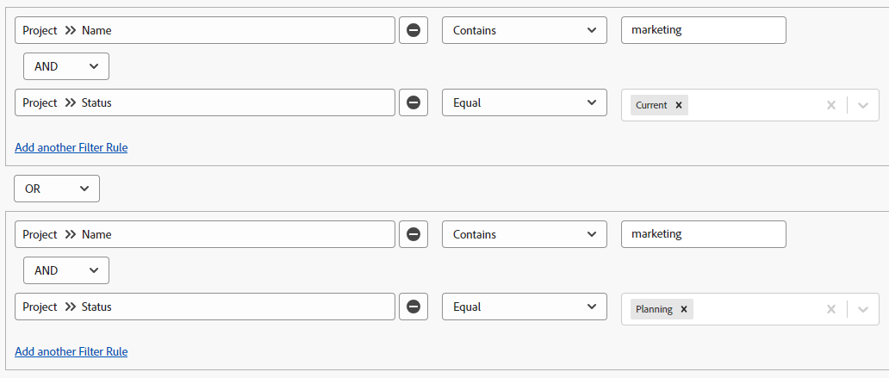

# Adobe Workfront でフィルターを作成または編集する

<!-- Audited: 11/2024 -->

フィルターを使用して項目リストの画面に表示する情報の量を制限できます。特定の基準を、オブジェクトに関する特定の情報に基づいて定義し、その基準を満たすオブジェクトのみを表示できます。

Adobe Workfront では、次のタイプのフィルターを適用できます。

* クイックフィルターは、キーワードを使用してオブジェクトのリストで実行され、項目を検索します。これらは、今後の使用のために保存できない一時フィルターです。

  クイックフィルターについて詳しくは、[クイックフィルターをリストに適用](../../../workfront-basics/navigate-workfront/use-lists/apply-quick-filter-list.md)を参照してください。

* 永続的なフィルターは、複数のリストおよびレポートに保存して何度も使用できます。この記事では、リストまたはレポート内で永続的なフィルターを作成する方法、または既存のフィルターを編集する方法について説明します。

* Workfront の他のエリア（リストやレポートの外部）でのフィルター。

  Workfront のすべてのフィルターと、それらを適用できるエリアの一覧について詳しくは、[フィルターの概要](../../../reports-and-dashboards/reports/reporting-elements/filters-overview.md)を参照してください。

## アクセス要件

+++ 展開すると、この記事の機能のアクセス要件が表示されます。

この記事の手順を実行するには、次のアクセス権が必要です。

<table style="table-layout:auto"> 
 <col> 
 <col> 
 <tbody> 
  <tr> 
   <td role="rowheader"><strong>Adobe Workfront プラン*</strong></td> 
   <td> 
任意
 </td> 
  </tr> 
  <tr> 
   <td role="rowheader"><strong>Adobe Workfront プラン*</strong></td> 
   <td> 
      
新規：

         <ul>
         <li>
フィルターを変更するコントリビューター
</li>
         <li>
レポートのフィルターを変更する標準
</li>
         </ul>
      
現在：

         <ul>
         <li>
フィルターを変更する場合は「要求」
</li>
         <li>
レポートのフィルターの変更を計画します
</li>
         </ul>
   </td>
  </tr> 
  <tr> 
   <td role="rowheader"><strong>アクセスレベル設定*</strong></td> 
   <td> <ul><li>
フィルター、ビュー、グループ化の編集アクセス権
</li></ul>

レポートでフィルターを編集するには、フィルター、ビュー、グループに対する編集アクセスに加えて、次のアクセスレベル設定が必要です。

<ul><li>
レポート、ダッシュボードおよびカレンダーへのアクセスを編集する
</li></ul>   
   </td> 
  </tr> 
  <tr> 
   <td role="rowheader"><strong>オブジェクトの権限*</strong></td> 
   <td> 
フィルターに対する権限を管理する
</td> 
  </tr> 
 </tbody> 
</table>

*詳しくは、[Workfront ドキュメントのアクセス要件 &#x200B;](/help/quicksilver/administration-and-setup/add-users/access-levels-and-object-permissions/access-level-requirements-in-documentation.md) を参照してください。

+++

## フィルター構築インターフェイスのタイプ

以下の表に示すフィルタービルダーのタイプを使用して、フィルターを作成できます。

<table style="table-layout:auto">
<col>
<col>
<col>
<tbody>
<tr>
<td><strong>ビルダーのタイプ</strong></td>
<td><strong>フィルターオブジェクト</strong></td>
<td><strong>利用可能な場合</strong></td>
</tr>
<tr>
<td>標準ビルダー</td>
<td>
<ul>
<li> 
プロジェクト
 </li>
<li> 
タスク 
 </li>
<li> 
イシュー
 </li>
<li> 
ポートフォリオ
 </li>
<li> 
プログラム
 </li>
<li> 
ユーザー
 </li>
<li> 
テンプレート
 </li>
<li> 
グループ
 </li>
</ul>
</td>
<td>
<ul>
<li> 
リスト 
 </li>
</ul>
<ul>
<li> 
シナリオプランナーのプロジェクトリスト
 
シナリオプランナには、追加のライセンスが必要です。Workfront シナリオプランナについては、<a href="../../../scenario-planner/scenario-planner-overview.md">シナリオプランナの概要</a>を参照してください。 
 </li>
</ul>

<b>メモ：</b>
 
フィルターの標準ビルダーは、レポートでは使用できません。
</td>
</tr>
<tr>
<td>レガシービルダー</td>
<td>すべてのオブジェクト </td>
<td>リストとレポート</td>
</tr>
</tbody>
</table>

Workfront オブジェクトについて詳しくは、[Adobe Workfront のオブジェクトについて](/help/quicksilver/workfront-basics/navigate-workfront/workfront-navigation/understand-objects.md)を参照してください。

様々なインターフェイスを使用してフィルターを作成する際は、次の点を考慮してください。

* 標準ビルダーは、上の表に示すエリアのレガシーフィルターインターフェイスと同じ場所にあります。
* 標準ビルダーは、使用可能なすべてのエリアでデフォルトのエクスペリエンスです。レガシーフィルタービルダーに切り替えるには、「[!UICONTROL **フィルター**]」の横にある「**その他**」メニューをクリックし、「[!UICONTROL **従来のフィルターに戻る**]」を選択します。

  

* 保存済みフィルターは、最初に作成したエクスペリエンスに関係なく、両方のビルダーで使用できます。例えば、レガシービルダーを使用してフィルターを作成した場合、標準のビルダーインターフェイスでもフィルターを検索および変更できます。

  >[!TIP]
  >
  >標準ビルダーには「すべて」フィルターは含まれていません。フィルターが適用されていない場合は、すべてのリスト項目が表示されるからです。「[!UICONTROL **すべてクリア**]」をクリックして、アクティブなフィルターをクリアし、すべての項目を表示します。「[!UICONTROL **すべてクリア**]」がグレー表示になっている場合、フィルターは適用されません。

* 標準ビルダーとレガシービルダーでは、AND および OR 演算子を組み合わせたマルチステートメントフィルターを作成する際の構文が少し異なります。その結果、ビルダー間を切り替えると、これらのフィルターの表示が異なる場合があります。

  >[!INFO]
  >
  >次のシナリオが存在します。
  >
  >1. 標準ビルダーを使用して、次の構文のフィルターを作成します。
  >
  >      `(A OR B) AND C`
  >
  >1. この記事の[従来のビルダーでのフィルターの作成または編集](#create-filter-in-legacy-builder)の節での説明に従って、従来のビルダーに切り替え、従来のビルダーの構文を使用してフィルターを編集します。レガシービルダーの構文は、次のようにフィルターステートメントを表示します。
  >
  >      `A AND C`
  >      `OR`
  >      `B AND C`
  >
  >1. レガシーインターフェイスのフィルターを変更します。
  >1. 標準ビルダーに戻ります。前述のように、フィルターステートメントは、レガシービルダーでサポートされているロジックに従って表示されます。
  >
  >      フィルターは、次のように標準ビルダーインターフェイスに表示されます。
  >  
  >      `A AND C`
  >      `OR`
  >      `B AND C`
  > 
  >      これは、フィルターがレガシーインターフェイスで変更されたためです。

## 標準ビルダーでフィルターを作成または編集する

次の方法で、標準ビルダーインターフェイスを使用してフィルターを作成できます。

* 最初から
* 既存のフィルターを編集する
* 既存のフィルターを複製する
* 既存のフィルターを複製し、編集して、新しいフィルターとして保存する

標準ビルダーインターフェイスを使用してフィルターを作成します。

1. カスタマイズするフィルターを作成するリスト、またはカスタマイズするフィルターを含むリストに移動します。
1. **フィルター**&#x200B;アイコン  をクリックして、ビルダーインターフェイスを開きます。

   

1. 次のフィルターリストを確認します。

   <table style="table-layout:auto">
   <col>
   <col>
   <tbody>
   <tr>
   <td role="rowheader"><strong>お気に入りに登録済み</strong></td>
   <td>お気に入りとしてマークしたフィルターです。フィルターをお気に入りに登録すると、元の場所がフィルター名の下に表示されます。また、お気に入りから削除しない限り、このフィルターは元のリストでは非表示になります。</td>
   </tr>
   <tr>
   <td role="rowheader"><strong>保存済み</strong></td>
   <td>自分で作成し、保存したフィルター。デフォルトでは、このリストには保存済みのフィルターが、保存日時が新しい順に表示されますが、フィルター名をドラッグして手動でリストを並べ替えることもできます。</td>
   </tr>
   <tr>
   <td role="rowheader"><strong>システムデフォルト</strong></td>
   <td>Workfront システムのデフォルトのフィルターおよび Workfront 管理者がシステムレベルまたはレイアウトテンプレートでフィルターのリストに追加したフィルター。</td>
   </tr>
   <tr>
   <td role="rowheader"><strong>自分と共有</strong></td>
   <td>他のユーザーが作成して自分と共有したフィルター、またはシステム全体で共有されているフィルター。</td>
   </tr>
   </tbody>
   </table>

1. 次のいずれかの操作を行います。

   * 「**新規フィルター**」をクリックして、最初からフィルターを作成します。
   * 管理する権限を持つ既存のフィルターの上にポインタを合わせて、**編集**&#x200B;アイコン  をクリックして編集します。

     または

     表示する権限を持つ既存のフィルターの上にポインタを合わせて、**その他**&#x200B;メニュー  をクリックし、「**複製**」をクリックして、既存のフィルターをコピーし、コピーを編集します。

   

1. （条件付き）フィルターグループ内のすべてのステートメントに一致するオブジェクトを検索するか、いずれかのステートメントに一致するオブジェクトを検索するかに応じて、次のオプションから選択します。

   <table style="table-layout:auto">
   <col>
   <col>
   <tbody>
   <tr>
   <td role="rowheader"><strong>すべてが当てはまる場合に含める</strong></td>
   <td>フィルターで見つかったオブジェクトは、フィルターグループ内のすべてのフィルター基準に一致する必要があります。この場合、フィルターステートメントは AND 演算子で結び付けられます。これはデフォルトの選択です。</td>
   </tr>
   <tr>
   <td role="rowheader"><strong>いずれかが当てはまる場合に含める</strong></td>
   <td>フィルターで見つかったオブジェクトは、フィルターグループ内のフィルタ基準に一致する必要があります。この場合、フィルターステートメントは OR 演算子で結び付けられます。</td>
   </tr>
   </tbody>
   </table>

   

   フィルター演算子について詳しくは、[フィルターの概要](/help/quicksilver/reports-and-dashboards/reports/reporting-elements/filters-overview.md)を参照してください。

1. フィールドドロップダウンメニューをクリックして、最近使用したフィールドと、フィルターに使用する推奨フィールドのリストを表示します。フィールド候補は、現在、フィルタリング対象のリストに表示されます。

   また、「**フィールドを参照**」をクリックすると、フィルタリングに使用できるすべてのフィールドの一覧が表示されます。詳細検索のフィールドは、オブジェクトカテゴリ別にグループ化されます。

   

1. 修飾子のドロップダウンメニューをクリックして、修飾子を選択します。デフォルトの修飾子は「等しい」です。

   詳しくは、[フィルターおよび条件修飾子](/help/quicksilver/reports-and-dashboards/reports/reporting-elements/filter-condition-modifiers.md)を参照してください。

   >[!TIP]
   >
   >フィルターを作成すると、結果がリストにすぐに表示されます。フィルターパネルがリストの上にある場合は、フィルターパネルを閉じて、表示を確認できます。入力した情報は、パネルを再度開いたときにビルダーに残ります。

1. フィルターに使用するフィールドの値の入力を開始します。例えば、`Issue:Name` でフィルタリングする場合は、イシューの名前の入力を開始します。値がリストに表示されたら、選択します。

   >[!TIP]
   >
   >選択した就職しに応じて、複数の値を選択できます。

1. 「**フィルターを追加**」をクリックして、別のフィールドを選択し、新しいフィルター条件をフィルターステートメントに追加します。
1. （オプション）**削除**&#x200B;アイコン  をクリックして、既存のフィルターステートメントを削除します。

   または

   「**すべてクリア**」をクリックして、すべてのフィルター条件をクリアします。

1. （オプション）「**フィルターグループを追加**」をクリックして、別のフィルター条件のセットを追加します。セット間のデフォルトの演算子は **AND** です。演算子をクリックして **OR** に変更します。

   >[!TIP]
   >
   >フィルターステートメント内の演算子とは別の演算子でグループを結び付けたい場合は、別のフィルターグループを使用できます。

   >[!INFO]
   >
   >名前に「マーケティング」が含まれ、完了していないか保留中ではないプロジェクトをフィルタリングする場合、次の複数のフィルターグループを使用できます。
   >`(Project: Name Contains Marketing AND Project: Percent Complete Does not equal 100)`
   >`OR`
   >`(Project: Name Contains Marketing AND Project: Status Does not equal On Hold)`
   >この場合、各フィルターステートメントは AND で結び付けられ、フィルターグループは OR で結び付けられます。

1. （オプション）「**テキストモード**」をクリックして、テキストモードを使用したフィルターの作成を続行します。

   

   テキストモードインターフェイスが開きます。

   

   >[!TIP]
   >
   >標準のビルダーインターフェースを使用して、できるだけ多くのフィルターを構築し、テキストモードでのみサポートされているフィルターを修正する必要がある場合にのみ、テキストモードを使用することをお勧めします。

   テキストモードインターフェイスを使用したフィルターの作成について詳しくは、[テキストモードを使用してフィルターを編集](/help/quicksilver/reports-and-dashboards/reports/text-mode/edit-text-mode-in-filter.md)を参照してください。

1. 「**テキストモードを終了**」をクリックして、標準ビルダーインターフェイスに戻ります。

   >[!WARNING]
   >
   >一部のテキストモードステートメントは、標準ビルダーまたはレガシーインターフェイスではサポートされていません。これらのタイプのステートメントを作成したときにテキストモードを終了すると、警告メッセージが表示される場合があります。

1. （オプション）「**適用**」をクリックして、リストにフィルターを適用し、結果を確認します。

   フィルターで結果が生成されない場合、リストは空になります。

1. 「**新規として保存**」をクリックして、後で使用するためのフィルターを保存します。

   

1. 「**名称未設定フィルター**」を選択し、代わりに新しいフィルターの名前を入力します。

   >[!TIP]
   >
   >後で見つけられるように、フィルターには必ず名前を付けてください。フィルターに名前を付けない場合は、システム内では無名フィルターと呼ばれます。

1. 「**アイコン**」ドロップダウンメニューから新しいフィルターのアイコンを選択します。

   

1. （オプション）フィルターの説明を追加して、そのフィルターの特徴を示します。フィルターのリストで、フィルター名の下に説明が表示されます。

   >[!TIP]
   >
   >「**キャンセル**」をクリックすると、いつでもフィルター作成エリアに戻ります。

1. 「**保存**」をクリックします。フィルターは保存済みリストに保存され、項目のリストに適用されます。
1. （オプション）フィルターをお気に入りリストに移動するには、フィルタードロワー内の任意のフィルターの上にポインタを合わせ、**お気に入り**&#x200B;アイコン  をクリックします。

   または

   フィルタードロワー内の任意のフィルターの上にポインターを合わせて、その他メニュー  をクリックし、「**お気に入り**」をクリックします。

1. （オプション）「**フィルターをスタック**」ボタンをクリックして、スタックされたフィルターをアクティブにします。このオプションを使用すると、複数の保存済みフィルターを適用できます。フィルタールールは、選択した順序で適用されます。

   >[!TIP]
   >
   >選択できるフィルターの数に制限はありません。
   >
   >複数のフィルターを選択した場合、一致する結果を表示するには、すべての条件を同時に満たす必要があります。

   

   選択したフィルター数が、項目リストの上部にあるフィルターアイコンの横に表示されます。

   

1. （オプション）次のいずれかを実行します。

   * フィルターを他のユーザーと共有するか、システム全体で使用できるようにします。詳しくは、[フィルター、ビュー、グループ化を共有](/help/quicksilver/reports-and-dashboards/reports/reporting-elements/share-filter-view-grouping.md)を参照してください。

   * フィルターが無効になった場合や重複した場合は削除します。削除できるのは、自分が所有しているフィルターのみです。自分と共有していたフィルターを削除できます。詳しくは、[フィルター、ビュー、およびグループ化を削除](/help/quicksilver/reports-and-dashboards/reports/reporting-elements/remove-filters-views-groupings.md)を参照してください。

## レガシービルダーでフィルターを作成または編集する {#create-filter-in-legacy-builder}

以下の方法で、リストとレポートにレガシーフィルターを作成できます。

* 最初から
* 既存のフィルターを編集して新しいフィルターとして保存する

フィルターの作成に使用する方法に関係なく、フィルターを最初から作成することも、既存のフィルターから作成することも同様です。

1. カスタマイズするフィルターを含むリストまたはレポートに移動します。
1. **フィルター** アイコン  をクリックしてから、**詳細** アイコン  をクリックして、**従来のフィルターに戻る** をクリックします。

   >[!TIP]
   >
   >レポート作成者は、レポートでフィルタードロップダウンリストを表示するには、フィルターの編集を許可する必要があります。レポートのデフォルトフィルターは、デフォルトでレポートに適用されます。レポートのデフォルトフィルターは、レポートを編集するときにのみカスタマイズできます。

1. フィルターのリストの上部にある「**+新規フィルター**」をクリックします。

   または

   変更するフィルターの上にマウスポインターを置き、**編集** アイコン  をクリックします。

   フィルター起動をカスタマイズするためのビルダー。

1. 次のいずれかの操作を行います。

   * 既存のルールをクリックし、新しいオプションを選択することで、既存のフィルタールールを変更します。
   * 「**別のフィルター規則を追加**」をクリックしてフィルタールールを追加し、「**フィールド名を入力**」ボックスにルールを追加するオプションの名前を入力し、ドロップダウンリストに表示されたら、それをクリックします。

     フィルターのオブジェクトに関連するフィールドが、「**フィールド名を入力**」ボックスに一覧表示されます。

   * フィルタールールを追加する場合は、「**AND**」または「**OR**」をクリックします。\
     フィルタールールを追加する場合は、フィルター修飾子を使用して、フィルターの条件を設定します。フィルター修飾子について詳しくは、[フィルターおよび条件修飾子](../../../reports-and-dashboards/reports/reporting-elements/filter-condition-modifiers.md)を参照してください。

     >[!NOTE]
     >
     >複数の OR ステートメントで AND ステートメントのグループをつなげる場合は、ステートメントのグループごとに OR ステートメント間で変更されないフィールドを繰り返す必要があります。
     >
     >
     >
     >「マーケティング」という単語を含み、ステータスが「現在」または「計画」のプロジェクトにあるタスクのフィルターを作成する場合、次のフィルタールールが必要です。
     >
     >`Task: Name Contains Marketing`
     >`AND`
     >`Project: Status Equals Current`
     >`OR`
     >`Task: Name Contains Marketing`
     >`AND`
     >`Project: Status Equals Planning`
     >
     >名前に「マーケティング」を含むタスクは、2 つの AND フィルターグループ間で変更されませんが、2 番目のグループで繰り返す必要があります。

   * 「X」アイコンをクリックして、既存のフィルタールールを削除します。

1. （オプション）「**テキストモードに切り替え**」をクリックし、「テキストモード」インターフェイスを使用してフィルターを追加します。

   「テキストモード」インターフェイスを使用したフィルターの作成について詳しくは、[テキストモードを使用したフィルターの編集](../../../reports-and-dashboards/reports/text-mode/edit-text-mode-in-filter.md)を参照してください。

1. 「**フィルターを保存**」をクリックして、フィルターを作成するか、選択したフィルターを変更で置き換えます。

   または

   「**新しいフィルターとして保存**」をクリックして、選択したフィルターから新しいフィルターを作成します。

   新しいフィルターがフィルターのリストに表示され、選択したリストまたはレポートに自動的に適用されます。

1. （オプション）次のいずれかを実行します。

   * 作成したフィルターを他のユーザーと共有したり、システム全体で使用できるようにします。詳しくは、[フィルター、ビュー、またはグループ化の共有](/help/quicksilver/reports-and-dashboards/reports/reporting-elements/share-filter-view-grouping.md)を参照してください。
   * リストに表示したくないフィルターを削除します。詳しくは、[フィルター、ビュー、およびグループ化の削除](/help/quicksilver/reports-and-dashboards/reports/reporting-elements/remove-filters-views-groupings.md)を参照してください。

