# Adobe Workfrontでフィルターを作成または編集

フィルターを使用して、項目のリストに表示する情報の量を制限できます。 特定の基準を、オブジェクトに関する特定の情報に基づいて定義し、その基準を満たすオブジェクトのみを表示できます。

Adobe Workfrontでは、次のタイプのフィルターを適用できます。

* オブジェクトのリスト内のクイックフィルタを使用して、キーワードを使用して項目を検索します。 これらは、今後の使用のために保存できない一時フィルターです。

  クイックフィルターについて詳しくは、 [クイックフィルターをリストに適用する](../../../workfront-basics/navigate-workfront/use-lists/apply-quick-filter-list.md).

* 複数のリストおよびレポートに対して多数の時間を保存し使用できる永続的なフィルター。 この記事では、リストまたはレポート内で永続的なフィルタを作成する方法、または既存のフィルタを編集する方法について説明します。

* Workfrontの他の領域（リストやレポートの外部）でのフィルター。

  Workfrontのすべてのフィルターと、それらを適用できる領域の一覧については、 [Adobe Workfrontのフィルターの概要](../../../reports-and-dashboards/reports/reporting-elements/filters-overview.md).

## アクセス要件

この記事の手順を実行するには、次のアクセス権が必要です。

<table style="table-layout:auto"> 
 <col> 
 <col> 
 <tbody> 
  <tr> 
   <td role="rowheader"><strong>Adobe Workfront plan*</strong></td> 
   <td> 
任意
 </td> 
  </tr> 
  <tr> 
   <td role="rowheader"><strong>Adobe Workfront license*</strong></td> 
   <td> 
新規：寄稿者以上

または

現在：リクエスト以降

<b>注意：</b>

レポートのフィルターを編集するには、次のライセンスが必要です。

新規：プラン

または

現在：標準

</td> 
  </tr> 
  <tr> 
   <td role="rowheader"><strong>アクセスレベル設定*</strong></td> 
   <td> <ul><li>
フィルター、ビューおよびグループへのアクセスを編集
</li></ul>
    
<b>注意：</b>

   レポートでフィルターを編集するには、フィルター、ビュー、グループに対する編集アクセスに加えて、次のアクセスレベル設定が必要です。

<ul><li>
レポート、ダッシュボード、カレンダーへのアクセスを編集
</li></ul>

<b>注意：</b>
 
 アクセス権がない場合は、Workfront管理者に、アクセスレベルに追加の制限を設定しているかどうかを問い合わせてください。 Workfront管理者がアクセスレベルを変更する方法について詳しくは、 <a href="../../../administration-and-setup/add-users/configure-and-grant-access/create-modify-access-levels.md" class="MCXref xref">カスタムアクセスレベルの作成または変更</a>.
 </td> 
  </tr> 
  <tr> 
   <td role="rowheader"><strong>オブジェクトの権限</strong></td> 
   <td> 
フィルターに対する権限の管理
 
追加のアクセス権のリクエストについて詳しくは、 <a href="../../../workfront-basics/grant-and-request-access-to-objects/request-access.md" class="MCXref xref">オブジェクトへのアクセスのリクエスト </a>.
 </td> 
  </tr> 
 </tbody> 
</table>

&#42;保有するプラン、ライセンスの種類、アクセス権を確認するには、Workfront管理者に問い合わせてください。

## フィルタ構築インターフェイスのタイプ

次の表に示すフィルタービルダーのタイプを使用して、フィルターを作成できます。

<table style="table-layout:auto">
<col>
<col>
<col>
<tbody>
<tr>
<td><strong>ビルダーのタイプ</strong></td>
<td><strong>Filter オブジェクト</strong></td>
<td><strong>利用可能な場合</strong></td>
</tr>
<tr>
<td>標準ビルダー</td>
<td>
<ul>
<li> 
プロジェクト
 </li>
<li> 
タスク 
 </li>
<li> 
イシュー
 </li>
<li> 
ポートフォリオ
 </li>
<li> 
プログラム
 </li>
<li> 
ユーザー
 </li>
<li> 
テンプレート
 </li>
<li> 
グループ
 </li>
</ul>
</td>
<td>
<ul>
<li> 
リスト 
 </li>
</ul>
<ul>
<li> 
シナリオプランナーの「プロジェクト」リスト
 
シナリオ・プランナには、追加のライセンスが必要です。 Workfront Scenario Planner の詳細は、 <a href="../../../scenario-planner/scenario-planner-overview.md">シナリオプランナーの概要</a>. 
 </li>
</ul>

<b>注意：</b>
 
フィルターの標準ビルダーは、レポートでは使用できません。
</td>
</tr>
<tr>
<td>レガシービルダー</td>
<td>すべてのオブジェクト </td>
<td>リストとレポート</td>
</tr>
</tbody>
</table>

Workfrontオブジェクトについて詳しくは、 [Adobe Workfrontのオブジェクトについて](/help/quicksilver/workfront-basics/navigate-workfront/workfront-navigation/understand-objects.md).

様々なインターフェイスを使用してフィルターを作成する際は、次の点を考慮してください。

* 標準ビルダーは、上の表に示す領域の従来のフィルターインターフェイスと同じ場所にあります。
* 標準ビルダーは、使用可能なすべての領域でデフォルトのエクスペリエンスです。 従来のフィルタービルダーに切り替えるには、 **その他** 隣のメニュー [!UICONTROL **フィルター**] を選択し、 [!UICONTROL **レガシーフィルターに戻る**].

  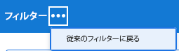

* 保存済みフィルターは、最初に作成したエクスペリエンスに関係なく、両方のビルダーで使用できます。 例えば、従来のビルダーを使用してフィルターを作成した場合、標準のビルダーインターフェイスでもフィルターを検索および変更できます。

  >[!TIP]
  >
  >標準ビルダーには「すべて」フィルターは含まれていません。フィルターが適用されていない場合は、すべてのリスト項目が表示されるからです。 クリック [!UICONTROL **すべてクリア**] をクリックして、アクティブなフィルターをクリアし、すべての項目を表示します。 次の場合 [!UICONTROL **すべてクリア**] がグレー表示になっている場合、フィルターは適用されません。

* 標準ビルダーとレガシービルダーでは、AND および OR 演算子を組み合わせた複数文フィルターを作成する際の構文が少し異なります。 その結果、ビルダー間を切り替えると、これらのフィルターの表示が異なる場合があります。

  >[!INFO]
  >
  >次のシナリオが存在します。
  >
  >1. 標準ビルダーを使用して、次の構文のフィルターを作成します。
  >
  >   `(A OR B) AND C`
  >
  >1. レガシービルダーに切り替え、レガシービルダーの構文を使用してフィルターを編集します ( [レガシービルダーでのフィルターの作成または編集](#create-filter-in-legacy-builder) 」の節を参照してください。 レガシービルダーの構文は、次のようにフィルターステートメントを表示します。
  >
  >   `A AND C`
  >   `OR`
  >   `B AND C`
  >
  >1. 従来のインターフェイスのフィルターを変更します。
  >1. 標準ビルダーに戻ります。 前述のように、filter 文は、レガシービルダーでサポートされているロジックに従って表示されます。
  >
  >   フィルターは、次のように標準ビルダーインターフェイスに表示されます。
  >  
  >   `A AND C`
  >   `OR`
  >   `B AND C`
  > 
  >   これは、フィルターが従来のインターフェイスで変更されたためです。

## 標準ビルダーでのフィルターの作成または編集

次の方法で、標準ビルダーインターフェイスを使用してフィルターを作成できます。

* 最初から
* 既存のフィルターの編集
* 既存のフィルターを複製
* 既存のフィルターを複製し、編集して、新しいフィルターとして保存します

標準ビルダーインターフェイスを使用してフィルターを作成します。

1. カスタマイズするフィルターを作成するリスト、またはカスタマイズするフィルターを含むリストに移動します。
1. 次をクリック： **フィルター** アイコン  をクリックして、ビルダーインターフェイスを開きます。

   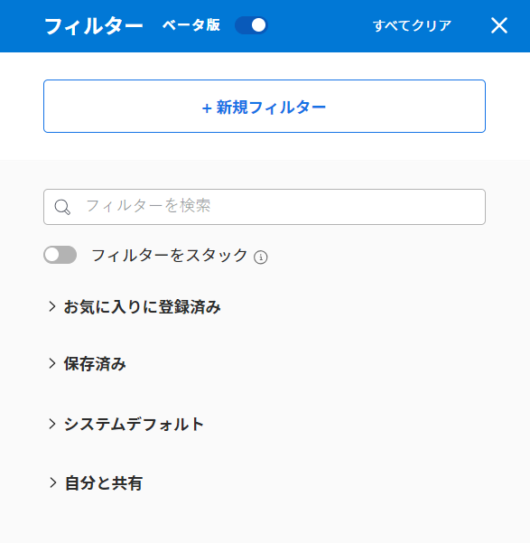

1. 次のフィルターリストを確認します。

   <table style="table-layout:auto">
   <col>
   <col>
   <tbody>
   <tr>
   <td role="rowheader"><strong>お気に入りに登録済み</strong></td>
   <td>お気に入りとしてマークしたフィルターです。 フィルターをお気に入りに登録すると、元の場所がフィルター名の下に表示され、お気に入りとして削除しない限り、元のリストでは非表示になります。</td>
   </tr>
   <tr>
   <td role="rowheader"><strong>保存済み</strong></td>
   <td>自分で作成し、保存したフィルター。 デフォルトでは、このリストには保存済みフィルターが最近保存された順に表示されますが、フィルター名をドラッグして手動でリストを並べ替えることができます。</td>
   </tr>
   <tr>
   <td role="rowheader"><strong>システムデフォルト</strong></td>
   <td>Workfrontシステムのデフォルトのフィルター。また、Workfront管理者がフィルターのリストに追加したフィルター（システムレベルまたはレイアウトテンプレート）。</td>
   </tr>
   <tr>
   <td role="rowheader"><strong>自分と共有</strong></td>
   <td>他のユーザーが自分を作成して共有したり、システム全体で共有したりするフィルター。</td>
   </tr>
   </tbody>
   </table>

1. 次のいずれかの操作を行います。

   * クリック **新しいフィルター** をクリックして、最初からフィルターを作成します。
   * 管理する権限を持つ既存のフィルターの上にマウスポインターを置いて、 **編集** アイコン  をクリックして編集します。

     または

     表示する権限を持つ既存のフィルターの上にマウスポインターを置いて、 **その他** メニュー をクリックし、 **複製** 既存のフィルターをコピーし、コピーを編集します。

   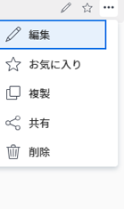

1. （条件付き）フィルタグループ内のすべてのステートメントに一致するオブジェクトを検索するか、いずれかのステートメントに一致するオブジェクトを検索するかに応じて、次のオプションから選択します。

   <table style="table-layout:auto">
   <col>
   <col>
   <tbody>
   <tr>
   <td role="rowheader"><strong>すべてが当てはまる場合に含める</strong></td>
   <td>フィルタで見つかったオブジェクトは、フィルタグループ内のすべてのフィルタ基準に一致する必要があります。 この場合、フィルター文は AND 演算子で結び付けられます。 これはデフォルトの選択です。</td>
   </tr>
   <tr>
   <td role="rowheader"><strong>いずれかが当てはまる場合に含める</strong></td>
   <td>フィルタで見つかったオブジェクトは、フィルタグループ内のフィルタ基準に一致する必要があります。 この場合、フィルター文は OR 演算子で結び付けられます。</td>
   </tr>
   </tbody>
   </table>

   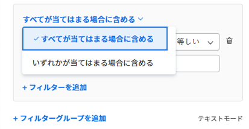

   フィルター演算子について詳しくは、 [Adobe Workfrontのフィルターの概要](/help/quicksilver/reports-and-dashboards/reports/reporting-elements/filters-overview.md).

1. フィールドドロップダウンメニューをクリックして、最近使用したフィールドと、フィルターに使用する推奨フィールドのリストを表示します。 推奨フィールドは、現在、フィルタリング対象のリストに表示されます。

   また、 **フィールドを参照** をクリックすると、フィルタリングに使用できるすべてのフィールドの一覧が表示されます。 詳細検索のフィールドは、オブジェクトカテゴリ別にグループ化されます。

   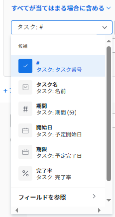

1. モディファイヤのドロップダウンメニューをクリックして、モディファイヤを選択します。 デフォルトの修飾子は「次と等しい」です。

   詳しくは、 [フィルターおよび条件修飾子](/help/quicksilver/reports-and-dashboards/reports/reporting-elements/filter-condition-modifiers.md).

   >[!TIP]
   >
   >フィルターを作成すると、結果がリストにすぐに表示されます。 フィルターパネルがリストの上にある場合は、フィルターパネルを閉じて、表示を確認できます。 入力した情報は、パネルを再度開いたときにビルダーに残ります。

1. フィルターに使用するフィールドの値を入力します。 例えば、フィルターに使用するイシューの名前を入力します `Issue:Name`. 値がリストに表示される場合は、値を選択します。

   >[!TIP]
   >
   >選択したモディファイヤに応じて、複数の値を選択できます。

1. クリック **フィルターを追加** をクリックして、別のフィールドを選択し、新しいフィルター条件をフィルターステートメントに追加します。
1. （オプション） **削除** アイコン  をクリックして、既存のフィルター文を削除します。

   または

   クリック **すべてクリア** をクリックして、すべてのフィルター条件をクリアします。

1. （オプション）「 **フィルターグループを追加** をクリックして、別のフィルター条件のセットを追加します。 セット間のデフォルトの演算子は AND です。 演算子をクリックして OR に変更します。

   >[!TIP]
   >
   >フィルター文内の演算子とは別の演算子でグループを結び付けたい場合は、別のフィルターグループを使用できます。

   >[!INFO]
   >
   >名前に「marketing」を含むプロジェクトをフィルタリングし、名前に「未完了」、「保留中」が含まれない場合は、次の複数のフィルターグループを使用できます。
   >`(Project: Name Contains Marketing AND Project: Percent Complete Does not equal 100)`
   >`OR`
   >`(Project: Name Contains Marketing AND Project: Status Does not equal On Hold)`
   >この場合、各フィルター文は AND で接続され、フィルターグループは OR で接続されます。

1. （オプション）「 **テキストモード** をクリックして、テキストモードを使用したフィルターの作成を続行します。

   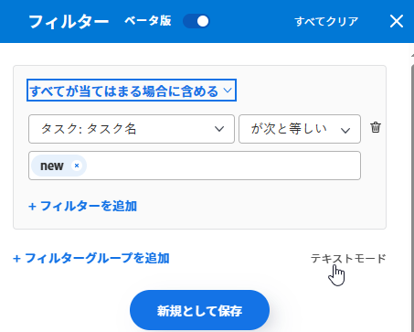

   テキストモードインターフェイスが開きます。

   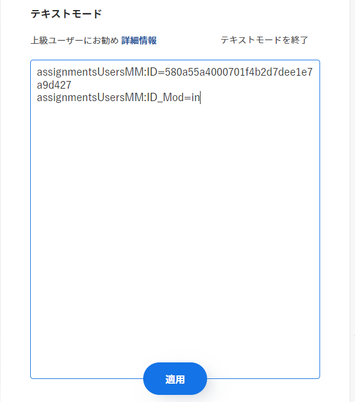

   >[!TIP]
   >
   >標準ビルダーインターフェイスを使用し、テキストモードでのみサポートされるフィルターを変更する必要がある場合にのみ、テキストモードを使用して、可能な限り多くのフィルターを作成することをお勧めします。

   テキストモードインターフェイスを使用したフィルターの作成について詳しくは、 [テキストモードを使用したフィルターの編集](/help/quicksilver/reports-and-dashboards/reports/text-mode/edit-text-mode-in-filter.md).

1. クリック **テキストモードを終了** をクリックして、標準ビルダーインターフェイスに戻ります。

   >[!WARNING]
   >
   >一部のテキストモードステートメントは、標準ビルダーまたはレガシーインターフェイスではサポートされていません。 これらのタイプのステートメントを作成したときにテキストモードを終了すると、警告メッセージが表示される場合があります。

1. （オプション）「 **適用** をクリックして、リストにフィルターを適用し、結果を確認します。

   フィルターで結果が生成されない場合、リストは空になります。

1. クリック **新規として保存** をクリックして、後で使用するためのフィルターを保存します。

   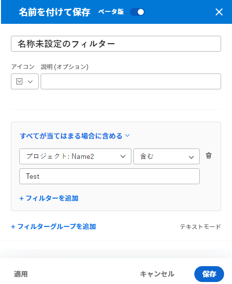

1. 選択 **名称未設定フィルター** 新しいフィルターの名前を入力します。

   >[!TIP]
   >
   >後で見つけられるように、フィルターには必ず名前を付けてください。 名前を付けない場合は、システムで「名称未設定フィルター」と呼ばれます。

1. 新しいフィルターのアイコンを **アイコン** ドロップダウンメニュー。

   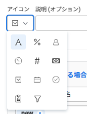

1. （オプション）フィルターに固有な情報を示す説明を追加します。 フィルターのリストで、フィルター名の下に説明が表示されます。

   >[!TIP]
   >
   >クリック **キャンセル** いつでもフィルターの作成領域に戻ります。

1. クリック **保存**. フィルターは「保存済み」リストに保存され、項目のリストに適用されます。
1. （オプション）フィルターをお気に入りに登録済みリストに移動するには、フィルタードロワー内の任意のフィルターの上にマウスポインターを置いて、お気に入りアイコンをクリックします .

   または

   フィルタードロワー内の任意のフィルターの上にマウスポインターを置いて、その他メニューをクリックします。 をクリックし、 **お気に入り**.

1. （オプション） **フィルターの積み重ね** ボタンをクリックして、積み重ねフィルターをアクティブにします。 このオプションを使用すると、複数の保存済みフィルターを適用できます。 フィルタールールは、選択した順序で適用されます。

   >[!TIP]
   >
   >選択できるフィルターの数に制限はありません。
   >
   >複数のフィルターを選択した場合、一致する結果を表示するには、すべての条件を同時に満たす必要があります。

   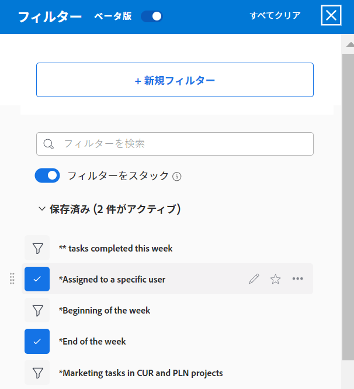

   選択したフィルター数が、項目リストの上部にあるフィルターアイコンの横に表示されます。

   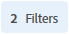

1. （オプション）次のいずれかの操作を行います。

   * フィルターを他のユーザーと共有するか、システム全体で使用できるようにします。 詳しくは、 [フィルター、表示またはグループ化の共有](/help/quicksilver/reports-and-dashboards/reports/reporting-elements/share-filter-view-grouping.md).

   * フィルターが無効になった場合や重複した場合は削除します。 削除できるのは、自分が所有しているフィルターのみです。 自分と共有していたフィルターを削除できます。 詳しくは、 [フィルター、ビュー、およびグループを削除する](/help/quicksilver/reports-and-dashboards/reports/reporting-elements/remove-filters-views-groupings.md).

## レガシービルダーでのフィルターの作成または編集 {#create-filter-in-legacy-builder}

リストおよびレポートでレガシーフィルターを作成するには、次の方法があります。

* 最初から
* 既存のフィルターを編集して新しいフィルターとして保存

フィルターの作成方法に関係なく、最初からフィルターを作成する場合も、既存のフィルターからフィルターを作成する場合も同様です。

1. カスタマイズするフィルターを含むリストまたはレポートに移動します。
1. 次をクリック： **フィルター** アイコン .

   >[!TIP]
   >
   >レポートの作成者がフィルタードロップダウンリストを表示するには、フィルターの編集を許可する必要があります。 レポートのデフォルトのフィルターは、デフォルトでレポートに適用されます。 レポートのデフォルトフィルターは、レポートを編集するときにのみカスタマイズできます。

   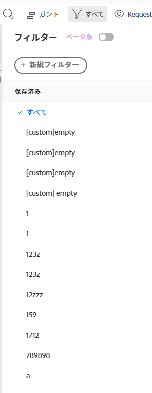

1. クリック **新しいフィルター** をクリックします。

   または

   変更するフィルターの上にマウスポインターを置いて、 **編集** アイコン .

   フィルター起動をカスタマイズするためのビルダー。

1. 次のいずれかの操作を行います。

   * 既存のルールをクリックし、新しいオプションを選択することで、既存のフィルタールールを変更します。
   * フィルタールールを追加するには、 **別のフィルタールールを追加**&#x200B;で、ルールを追加するオプションの名前を **フィールド名の入力を開始** 」ボックスをクリックし、ドロップダウンリストに表示されたらクリックします。

     フィルターのオブジェクトに関連するフィールドは、「 **フィールド名の入力を開始** ボックス。

   * クリック **および** または **または** 新しいフィルタールールを追加する場合。\
     フィルタールールを追加する場合は、フィルター修飾子を使用して、フィルターの条件を設定します。 フィルタ修飾子の詳細については、 [フィルターおよび条件修飾子](../../../reports-and-dashboards/reports/reporting-elements/filter-condition-modifiers.md).

     >[!NOTE]
     >
     >複数の OR ステートメントで AND ステートメントのグループを接続する場合は、ステートメントのグループごとに OR ステートメント間で変更されないフィールドを繰り返す必要があります。
     >
     >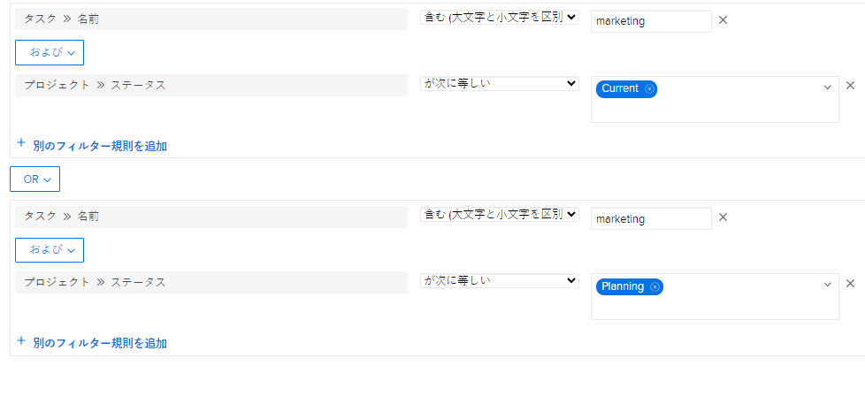
     >
     >「marketing」という単語を含み、ステータスが「現在」または「計画」のプロジェクトにあるタスクのフィルタを作成する場合、次のフィルタ・ルールが必要です。
     >
     >`Task: Name Contains Marketing`
     >`AND`
     >`Project: Status Equals Current`
     >`OR`
     >`Task: Name Contains Marketing`
     >`AND`
     >`Project: Status Equals Planning`
     >
     >「Task: Name Contains &quot;marketing&quot;」は、2 つの AND フィルターグループ間で変更されませんが、2 番目のグループで繰り返す必要があります。

   * 「X」アイコンをクリックして、既存のフィルタールールを削除します。

1. （オプション）「 **テキストモードに切り替え** をクリックし、「テキストモード」インターフェイスを使用してフィルターを追加します。

   テキストモードインターフェイスを使用したフィルターの作成について詳しくは、 [テキストモードを使用したフィルターの編集](../../../reports-and-dashboards/reports/text-mode/edit-text-mode-in-filter.md).

1. クリック **フィルターを保存** をクリックして、新しいフィルターを作成するか、選択したフィルターを変更に置き換えます。

   または

   クリック **新しいフィルターとして保存** 選択したフィルタから新しいフィルタを作成します。

   新しいフィルターがフィルターのリストに表示され、選択したリストまたはレポートに自動的に適用されます。

1. （オプション）次のいずれかの操作を行います。

   * 作成したフィルターを他のユーザーと共有したり、システム全体で使用できるようにします。 詳しくは、 [フィルター、表示またはグループ化の共有](/help/quicksilver/reports-and-dashboards/reports/reporting-elements/share-filter-view-grouping.md).
   * リストに表示しなくなったフィルターを削除します。 詳しくは、 [フィルター、ビュー、およびグループを削除する](/help/quicksilver/reports-and-dashboards/reports/reporting-elements/remove-filters-views-groupings.md).

