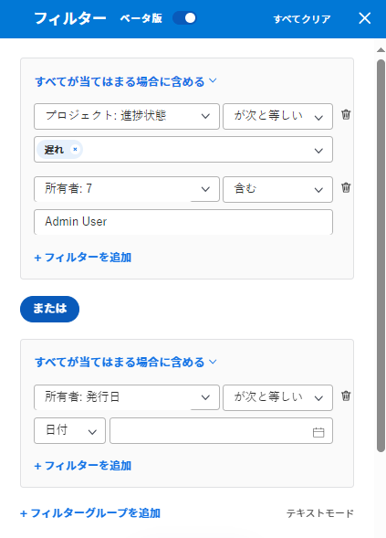
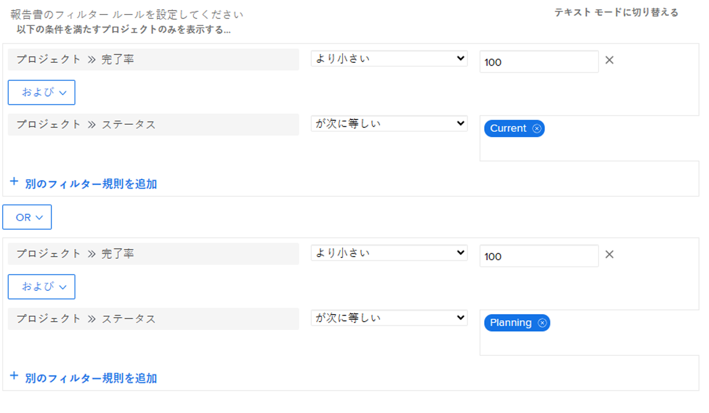

# Adobe Workfrontのフィルターの概要

Adobe Workfrontでフィルターを使用すると、リスト、レポート、その他の領域で画面に表示する情報の量を減らすことができます。

>[!NOTE]
>
>この記事では、Workfrontでフィルターを適用できるすべての領域に加えて、リストおよびレポートのフィルターに関する一般情報について説明します。 リストやレポート以外の特定の領域でのフィルターに関する情報については、以下のリンクにある記事を参照してください。

## Workfrontフィルターのタイプ

Workfrontには、複数のタイプのフィルターがあります。 すべてのフィルターは、画面に表示する情報の量を制限するのと同じ目的を満たします。

次に、Workfrontで使用できるフィルターのタイプを示します。

<table style="table-layout:auto"> 
 <col> 
 <col> 
 <tbody> 
  <tr> 
   <td><strong>一時フィルター</strong></td> 
   <td> 
キーワード検索に基づく 1 回限りのクイックフィルターで、リスト内の項目をすばやく検索できます。 
 </td> 
  </tr> 
  <tr> 
   <td><strong>リストおよびレポートの永続フィルター</strong></td> 
   <td>Workfrontによって作成されたか、ユーザーまたは他のユーザーによってカスタマイズされたもの。 複数回使用できます。 適切なアクセス権と権限を持っている場合は、複数の領域で名前を付け、保存し、再利用できます。 これらのフィルターを他のユーザーと共有することもできます。 これらは、オブジェクトのリストまたはレポートで使用できます。 </td> 
  </tr> 
  <tr> 
   <td><strong>特殊領域用の一時フィルターまたは永久フィルター</strong></td> 
   <td>Workfrontによって作成されたか、ユーザーまたは他のユーザーによってカスタマイズされたもの。 永久的なフィルターを保存して複数回使用することも、保存せずに、即時のニーズに応じて一時的に適用することもできます。 未保存のフィルターは、共有または削除できません。 これらは、の節で説明されているように、特別な領域で使用できます。 <a href="#workfront-filters-for-special-areas" class="MCXref xref">Workfrontフィルター（特殊領域）</a> 」を参照してください。 </td> 
  </tr> 
 </tbody> 
</table>

## Workfront一時フィルター

クイックフィルターでは、キーワードを使用して画面上の項目を検索できます。 ページを更新すると、一時的なクイックフィルターがクリアされます。 一時フィルタを保存して再利用することはできません。

クイックフィルターについて詳しくは、 [クイックフィルターをリストに適用する](../../../workfront-basics/navigate-workfront/use-lists/apply-quick-filter-list.md).

## Workfrontのリストおよびレポートの永続フィルター

オブジェクトのリストやレポートで作成した、自分、他のユーザー、またはWorkfrontの永続的なフィルターを使用できます。

Workfrontのオブジェクトと、レポートの作成対象について詳しくは、 [Adobe Workfrontのオブジェクトについて](../../../workfront-basics/navigate-workfront/workfront-navigation/understand-objects.md).

リストおよびレポートのフィルターの詳細については、次の記事を参照してください。

* [Adobe Workfrontでフィルターを作成または編集](../../../reports-and-dashboards/reports/reporting-elements/create-filters.md)
* [フィルター、ビュー、およびグループを削除する](../../../reports-and-dashboards/reports/reporting-elements/remove-filters-views-groupings.md)
* [フィルター、表示またはグループ化の共有](../../../reports-and-dashboards/reports/reporting-elements/share-filter-view-grouping.md)

## Workfrontフィルター（特殊領域） {#workfront-filters-for-special-areas}

Workfrontの次の領域で、組み込みフィルターを使用するか、カスタムフィルターを作成できます。

* ホーム\
  詳しくは、 [作業リストのフィルタリング](../../../workfront-basics/using-home/using-the-home-area/display-items-in-home-work-list.md#filtering-by-item-type) 記事のセクション [[ ホーム ] 領域の [ 作業リスト ] に項目を表示する](../../../workfront-basics/using-home/using-the-home-area/display-items-in-home-work-list.md).
* リクエスト領域。 「要求」領域では、フィルターをカスタマイズできません。

  詳しくは、 [送信された要求を見つける](../../../manage-work/requests/create-requests/locate-submitted-requests.md).

* リソースプランナー\
  詳しくは、 [リソースプランナーの情報のフィルタリング](../../../resource-mgmt/resource-planning/filter-resource-planner.md).

* 使用率レポート

  詳しくは、 [使用状況情報のフィルタリング](../../../resource-mgmt/resource-utilization/view-utilization-information.md#filtering-utilization-information) 記事内 [リソース使用率情報の表示](../../../resource-mgmt/resource-utilization/view-utilization-information.md).

* ワークロードバランサー

  詳しくは、 [ワークロードバランサーの情報のフィルタリング](../../../resource-mgmt/workload-balancer/filter-information-workload-balancer.md).

* Analytics 領域

  詳しくは、 [拡張分析でのフィルターの適用](../../../enhanced-analytics/use-enhanced-analytics-filters.md).

* ブループリント領域

  詳しくは、 [ブループリントのインストール](../../../administration-and-setup/blueprints/blueprints-install.md).

* シナリオプランナー

  シナリオ・プランナには、追加のライセンスが必要です。 Workfront Scenario Planner の詳細は、 [シナリオプランナーの概要](../../../scenario-planner/scenario-planner-overview.md).

  >[!TIP]
  >
  >シナリオ・プランナでは、フィルタをカスタマイズできません。

  <!--
  
(NOTE: the tip above: this might change with the beta filters??)

  -->

  組み込みフィルタをプラン、イニシアチブまたはプロジェクトに使用し、シナリオプランナでプロジェクトフィルタをカスタマイズできます。

  詳しくは、次の記事を参照してください。

   * [シナリオプランナーでのプランの作成と編集](../../../scenario-planner/create-and-edit-plans.md)
   * [シナリオプランナーでイニシアチブを公開して、プロジェクトを更新または作成します](../../../scenario-planner/publish-scenarios-update-projects.md)
   * [シナリオプランナーのプランにプロジェクトをインポートします](../../../scenario-planner/import-projects-to-plans.md)

* 目標

  目標には追加のライセンスが必要です。 Workfront目標について詳しくは、 [Adobe Workfront目標の概要](../../../workfront-goals/goal-management/wf-goals-overview.md).

  組み込みのフィルター条件を使用できますが、カスタムフィルターを作成して「目標」領域で再利用することはできません。

  詳しくは、 [Adobe Workfront目標での情報のフィルター](../../../workfront-goals/goal-management/filter-information-wf-goals.md).

* ボード

  組み込みのフィルターを適用できますが、「ボード」領域で再利用するカスタムフィルターを作成することはできません。

  詳しくは、 [ボード内でのフィルターと検索](../../../agile/get-started-with-boards/filter-search-in-board.md).

## リストとレポートのフィルターの概要

リストやレポートを使用する場合、次のタイプのフィルターを使用して、画面上の情報をフィルタリングできます。

* 組み込みフィルター
* 新規フィルターを作成し、他のユーザーがゼロから作成
* 他のユーザーが自分を作成し共有した、カスタマイズ済みの既存のフィルター
* 既存のフィルターに基づいてコピーおよび編集したフィルター

>[!IMPORTANT]
>
>レポートでフィルターを作成または編集する場合、新しいフィルターをレポートのデフォルトのフィルターにするには、レポートを編集する必要があります。 フィルターのみを編集しても、Report Builder 以外では、レポートのデフォルトのフィルターは更新されません。\
>レポートの編集について詳しくは、 [カスタムレポートの作成](../../../reports-and-dashboards/reports/creating-and-managing-reports/create-custom-report.md).

Workfrontリストについて詳しくは、 [Adobe Workfrontでのリストの概要](../../../workfront-basics/navigate-workfront/use-lists/view-items-in-a-list.md).\
Workfrontレポートについて詳しくは、 [レポートの概要](../../../reports-and-dashboards/reports/reporting/get-started-reports-workfront.md).

リストまたはレポートでフィルターを使用する際は、次の点に注意してください。

* リストおよびレポート内の既存のフィルターをカスタマイズできます。 フィルターに対する権限を持つすべてのユーザーも、変更を表示できます。

* Workfrontの管理者は、永続的なフィルターを作成するために、フィルター、ビューおよびグループに対する編集アクセス権を付与する必要があります。

  フィルタ、ビュー、およびグループへのアクセス権の付与について詳しくは、 [フィルター、ビューおよびグループに対するアクセス権の付与](../../../administration-and-setup/add-users/configure-and-grant-access/grant-access-fvg.md).

* フィルターに対する権限のレベルによって、フィルターの保存方法が決まります。 最初にフィルターを作成した場合は、変更を保存できます。それ以外の場合は、変更するフィルターのバージョンを保存するよう求められます。

  >[!TIP]
  >
  >他のユーザーと共有しているフィルターに変更を加えた場合、変更は他のユーザーにも影響を与えます。

* 自分と共有されていたフィルタは、そのフィルタを共有したユーザが管理アクセス権を付与した場合にのみカスタマイズできます。 フィルターの共有について詳しくは、 [フィルター、表示またはグループ化の共有](../../../reports-and-dashboards/reports/reporting-elements/share-filter-view-grouping.md).

## フィルターの要素

フィルターを作成する場合、複数の要素を接続して、フィルターステートメントを構成します。 フィルターの条件を定義する複数のフィルターステートメントを作成できます。

次に、標準フィルタービルダーの例を示します。

以下に、従来のフィルタービルダーの例を示します。

フィルターには、次の要素が含まれます。

<table style="table-layout:auto"> 
 <col> 
 <col> 
 <tbody> 
  <tr> 
   <td><strong>オブジェクト</strong></td> 
   <td> 
フィルターのWorkfrontデータベースオブジェクト。 Workfrontでレポート可能なオブジェクトについて詳しくは、 <a href="../../../workfront-basics/navigate-workfront/workfront-navigation/understand-objects.md" class="MCXref xref">Adobe Workfrontのオブジェクトについて</a>. 
 
例えば、プロジェクト、タスク、イシュー、ユーザー、ドキュメントをフィルターの対象にすることができます。 
 </td> 
  </tr> 
  <tr> 
   <td><strong>フィールド</strong></td> 
   <td> 
フィルタリングに使用するオブジェクトの属性。 
 
例えば、「Portfolio名」や「プロジェクト所有者」でフィルターできます。 この場合、「名前」(Name) と「所有者」(Owner) は、「Portfolio」(Project) オブジェクトと「プロジェクト」(Project) オブジェクトのフィールドです。 
 </td> 
  </tr> 
  <tr> 
   <td> 
<strong>値</strong>
 </td> 
   <td>Workfrontのフィールドの実際の名前。 例えば、[ 完了 ] は [ プロジェクトステータス ] フィールドの値にすることができます。 </td> 
  </tr> 
  <tr> 
   <td><strong>演算子</strong></td> 
   <td>複数のフィルターステートメントを接続します。 詳しくは、 <a href="#filter-operators" class="MCXref xref">フィルター演算子</a> 」を参照してください。 </td> 
  </tr> 
  <tr> 
   <td><strong>修飾子</strong></td> 
   <td>データに一致させる情報の種類を示します。 詳しくは、 <a href="#filter-modifiers" class="MCXref xref">フィルター修飾子</a> 」を参照してください。 </td> 
  </tr> 
 </tbody> 
</table>

## フィルター演算子 {#filter-operators}

Workfrontには、各フィルター文を結び付ける 2 つのフィルター演算子があります。

* **および**: AND 演算子で 2 つのフィルター文を結合する場合、両方のフィルター文を同時に満たすように指定します。

  デフォルトでは、フィルター内のステートメントは AND 演算子で結合されます。

* **または**:OR 演算子で 2 つのフィルター文を結合する場合は、いずれかの文を満たすように指定します。

  >[!TIP]
  >
  >AND 文を OR 文に変更すると、レポートの項目数が増えます。

## フィルター修飾子 {#filter-modifiers}

フィルター修飾子を使用して、データに一致させる情報の種類を指定できます。

>[!INFO]
>
>**例：**
>「完了率」が 100%のプロジェクトをフィルタリングできます。 この場合、次のフィルター文で「次と等しい」修飾子を使用できます。
>
>`Project: Percent Complete Equal(Case Sensitive) 100`

フィルタ修飾子の詳細については、 [フィルターおよび条件修飾子](../../../reports-and-dashboards/reports/reporting-elements/filter-condition-modifiers.md).

## ビルダーインターフェイスでのフィルターの作成

標準またはレガシーのビルダーインターフェイスを使用して、フィルターを作成するには、次の方法があります。

* 最初から
* 既存のフィルターの変更
* 既存のフィルターのコピー

標準またはレガシーのビルダーインターフェイスを使用したフィルターの作成について詳しくは、 [Adobe Workfrontでフィルターを作成または編集](../../../reports-and-dashboards/reports/reporting-elements/create-filters.md).

## テキストモードインターフェイスを使用したフィルターの作成

フィルターは、テキストモードインターフェイスを使用して作成できます。 標準またはベータのビルダーインターフェイスを使用して、ほとんどのフィルターステートメントを作成し、最後の手順としてのみフィルターのコードを編集することをお勧めします。 テキストモードのインターフェイスだけを使用して、最初からフィルターを作成することはお勧めしません。

テキストモードインターフェイスを使用したフィルターの作成について詳しくは、 [テキストモードを使用したフィルターの編集](../../../reports-and-dashboards/reports/text-mode/edit-text-mode-in-filter.md).

## 複雑なフィールドのフィルターの作成

* [値にコンマが含まれるフィールドに対するフィルターを作成する](#create-filters-for-fields-whose-values-contain-commas)
* [複数選択カスタムフィールドの値を持つフィルターを作成する](#create-filters-for-whose-values-are-a-multi-select-custom-field)

### 値にコンマが含まれるフィールドに対するフィルターを作成する {#create-filters-for-fields-whose-values-contain-commas}

テキストモードでフィルターを作成し、コンマを含むフィールド値のフィルタリングを行う場合、値を 1 つのフィルターオプションとして読み取るには、値を区切るコンマの前にスラッシュ (「/」) を追加する必要があります。 これは、次のフィールドタイプにのみ当てはまります。

* ドロップダウン
* ラジオ ボタン
* チェック ボックス

例えば、「色」という名前のラジオボタンフィールドがあり、そのオプションは次のとおりです。

* 赤
* 青
* 赤、青

3 番目のオプションが選択されているプロジェクトのみを検索するフィルターを作成する場合は、テキストモードインターフェイスの filter 文を次のようにします。

`DE:check=red/, blue`

`DE:check_Mod=in`

この構文は、値が 1 つのオプションとして同時に読み取られるようにします。 スラッシュを省略した場合、Workfrontはコンマを「OR」として読み取ります。この場合、1 つ目または 2 つ目のオプションを持つプロジェクトのみが選択されます。

この構文は、プロンプトを構築する際にも適用されます。 プロンプトの使用の詳細については、「 [レポートにプロンプトを追加する](../../../reports-and-dashboards/reports/creating-and-managing-reports/add-prompt-report.md).

### 複数選択カスタムフィールドの値を持つフィルターを作成する {#create-filters-for-whose-values-are-a-multi-select-custom-field}

複数選択のカスタムフィールドに関するレポートを作成できます。 例えば、チェックボックスであるフィールドに関するレポートを作成できます。

ただし、選択したオプションの 1 つのみを含む結果を除外する場合、そのオプションを含むオブジェクトと、その他のオプションが選択されているオブジェクトがレポートに表示されます。

たとえば、3 つのオプション (A、B、C) を持つフィールドがあり、3 つのオプション（A、B、C ではなく A、B）のうち 2 つをオブジェクトに選択した場合、A と B の両方を持つフィルタを使用してレポートを作成できます。 オプション A に対して「等しくない」の修飾子を使用してフィルタを作成した場合、A のみが選択されたオブジェクトのみが除外されますが、A と B が選択されている場合、そのオブジェクトはレポートに表示されます。

## 複数のフィルタールールの結合に関する制限

Workfrontでフィルターを作成する場合、参照できるオブジェクトは 5 つ（レポートのオブジェクトを除く）だけです。
