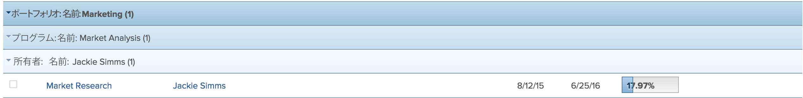

# Adobe Workfront でのグループの概要

<!--

(NOTE: This article was supposed to be replaced by "Groupings overview", but decided to keep this here because this is linked in too many places. "Create groupings" and "Edit existing groupings" have been added also (with videos) to replace portions of the old content here.) 

-->

グループ化を追加して、レポートやリストの情報のレイアウトを管理できます。

次の方法で、レポートにグループを追加できます。

* 既存のグループ化を編集することで、グループ化を作成できます。

  既存のグループ化のカスタマイズについて詳しくは、[既存のグループを編集](../../../reports-and-dashboards/reports/reporting-elements/edit-existing-groupings.md)を参照してください。

* グループ化は最初から作成できます。

  最初からグループ化を作成する方法について詳しくは、[Adobe Workfront でグループ化を作成](../../../reports-and-dashboards/reports/reporting-elements/create-groupings.md)を参照してください。

デフォルトでは、グループ化は、レポートまたはリストでグレーまたはブルーのハイライトで表示されます。レポートまたはリストの結果は、個々のグループの下に、ハイライトなしで表示されます。

1 つのレポートには、最大 3 つのグループを追加できます。マトリックスレポートを作成すると、最大 4 つのグループに分けて情報を整理できます。マトリックスレポートについて詳しくは、[マトリックスレポートを作成](../../../reports-and-dashboards/reports/creating-and-managing-reports/create-matrix-report.md)を参照してください。

標準のグループ化レポートでは、最初のグループは濃い色で、2 番目と 3 番目のグループは明るい色です。グループ化のハイライトの色や、グループ名のフォントはカスタマイズできません。グループ名の後の括弧内の数は、そのグループ化の下の結果数を表します。レポートが複数のページにわたる場合、レポートまたはリストに&#x200B;*すべて*&#x200B;の結果を表示し、各グループの結果の正確なカウントを取得します。

グループ化を使用する際は、次の点に注意してください。

* 既存のグループ内の情報をカスタマイズできます。グループ化を表示できるすべてのユーザーが、変更内容も表示できます。
* グループ化を作成するには、Workfront 管理者が、フィルター、ビューおよびグループ化を編集するためのアクセス権をユーザーに付与する必要があります。

  フィルター、ビュー、およびグループへのアクセス権の付与について詳しくは、[フィルター、ビューおよびグループ化に対するアクセス権の付与](../../../administration-and-setup/add-users/configure-and-grant-access/grant-access-fvg.md)を参照してください。

* グループに対する権限のレベルによって、グループ化の保存方法が決まります。最初にグループ化を作成した場合は、変更を保存できます。作成してない場合は、グループ化のバージョンを保存するよう求めるプロンプトが表示されます。他のユーザーと共有したグループに変更を加えると、他のユーザーも同様に影響を受けます。
* 自分と共有されたグループは、そのグループを共有したユーザーが管理アクセス権を付与した場合にのみカスタマイズできます。グループ化の共有について詳しくは、[フィルター、表示またはグループ化の共有](../../../reports-and-dashboards/reports/reporting-elements/share-filter-view-grouping.md)を参照してください。
* グループ化をインラインで編集することはできません。
* 複数選択のカスタムフィールド（チェックボックスなど）や、複数の値を持つことのできるフィールド（リソースマネージャーなど）でグループ化することはできません。

## グループ化に関する追加情報

グループ化を使用する場合は、グループ化行の各列の値を集計したり、グループ化のフィールドで情報を並べ替えることで、レポート情報をさらに管理できます。不要になったグループを削除することもできます。

* [グループ化での値の集計](#aggregate-values-in-groupings)
* [グループ別に並べ替え](#sort-by-a-grouping)
* [グループ化を削除](#remove-a-grouping)

### グループ化での値の集計 {#aggregate-values-in-groupings}

レポートの各列の値を要約することで、レポートに表示されているデータをグループ化行で集計できます。グループ化列のデータの要約について詳しくは、[Adobe Workfront ビューの概要](../../../reports-and-dashboards/reports/reporting-elements/views-overview.md)を参照してください。

>[!NOTE]
>
>グループ化における次のフィールドの値を集計する場合、親オブジェクト（親タスクなど）には次の例外が適用されます。
>
>* 実際の時間数（「予定／実際の労力コスト」、「予定／実際の費用コスト」、「予定／実際のコスト」、「予定時間数」など）を除くすべての数値フィールドと通貨フィールドでは、子タスクとスタンドアロンタスクの値のみを集計します。親タスクまたは親の親の値は集計されません。
>* 実際の時間数は、メインの親タスクとスタンドアロンタスクの値を集計します。親タスクの親や子タスクの数値は集計されません。
>* 数値および通貨の値のカスタムデータフィールドは、すべてのタスク（親、子、親の親、スタンドアロンタスク）を集計します。

### グループ別に並べ替え {#sort-by-a-grouping}

グループ化は並べ替えできません。ビューは並べ替えできます。グループ化でキャプチャされた値でリストを並べ替えるには、ビューの列の 1 つにその同じ値を含め、ビューで並べ替えを適用する必要があります。このようにして、リストはグループ化の値で間接的に並べ替えられます（グループ化にもキャプチャされているビューの値で並べ替えられます）。ビューの作成と、ビュー内の値による並べ替えについて詳しくは、[Adobe Workfront のビューの概要](../../../reports-and-dashboards/reports/reporting-elements/views-overview.md)を参照してください。

### グループ化を削除 {#remove-a-grouping}

グループ化を削除する方法は、グループ化の作成者であるか、またはグループ化を他のユーザーと共有していたかどうかによって異なります。デフォルトのグループ化を削除することはできません。

* **グループ化を作成して削除すると**、グループ化は Workfront システムから削除されます。以前にグループ化を共有していたユーザーは、削除されたグループ化を使用できなくなります。
* **他のユーザーと共有していたグループ化を削除すると**、グループ化は自分に対してのみ削除されます。当該のグループ化を作成したユーザーとそのグループ化を共有している他のユーザーは、引き続きそのグループ化にアクセスできます。

グループの削除について詳しくは、[フィルター、ビューおよびグループを削除](../../../reports-and-dashboards/reports/reporting-elements/remove-filters-views-groupings.md)の記事を参照してください。
