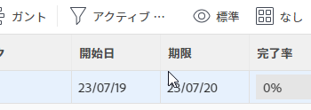
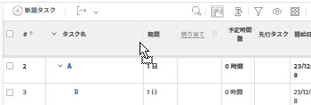

# 列の幅と順序の変更

Adobe Workfront での列の幅の仕組みに関するガイドラインを以下に示します。

* Workfront では、デフォルトでリストとレポートの列の幅が定義されます。
* Workfront では、列のテキストモードで特に指定されていない限り、すべてのリストおよびレポートの `valueformat` 情報に従って列の幅が自動的に調整されます。

  >[!NOTE]
  >
  >Workfront では、「設定」と「レポート」のエリアで使用できるリストの `valueformat` 情報に従って列の幅が調整されません。

  `valueformat` 値では、列に表示される情報の種類が定義されます。例えば、数値を表示する列は、「説明」フィールドを表示する列よりも狭くなります。

* 列に表示する情報の種類に応じて、Workfront のリストとレポートの列の幅をニーズに合わせてカスタマイズできます。

  列の幅は、リストやレポートを表示しているときに一時的に変更することも、ビュービルダーで列の幅を調整して永久的に変更することも可能です。列の幅を一時的に変更する方法については、この記事の[列の幅と順序を一時的に変更する際の考慮事項](#considerations-when-temporarily-modifying-the-width-and-order-of-columns)のセクションを参照してください。

* 組み込みビューで表示される列の幅は、Workfront であらかじめ定義され、ハードコーディングされています。これらの幅を変更するには、ビュービルダーのテキストモードを使用して手動で更新する必要があります。

  テキストモードでの列の変更について詳しくは、[表示：列の幅の永久的な編集](../../../reports-and-dashboards/reports/custom-view-filter-grouping-samples/view-edit-column-width-permanently.md)を参照してください。

## アクセス要件

この記事の手順を実行するには、次のアクセス権が必要です。

<table style="table-layout:auto"> 
 <col> 
 <col> 
 <tbody> 
  <tr> 
   <td role="rowheader"><strong>Adobe Workfront プラン*</strong></td> 
   <td> 
任意
 </td> 
  </tr> 
  <tr> 
   <td role="rowheader"><strong>Adobe Workfront ライセンス*</strong></td> 
   <td> 
リクエスト以上 
 </td> 
  </tr> 
  <tr> 
   <td role="rowheader"><strong>アクセスレベル設定*</strong></td> 
   <td> 
フィルター、ビュー、グループへのアクセスを編集
 
レポート、ダッシュボード、カレンダーへのアクセス権を編集して、レポートのビューを編集
 
メモ：まだアクセス権がない場合は、アクセスレベルに追加の制限が設定されていないかどうか Workfront 管理者にお問い合わせください。Workfront 管理者がアクセスレベルを変更する方法について詳しくは、<a href="../../../administration-and-setup/add-users/configure-and-grant-access/create-modify-access-levels.md" class="MCXref xref">カスタムアクセスレベルの作成または変更</a>を参照してください。
 </td> 
  </tr> 
  <tr> 
   <td role="rowheader"><strong>オブジェクト権限</strong></td> 
   <td> 
レポートに対する権限を管理して、レポートのビューを編集する
 
編集するために、ビューに対する管理権限
 
追加のアクセス権のリクエストについて詳しくは、<a href="../../../workfront-basics/grant-and-request-access-to-objects/request-access.md" class="MCXref xref">オブジェクトへのアクセス権のリクエスト</a>を参照してください。
 </td> 
  </tr> 
 </tbody> 
</table>

&#42;ご利用のプラン、ライセンスタイプまたはアクセス権を確認するには、Workfront 管理者にお問い合わせください。

## 列の幅と順序の変更

レポートの列の幅と順序は、次の方法で変更できます。

* [列の幅と順序の一時的な変更](#modify-width-and-order-of-columns-temporarily)
* [列の幅と順序を永続的に変更する](#modify-width-and-order-of-columns-permanently)

### 列の幅と順序の一時的な変更 {#modify-width-and-order-of-columns-temporarily}

列の境界線をドラッグして列のサイズを変更したり、列をドラッグ&amp;ドロップして、Workfront サイト全体のほとんどのリストで一時的に並べ替えることができます。これには、レポート、ビュー、ダッシュボードのレポート、ガントチャート表示が含まれます。

Workfront のリストについて詳しくは、[Adobe Workfront のリストの概要](../../../workfront-basics/navigate-workfront/use-lists/view-items-in-a-list.md)を参照してください。

* [列の幅と順序を一時的に変更する際の考慮事項](#considerations-when-temporarily-modifying-the-width-and-order-of-columns)
* [列のサイズの一時的な変更](#resize-columns-temporarily)
* [列を一時的に並べ替える](#reorder-columns-temporarily)

#### 列の幅と順序を一時的に変更する際の考慮事項 {#considerations-when-temporarily-modifying-the-width-and-order-of-columns}

リスト内の列の幅と順序は、ビューを編集することなく一時的に変更できます。

列のサイズを一時的に変更して並べ替える際は、次の点を考慮してください。

* 列のサイズを変更すると、新しい列のサイズがブラウザーのローカルストレージにデフォルトとして保存されます。別のブラウザーを使用したり、キャッシュや参照データをクリアしたりすると、列のサイズがデフォルトに戻ります。ページを更新しても、列の幅に加えた変更は保持されます。

>[!NOTE]
> 
>列の幅は、ブラウザーウィンドウのサイズによって制限されます。ページが更新されると、すべての列が横にスクロールせずにウィンドウに収まるように、列の幅が狭くなります。 列の幅をブラウザーが収まらない幅に保つには、テキストモードで列の幅を設定する必要があります。詳しくは、 [列の幅と順序を恒久的に変更する](#modify-width-and-order-of-columns-permanently) 列の幅を手動で調整する場合は、境界線をドラッグします。
>

* 列を並べ替えると、リストから移動するか、ブラウザーページを更新するまで、選択した順序が維持されます。リストから移動したり、ブラウザーページを更新したりすると、列はデフォルトの順序に戻ります。
* 最適なパフォーマンスを得るために、並べ替える列のリスト項目数は 100 個以下にする必要があります。
* 列のサイズを変更すると、変更は現在使用しているビューにのみ適用され、自分だけに表示されます。ビューを別のユーザーと共有しても、定義した列サイズは共有されません。
* 列の境界線を右にドラッグして列のサイズを変更した後、次の点を除き、隣の列の幅は保持されます。

   * 設定エリア
   * レポートエリア
   * ドキュメントのリストとレポート

  >[!NOTE]
  >
  >リスト内で、列の左の境界線を隣の列の左の境界線を超えて移動することはできません。

* リストをファイルに書き出す場合、列の一時的な順序は書き出されたファイルに転送されません。書き出されたファイルには、列が並べ替えられる前の、元のリストの列の順序が表示されます。

リストおよびレポートからデータを書き出す方法について詳しくは、[データの書き出し](../../../reports-and-dashboards/reports/creating-and-managing-reports/export-data.md)を参照してください。

#### 列のサイズを一時的に変更する {#resize-columns-temporarily}

1. 変更するリストに移動します。
1. 列の境界線をドラッグして、目的のサイズにします。\
   

#### 列を一時的に並べ替える {#reorder-columns-temporarily}

1. 変更するリストに移動します。
1. 別の場所に移動する列をクリックして選択します。
1. 列を正しい位置にドラッグします。
1. 列をその位置にドロップして移動します。

   

>[!TIP]
>
>これは、ガントチャートとリスト表示を同時に表示する場合に特に便利です。 ガントチャートを表示すると、列が非表示になる場合があります。 ガントチャートが表示されている間に列を表示するには、表示する列をドラッグして、ページの左側に表示します。

### 列の幅と順序を永続的に変更する {#modify-width-and-order-of-columns-permanently}

列を永続的に並べ替えるには、[Adobe Workfront でのビューの概要](../../../reports-and-dashboards/reports/reporting-elements/views-overview.md)の[標準ビューの作成またはカスタマイズ](../../../reports-and-dashboards/reports/reporting-elements/views-overview.md#customizing-a-standard-view)を参照してください。

列の幅は、テキストモードを使用した場合のみ永続的に変更できます。

テキストモードの使用と列の幅の永続的な変更について詳しくは、[テキストモードの一般的な使用例の概要](../../../reports-and-dashboards/reports/text-mode/understand-common-uses-text-mode.md)を参照してください。
