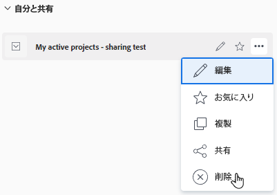

# フィルター、ビュー、グループを削除

リストやレポートを作成した場合、または共有されている場合は、リストやレポートからフィルター、ビュー、またはグループ化を削除できます。デフォルトのフィルター、ビュー、グループ化は削除できません。

## アクセス要件

以下が必要です。

<table style="table-layout:auto"> 
 <col> 
 </col> 
 <col> 
 </col> 
 <tbody> 
  <tr> 
   <td role="rowheader"><strong>Adobe Workfront プラン*</strong></td> 
   <td> 
任意 
 </td> 
  </tr> 
  <tr> 
   <td role="rowheader"><strong>Adobe Workfront ライセンス*</strong></td> 
   <td> 
リクエスト以上
 </td> 
  </tr> 
  <tr> 
   <td role="rowheader"><strong>アクセスレベル設定*</strong></td> 
   <td> 
フィルター、ビュー、グループ化に対する表示またはそれ以上のアクセス権
 
メモ：まだアクセス権がない場合は、アクセスレベルに追加の制限が設定されていないかどうか Workfront 管理者にお問い合わせください。Workfront 管理者がアクセスレベルを変更する方法について詳しくは、<a href="../../../administration-and-setup/add-users/configure-and-grant-access/create-modify-access-levels.md" class="MCXref xref">カスタムアクセスレベルの作成または変更</a>を参照してください。
 </td> 
  </tr> 
  <tr> 
   <td role="rowheader"><strong>オブジェクト権限</strong></td> 
   <td> 
削除するフィルター、ビュー、またはグループ化に対する共有アクセス限を持つ表示権限
 
追加のアクセス権のリクエストについて詳しくは、<a href="../../../workfront-basics/grant-and-request-access-to-objects/request-access.md" class="MCXref xref">オブジェクトへのアクセス権のリクエスト</a>を参照してください。
 </td> 
  </tr> 
 </tbody> 
</table>

&#42;保有するプラン、ライセンスタイプ、アクセス権を確認するには、Workfront 管理者に問い合わせてください。

## 標準ビルダーを使用してフィルターを削除する

標準ビルダーインターフェイスを使用して、自分と共有していたフィルターをプロジェクト、タスク、またはイシューのリストから削除できます。標準ビルダーインターフェイスは、他のオブジェクトに対しても、ビューやグループ化に対しても使用できません。

標準ビルダーインターフェイスを使用して、プロジェクト、タスク、またはイシューのリストから所有しているフィルターを削除することもできます。

システムのデフォルトのフィルターは、削除できません。

### 標準ビルダーを使用したフィルターの削除に関する考慮事項

標準ビルダーを使用してフィルターを削除する場合、次のシナリオが存在します。

* フィルターを自分と共有し、自分で削除した場合は、そのフィルターは自分に対してのみ削除されます。最初にフィルターを作成したユーザーと、それを共有している他のユーザーは、引き続きフィルターにアクセスできます。
* フィルターを所有していて、削除した場合、そのフィルターは Workfront システムから削除されます。以前にフィルターを共有していたユーザーは、フィルターを使用できなくなります。
* Workfront 管理者はフィルターを削除でき、所有者を含むすべてのユーザーに対してフィルターが完全に削除されます。

### 標準ビルダーを使用してフィルターを削除する

1. プロジェクト、タスク、イシュー、ポートフォリオ、プログラム、ユーザー、テンプレート、またはグループのリストに移動します。
1. **フィルター**&#x200B;アイコン  をクリックします。
1. **自分と共有**&#x200B;の下のフィルターにポインタを合わせて、**その他**&#x200B;メニュー  をクリックして、「**削除**」をクリックします。

   

1. 確認メッセージで「**削除**」を選択すると、フィルターが完全に削除されます。

### 標準ビルダーを使用してフィルターを削除する

1. プロジェクト、タスク、イシュー、ポートフォリオ、プログラム、ユーザー、テンプレート、またはグループのリストに移動します。
1. **フィルター** アイコン  をクリックします。
1. 削除権限があるフィルターの上にポインターを合わせて、**その他**&#x200B;メニュー  をクリックして、「**削除**」をクリックします。

   

1. （オプション）確認メッセージで「**キャンセル**」をクリックすると、削除されずにフィルターのリストに戻ります。
1. 確認メッセージで「**削除**」をクリックすると、削除されます。

   このフィルターは、自分のほか、権限を持つすべてのユーザーに対して削除されます。

## レガシービルダーを使用してフィルター、ビュー、またはグループ化を削除する

レガシービルダーインターフェイスを使用して、すべてのオブジェクトのリストのフィルター、表示、またはグループ化を削除できます。

### レガシービルダーを使用してフィルター、ビュー、およびグループ化を削除する際の考慮事項

レポート要素を削除する方法は、最初に作成したか、自分と共有したかによって異なります。

フィルター、ビュー、またはグループ化を削除する場合、次のシナリオが存在します。

* **要素を作成して削除すると**、要素は Workfront システムから削除されます。以前に共有していたユーザーは利用できなくなります。
* **他のユーザーと共有していた要素を削除すると**、要素は自分に対してのみ削除されます。最初にそれを作成したユーザーと、共有している他のユーザーは、引き続きアクセスできます。

### レガシービルダーを使用してフィルター、ビュー、またはグループ化を削除する

1. オブジェクトのリストまたはレポートに移動します。
1. （条件付き）リストから、「**フィルター**」、「**ビュー**」、または「**グループ化**」アイコンをクリックし、削除するフィルター、ビュー、またはグループ化にポインタを合わせて、**その他**&#x200B;アイコン  をクリックし、続いて「**削除**」をクリックします。フィルター、ビュー、またはグループ化が削除されます。
1. （条件付き）レポートから、「**グループ化**」、「**フィルター**」、または「**ビュー**」ドロップダウンメニューをクリックして、「**グループ化の削除**」、「**フィルターの削除**」、または「**ビューの削除**」を選択します。

   「**マイグループ化**」、「**マイフィルター**」、または「**マイビュー**」ダイアログボックスが表示されます。

   削除する権限を持つすべてのレポート要素を削除できます。その他のレポート要素は淡色表示になります。

1. 削除するレポート要素の横にある「**x**」アイコンをクリックします。
1. （条件付き）作成して後で他のユーザーと共有したフィルター、ビュー、またはグループ化を削除することを選択した場合は、「**はい、削除します**」をクリックします。これにより、Workfront システムからフィルター、ビュー、またはグループ化が削除されます。

   >[!TIP]
   >
   >他のユーザーと共有せずに作成したフィルター、ビュー、またはグループ化を削除すると、確認を求めることなくシステムから削除されます。

1. 「**完了**」をクリックします。

