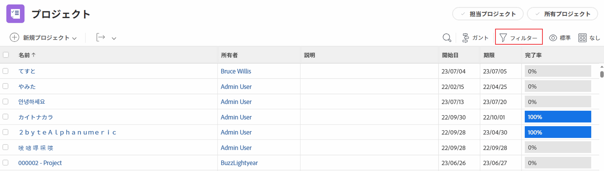

# レポート要素：フィルター、ビューおよびグループ化

<!--

AL: Add information here about all the different kinds of FVGs: in reports, in lists, beta, etc // OR: this article should be a high-level overview of reporting elements. Then, each type of element should have:

- overview for Filters

- create a filter

- share a filter

ALL in Reporting elements but the Shared ones should be linked to Basics> Sharing; some of the articles in the Basics> Navigation> Use lists might beed to link here as well

-->

Adobe Workfront には、リストやレポートを構成する要素がいくつかあります。すべてのリストとレポートに必要な主な要素は、フィルター、ビューおよびグループ化です。各要素は、どのレポート内でも様々な情報を提供します。

## レポート要素に関する考慮事項

フィルター、ビューおよびグループ化を使用する際は、次の点を考慮してください。

* レポート要素は、レポートの構成要素として機能します。これらは、レポートまたはリストのルックアンドフィールのほか、レポートまたはリストに含まれる情報を定義します。
* Workfront のレポートは、1 つのオブジェクトに固有のものです。レポートを作成するには、まず、レポートのメインオブジェクトを定義する必要があります。したがって、すべてのレポート要素はオブジェクトに固有です。
* リストやレポートでフィルター、ビューおよびグループ化をユーザーが表示または編集できるようにするには、Workfront 管理者がそれらへのアクセス権をアクセスレベルでユーザーに付与する必要があります。

  フィルター、ビューおよびグループ化に対するアクセス権の付与については、[フィルター、ビューおよびグループ化に対するアクセス権の付与](../../../administration-and-setup/add-users/configure-and-grant-access/grant-access-fvg.md)を参照してください。

* レポートをユーザーが表示または編集できるようにするには、Workfront 管理者がレポート、ダッシュボードおよびカレンダーへのアクセス権をアクセスレベルでユーザーに付与する必要があります。

  レポート、ダッシュボードおよびカレンダーに対するアクセス権の付与については、[レポート、ダッシュボードおよびカレンダーに対するアクセス権の付与](../../../administration-and-setup/add-users/configure-and-grant-access/grant-access-reports-dashboards-calendars.md)を参照してください。

* レポートまたはリストでフィルター、ビューまたはグループ化を選択した場合、Workfront では、ユーザーがログアウトするかブラウザーを閉じた後でも、そのオブジェクトのリストに対するこの選択内容が保持されます。例えば、タスクレポートの特定のビューを選択すると、その選択は他のタスクリスト（プロジェクト上のタスクのリストなど）にも表示されます。

## フィルター

フィルターはレポートに表示される結果を制御し、通常は結果を一般的なものから特定のものに絞り込みます。これはふるいのように機能し、必要な情報のみを取り込み、その情報をレポートに戻します。

例えば、ログインしたユーザーに割り当てられたタスクのみを表示する場合は、「マイタスク」という名前のフィルターを作成し、満たすべき条件をそのフィルターに定義したあと、レポートを実行して、ログインしたユーザーに割り当てられたタスクのみを表示することができます。

フィルターの主な属性は次のとおりです。

* Workfront には、デフォルトで、様々なオブジェクトのフィルターが多数用意されています。
* 自分が所有または管理するフィルターをカスタマイズできます。

  フィルターについて詳しくは、「 [フィルターの概要](../../../reports-and-dashboards/reports/reporting-elements/filters-overview.md).

## ビュー

レポートのビューを定義することで、レポートに含める情報を定義します。すべてのレポート要素と同様に、ビューも 1 つのオブジェクトタイプに基づいています。\
例えば、タスクレポートのビューでは、期日を表示したり、コストなどの主要な財務詳細を含めたり、割り当てと納期の詳細を表示するために使用したりできます。ビューを使用して、レポート内のデータに関する様々な詳細を提供できます。

ビューの主な属性は次のとおりです。

* デフォルトの Workfront ビューを使用することも、独自のビューを作成することもできます。
* レポートを実行した後に、「ビュー」ドロップダウンフィールドから追加のビューを適用できます。
* 追加のビューは、レポートの作成時に定義されたビューに一時的に置き換わります。ただし、次回レポートに戻ったときは、デフォルトのビューが表示されます。

  ビューについて詳しくは、[Adobe Workfront のビューの概要](../../../reports-and-dashboards/reports/reporting-elements/views-overview.md)を参照してください。

## グループ化

グループ化は、データの整理方法を制御して、データを読みやすく理解しやすくします。グループ化では、レポート全体を通して横棒グラフが作成され、共通の属性別に結果が一緒に表示されます。グループ化を作成する際に、レポートの結果をグループ化する方法の基準を定義します。

例えば、複数のプロジェクトにまたがるタスクのリストをプロジェクト名別にグループ化すると、1 つのプロジェクトに属するすべてのタスクが、その名前で整理されます。

グループ化の主な属性は次のとおりです。

* 後でレポートにグラフを追加する場合、グループ化は必須のレポート要素になります。
* グループ化により、結果に集計値が表示されます。
* グループ化によって、グラフの軸が決まります。
* グループ化によって、マトリックスレポートのヘッダー ID が決まります。\
  マトリックスレポートについて詳しくは、[マトリックスレポートの作成](../../../reports-and-dashboards/reports/creating-and-managing-reports/create-matrix-report.md)を参照してください。

* グループ化は、レポートの概要タブを作成し、レポートの集計値を提供するのに役立ちます。
* Workfront は、デフォルトで、様々なオブジェクトに対して多数のグループ化を提供します。
* 所有または管理するグループをカスタマイズできます。

  グループ化について詳しくは、[Adobe Workfront でのグループ化の概要](../../../reports-and-dashboards/reports/reporting-elements/groupings-overview.md)を参照してください。

## その他のレポート要素

フィルター、ビューおよびグループ化に加えて、次の要素をレポートに追加することもできます。

* **プロンプト**：オープンフィルターで、レポートを実行するたびに異なる方法でカスタマイズおよび適用できます。\
  プロンプトについて詳しくは、[レポートへのプロンプトの追加](../../../reports-and-dashboards/reports/creating-and-managing-reports/add-prompt-report.md)を参照してください。

* **グラフ**：レポートにグラフを追加し、情報を視覚的に表示することで、レポートをより充実させることができます。\
  レポートのグラフについて詳しくは、[レポートへのグラフの追加](../../../reports-and-dashboards/reports/creating-and-managing-reports/add-chart-report.md)を参照してください。
