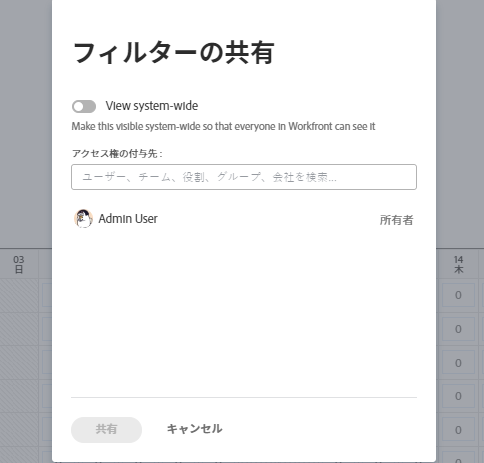
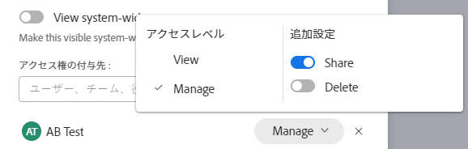
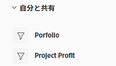
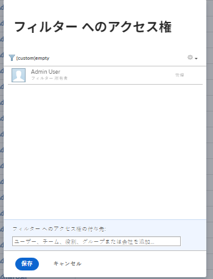

# フィルター、表示またはグループ化の共有

<!--

(NOTE: CONSIDER SPLITTING THIS in three articles for each reporting element?)

(NOTE: This is linked from the TOC article in WF Basics > permissions section)&nbsp;

-->

Adobe Workfront管理者は、アクセスレベルを割り当てる際に、ユーザーにオブジェクトの表示や編集のアクセス権を付与します。 オブジェクトへのアクセス権の付与の詳細については、 [カスタムアクセスレベルの作成または変更](../../../administration-and-setup/add-users/configure-and-grant-access/create-modify-access-levels.md).

ユーザーに付与されるアクセスレベルに加えて、自分が作成した特定のオブジェクトや、共有するアクセス権を持つオブジェクトを表示または編集する権限をユーザーに付与することもできます。 アクセスレベルと権限の詳細については、 [アクセスレベルと権限の連携](../../../administration-and-setup/add-users/access-levels-and-object-permissions/how-access-levels-permissions-work-together.md).

表示するためのアクセス権のあるフィルター、ビューおよびグループを他のユーザーと共有できます。

フィルター、表示、またはグループ化が共有されている場合、そのフィルター、表示またはグループをリストに適用できます。 自分に付与されているアクセス権に応じて、自分が自分を変更し、他のユーザーと共有できる場合があります。

フィルター、表示またはグループ化の作成方法については、次の記事を参照してください。

* [Adobe Workfrontのフィルターの概要](../../../reports-and-dashboards/reports/reporting-elements/filters-overview.md)
* [Adobe Workfrontの概要を表示](../../../reports-and-dashboards/reports/reporting-elements/views-overview.md)
* [Adobe Workfrontでのグループ化の概要](../../../reports-and-dashboards/reports/reporting-elements/groupings-overview.md)

## アクセス要件

以下が必要です。

<table style="table-layout:auto"> 
 <col> 
 <col> 
 <tbody> 
  <tr> 
   <td role="rowheader"><strong>Adobe Workfront plan*</strong></td> 
   <td> 
任意 
 </td> 
  </tr> 
  <tr> 
   <td role="rowheader"><strong>Adobe Workfront license*</strong></td> 
   <td> 
リクエスト以上
 </td> 
  </tr> 
  <tr> 
   <td role="rowheader"><strong>アクセスレベル設定*</strong></td> 
   <td> 
フィルター、ビュー、グループに対する表示またはそれ以上のアクセス権
 
注意：まだアクセス権がない場合は、Workfront管理者に、アクセスレベルに追加の制限を設定しているかどうかを問い合わせてください。 Workfront管理者がアクセスレベルを変更する方法について詳しくは、 <a href="../../../administration-and-setup/add-users/configure-and-grant-access/create-modify-access-levels.md" class="MCXref xref">カスタムアクセスレベルの作成または変更</a>.
 </td> 
  </tr> 
  <tr> 
   <td role="rowheader"><strong>オブジェクト権限</strong></td> 
   <td> 
ビュー、フィルター、またはグループ化に対する共有アクセス権を持つ表示または高い権限
 
追加のアクセス権のリクエストについて詳しくは、 <a href="../../../workfront-basics/grant-and-request-access-to-objects/request-access.md" class="MCXref xref">オブジェクトへのアクセスのリクエスト </a>.
 </td> 
  </tr> 
 </tbody> 
</table>

&#42;保有しているプラン、ライセンスの種類、アクセス権を確認するには、Workfront管理者に問い合わせてください。

## フィルター、表示またはグループ化の共有

<!--

(NOTE: when the beta filters/ groupings come out either consider splitting this in different kinds of FVGs or splitting this article in FVGs for showing sharing on each one of them??)

-->

選択リストでのフィルターの共有方法は、フィルターの共有に使用するインターフェイスによって異なります。標準またはレガシー。 フィルタ構築インターフェイスのタイプについては、 [Adobe Workfrontでフィルターを作成または編集](/help/quicksilver/reports-and-dashboards/reports/reporting-elements/create-filters.md).

ビューとグループは、レガシーインターフェイスでのみ共有できます。

### 標準ビルダーインターフェイスを使用したフィルターの共有

標準インターフェイスでは、プロジェクト、タスク、問題、ポートフォリオ、プログラム、ユーザー、テンプレート、グループのリストからフィルターを共有できます。 フィルタの標準ビルダーインターフェイスは、他のオブジェクトやビューやグループには使用できません。

標準ビルダーインターフェイスを使用してフィルターを共有します。

1. プロジェクト、タスクまたはタスクのリストに移動します。
1. 次をクリック： **フィルター** アイコン .

   

1. 次のフィルターリストを確認します。

   <table style="table-layout:auto">
   <col>
   <col>
   <tbody>
   <tr>
   <td role="rowheader"><strong>お気に入りに登録済み</strong></td>
   <td>お気に入りとしてマークしたフィルターです。 フィルターをお気に入りに登録すると、元の場所がフィルター名の下に表示され、お気に入りとして削除しない限り、元のリストでは非表示になります。</td>
   </tr>
   <tr>
   <td role="rowheader"><strong>保存済み</strong></td>
   <td>自分で作成し、保存したフィルター。</td>
   </tr>
   <tr>
   <td role="rowheader"><strong>システムデフォルト</strong></td>
   <td>Workfrontシステムのデフォルトのフィルター。また、Workfront管理者がフィルターのリストに追加したフィルター（システムレベルまたはレイアウトテンプレート）。</td>
   </tr>
   <tr>
   <td role="rowheader"><strong>自分と共有</strong></td>
   <td>他のユーザーが自分を作成して共有したり、システム全体で共有したりするフィルター。</td>
   </tr>
   </tbody>
   </table>

1. 少なくとも表示および共有にアクセスできるフィルターの上にマウスポインターを置いて、 **詳細** メニュー を選択し、「 **共有**.

   

   「フィルター共有」ボックスが表示されます。

1. を有効にします。 **システム全体を表示** 設定。 これにより、Workfrontのユーザーはフィルターを表示する権限を持ちます。

   >[!IMPORTANT]
   >
   >この設定は慎重に使用してください。 すべてのユーザーに多数のフィルターを追加すると、フィルターエクスペリエンスが煩雑になり、フィルターを見つけにくくなります。

   または、で共有するユーザー、チーム、役割、グループまたは会社の名前の入力を開始します **へのアクセス権を付与** フィールドに入力します。

   

1. （オプション）フィルターに対する権限を編集するエンティティの名前の横にある右矢印をクリックし、 **表示** または **管理** オプション。 **表示** がデフォルトです。

   

1. （オプション）次のいずれかの操作をおこなって、エンティティの追加の権限を有効または無効にします。

   1. クリック **表示** を無効にします。 **共有** オプション。 これはデフォルトで有効になっています。
   1. クリック **管理** を無効にし、 **共有** または **削除** オプション。 これらは、デフォルトで有効になっています。

      >[!NOTE]
      >
      >「削除」オプションを使用して「アクセスを管理」を有効にした場合、ユーザーは、フィルターを所有していなくても、すべてのユーザーからフィルターを削除できます。
   >[!TIP]
   >
   >ユーザーは、自分のアクセスレベルより高い権限を受け取ることはできません。 アクセスレベルでフィルターを編集するアクセス権がない場合、フィルターを管理する権限を受け取ることはできません。 Workfrontでは、これらのユーザーの「管理」オプションが無効になっており、このオプションは淡色表示になっています。

1. 「**共有**」をクリックします。フィルターは、指定したエンティティと共有されます。

   >[!TIP]
   >
   >グループと共有すると、グループのメンバーとすべてのサブグループに対するフィルター権限が与えられます。

   共有したフィルターが「 **自分と共有済み** 」セクションに表示されます。

   

### 従来のインターフェイスを使用したフィルター、ビュー、グループの共有

レガシーインターフェイスでのフィルター、表示、グループの共有は同じです。

1. オブジェクトまたはレポートのリストに移動します。
1. （条件付き）リストから、 **フィルター**, **表示**&#x200B;または **グループ化** アイコンをクリックし、共有するフィルター、表示またはグループにマウスポインターを置いて、 **詳細** アイコン を、 **共有**.

   レポートから、 **フィルター**, **表示**&#x200B;または **グループ化** ドロップダウンメニューから、共有するフィルター、表示またはグループを選択します。

1. （条件付き）レポートから共有する場合、 **フィルター**, **表示**&#x200B;または **グループ化** ドロップダウンメニューを再度表示し、「 **フィルターを共有**, **ビューを共有**&#x200B;または **グループを共有**.\
   この **アクセスをフィルター**, **アクセスを表示**&#x200B;または **グループ化アクセス** ダイアログボックスが表示されます。

   

1. 共有相手に応じて、次のいずれかを実行します。

   **個々のユーザー、チーム、役割、グループまたは会社と共有するには：** 提供されたフィールドに、共有するユーザー、チーム、役割、グループまたは会社の名前を入力し、ドロップダウンリストに表示されたら名前をクリックします。\
   複数のユーザー、チーム、役割、グループまたは会社とアクセスを共有するには、この手順を繰り返します。

   >[!TIP]
   >
   >グループと共有すると、グループのメンバーとすべてのサブグループのメンバーに対して、フィルタ、表示、またはグループ化の権限が与えられます。

   **システム内のすべてのユーザーと共有するには：** 次をクリック： **設定** アイコンをクリックし、 **この機能をシステム全体で表示**.\
   このオプションを使用するには、管理者が [ システム全体の共有 ] オプションを選択する必要があります。 詳しくは、 [カスタムアクセスレベルの作成または変更](../../../administration-and-setup/add-users/configure-and-grant-access/create-modify-access-levels.md) および [レポート、ダッシュボード、カレンダーの共有](../../../workfront-basics/grant-and-request-access-to-objects/permissions-reports-dashboards-calendars.md).

1. （条件付き）個々のユーザー、チーム、役割、グループまたは会社と共有している場合は、ドロップダウンメニューをクリックして、付与するアクセスレベルを定義します。

   次のオプションから選択できます。

   <table style="table-layout:auto"> 
    <col> 
    <col> 
    <tbody> 
     <tr> 
      <td role="rowheader"><strong>それを表示</strong></td> 
      <td> 
共有受信者が共有フィルター、表示またはグループ化のみを使用できるようにするには、このオプションを選択します。 このオプションを選択した場合、受信者は共有項目を変更できません。
 </td> 
     </tr> 
     <tr> 
      <td role="rowheader"><strong>それを管理</strong></td> 
      <td> 
共有受信者が共有フィルター、表示またはグループ化の使用および変更をおこなえるようにするには、このオプションを選択します。
 </td> 
     </tr> 
     <tr> 
      <td role="rowheader"><strong>共有する</strong></td> 
      <td> 
クリック <strong>詳細設定</strong>を選択し、 <strong>共有</strong> 」オプションを選択します。
 </td> 
     </tr> 
    </tbody> 
   </table>

1. 「**保存**」をクリックします。

   フィルター、表示またはグループを共有したユーザーは、「 **フィルター**, **表示**&#x200B;または **グループ化** ドロップダウンメニューまたはアイコンと、 **自分と共有済み** 」セクションに入力します。

