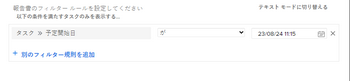

# 日付ベースのワイルドカードを使用してレポートを一般化する

特定のレポート要素を作成する際に、特定の情報ではなくワイルドカードを使用して、レポートを一般化できます。

例えば、特定の計画開始日を持つタスクを表示するレポートを作成する場合は、フィルタでカレンダー日付選択を使用して特定の日付を選択できます。 ただし、レポートのアクセス日から特定の期間内に予定開始日が設定されたタスクを表示するレポートを作成する場合は、レポートを表示した時点に関連する期間の情報を表示するワイルドカードを使用できます。

例えば、過去の週、過去の年、次の 2 週間など。 この方法では、レポートを 1 回作成しますが、フィルターでワイルドカードを使用するので、レポートの実行日に適応するので、誰かが読むたびに異なる結果が生成されます。

次のレポート要素を作成する際に、日付ベースのワイルドカードを使用できます。

* フィルター
* カスタムプロンプト
* 列のルールを追加する際に表示

## アクセス要件

この記事の手順を実行するには、次のアクセス権が必要です。

<table style="table-layout:auto"> 
 <col> 
 <col> 
 <tbody> 
  <tr> 
   <td role="rowheader"><strong>Adobe Workfront plan*</strong></td> 
   <td> 
任意
 </td> 
  </tr> 
  <tr> 
   <td role="rowheader"><strong>Adobe Workfront license*</strong></td> 
   <td> 
計画 
 </td> 
  </tr> 
  <tr> 
   <td role="rowheader"><strong>アクセスレベル設定*</strong></td> 
   <td> 
フィルター、ビュー、グループへのアクセスを編集
 
レポート、ダッシュボード、カレンダーへのアクセスを編集して、レポートのレポート要素を編集します
 
注意：まだアクセス権がない場合は、Workfront管理者に、アクセスレベルに追加の制限が設定されているかどうかを問い合わせてください。 Workfront管理者がアクセスレベルを変更する方法について詳しくは、 <a href="../../../administration-and-setup/add-users/configure-and-grant-access/create-modify-access-levels.md" class="MCXref xref">カスタムアクセスレベルの作成または変更</a>.
 </td> 
  </tr> 
  <tr> 
   <td role="rowheader"><strong>オブジェクトの権限</strong></td> 
   <td> 
レポートのレポート要素を編集するためのレポートに対する権限の管理
 
ビューまたはフィルターに対する権限を管理して編集する
 
追加のアクセス権のリクエストについて詳しくは、 <a href="../../../workfront-basics/grant-and-request-access-to-objects/request-access.md" class="MCXref xref">オブジェクトへのアクセスのリクエスト </a>.
 </td> 
  </tr> 
 </tbody> 
</table>

&#42;保有するプラン、ライセンスの種類、アクセス権を確認するには、Workfront管理者に問い合わせてください。

## 前提条件

ワイルドカード変数を追加する前に、レポートを作成する必要があります。

レポートの作成について詳しくは、 [レポートの作成](../../../reports-and-dashboards/reports/creating-and-managing-reports/create-report.md).

## ハウツー手順

日付ベースのワイルドカードをレポートに挿入するには、次の手順に従います。

1. 日付ベースのワイルドカードを挿入するレポートに移動します。
1. クリック **レポートのアクション**&#x200B;を、 **編集**.

1. 次をクリック： **フィルター** タブをクリックします。
1. クリック **フィルタールールを追加する**.
1. フィルターに使用するフィールドの名前を入力します。\
   日付を参照するフィールドを入力する必要があります。
1. 選択 **次と等しい** （フィルター変数のドロップダウンメニュー）を使用します。

   >[!TIP]
   >
   >常に **次と等しい** Adobe Workfrontでワイルドカードを使用する場合は、フィルター変数を使用します。

1. Adobe Analytics の **名前の入力を開始…** ボックス、タイプ： `$$TODAY` レポートの実行日と同じ日に発生した何かに関する情報を表示する場合。

   または

   タイプ `$$NOW` レポートが実行された日時に発生した何かに関する情報を表示する場合。

   この日付は、ユーザーが実際にレポートを閲覧した日付と共に変化するので、常に異なります。 したがって、レポートに表示される情報は日々異なります。

1. （オプション）レポートの実行日より後の期間内に発生する情報を表示する場合は、「 `$$TODAY+1w` 次の週に情報を表示する `$$TODAY+2m` 」をクリックして、今後 2 か月間の情報を表示します。 四半期、時間、日または年の期間も指定できます。
1. （オプション）レポートが実行される日付より前の期間に発生した情報を表示する場合は、「 `$$TODAY-1w` 前の週の情報を表示する。 `$$TODAY-2m` 過去 2 か月の情報を表示する 四半期、時間、日または年の期間も指定できます。

   日付ベースのワイルドカードで使用できる属性、修飾子および演算子の完全なリストについては、「 [ワイルドカードフィルター変数の概要](../../../reports-and-dashboards/reports/reporting-elements/understand-wildcard-filter-variables.md).

   

1. 「**保存して閉じる**」をクリックします。

## 追加情報

関連トピック：

<!--outdated: * [Basic Report Creation Program](https://one.workfront.com/s/basic-report-creation-program) -->
* [ワイルドカードフィルター変数の概要](../../../reports-and-dashboards/reports/reporting-elements/understand-wildcard-filter-variables.md)
* [Adobe Workfrontでフィルターを作成または編集](../../../reports-and-dashboards/reports/reporting-elements/create-filters.md)
* [レポートにプロンプトを追加する](../../../reports-and-dashboards/reports/creating-and-managing-reports/add-prompt-report.md)
* [ビューでの条件付き書式の使用](../../../reports-and-dashboards/reports/reporting-elements/use-conditional-formatting-views.md)
