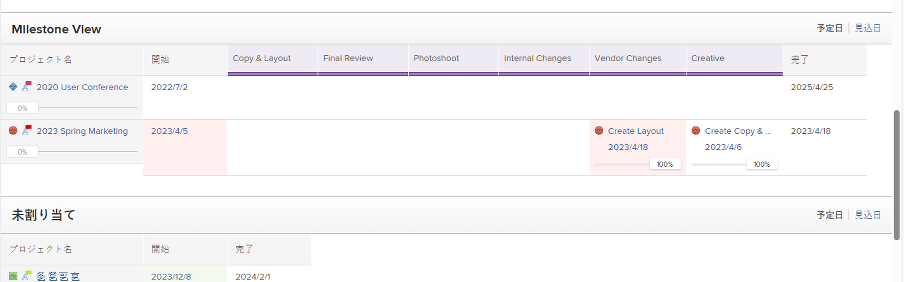
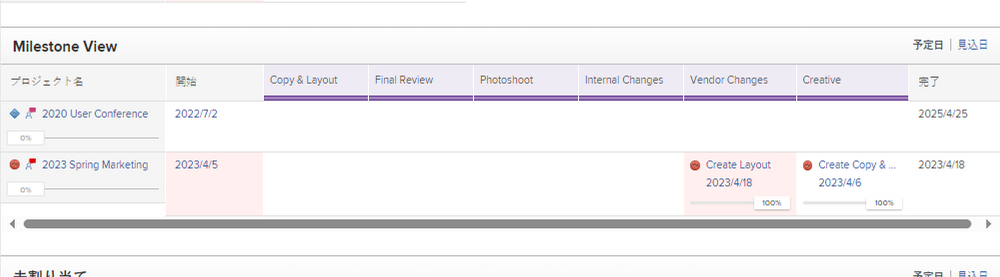
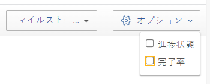

# マイルストーンビューの使用

<!-- Audited: 1/2024 -->

マイルストーンビューは、プロジェクトの一覧またはレポートに適用できます。

マイルストーンビューを使用する前に、マイルストーンを設定する必要があります。マイルストーンパスをプロジェクトに追加し、マイルストーンをタスクに関連付ける必要があります。詳しくは、記事を参照してください [マイルストーンパスを作成する](../../../administration-and-setup/customize-workfront/configure-approval-milestone-processes/create-milestone-path.md) および [タスクへのマイルストーンの関連付け](../../../manage-work/tasks/manage-tasks/associate-milestones-with-tasks.md).

マイルストーンビューは、プロジェクトリストまたはプロジェクトレポートを表示するときに使用できます。 次のセクションでは、マイルストーンビューの表示方法と使用方法について説明します。

## アクセス要件

この記事の手順を実行するには、次のアクセス権が必要です。

<table style="table-layout:auto"> 
 <col> 
 </col> 
 <col> 
 </col> 
 <tbody> 
  <tr> 
   <td role="rowheader"><strong>Adobe Workfrontプラン</strong></td> 
   <td> 
任意
 </td> 
  </tr> 
  <tr> 
   <td role="rowheader"><strong>Adobe Workfrontライセンス</strong></td> 
   <td> 
   
新規：標準

   
現在：作業以上 
 </td> 
  </tr> 
  <tr> 
   <td role="rowheader"><strong>アクセスレベル設定*</strong></td> 
   <td> 
レポート、ダッシュボード、カレンダーへのアクセス権を表示またはそれ以上に設定する
</td> 
  </tr> 
  <tr> 
   <td role="rowheader"><strong>オブジェクトの権限</strong></td> 
   <td> 
マイルストーンビューをレポートに適用するための、プロジェクトレポートに対する権限を表示します
 </td> 
  </tr> 
 </tbody> 
</table>

この表の情報の詳細については、 [Workfrontドキュメントのアクセス要件](/help/quicksilver/administration-and-setup/add-users/access-levels-and-object-permissions/access-level-requirements-in-documentation.md).

## マイルストーン表示に切り替える {#switch-to-the-milestone-view}

{{step1-to-projects}}

1. 次をクリック： **表示** ドロップダウンメニューから、 **マイルストーン**.

   リストまたはレポートは、マイルストーンビューで表示されます。

   マイルストーンビューについて詳しくは、「 [マイルストーン表示の概要](#milestone-view-overview) 」を参照してください。

## マイルストーン表示の概要 {#milestone-view-overview}

マイルストーンビューは、プロジェクトリストとプロジェクトレポートで使用できます。 このビューでは、表示中のプロジェクト内のタスクに関連するすべてのマイルストーンをすばやく表示できます。

>[!NOTE]
>
>以下の領域では、マイルストーンビューを使用できません。
>
>* タイムシート（プロジェクトの追加時にプロジェクトリスト内）。

マイルストーンビューに切り替える方法については、「 [マイルストーン表示に切り替える](#switch-to-the-milestone-view) 」を参照してください。

### マイルストーン表示セクション

マイルストーンビューをプロジェクトの一覧に適用すると、以下のセクションにプロジェクトが表示されます。

* マイルストーンパスに関連付けられているプロジェクトが最初に表示され、それぞれのマイルストーンパスの名前の下に表示されます。

  Workfrontは、最初のセクションのプロジェクトを、次の基準に従って、この順序で並べ替えます。

   1. マイルストーンパス ID。 マイルストーンパス ID は、マイルストーンパスレポートで表示できます。

   2. マイルストーンビューを選択する前に、以前にプロジェクトリストに適用されたビューのプロジェクトリストの最初の並べ替えフィールドとして選択されたフィールドです。

* 「未割り当て」セクションの次に、マイルストーブパスに関連付けられていないプロジェクトが表示されます。 Workfrontは、[ 割り当てなし ] セクションのプロジェクトを、以前にプロジェクト一覧に適用されたビューのプロジェクト一覧の最初の並べ替えフィールドとして選択されたフィールドで並べ替えます。

### マイルストーンビューのプロジェクト情報

マイルストーンビューでプロジェクト一覧またはプロジェクトレポートを表示すると、次の情報が表示されます。

* **計画日または予定日：** マイルストーンビューに計画日と予定日のどちらを表示するかを指定します。\
  開始および完了の日付と、マイルストーンパス内の各マイルストーンの日付が表示されます。\
  「計画日」を表示し、プロジェクトに対する「管理」アクセス権も持っている場合は、「マイルストーン」ビューから直接次の日付を編集できます（「予定日」を表示している場合は、「予定日」が計算され、手動で変更できないため、日付は編集できません）。

   * **プロジェクトの開始日：** プロジェクトが開始日からスケジュールされている場合、プロジェクトの開始日を手動で変更すると、完了日が計算されます。
   * **プロジェクトの完了日：** プロジェクトが「完了日」からスケジュールされている場合、プロジェクトの「完了日」を手動で変更すると、開始日が計算されます。
   * **タスクの完了日：** タスクの完了は、マイルストーンビューから直接手動で更新できます。

* **完了率：** 各タスクとプロジェクトの完了率を表示します。\
  「 」セクションで説明しているように、完了率を表示しないようにできます。 [マイルストーン表示に表示する情報を構成する](#configure-what-information-displays-in-the-milestone-view) 」を参照してください。\
  完了率は、「マイルストーン」ビューから直接調整できます（「 」セクションを参照）。 [マイルストーンビューでタスクの完了率を調整する](#adjust-percent-complete-for-tasks-in-the-milestone-view) 」を参照してください。

* **タスクステータスアイコン：** マイルストーンビューでは、各プロジェクトとタスクの横にステータスアイコンが表示されます。

   * 予定通り\
     

   * 遅れ\
     

   * リスクあり\
     

   * 遅延\
     

  これらのステータスアイコンの表示を無効にするには、「 」の節で説明されているようにします。 [マイルストーン表示に表示する情報を構成する](#configure-what-information-displays-in-the-milestone-view) 」を参照してください。\
  各ステータスタイプの詳細については、「 [タスクの進捗状況ステータスの概要](../../../manage-work/tasks/task-information/task-progress-status.md).

* **完了したタスクのタスクステータスの網掛け**：タスクが「完了」とマークされた後、マイルストーンビューでタスクの背景に影が付き、タスクが時間通りに完了したか遅く完了したかを示します。

   * **タスク列の赤い網掛け**：進捗状況ステータスが赤の場合、タスクの背景は赤で表示されます **遅延**.

   * **タスク列の緑の網掛け**：進捗状況ステータスが緑色のタスクの背景は、緑色です **オンタイム**.

* **[ プロジェクトの開始 ] 列と [ 完了 ] 列のプロジェクトステータスの網掛け**:

   * **プロジェクト開始列**:「プロジェクトの開始日」列の背景が、「実際の開始日」が入力されている場合にのみ、赤または緑になります。

      * **プロジェクト開始列の赤い網掛け**：プロジェクトの進捗状況ステータスが赤の場合、「プロジェクトの開始」列の背景は赤で表示されます **遅延**.

      * **プロジェクト開始列の緑の網掛け**：プロジェクトの進捗状況ステータスが緑色の場合、「プロジェクトの開始」列の背景は緑色です **オンタイム**.

   * **プロジェクト完了列**:「プロジェクトの完了」列の背景は、「実際の完了日」が入力されている場合にのみ、赤または緑で表示されます。

      * **プロジェクト完了の赤い網掛け列**：プロジェクトの進捗状況ステータスが赤の場合、「プロジェクト完了」列の背景は赤で表示されます **遅延**.

      * **[ プロジェクトの完了 ] 列の緑の陰影**：プロジェクトの進捗状況ステータスがの場合、「プロジェクト完了」列の背景は緑色です **オンタイム**.

   * タスクの進捗状況ステータスが [ 危険度 ] または [ 後 ] の場合、[ 開始 ] 列と [ 完了 ] 列に色分けが割り当てられません。

  

* **プロジェクト名**：プロジェクト名が、プロジェクトへのリンクと共に表示されます。
* **プロジェクト条件アイコン**：プロジェクト名の横に、プロジェクトの条件を示すアイコンが表示されます。

## マイルストーン表示に表示する情報を構成する {#configure-what-information-displays-in-the-milestone-view}

マイルストーンビューに次の要素を表示するかどうかを設定できます。

* 進行状況ステータスのアイコン
* プロジェクトとタスクの完了率

デフォルトでは、プロジェクトステータスアイコンとプロジェクトの完了率のアイコンが表示されます。

これらのオプションに対して行った変更は、自分にのみ適用され、他のユーザーは影響を受けません。 加えた変更は、次回Adobe Workfrontにログインしたときにも保持されます。

プロジェクトステータスアイコンとプロジェクトの完了率を表示するかどうかを設定するには、次の手順に従います。

{{step1-to-projects}}

1. 次をクリック： **表示** ドロップダウンメニューから、 **マイルストーン**.\
   Portfolioまたはプログラム内のプロジェクトのリストを表示する場合は、 **マイルストーン** サブタブ

1. クリック **オプション** をクリックします。\
   

1. 次のオプションから選択します。

   <table style="table-layout:auto"> 
    <col> 
    <col> 
    <tbody> 
     <tr> 
      <td role="rowheader">進捗ステータス</td> 
      <td> 
各プロジェクトとタスクの横に進捗状況のステータスアイコンを表示するには、このオプションを選択します。
 
このオプションは、デフォルトで有効になっています。
 </td> 
     </tr> 
     <tr> 
      <td role="rowheader">完了率</td> 
      <td> 
各プロジェクトとタスクの横に完了率を表示するには、このオプションを選択します。
 
このオプションは、デフォルトで有効になっています。
 </td> 
     </tr> 
    </tbody> 
   </table>

## マイルストーンビューでタスクの完了率を調整する {#adjust-percent-complete-for-tasks-in-the-milestone-view}

マイルストーンビューで、タスクの完了率を調整できます。 親タスク（サブタスクを含むタスク）に対しては、完了率を調整できません。

マイルストーンビューでタスクの完了率を調整するには、次の手順を実行します。

{{step1-to-projects}}

1. 次をクリック： **表示** ドロップダウンメニューから、 **マイルストーン**.

1. （条件付き）完了の割合が現在マイルストーンビューに表示されていない場合、 **オプション** マイルストーンビューの右上隅で、 **完了率** が有効になっている。

1. タスクの下の完了率をクリックし、新しい割合を指定して、Enter キーを押します。
