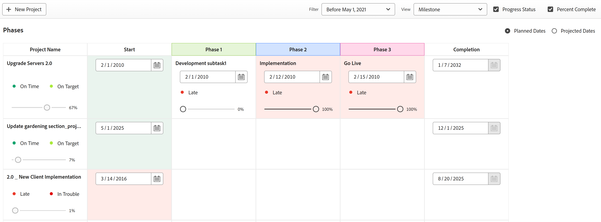
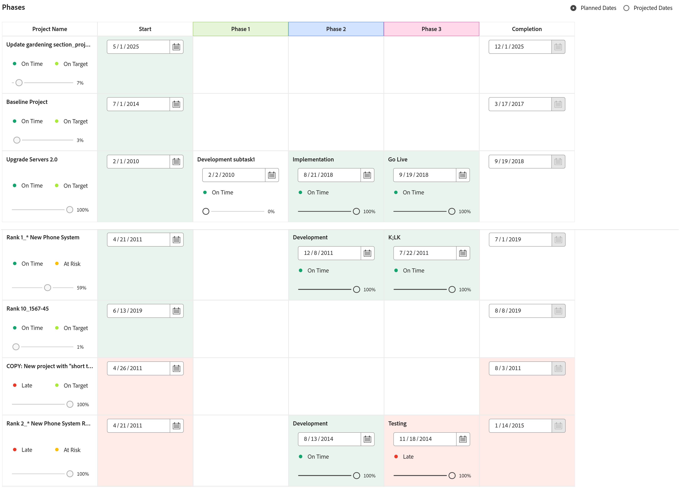
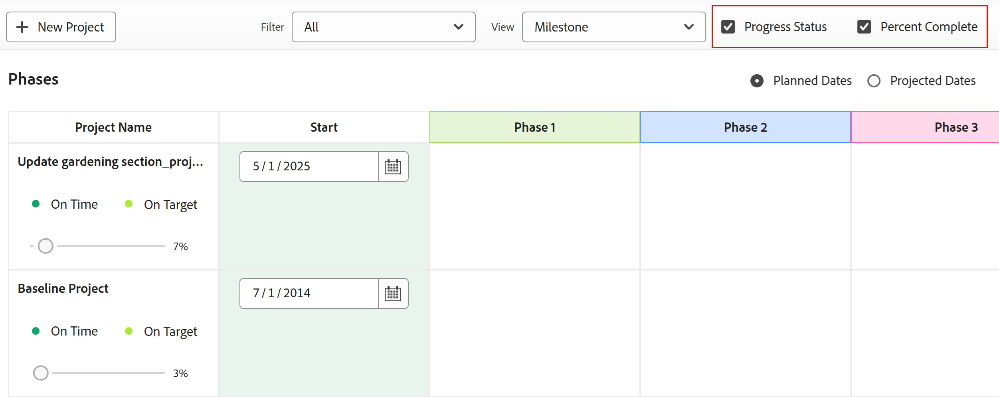

# マイルストーンビューの使用

<!-- Audited: 11/2024 -->

<!--remove Preview and Production mentions from the article when this comes out live-->

<!--

 

The highlighted information on this page refers to functionality not yet generally available. It is available only in the Preview environment for all customers. The same features will also be available in the Production environment for all customers starting with  a week from the Preview release.      

For more information, see [Interface modernization](/help/quicksilver/product-announcements/product-releases/interface-modernization/interface-modernization.md).  

-->

マイルストーンビューは、プロジェクトリストまたはレポートに適用できます。 マイルストーンビューを使用すると、表示しているプロジェクト内のタスクに関連付けられているすべてのマイルストーンを表示できます。

マイルストーンビューを使用する前に、次の要素が存在する必要があります。

* マイルストーンパスが設定されます。 詳しくは、[ マイルストーンパスの作成](../../../administration-and-setup/customize-workfront/configure-approval-milestone-processes/create-milestone-path.md)を参照してください。
* 必要なマイルストーンパスがプロジェクトに追加されます。 詳しくは、[プロジェクトの編集](/help/quicksilver/manage-work/projects/manage-projects/edit-projects.md)を参照してください。
* マイルストーンはタスクに関連付けられています。 詳しくは、[マイルストーンとタスクの関連付け](../../../manage-work/tasks/manage-tasks/associate-milestones-with-tasks.md)を参照してください。

マイルストーンビューは、プロジェクトリストまたはプロジェクトレポートを表示するときに使用できます。 次の節では、マイルストーンビューの表示方法と使用方法について説明します。

## アクセス要件

+++ 展開すると、この記事の機能のアクセス要件が表示されます。

<table style="table-layout:auto"> 
 <col> 
 <col> 
 <tbody> 
  <tr> 
   <td role="rowheader">Adobe Workfront パッケージ</td> 
   <td> 
任意
 </td> 
  </tr> 
  <tr> 
   <td role="rowheader">Adobe Workfront プラン</strong></td> 
   <td> 
    
標準

    
Work またはそれ以上

   </td>
  </tr> 
  <tr> 
   <td role="rowheader">アクセスレベル設定</td> 
   <td> 
レポート、ダッシュボード、カレンダーへのアクセス権を表示またはそれ以上の権限に設定する

   </td> 
  </tr> 
  <tr> 
   <td role="rowheader">オブジェクト権限</td> 
    <td> 
マイルストーンビューをレポートに適用するための、プロジェクトレポートに対する表示権限
</td> 
   </td> 
  </tr> 
 </tbody> 
</table>

この表の情報について詳しくは、[Workfront ドキュメントのアクセス要件](/help/quicksilver/administration-and-setup/add-users/access-levels-and-object-permissions/access-level-requirements-in-documentation.md)を参照してください。

+++

## マイルストーンビューへの切り替え {#switch-to-the-milestone-view}

{{step1-to-projects}}

1. 「**ビュー**」ドロップダウンメニューをクリックして、「**マイルストーン**」をクリックします。

   リストやレポートがマイルストーンビューで表示されます。

   マイルストーンビューについて詳しくは、この記事の[マイルストーンビューの概要](#milestone-view-overview)の節を参照してください。

## マイルストーンビューの概要 {#milestone-view-overview}

マイルストーンビューは、プロジェクトリストやプロジェクトレポートで使用できます。表示しているプロジェクト内のタスクに関連付けられているすべてのマイルストーンをすばやく表示できます。

>[!NOTE]
>
>以下のエリアでは、マイルストーンビューを使用できません。
>
>* タイムシート（プロジェクト追加時のプロジェクトリスト内）。

マイルストーンビューに切り替える方法については、この記事の[マイルストーンビューへの切り替え](#switch-to-the-milestone-view)の節を参照してください。

### マイルストーンビューのセクション

マイルストーンビューをプロジェクトのリストに適用すると、プロジェクトは以下のセクションに表示されます。

* マイルストーンパスに関連付けられているプロジェクトが最初に表示され、それぞれのマイルストーンパス名の下にリストアップされます。

  Workfront は、最初のセクションのプロジェクトを以下の基準に従って、次の順序で並べ替えます。

   1. マイルストーンパス ID。マイルストーンパス ID は、マイルストーンパスレポートで確認できます。

   2. マイルストーンビューを選択する前に、以前にプロジェクトリストに適用されたビューのプロジェクトリストの最初の並べ替えフィールドとして選択されていたフィールド。

* 次にマイルストーンパスに関連付けられていないプロジェクトが、「未割り当て」セクションに表示されます。Workfront は、マイルストーンビューを選択する前に、以前にプロジェクトリストに適用されたビューのプロジェクトリストの最初の並べ替えフィールドとして選択されていたフィールドを基に、「未割り当て」セクションのプロジェクトを並べ替えます。

### マイルストーンビューのプロジェクト情報

マイルストーンビューでプロジェクトリストやプロジェクトレポートを表示すると、次の情報を確認できます。

* **予定日または見込み日：**&#x200B;マイルストーンビューに予定日と見込み日のどちらを表示するかを指定します。\
  プロジェクトの開始日と完了日、およびマイルストーンパスの各マイルストーンタスクの完了日が表示されます。

  予定日を表示する場合、日付は編集できません。 見込み日はWorkfrontによって計算され、手動で変更することはできません。

  予定日を表示しており、プロジェクトへの管理アクセス権も持っている場合は、マイルストーンビューから次の日付を直接編集できます。

   * **プロジェクト開始日：** プロジェクトが開始日からスケジュールされている場合、プロジェクトの予定開始日を手動で変更し、予定完了日を計算できます。
   * **プロジェクト完了日：** プロジェクトが予定完了日からスケジュールされている場合、プロジェクトの予定完了日を手動で変更でき、予定開始日が計算されます。
   * **タスク完了日：** タスクの予定完了日は、マイルストーンビューから直接手動で更新できます。

* **完了率：**&#x200B;各タスクとプロジェクトの完了率を表示します。

  この記事の、[マイルストーンビューに表示される情報を設定する](#configure-what-information-displays-in-the-milestone-view)の節で説明されているように、完了率が表示されないようにすることができます。

  完了率は、[マイルストーンビューでタスクの完了率を調整する](#adjust-percent-complete-for-tasks-in-the-milestone-view)の節で説明されているように、完了率が表示されないようにすることができます。

* **タスクの進捗状況アイコン：** タスクの進捗状況を示すアイコンは次のとおりです。

   * オンタイム – 緑
   * 後ろ – 黄色
   * リスク – 青
   * レイト – 赤

  <!--
   * In the Production environment, the following status icons display next to each project and task in the Milestone view: 
      * On Time  
      
      * Behind  
      
      * At Risk  
      
      * Late  
      
      
      get new screen shots or hide them for preview or production - could not display all in devtest; idea: use color dots from Task Details tab - New status is blue; Some concerns condition is yellow etc
   -->

  これらのステータスアイコンは、[マイルストーンビューに表示する情報を設定する](#configure-what-information-displays-in-the-milestone-view)の節で説明されているように、表示されないようにすることができます。

  各ステータスタイプについて詳しくは、[タスクの進捗ステータスの概要](../../../manage-work/tasks/task-information/task-progress-status.md)を参照してください。

* **完了したタスクのステータスの色合い**：タスクが「完了」とマークされた後、マイルストーンビューでタスクの背景に色が付き、タスクが時間通りに完了したか、遅れて完了したかを示します。

   * **タスク列の赤い背景色**：進捗ステータスが&#x200B;**遅延**&#x200B;の場合、タスクの背景は赤色で表示されます。

   * **タスク列の緑の背景色**：進捗ステータスが&#x200B;**オンタイム**&#x200B;の場合、タスクの背景は緑色で表示されます。

* **プロジェクトの開始列と完了列のプロジェクトステータスの背景色**：

   * **プロジェクトの開始列**：「実際の開始日」が入力されている場合にのみ、プロジェクトの開始列の背景が、赤色または緑色になります。

      * **プロジェクトの開始列の赤い背景色**：プロジェクトの進捗ステータスが&#x200B;**遅延**&#x200B;の場合、プロジェクトの開始列の背景は赤色で表示されます。

      * **プロジェクトの開始の列の緑の色合い**：プロジェクトの進捗ステータスが&#x200B;**オンタイム**&#x200B;の場合、プロジェクトの開始の列の背景は緑色で表示されます。

     >[!TIP]
     >
     >プロジェクトの実際の開始日を表示するには、プロジェクト詳細ページに移動する必要があります。

   * **プロジェクトの完了列**：プロジェクトの完了列の背景は、実際の完了日が入力されている場合にのみ、赤色または緑色で表示されます。

      * **プロジェクトの完了列の赤い背景色**：プロジェクトの進捗ステータスが&#x200B;**遅延**&#x200B;の場合、プロジェクトの完了列の背景は赤色で表示されます。

      * **プロジェクトの完了列の緑の背景色**：プロジェクトの進捗ステータスが&#x200B;**オンタイム**&#x200B;の場合、プロジェクトの完了列の背景は緑色で表示されます。

     >[!TIP]
     >
     >プロジェクトの実際の完了日を表示するには、プロジェクト詳細ページに移動する必要があります。

   * タスクの進捗ステータスが「危険あり」または「遅れ」の場合、開始日と完了日の列の背景色は変わりません。

  <!--add new screen shot for preview or production release; logged a bug as this is not happening in the new view - if at prod this is still missing, hide this screen shot-->

  

* **プロジェクト名**：プロジェクト名が、プロジェクトへのリンクと共に表示されます。
* **プロジェクトの状況アイコン**：次のインジケーターは、プロジェクトの状況を示します。

   * ターゲット上 – 緑
   * リスク – イエロー
   * 問題あり – 赤

  <!--
   * In the Production environment, an icon displays next to the project name, indicating the condition of the project. The Condition of the project might be one of the following:
      * On Target
      * At Risk
      * In Trouble
      -->

## マイルストーンビューに表示する情報を設定する {#configure-what-information-displays-in-the-milestone-view}

マイルストーンビューに次の要素を表示するかどうかを設定できます。

* 進行ステータスのアイコン
* プロジェクトとタスクの完了率

デフォルトでは、プロジェクトとタスクの進捗状況アイコンと完了率が表示されます。

これらのオプションに対して行った変更は、自分にのみ適用され、他のユーザーは影響を受けません。変更した内容は、次回Workfrontにログインしたときに保持されます。

プロジェクトのステータスアイコンとプロジェクトの完了率を表示するかどうかを設定するには、次の手順に従います。

{{step1-to-projects}}

1. 「**表示**」ドロップダウンメニューをクリックして、「**マイルストーン**」をクリックします。

1. 次のオプションから選択します。

   <table style="table-layout:auto"> 
    <col> 
    <col> 
    <tbody> 
     <tr> 
      <td role="rowheader">進捗ステータス</td> 
      <td> 
各プロジェクトとタスクの横に進捗ステータスアイコンを表示するには、このオプションを選択します。
 
このオプションは、デフォルトで有効になっています。
 </td> 
     </tr> 
     <tr> 
      <td role="rowheader">完了率</td> 
      <td> 
各プロジェクトとタスクの横に完了率を表示するには、このオプションを選択します。
 
このオプションは、デフォルトで有効になっています。
 </td> 
     </tr> 
    </tbody> 
   </table>

   

## マイルストーンビューでタスクの完了率を調整する {#adjust-percent-complete-for-tasks-in-the-milestone-view}

マイルストーンビューで、タスクの完了率を調整できます。親タスク（サブタスクを含むタスク）またはプロジェクトの完了率は調整できません。

マイルストーンビューでタスクの完了率を調整するには、次の手順を実行します。

{{step1-to-projects}}

1. 「**表示**」ドロップダウンメニューをクリックして、「**マイルストーン**」をクリックします。

1. （条件付き）完了率がマイルストーンビューに表示されていない場合は、この記事の「[ マイルストーンビューに表示される情報の設定](#configure-what-information-displays-in-the-milestone-view)」で説明されているように、タスクとプロジェクトの完了率の表示を有効にします。

1. **完了率**&#x200B;のスライドを新しい完了率に移動して更新します。

   <!--In the Production environment, click the completion percentage below a task, specify a new percentage, then press Enter.-->
