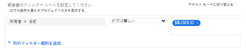

# ユーザーベースのワイルドカードを使用してレポートを一般化する

特定のレポート要素を作成するときに、特定の情報の代わりにワイルドカードを使用することで、レポートを一般化できます。例えば、特定のユーザーに割り当てられたタスクを示すレポートを作成する場合は、フィルターの「割り当て先」フィールドでユーザーの名前を使用できます。ただし、ログインしたユーザーに割り当てられたタスクを表示するレポートを作成する場合は、そのユーザーが誰であるかに関係なく、誰かがレポートを表示すると、そのユーザーにのみ関連する情報が表示されることを示すワイルドカードを使用できます。この方法では、レポートを一度作成しますが、フィルターでワイルドカードを使用しているため、レポートを読むたびに異なる結果が生成されます。

次のレポート要素を作成する際に、ユーザーベースのワイルドカードを使用できます。

* フィルター
* カスタムプロンプト
* 列のルールを追加するときのビュー

## アクセス要件

この記事の手順を実行するには、次のアクセス権が必要です。

<table style="table-layout:auto"> 
 <col> 
 <col> 
 <tbody> 
  <tr> 
   <td role="rowheader"><strong>Adobe Workfront プラン*</strong></td> 
   <td> 
任意
 </td> 
  </tr> 
  <tr> 
   <td role="rowheader"><strong>Adobe Workfront ライセンス*</strong></td> 
   <td> 
プラン 
 </td> 
  </tr> 
  <tr> 
   <td role="rowheader"><strong>アクセスレベル設定*</strong></td> 
   <td> 
フィルター、ビュー、グループへのアクセスを編集
 
ポート、ダッシュボード、カレンダーへの編集アクセスでレポートのレポート要素の編集
 
メモ：まだアクセス権がない場合は、アクセスレベルに追加の制限が設定されていないかどうか Workfront 管理者にお問い合わせください。Workfront 管理者がアクセスレベルを変更する方法について詳しくは、<a href="../../../administration-and-setup/add-users/configure-and-grant-access/create-modify-access-levels.md" class="MCXref xref">カスタムアクセスレベルの作成または変更</a>を参照してください。
 </td> 
  </tr> 
  <tr> 
   <td role="rowheader"><strong>オブジェクト権限</strong></td> 
   <td> 
レポートの管理権限（レポート内のレポート要素を編集するため）
 
ビューまたはフィルターの管理権限（これらを編集するため）
 
追加のアクセス権のリクエストについて詳しくは、<a href="../../../workfront-basics/grant-and-request-access-to-objects/request-access.md" class="MCXref xref">オブジェクトへのアクセス権のリクエスト</a>を参照してください。
 </td> 
  </tr> 
 </tbody> 
</table>

&#42;保有するプラン、ライセンスタイプ、アクセス権を確認するには、Workfront 管理者に問い合わせてください。

## 前提条件

ワイルドカード変数を追加する前に、レポートを作成する必要があります。

レポートの作成手順については、[レポートを作成](../../../reports-and-dashboards/reports/creating-and-managing-reports/create-report.md)を参照してください。

## 操作手順

ユーザーベースのワイルドカードをレポートに挿入するには、次の手順に従います。

1. ユーザーベースのワイルドカードを挿入するレポートに移動します。
1. 「**報告書アクション**」をクリックし、次に「**編集**」を選択します。

1. 「**フィルター**」タブをクリックします。
1. 「**フィルター規則の追加**」をクリックします。
1. フィルタリングの条件に使用するフィールドの名前を入力していきます。\
   ユーザーオブジェクトまたはユーザーに関する情報を参照するフィールドを入力する必要があります。
1. フィルター変数のドロップダウンメニューで「**が次に等しい**」を選択します。

   >[!TIP]
   >
   >Adobe Workfront でワイルドカードを使用する場合は、常に&#x200B;**が次に等しい**&#x200B;フィルター変数を選択する必要があります。

1. 「**名前の入力を開始…**」ボックスに、ログインしているユーザーに関する情報を名前に基づいてレポートに表示する場合は、`$$USER.ID` または `$$USER.name` と入力します。ログインしたユーザーのグループ、チーム、会社、その他の情報を参照する他のワイルドカードを挿入できます。

   ユーザーベースのワイルドカードの完全なリストについては、 [ワイルドカードフィルター変数の概要](../../../reports-and-dashboards/reports/reporting-elements/understand-wildcard-filter-variables.md).

   

1. 「**保存して閉じる**」をクリックします。

## 追加情報

関連トピック：

<!--outdated: * [Basic Report Creation Program](https://one.workfront.com/s/basic-report-creation-program) -->
* [ワイルドカードフィルター変数の概要](../../../reports-and-dashboards/reports/reporting-elements/understand-wildcard-filter-variables.md)
* [Adobe Workfront でフィルターを作成または編集](../../../reports-and-dashboards/reports/reporting-elements/create-filters.md)
* [フィルターの概要](../../../reports-and-dashboards/reports/reporting-elements/filters-overview.md)
* [レポートにプロンプトを追加](../../../reports-and-dashboards/reports/creating-and-managing-reports/add-prompt-report.md)
* [ビューでの条件付き形式の使用](../../../reports-and-dashboards/reports/reporting-elements/use-conditional-formatting-views.md)
