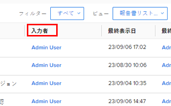

# レポートの概要

<!-- Audited: 12/2023 -->

レポートでは、ユーザーや作業の状況を視覚的に確認できます。 レポートを使用して、Adobe Workfrontのオブジェクトに関する情報を表示できます。

オブジェクトと、Workfrontアプリケーションでのオブジェクトのレポート方法について詳しくは、 [Adobe Workfrontオブジェクトの概要](../../../workfront-basics/navigate-workfront/workfront-navigation/understand-objects.md).

## レポート要素

Workfrontのレポートは、次の 3 つの要素の組み合わせです。

<table style="table-layout:auto"> 
 <col> 
 <col> 
 <tbody> 
  <tr> 
   <td role="rowheader">表示</td> 
   <td> <li>レポートの列と、各列に含めることができる情報を定義します。</li> <li>ビューについて詳しくは、 <a href="../../../reports-and-dashboards/reports/reporting-elements/views-overview.md" class="MCXref xref">Adobe Workfrontの概要を表示</a>.</li> </td> 
  </tr> 
  <tr> 
   <td role="rowheader">グループ化</td> 
   <td> <li>共通の情報に基づいて情報を分類し、レポートの結果を見出しの下に表示します。</li> <li>グループ化について詳しくは、 <a href="../../../reports-and-dashboards/reports/reporting-elements/groupings-overview.md" class="MCXref xref">Adobe Workfrontでのグループ化の概要</a>.</li> </td> 
  </tr> 
  <tr> 
   <td role="rowheader">フィルター</td> 
   <td> <li>レポートに表示される情報の量を制御します。</li> <li>フィルターについて詳しくは、 <a href="../../../reports-and-dashboards/reports/reporting-elements/filters-overview.md" class="MCXref xref">フィルターの概要</a>.</li> <li>フィルター修飾子について詳しくは、 <a href="../../../reports-and-dashboards/reports/reporting-elements/filter-condition-modifiers.md" class="MCXref xref">フィルターおよび条件修飾子</a>.</li> <li>ワイルドカードを使用してフィルタリングし、フィルターの一般性を高め、使用の柔軟性を高めることができます。</li> <li>フィルターでのワイルドカードの使用について詳しくは、 <a href="../../../reports-and-dashboards/reports/reporting-elements/understand-wildcard-filter-variables.md" class="MCXref xref">ワイルドカードフィルター変数</a>.</li> </td> 
  </tr> 
 </tbody> 
</table>

>[!NOTE]
>
>リストから新しいフィルター、表示またはグループを選択した場合、Workfrontからログアウトしたりブラウザーを閉じても、選択内容は保持されます。

レポート要素について詳しくは、 [レポート要素：フィルター、ビューおよびグループ化](../../../reports-and-dashboards/reports/reporting-elements/reporting-elements-filters-views-groupings.md).

レポートの内容をより充実させるには、次の要素を追加します。

* グラフ：レポートの結果を視覚的に表したものです。\
  グラフレポートについて詳しくは、 [レポートにグラフを追加する](../../../reports-and-dashboards/reports/creating-and-managing-reports/add-chart-report.md).

* マトリックスのグループ化：レポートの情報の集計表形式でまとめます。\
  マトリックスレポートについて詳しくは、 [マトリックスレポートの作成](../../../reports-and-dashboards/reports/creating-and-managing-reports/create-matrix-report.md).

* プロンプト：レポートを実行するたびに、カスタマイズして適用できる開いたフィルターです。\
  プロンプトの詳細については、を参照してください。 [レポートにプロンプトを追加する](../../../reports-and-dashboards/reports/creating-and-managing-reports/add-prompt-report.md).

レポートを作成する際は、Report Builder でこれらの要素を個別に変更できます。

レポートに含まれる情報の関連性を高めるもう 1 つの方法は、ビューに条件付き書式を適用することです。\
条件付き書式の使用について詳しくは、 [ビューでの条件付き書式の使用](../../../reports-and-dashboards/reports/reporting-elements/use-conditional-formatting-views.md).

## システムレポート

Workfrontは、デフォルトでシステムに読み込まれる複数のシステムレポートを提供します。\
システムに情報を入力した後、これらのレポートを使用して、情報を視覚的に表示できます。

システムレポートにアクセスする方法と使用可能なシステムレポートの詳細については、 [Adobe Workfrontの組み込みレポートの使用](../../../reports-and-dashboards/reports/using-built-in-reports/use-workfront-built-in-reports.md).

## レポートの作成

Workfrontで提供されるシステムレポートに加えて、組織のニーズに合わせて独自にカスタマイズしたレポートを作成できます。

レポートを作成するには、次のいずれかの操作を実行します。

* レポートをゼロから作成する。
* 既存のレポートをコピーします。\
  他のユーザーが作成したレポートをコピーするには、少なくとも表示権限が必要です。 レポートのコピーについて詳しくは、 [レポートのコピーの作成](../../../reports-and-dashboards/reports/creating-and-managing-reports/create-copy-report.md).

レポートの作成について詳しくは、 [カレンダーレポートの概要](../../../reports-and-dashboards/reports/calendars/calendar-reports-overview.md).

### レポート作成の前提条件 {#prerequisites-for-creating-reports}

* 独自のレポートを作成するには、プランライセンス（現在のライセンス）または標準ライセンス（新しいライセンス）が必要です。\
  Workfrontのライセンスの種類について詳しくは、 [ライセンスの概要](../../../administration-and-setup/add-users/access-levels-and-object-permissions/wf-licenses.md) 現在のライセンスに関して [新しいライセンスの概要](/help/quicksilver/administration-and-setup/add-users/how-access-levels-work/licenses-overview.md) 新しいライセンスの場合

* Workfront管理者が、アクセスレベルでレポートの編集のアクセス権を付与する必要があります。\
  編集レポートへのアクセス権の付与について詳しくは、 [レポート、ダッシュボード、カレンダーへのアクセス権の付与](../../../administration-and-setup/add-users/configure-and-grant-access/grant-access-reports-dashboards-calendars.md).

* Workfront管理者が、アクセスレベルでフィルター、ビューおよびグループを編集するためのアクセス権を付与する必要があります。

  編集フィルター、ビュー、およびグループへのアクセス権の付与について詳しくは、 [フィルター、ビューおよびグループに対するアクセス権の付与](../../../administration-and-setup/add-users/configure-and-grant-access/grant-access-fvg.md).

* レポート対象のオブジェクトを 1 つ定義する必要があります。 レポートは、Workfrontに特有のオブジェクトで、レポートの作成を開始する前に、オブジェクトタイプの選択から始める必要があります。 Workfrontインターフェイスで使用可能なオブジェクトのみをレポートできます。

### 所有権をレポート {#report-ownership}

Workfrontでレポートを作成すると、そのレポートのデフォルトの所有者になり、「マイレポート」セクションに表示されます。 レポートの所有者は変更できません。

レポートをコピーすると、自動的にコピーされたレポートの所有者になります。
レポートのコピーについて詳しくは、 [レポートのコピーの作成](../../../reports-and-dashboards/reports/creating-and-managing-reports/create-copy-report.md).

レポートの所有者を確認するには、 **入力者** フィールドに入力します。

### ビルダーインターフェイスでのレポートの作成 {#create-reports-in-the-builder-interface}

最初にレポート作成インターフェイスを使用して新しいレポートを作成することをお勧めします。 このインターフェイスには、要素を組み合わせて目的のレポートを作成する、合理化された一連のツールが用意されています。 リストから選択し、すべてのレポート要素に追加できるオブジェクトとフィールドがあります。\
レポート作成インターフェイスでのレポートの作成について詳しくは、 [カスタムレポートの作成](../../../reports-and-dashboards/reports/creating-and-managing-reports/create-custom-report.md).

レポートできるオブジェクトの一覧については、 [オブジェクトに関するレポート](../../../workfront-basics/navigate-workfront/workfront-navigation/understand-objects.md#report-on-objects) 記事のセクション [Adobe Workfrontオブジェクトの概要](../../../workfront-basics/navigate-workfront/workfront-navigation/understand-objects.md).

レポートに表示できるフィールドについて詳しくは、 [Adobe Workfrontの用語集](../../../workfront-basics/navigate-workfront/workfront-navigation/workfront-terminology-glossary.md).

### テキストモードでのレポートの作成 {#create-reports-in-text-mode}

ビルダーインターフェイスの特定のフィールドが見つからない場合がありますが、API で使用できる場合があります。\
API で使用可能なフィールドについて詳しくは、この記事を参照してください。 [API エクスプローラ](../../../wf-api/general/api-explorer.md).

API エクスプローラーの使用方法について詳しくは、この記事を参照してください。 [API エクスプローラーの使用](../../../wf-api/general/using-api-explorer.md).

>[!NOTE]
>
>Report Builder で使用できないオブジェクトに関するレポートは、Workfrontインターフェイスでは作成できません。 ただし、API を通じて使用できる場合は、Report Builder でオブジェクトに関連付けられたフィールドをレポートできます。 これを行うには、「テキストモード」インターフェイスを使用する必要があります。

テキストモードを使用すると、標準モードインターフェイスでは使用できないフィールドを使用できるようにすることで、より複雑なビュー、フィルタ、グループ化、プロンプトを作成できます。

#### テキストモードの用語 {#text-mode-terminology}

Workfront Text Mode インターフェイスを使用するには、特定の構文を使用する必要があります。

テキストモードのWorkfront構文について詳しくは、 [テキストモードの構文の概要](../../../reports-and-dashboards/reports/text-mode/text-mode-syntax-overview.md).

#### 計算列、条件付き書式、その他の使用方法に関するテキストモード {#calculated-columns-conditional-formatting-and-other-uses-of-text-mode}

ビルダーインターフェイスで使用できないフィールドに関するレポート以外の方法で、「テキストモード」を使用して、特定のフィールドに対する計算や比較を表示できます。

レポートでテキストモードが最もよく使用される例については、 [テキストモードの一般的な使用例の概要](../../../reports-and-dashboards/reports/text-mode/understand-common-uses-text-mode.md).

レポートに計算済みのカスタムデータを含める方法について詳しくは、 [レポート内の計算済みカスタムデータ](../../../reports-and-dashboards/reports/calc-cstm-data-reports/calculated-custom-data-reports.md).

条件付き書式でのフィールドの比較について詳しくは、 [条件付き書式でのフィールドの比較](../../../reports-and-dashboards/reports/text-mode/compare-fields-conditional-formatting.md).

また、レポートでテキストモードを使用してコレクションフィールドを参照することもできます。\
テキストモードを使用してレポートにコレクション情報を表示する方法について詳しくは、 [レポート内のコレクションの参照](../../../reports-and-dashboards/reports/text-mode/reference-collections-report.md).

#### テキストモードのサンプル {#text-mode-samples}

テキストモードで作成できる、最も使用されているビュー、フィルター、グループのサンプルのライブラリが用意されています。

このライブラリを参照して、提供されるサンプルの一部を使用するには、次の記事を参照してください。 [カスタム表示、フィルター、グループ化のサンプル：記事のインデックス](../../../reports-and-dashboards/reports/custom-view-filter-grouping-samples/custom-view-filter-grouping-samples.md).

## レポートのタブ

インターフェイスでレポートを実行する際に、レポートには複数のタブを含めることができます。

レポートの実行について詳しくは、「 [レポートの実行](../../../reports-and-dashboards/reports/creating-and-managing-reports/run-report.md).

各タブでは、レポートに含める情報の形式が少し異なります。 組織のニーズに最適な形式を選択します。

任意のタブをレポートのデフォルトのタブにすることができます。 デフォルトのタブは、レポートの名前をクリックして開くときに表示される最初のタブです。また、レポートをダッシュボードに配置するときに表示されるタブです。

### 「詳細」タブ {#details-tab}

レポートの「詳細」タブには、レポートのオブジェクトと、そのオブジェクトに対して選択した属性がリスト形式で表示されます。 すべてのレポートには「詳細」タブがあります。

>[!IMPORTANT]
>
>「詳細」タブの情報の表示は、タイムゾーンに応じて「グラフ」タブとは異なる場合があります。\
>例えば、カリフォルニア州のユーザーが 2 月 12 日の午後 9 時 30 分にタスクを完了したとします。 このタスクの完了を含むレポートをニューヨークのユーザーが表示した場合、2 月 13 日の米国東部標準時 12:30 に完了したので、「詳細」タブと「グラフの詳細」の両方で「実際の完了日」が 2 月 13 日と表示されます。 ただし、グラフでは、グラフ要素を展開するまで、2 月 12 日のグループ化に含まれます。

### 「概要」タブ {#summary-tab}

グループ化を含むレポートには、「概要」タブがあります。

「詳細」タブにリスト形式で表示されるのと同じ情報が、「概要」タブのレポートのグループ化に従って要約および集計されます。

グループ化について詳しくは、 [Adobe Workfrontでのグループ化の概要](../../../reports-and-dashboards/reports/reporting-elements/groupings-overview.md).

### 「マトリックス」タブ {#matrix-tab}

マトリックスグループを含むレポートには、マトリックスタブがあります。

「詳細」タブのリスト形式で表示される情報と同じ情報は、表形式で表示され、「マトリックス」タブのレポートでグループ化されて表示されます。

レポートにマトリックスグループを追加すると、「概要」タブが「マトリックス」タブに置き換えられます。

マトリックスのグループ化の構築の詳細については、「 [マトリックスレポートの作成](../../../reports-and-dashboards/reports/creating-and-managing-reports/create-matrix-report.md).

### 「グラフ」タブ {#chart-tab}

グラフを含むレポートには、「グラフ」タブがあります。

効果的なダッシュボードを経営幹部に提供するために、レポートにグラフを含めることを検討してください。 グラフは、レポートに情報を表示するための簡潔な方法です。 グラフ要素をクリックすると、その要素に含まれる項目が表示されます。

>[!IMPORTANT]
>
>グラフ要素をクリックすると、展開された情報が、タイムゾーンに応じてグラフとは異なって表示される場合があります。\
>例えば、カリフォルニア州のユーザーが 2 月 12 日の午後 9 時 30 分にタスクを完了したとします。 このタスクの完了を含むレポートをニューヨークのユーザーが表示した場合、2 月 13 日の米国東部標準時 12:30 に完了したので、「詳細」タブと「グラフの詳細」の両方で「実際の完了日」が 2 月 13 日と表示されます。 ただし、グラフでは、グラフ要素を展開するまで、2 月 12 日のグループ化に含まれます。

グラフを含むレポートの作成について詳しくは、この記事を参照してください。 [レポートにグラフを追加する](../../../reports-and-dashboards/reports/creating-and-managing-reports/add-chart-report.md).

### 「プロンプト」タブ {#prompts-tab}

プロンプトを含むレポートには、[ プロンプト ] タブが表示されます。

プロンプトを表示すると、レポートを実行するたびに、レポートにフィルタを追加できます。 レポートにプロンプトを追加すると、[ プロンプト ] タブが自動的にレポートの既定のタブになります。 これを別のタブに変更することはできません。

レポートのプロンプトを作成する方法については、この記事を参照してください。 [レポートにプロンプトを追加する](../../../reports-and-dashboards/reports/creating-and-managing-reports/add-prompt-report.md).

## レポートの共有

レポートを作成したら、他のユーザーと共有できます。

### レポートへの共有権限の付与 {#give-sharing-permissions-to-a-report}

他のユーザーに対して、作成したレポートを表示または管理するための共有権限を付与できます。 別のユーザーに、自分と同じかそれ未満のレベルの権限を付与できます。 また、共有権限を使用してレポートを公開することもできます。 レポートの共有について詳しくは、 [Adobe Workfrontでのレポートの共有](../../../reports-and-dashboards/reports/creating-and-managing-reports/share-report.md).

### レポートの配信スケジュールの設定 {#schedule-a-report-delivery}

レポートの配信スケジュールを設定できます。 レポートを共有しているユーザーには、レポート結果が添付された電子メールが送信されます。 添付ファイルの形式は次のとおりです。

* HTML
* PDF
* Excel
* .TSV

レポート配信のスケジュール設定について詳しくは、 [レポート配信の概要](../../../reports-and-dashboards/reports/creating-and-managing-reports/set-up-report-deliveries.md).

### レポートの結果のエクスポート {#export-the-results-of-a-report}

レポートの結果は、次のファイル形式で書き出すことができます。

* PDF
* Excel（.xls および.xlsx 形式）
* タブ区切り

レポートの結果のエクスポートについて詳しくは、 [データを書き出し](../../../reports-and-dashboards/reports/creating-and-managing-reports/export-data.md).

レポートをこれらの形式のいずれかにエクスポートした後、添付ファイルとして電子メールで送信したり、印刷したりして、他のユーザーと共有できます。

### ダッシュボードへのレポートの追加 {#add-a-report-to-a-dashboard}

レポートをダッシュボードに追加して、他のユーザーとダッシュボードを共有できます。 ダッシュボードへのレポートの追加について詳しくは、 [ダッシュボードへのレポートの追加](../../../reports-and-dashboards/dashboards/creating-and-managing-dashboards/add-report-dashboard.md).

## カレンダーの作成

データをカレンダー形式で表示する場合は、レポートの代わりにカレンダーを作成できます。

カレンダーの作成と使用について詳しくは、 [カレンダーレポートの概要](../../../reports-and-dashboards/reports/calendars/calendar-reports-overview.md).

## 使用状況のレポート

レポートを作成して他のユーザーと共有した後、それらのレポートの使用頻度を追跡できます。
表示頻度、ユーザー別、表示するダッシュボードなど、レポートの使用状況について詳しくは、この記事を参照してください。 [使用状況の概要をレポート](../../../reports-and-dashboards/reports/report-usage/report-usage-overview.md).

## レポートを参照する際に使用される一般的な用語

Workfrontレポートを参照する際には、次の用語が使用されます。

<table style="table-layout:auto"> 
 <col> 
 <col> 
 <thead> 
  <tr> 
   <th><strong>用語またはフレーズ</strong> </th> 
   <th><strong>定義</strong> </th> 
  </tr> 
 </thead> 
 <tbody> 
  <tr> 
   <td>詳細オプション</td> 
   <td> 
次の操作を実行できる Report Builder の「列（表示） 」タブのリンクを参照します。
 
    <ul> 
     <li>選択した条件に基づいて、テキストおよび画像の列の条件付きスタイル書式を設定します。</li> 
     <li>列のラベルを変更します。</li> 
     <li>列の値を書式設定します。</li> 
    </ul> 
たとえば、すべての親タスクを太字で表示したり、タスクが遅れている場合は計画完了日を赤で表示したりできます。
 </td> 
  </tr> 
  <tr> 
   <td>属性</td> 
   <td> データベースで定義された、オブジェクトのフィールド。 これは、テキストモードの式で使用されます。  例えば、「ステータス」フィールドは、 <em>ステータス</em> テキストモードの式で使用する場合。 </td> 
  </tr> 
  <tr> 
   <td>Bean または JavaBean</td> 
   <td>Bean は、再利用可能なプログラミング要素を表します。 Bean という用語は、Workfrontアプリケーション内の異なるオブジェクト間の関係を表します。 基本レポートツールでは使用できないオブジェクトに関する追加の属性を表示しようとする場合は、これらの関係を理解しておくことが重要です。</td> 
  </tr> 
  <tr> 
   <td>ビルダーインターフェイスまたはReport Builder</td> 
   <td>ビルダーインターフェイスは、一連のドロップダウンメニューで、「列（表示） 」、「フィルター」および「グループ化」タブに表示されるフィールドが含まれています。 ビュー内の列、フィルタの基準、グループ化の共通属性を識別するのに役立つ、Bean 関係の直感的なマッピングを提供します。</td> 
  </tr> 
  <tr> 
   <td>キャメルケース</td> 
   <td> 
キャメルケースとは、複数語の属性を文字列化するプログラミング要素を記述する特定の方法を指します。 キャメルケースで属性のスペルを指定する場合、最初の単語の最初の文字は小文字で、単語の間にスペースはなく、後続の単語の最初の文字は大文字になります。
 
例えば、ホームグループは <em>homeGroup</em>を指定した場合、リソースプールは次のようになります。 <em>resourcePool</em>、「実際の開始日」は次のようになります。 <em>actualStartDate</em>.
 </td> 
  </tr> 
  <tr> 
   <td>グラフ</td> 
   <td> 
Report Builder 内のタブ、レポートを保存した後の「レポート」タブ、および任意のレポートにグラフを追加できるレポートのオプション要素です。 グラフを作成する前に、レポートでグループ化を定義する必要があります。
 
次に、任意のレポートに追加できるグラフのタイプを示します。 
 
    <ul> 
     <li>列</li> 
     <li>棒グラフ</li> 
     <li>円グラフ</li> 
     <li>折れ線グラフ</li> 
     <li>ゲージ</li> 
     <li>バブル</li> 
    </ul> 
レポートへのグラフの追加の詳細については、「 <a href="../../../reports-and-dashboards/reports/creating-and-managing-reports/add-chart-report.md" class="MCXref xref">レポートにグラフを追加する</a>.
 </td> 
  </tr> 
  <tr> 
   <td>詳細</td> 
   <td>これは、レポートを保存した後の、レポートのタブの 1 つです。 レポートの結果が表示され、選択したビューとグループに表示されます。</td> 
  </tr> 
  <tr> 
   <td>式</td> 
   <td>式とは、テキストモードインターフェイスを使用して検索または表示する情報を伝えるために、テキストモードで記述された数式です。 これは通常、より大きなテキストモード文の 1 行です。</td> 
  </tr> 
  <tr> 
   <td>フィールド</td> 
   <td> 
オブジェクトの属性を参照します。 例えば、「ステータス」は、プロジェクト、タスク、またはタスクのフィールドです。 「Portfolioマネージャー」は、Portfolioオブジェクトのフィールドです。
 
また、自分で作成し、カスタムフォームに追加するカスタムフィールドを持つこともできます。 カスタムフォームの作成について詳しくは、 <a href="../../../administration-and-setup/customize-workfront/create-manage-custom-forms/create-or-edit-a-custom-form.md" class="MCXref xref">カスタムフォームの作成または編集</a>.
 </td> 
  </tr> 
  <tr> 
   <td>フィールド名 </td> 
   <td>ビューに表示される、またはフィルターの条件で使用される、またはグループ化の共通要素として使用される属性の値。 「フィールド名」のオプションは、「フィールドソース」の選択項目によって異なります。</td> 
  </tr> 
  <tr> 
   <td>フィールド ソース </td> 
   <td>ビューに表示される、またはフィルターの条件で使用される、またはグループ化の共通要素として使用されるオブジェクトの値。 フィールドソースのオプションは、作成する UI 要素のオブジェクトタイプによって異なります。 フィールドソースを使用すると、UI 要素のオブジェクトタイプ以外のオブジェクトから属性を参照できます。</td> 
  </tr> 
  <tr> 
   <td>フィルター</td> 
   <td>レポートに表示する結果を決定するメインレポート要素です。</td> 
  </tr> 
  <tr> 
   <td>フォーム </td> 
   <td>「Custom Form」と同じ意味で使用されます。 フィールドとセクションがフォームに追加され、オブジェクトに添付されて、オブジェクトに関連付け可能なフィールドの数を増やします。</td> 
  </tr> 
  <tr> 
   <td>グループ化 </td> 
   <td>結果のリストの編成方法を識別するメインレポート要素。 グループ化により、レポート全体で横棒グラフが作成され、結果を作成時に定義した共通の属性でグループ化します。 グループ化は、データを集計するためにマトリックスレポートで使用され、グラフの軸を決定するためにも使用されます。</td> 
  </tr> 
  <tr> 
   <td>オブジェクトまたはオブジェクトの種類</td> 
   <td> オブジェクトは、Workfrontのアプリケーション要素です（例えば、プロジェクト、タスク、グループ、会社、フィルター）。 「オブジェクトタイプ」は、新しいレポートの作成、表示、フィルターまたはグループ化の際に使用し、レポートの対象となるオブジェクトを特定します。 レポートで使用できるオブジェクトのタイプは 1 つだけです。これはレポートのメインオブジェクトです。 親オブジェクトは同じレポート内で参照できます。 オブジェクトの階層の詳細については、この記事の「相互依存関係とオブジェクトの階層について」の節を参照してください。 <a href="../../../workfront-basics/navigate-workfront/workfront-navigation/understand-objects.md" class="MCXref xref">Adobe Workfrontオブジェクトの概要</a>.</td> 
  </tr> 
  <tr> 
   <td>プロンプト</td> 
   <td> 
レポートを実行するたびに異なるフィルターを使用する必要がある場合に、レポートに追加できるオプションのレポート要素です。
 
プロンプトの詳細については、を参照してください。 <a href="/help/quicksilver/reports-and-dashboards/reports/creating-and-managing-reports/add-prompt-report.md" class="MCXref xref">レポートにプロンプトを追加する</a>.
 </td> 
  </tr> 
  <tr> 
   <td>クオリファイアまたは条件モディファイア</td> 
   <td> 
このフィールドは、レポートの次の領域に表示されます。
 
    <ul> 
     <li>「フィルター」タブで、</li> 
     <li>「列（表示） 」タブの列の「詳細オプション」画面。 修飾子を定義すると、フィールド名を別のフィールドまたは値と比較できます。</li> 
     <li> カスタムプロンプトで 
プロンプトの詳細については、を参照してください。 <a href="/help/quicksilver/reports-and-dashboards/reports/creating-and-managing-reports/add-prompt-report.md" class="MCXref xref">レポートにプロンプトを追加する</a>.
。</li> 
    </ul> 
例えば、「計画完了日」が「今日」のタスクのフィルターを作成する場合、「 <strong>次と等しい</strong> 「限定子」フィールドで、「日付」フィールドで今日の日付を指定します。
 
<em>タスク &gt; 計画完了日 &gt; 次の日付と等しい &gt;（今日の日付）</em> 
 
このシナリオでは、Qualifier は次のようになります。 <strong>次と等しい</strong>. 修飾子の詳細については、「 <a href="../../../reports-and-dashboards/reports/reporting-elements/filter-condition-modifiers.md" class="MCXref xref">フィルターおよび条件修飾子</a>.
 </td> 
  </tr> 
  <tr> 
   <td>レポート </td> 
   <td>ビュー、フィルター、および（場合によっては）グループ化の組み合わせ。 レポートの目的は、インターフェイス全体で一貫したデータを表示し、情報を分散させ、同じ検索やクエリを定期的に実行する必要をなくすことです。</td> 
  </tr> 
  <tr> 
   <td>文</td> 
   <td>テキストモードの使用時にレポートに表示する情報を定義するために組み合わされた複数の式で構成されます。 レポート内のカスタムプロンプトのビュー、フィルタ、グループ化、またはカスタムプロンプトに対してステートメントを作成できます。</td> 
  </tr> 
  <tr> 
   <td>概要</td> 
   <td>これは、レポートを保存した後の、レポートのタブの 1 つです。 このタブは、レポートのグループ化を定義した場合にのみ作成されます。 レポートの作成時に定義したグループ化に基づく情報の概要を示し、レポートの集計オブジェクトの概要をすばやく確認できます。 レポート内のすべてのオブジェクトが表示されるわけではなく、集計されたオブジェクトのみが表示されます。</td> 
  </tr> 
  <tr> 
   <td>テキストモードインターフェイス</td> 
   <td>最初にビルダーインターフェイスを使用して作成されたカスタムビュー、フィルター、グループ化、プロンプトのコードを作成または変更する機能を提供します。 高度なビュー、フィルター、グループ化、プロンプトのコーディングを簡単にするために、レポート要素は、最初はビルダーインターフェイスを使用して作成し、保存後にテキストモードに変換することをお勧めします。</td> 
  </tr> 
  <tr> 
   <td>ユーザーインターフェイス (UI)</td> 
   <td>任意の時点でユーザーの画面に表示されるコンポーネントまたは構成要素を指します。</td> 
  </tr> 
  <tr> 
   <td>表示（または列）</td> 
   <td>レポートの主要要素の 1 つ。 レポートのリストに表示される列ヘッダーを識別します。</td> 
  </tr> 
 </tbody> 
</table>
