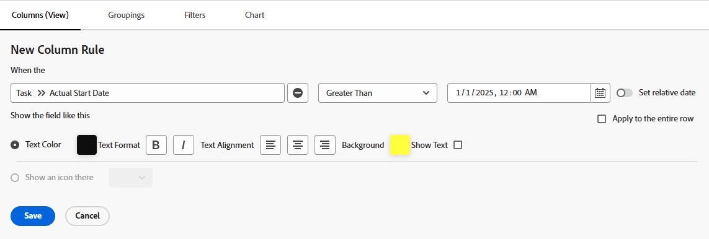

# 条件付き書式でのフィールドを比較

条件付き書式を使用すると、ビュー内の 2 つの異なるフィールドを比較し、フィールド間で特定の条件が満たされた場合にそれらをハイライト表示できます。

## アクセス要件

この記事の手順を実行するには、次のアクセス権が必要です。

<table style="table-layout:auto"> 
 <col> 
 <col> 
 <tbody> 
  <tr> 
   <td role="rowheader">Adobe Workfront プラン*</td> 
   <td> <p>任意</p> </td> 
  </tr> 
  <tr> 
   <td role="rowheader">Adobe Workfront ライセンス*</td> 
   <td> <p>プラン </p> </td> 
  </tr> 
  <tr> 
   <td role="rowheader">アクセスレベル設定*</td> 
   <td> <p>フィルター、ビュー、グループへのアクセスを編集</p> <p>レポート、ダッシュボード、カレンダーへのアクセス権を編集して、レポートのビューを編集</p> <p>メモ：まだアクセス権がない場合は、アクセスレベルに追加の制限が設定されていないかどうか Workfront 管理者にお問い合わせください。Workfront 管理者がアクセスレベルを変更する方法について詳しくは、<a href="../../../administration-and-setup/add-users/configure-and-grant-access/create-modify-access-levels.md" class="MCXref xref">カスタムアクセスレベルの作成または変更</a>を参照してください。</p> </td> 
  </tr> 
  <tr> 
   <td role="rowheader">オブジェクト権限</td> 
   <td> <p>レポートに対する権限を管理して、レポートのビューを編集</p> <p>ビューに対する権限を管理</p> <p>追加のアクセス権のリクエストについて詳しくは、<a href="../../../workfront-basics/grant-and-request-access-to-objects/request-access.md" class="MCXref xref">オブジェクトへのアクセス権のリクエスト</a>を参照してください。</p> </td> 
  </tr> 
 </tbody> 
</table>

&#42;保有するプラン、ライセンスタイプ、アクセス権を確認するには、Workfront 管理者に問い合わせてください。

## 例：実際の開始日と予定開始日の比較

例えば、タスクの実際の開始日が予定開始日より後の場合、条件付き書式を使用して、予定開始日の列をハイライト表示できます。

条件付き書式を使用して、タスクの予定開始日と実際の開始日を比較するには、以下のように行います。

1. タスクビューまたはレポートに移動します。
1. （条件付き）レポートで作業する場合、「**列（表示）**」タブで、条件付き書式を設定する列のヘッダーをクリックして選択します。\
   例えば、予定開始日のフィールドと実際の開始日フィールドを比較して条件付き書式設定を追加する場合は、**実際の開始日**&#x200B;の列を選択します。

1. **「詳細」オプション**、「**この列にルールを追加**」の順にクリックします。

1. ビルダーにある既存の値を使用した比較条件を入力し、条件付き書式を指定します。\
   例えば、実際の開始日が予定開始日より後（または値が予定開始日より大きい）のタスクを強調表示します。「次よりも大きい」修飾子を選択し、日付フィールドで実際の日付を選択します。\
     

1. （オプション）行全体に書式を適用する場合、「**行全体に適用**」を選択します。
1. 「**ルールを追加**」をクリックし、続いて「**完了**」をクリックします。

1. **実際の開始日**&#x200B;の列、「**テキストモードに切り替え**」の順にクリックします。

1. 「**クリックしてテキストを編集**」をクリックし、続いて以下のテキスト行を追加します。

   ```
   styledef.case.0.comparison.rightmethod= <field to compare>
   ```

   この例では、次のようになります。

   ```
   styledef.case.0.comparison.rightmethod=plannedStartDate
   ```

   >[!NOTE]
   >
   >Workfront のネイティブフィールドを比較する場合は、フィールドの名前にキャメルケース構文を使用します。カスタムフィールドを比較する場合は、最初のフィールドと比較する名前フィールド用に、**DE：実際のフィールド名**&#x200B;を入力します。\
   >例えば、「**実際の開始日**」と「**配信日**」というラベルの付いたカスタムフィールドを比較する場合は、テキストモードコードに次のステートメントを追加します。
   >
   >`styledef.case.0.comparison.rightmethod=DE:Delivery Date`

1. コードの`righttext`の行がコードの`rightmethod`の行のステートメントと一致していることを確認します。

   

1. 「**保存**」をクリックします。
1. 「**保存して閉じる**」をクリックします。

   この列では、条件に一致するフィールドがハイライト表示されます。
