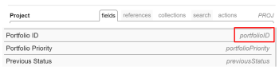

# EXISTS 文を使用した複雑なテキストモードフィルターの作成

<!--
<p data-mc-conditions="QuicksilverOrClassic.Draft mode">(NOTE: do not EVER&nbsp;delete this article as long as Text Mode still exists in the system.&nbsp;Google ordered this article to be written and we wrote it with the help of consultants, so the use case is very complex and very hard to understand without this. It is also very much used by many customers)</p>
-->

<!--
<p data-mc-conditions="QuicksilverOrClassic.Draft mode">(NOTE:&nbsp;Alina: **~ Replace screen shot of icons when list/ reporting UI changes)</p>
-->

>[!IMPORTANT]
>
>この記事では、Adobe Workfront API とテキストモードレポートインターフェイスに関する十分な知識が必要です。 Workfront API について詳しくは、 [API の基本](../../../wf-api/general/api-basics.md).\
>テキストモードの使用について詳しくは、 [テキストモードの概要](../../../reports-and-dashboards/reports/text-mode/understand-text-mode.md).

## Workfrontのオブジェクト関係の概要

すべてのオブジェクトは、Workfrontデータベース内の他のオブジェクトにリンクされます。

オブジェクトの階層と相互依存関係を理解すると、レポートで参照できるオブジェクトを見つけるのに役立ちます。

Workfront内のオブジェクトと、その階層および相互依存関係について詳しくは、 [Adobe Workfrontのオブジェクトについて](../../../workfront-basics/navigate-workfront/workfront-navigation/understand-objects.md).

フィルタを作成する場合、標準のレポートインターフェイスを使用して、最大 2 レベルの関係内でフィルタのオブジェクトに接続されている他のオブジェクトを参照できます。

例えば、問題フィルターでPortfolioID を参照すると、標準インターフェイスを使用して、特定のポートフォリオに関連付けられたプロジェクトに関する問題のみを表示できます。 この場合、ポートフォリオは問題から 2 レベル離れています。

ただし、標準インターフェイスを使用して問題フィルターでPortfolio所有者を参照し、所有者が特定のユーザーであるポートフォリオに関連付けられたプロジェクトの問題のみを表示することはできません。 テキストモードを使用して、問題から 3 レベル離れた「Portfolio所有者名」フィールドにアクセスする必要があります。


Workfrontのオブジェクトの完全なリストについては、 [API エクスプローラ](../../../wf-api/general/api-explorer.md).

API エクスプローラーを操作してオブジェクトを検索する方法について詳しくは、 [API エクスプローラーの使用](../../../wf-api/general/using-api-explorer.md).

フィルタを作成する場合は、テキストモードインターフェイスで複雑なステートメントを作成して、これらのタイプのオブジェクトを参照する必要があります。

複雑なフィルターの作成について詳しくは、 [EXISTS ステートメントを使用する複雑なテキストモードフィルターの概要](#overview-of-complex-text-mode-filters-that-use-exists-statements) 」セクションに入力します。

## EXISTS 文を使用する複雑なテキストモードフィルターの概要 {#overview-of-complex-text-mode-filters-that-use-exists-statements}

オブジェクト階層の複数のレベルにまたがるフィルタや、見つからないオブジェクトに対するフィルタを作成する際は、次の点を考慮してください。

* フィルタオブジェクトに直接接続されていないオブジェクトを参照する場合は、複雑なフィルタを作成する必要があります。
* 次の操作を行うには、EXISTS 文を使用する必要があります。

   * 複数のレベルにまたがるフィルターを作成します。
   * 見つからないオブジェクトを検索するフィルタを作成します。\
      例えば、ユーザーレポートを作成する際に、一定期間ログに記録していないユーザーをフィルタリングできます。

フィルターで EXISTS ステートメントを使用する際は、次のルールを考慮してください。

* EXISTS フィルタで参照できるオブジェクトは 3 つあります。

   * フィルターのオブジェクト（元のオブジェクト）。
   * フィールドを参照するオブジェクト（Target オブジェクト）。
   * オリジナルオブジェクトとターゲットオブジェクトを接続するオブジェクト（これらが相互に直接接続されていない場合）。

* EXISTS を使用するフィルターには、等号でリンクされた 2 つの異なるステートメントが含まれます。

   * 等号の前の文は、参照先のオブジェクト（リンクまたはターゲットオブジェクト）を指します。
   * 等号の後の文は、参照元のオブジェクト（オリジナルオブジェクト）を参照します。

* ステートメントを接続するには、リンクオブジェクトのオブジェクトコードを使用する必要があります。\
   すべてのオブジェクトのオブジェクトコードは、API エクスプローラーで確認できます。\
   API エクスプローラーについて詳しくは、 [API エクスプローラ](https://one.workfront.com/s/api-explorer).

* オリジナルオブジェクトとターゲットオブジェクトが直接接続されているので、リンクオブジェクトが見つからない場合は、リンクオブジェクトの代わりにターゲットオブジェクトのオブジェクトコードを使用できます。
* 同じオブジェクト（ターゲットオブジェクト）上で複数のフィールド（ターゲットフィールド）を参照できますが、その場合は、フィールドを参照する行を AND で接続する必要があります。\
   Target オブジェクトに属する複数のフィールドのフィルタリングの例については、 [例 4:複数のフィールドでフィルター：Portfolio所有者名およびPortfolio線形スコアカード ID 別のタスク](#example-4-filter-by-multiple-fields-tasks-by-portfolio-owner-name-and-portfolio-alignment-scorecard-id) 」の節を参照してください。

* EXISTS 文でサポートされる唯一の修飾子は NOTEXISTS です。

## アクセス要件

この記事の手順を実行するには、次のアクセス権が必要です。

<table style="table-layout:auto"> 
 <col> 
 <col> 
 <tbody> 
  <tr> 
   <td role="rowheader">Adobe Workfront plan*</td> 
   <td> <p>任意</p> </td> 
  </tr> 
  <tr> 
   <td role="rowheader">Adobe Workfront license*</td> 
   <td> <p>計画 </p> </td> 
  </tr> 
  <tr> 
   <td role="rowheader">アクセスレベル設定*</td> 
   <td> <p>フィルター、ビュー、グループへのアクセスを編集</p> <p>レポート、ダッシュボード、カレンダーへのアクセスを編集して、レポートのフィルターを編集します</p> <p>注意：まだアクセス権がない場合は、Workfront管理者に、アクセスレベルに追加の制限を設定しているかどうかを問い合わせてください。 Workfront管理者がアクセスレベルを変更する方法について詳しくは、 <a href="../../../administration-and-setup/add-users/configure-and-grant-access/create-modify-access-levels.md" class="MCXref xref">カスタムアクセスレベルの作成または変更</a>.</p> </td> 
  </tr> 
  <tr> 
   <td role="rowheader">オブジェクト権限</td> 
   <td> <p>レポートに対する権限を管理して、レポートのフィルターを編集します</p> <p>フィルターを編集するための権限を管理</p> <p>追加のアクセス権のリクエストについて詳しくは、 <a href="../../../workfront-basics/grant-and-request-access-to-objects/request-access.md" class="MCXref xref">オブジェクトへのアクセスのリクエスト </a>.</p> </td> 
  </tr> 
 </tbody> 
</table>

&#42;保有しているプラン、ライセンスの種類、アクセス権を確認するには、Workfront管理者に問い合わせてください。

## オブジェクト階層の複数のレベルにまたがる複雑なテキストモードフィルタを作成する

<!--
<p data-mc-conditions="QuicksilverOrClassic.Draft mode">(NOTE: Alina: ***[This information is somewhat duplicated from the section below: Create Text-Mode Filters for Missing Objects])</p>
-->

フィルタオブジェクトが存在するオブジェクト階層の複数のレベルにわたるオブジェクトを参照するフィルタを作成できます。 例えば、特定のPortfolio所有者に関連付けられていないプロジェクト上の問題に対する問題フィルターを作成できます。

このフィルターを作成するには、常に EXISTS 文とテキストモードインターフェイスを使用する必要があります。

フィルターの例については、 [例 1:問題をPortfolio所有者名でフィルタ](#example-1-filter-for-issues-by-portfolio-owner-name) 」の節を参照してください。

オブジェクト階層の複数のレベルにまたがるフィルタを作成するには：

1. フィルターのオブジェクトを特定します。 このオブジェクトを、「元のオブジェクト」と呼びます。\
   例えば、Issue などです。
1. フィルターに使用するフィールドを特定します。 このオブジェクトを、ターゲットオブジェクトに属するターゲットフィールドと呼びます。\
   例えば、所有者（Target オブジェクト）に属する ownerID フィールド（Target フィールド）がPortfolio（Target オブジェクト）になります。
1. （条件付き）元のオブジェクト（問題）とターゲットフィールド (ownerID) が直接接続されていない場合、3 つ目のオブジェクト、つながりを持つリンクオブジェクト（プロジェクト）を見つける必要があります。 リンクオブジェクトには、元のオブジェクトの [ フィールド ] タブまたは [ 参照 ] タブから参照されるフィールド（元のオブジェクトに表示されるフィールド）が少なくとも 1 つ含まれ、リンクオブジェクトの [ フィールド ] タブまたは [ 参照 ] タブに表示される必要があります。 Linking Field to the Target Object (Linking Object) （または Linking Object に表示される Linking Field）は、Target Field と一致している必要があります。\
   例えば、（プロジェクト）ID（元のオブジェクトに表示されるリンクフィールド）は、問題（元のオブジェクト）から参照されます。 (Portfolio)ownerID (Linking Field to the Target Object) は、プロジェクト (Linking Object) の「フィールド」タブに表示されます。 PortfolioownerID は Target オブジェクト (Portfolio) のフィールドでもあります。 Linking オブジェクトの Linking フィールドは、Target フィールドと一致します。\
   

1. API エクスプローラーを使用して、 **オブジェクトコード** を設定します。\
   たとえば、プロジェクトのオブジェクトコードは PROJ です。\
   

1. 元のオブジェクトのフィルタを作成します。\
   例えば、問題フィルターを作成します。\
   フィルターの作成について詳しくは、 [Adobe Workfrontのフィルターの概要](../../../reports-and-dashboards/reports/reporting-elements/filters-overview.md).

1. クリック **テキストモードに切り替え**.
1. 次の数式の例を新しいフィルタのテキストモードインターフェイスに貼り付け、推奨テキストを正しいオブジェクトとフィールドに置き換えます。

   ```
   EXISTS:A:$$OBJCODE=<Object code of the Linking Object>
   EXISTS:A:<Linking Field on the Linking Object>=FIELD:<Linking Field displayed on the Original Object>
   EXISTS:A:<Target Object>:<Target Field>=<Your value for the Target Field>
   ```

   上記で識別したフィールドの使用例については、 [例 1:問題をPortfolio所有者名でフィルタ](#example-1-filter-for-issues-by-portfolio-owner-name) 」の節を参照してください。

1. クリック **フィルターを保存**.

## 見つからないオブジェクトに対して複雑なテキストモードフィルタを作成する

<!--
<p data-mc-conditions="QuicksilverOrClassic.Draft mode">(NOTE: Alina: **^[This information is somewhat duplicated from the section above: Create Text-Mode Filters that Span Multiple Levels in the Object Hierarchy])</p>
-->

見つからないオブジェクトを参照するフィルタを作成できます。 例えば、Workfrontに何時間もログインしていないユーザーを表示するユーザーフィルターを作成できます。

常に *存在する* 文と、このフィルターを作成するためのテキストモードインターフェイス。

見つからないオブジェクトのフィルタの例については、この記事の次の節を参照してください。

* [例 2:見つからないオブジェクトのフィルタ：カスタムフォームに表示されないカスタムフィールド](#example-2-filter-for-missing-objects-custom-fields-that-do-not-appear-in-any-custom-forms)
* [例 3:見つからないオブジェクトのフィルタ：一定期間ログに記録しなかったユーザー](#example-3-filter-for-missing-objects-users-who-did-not-log-time-for-a-certain-period-of-time)

見つからないオブジェクトを参照するフィルタを作成するには、次の手順に従います。

1. フィルターのオブジェクトを特定します。 このオブジェクトを、「元のオブジェクト」と呼びます。\
   例えば、「パラメーター」や「カスタムフィールド」などです。
1. フィルターに使用するフィールドを特定します。 このオブジェクトを、ターゲットオブジェクトに属するターゲットフィールドと呼びます。\
   例えば、カテゴリ（Target オブジェクト）に属する categoryID フィールド（Target フィールド）。
1. 元のオブジェクト（パラメーター）とターゲットフィールド (categoryID) は直接接続されていないので、3 つ目のオブジェクト、つながりのオブジェクト（カテゴリーパラメーター）を検索する必要があります。 リンクオブジェクトには、元のオブジェクトの [ フィールド ] タブまたは [ 参照 ] タブから参照されるフィールド（元のオブジェクトに表示されるフィールド）が少なくとも 1 つ含まれ、リンクオブジェクトの [ フィールド ] タブまたは [ 参照 ] タブに表示される必要があります。 Linking Field to the Target Object (Linking Object) （または Linking Object に表示される Linking Field）は、Target Field と一致している必要があります。\
   例えば、カテゴリパラメータ（元のオブジェクトに表示されるリンクフィールド）の ID は、パラメータ（元のオブジェクト）から参照されます。 parameterID (Linking Field to the Target Object) は、カテゴリパラメータ (Linking Object) の「フィールド」タブに表示されます。 リンクオブジェクトに表示されるターゲットオブジェクトへのリンクフィールドは、ターゲットフィールドと一致します。
1. API エクスプローラーを使用して、 **オブジェクトコード** を設定します（カテゴリパラメータ）。\
   たとえば、カテゴリパラメータのオブジェクトコードは CTGYPA です。\
   

1. 元のオブジェクトのフィルタを作成します。\
   たとえば、パラメータフィルタを作成します。\
   フィルターの作成について詳しくは、 [Adobe Workfrontのフィルターの概要](../../../reports-and-dashboards/reports/reporting-elements/filters-overview.md).

1. クリック **テキストモードに切り替え**.
1. （条件付き）欠落しているオブジェクトをフィルタリングする場合は、次の数式の例を新しいフィルタのテキストモードインターフェイスに貼り付け、候補のテキストを正しいオブジェクトとフィールドに置き換えます。

   ```
   EXISTS:A:$$OBJCODE=<Object code of the Linking Object><br>
   ```

   ```
   EXISTS:A:<Linking Field displayed on the Linking Object>=FIELD:<Linking Field displayed on the Original Object><br>EXISTS:A:$$EXISTSMOD=NOTEXISTS
   ```

   カスタムFormsに関連付けられていないカスタムフィールドのレポートの例については、 [例 2:見つからないオブジェクトのフィルタ：カスタムフォームに表示されないカスタムフィールド](#example-2-filter-for-missing-objects-custom-fields-that-do-not-appear-in-any-custom-forms) 」の節を参照してください。

1. クリック **フィルターを保存**.

## オブジェクト階層の複数のレベルにまたがるテキストモードフィルタの例

* [例 1:問題をPortfolio所有者名でフィルタ](#example-1-filter-for-issues-by-portfolio-owner-name)
* [例 2:見つからないオブジェクトのフィルタ：カスタムフォームに表示されないカスタムフィールド](#example-2-filter-for-missing-objects-custom-fields-that-do-not-appear-in-any-custom-forms)
* [例 3:見つからないオブジェクトのフィルタ：一定期間ログに記録しなかったユーザー](#example-3-filter-for-missing-objects-users-who-did-not-log-time-for-a-certain-period-of-time)
* [例 4:複数のフィールドでフィルター：Portfolio所有者名およびPortfolio線形スコアカード ID 別のタスク](#example-4-filter-by-multiple-fields-tasks-by-portfolio-owner-name-and-portfolio-alignment-scorecard-id)

### 例 1:問題をPortfolio所有者名でフィルタ {#example-1-filter-for-issues-by-portfolio-owner-name}

テキストモードインターフェイスを使用して、問題のリストに対するフィルタを作成し、所有者が特定のユーザーである、ポートフォリオに関連付けられたプロジェクト上の問題のみを表示できます。

問題をPortfolio所有者名でフィルタするには：

1. 問題フィルターを作成します。\
   フィルターの作成について詳しくは、 [Adobe Workfrontのフィルターの概要](../../../reports-and-dashboards/reports/reporting-elements/filters-overview.md).

1. クリック **テキストモードに切り替え**.
1. 次の汎用コードを参照してください。

   ```
   EXISTS:A:$$OBJCODE=<Object code of the Linking Object><br>
   ```

   ```
   EXISTS:A:<Linking Field on the Linking Object>=FIELD:<Linking Field displayed on the Original Object><br>EXISTS:A:<Target Object>:<Target Field>=<Your value for the Target Field>
   ```

1. 次のコードを **レポートのフィルタールールの設定** 上の汎用コードを置き換える領域：

   <pre>存在する:A:$$OBJCODE=PROJ<br>存在する:A:ID=FIELD:projectID<br>存在する:A:portfolio:ownerID=4d94d7da001699b19edf50de15682221</pre>

   >[!NOTE]
   >
   >* 元のオブジェクトは、レポートのオブジェクトです。問題
   >* Target オブジェクトはPortfolioです。
   >* リンクオブジェクトは Project です。
   >* リンクオブジェクトから参照されるターゲットフィールドとターゲットオブジェクトへのリンクフィールドは、ownerID です。
   >* ここでのリンクオブジェクトのオブジェクトコードは PROJ です。
   >* 元のオブジェクトに表示されるリンクフィールドは projectID で、リンクフィールドは ID です。


1. 最後の文のターゲットフィールド (ownerID) の値を、環境のユーザー ID に置き換えます。
1. クリック **フィルターを保存**.

### 例 2:見つからないオブジェクトのフィルタ：カスタムフォームに表示されないカスタムフィールド {#example-2-filter-for-missing-objects-custom-fields-that-do-not-appear-in-any-custom-forms}

テキストモードインターフェイスを使用して、カスタムForms（カテゴリ）に関連付けられていないカスタムフィールド（パラメーター）を表示するフィルターを作成できます。 このフィルタは、[ パラメータ ] を [ カテゴリ ] にリンクします。このフィルタは、別のオブジェクト [ カテゴリパラメータ ] を通じて接続されます。 2 つのフィールドは互いに直接接続されていないので、欠落している情報をフィルタリングするので、EXISTS 文を使用する必要があります。

>[!IMPORTANT]
>
>パラメーターは、カスタムフォームで参照されるフィールドライブラリ内に存在するフィールドです。 カテゴリパラメータとは、特定のフォームに表示されるフィールドのバージョンです。 例えば、5 つのフォームで同じフィールドが表示される場合、Workfrontデータベースには「 Parameter 」と「 Category Parameters 」が 1 つ、「5 Category Parameters 」という 2 つのパラメーターがあります。

カスタムフォームに関連付けられていないカスタムフィールドをフィルタするには：

1. パラメータまたはカスタムフィールドフィルタを作成します。\
   フィルターの作成について詳しくは、 [Adobe Workfrontのフィルターの概要](../../../reports-and-dashboards/reports/reporting-elements/filters-overview.md).

1. クリック **テキストモードに切り替え**.
1. 次の汎用コードを参照してください。

   ```
   EXISTS:A:$$OBJCODE=<Object code of the Linking Object>
   ```

   ```
   EXISTS:A:<Linking Field displayed on the Linking Object>=FIELD:<Linking Field displayed on the Original Object><br>EXISTS:A:$$EXISTSMOD=NOTEXISTS
   ```

1. 次のコードを **レポートのフィルタールールの設定** 上の汎用コードを置き換える領域：

   <pre>存在する:A:$$OBJCODE=CTGYPA<br>存在する:A:parameterID=FIELD:ID<br>存在する:A:$$EXISTSMOD=NOTEXISTS</pre>

   >[!NOTE]
   >
   >* 元のオブジェクトは、レポートのオブジェクトです。パラメーター。
   >* Target オブジェクトは Category です。
   >* リンクオブジェクトはカテゴリパラメータです。
   >* リンクオブジェクトのオブジェクトコードは CTGYPA です。
   >* Linking Object Table と Target Object Table の両方に parameterID が存在するので、Linking Field to the Target Object は parameterID です。
   >* 元のオブジェクトに表示されるリンクフィールドは、（カテゴリパラメータの）ID です。


1. クリック **フィルターを保存**.

### 例 3:見つからないオブジェクトのフィルタ：一定期間ログに記録しなかったユーザー {#example-3-filter-for-missing-objects-users-who-did-not-log-time-for-a-certain-period-of-time}

テキストモードインターフェイスを使用して、特定の期間に時間を記録しなかったユーザーを表示するフィルターを作成できます。 このフィルターは、ユーザーを時間にリンクします。時間は、互いに直接接続されています。 ただし、見つからない information.information をフィルタリングするには、EXISTS 文とテキストモードインターフェイスを使用する必要があります。

先週のログに時刻を記録しなかったユーザーをフィルタリングするには：

1. ユーザーフィルターを作成します。\
   フィルターの作成について詳しくは、 [Adobe Workfrontのフィルターの概要](../../../reports-and-dashboards/reports/reporting-elements/filters-overview.md).

1. クリック **テキストモードに切り替え**.
1. 次の汎用コードを参照してください。

   ```
   EXISTS:A:$$OBJCODE=<Object code of the Linking Object><br>
   ```

   ```
   EXISTS:A:<Linking Field displayed on the Linking Object>=FIELD:<Linking Field displayed on the Original Object><br>EXISTS:A:$$EXISTSMOD=NOTEXISTS
   ```

1. 次のコードを **レポートのフィルタールールの設定** 上の汎用コードを置き換える領域：

   ```
   EXISTS:A:$$OBJCODE=HOUR<br>EXISTS:A:ownerID=FIELD:ID<br>EXISTS:A:entryDate=$$TODAYb-1w<br>EXISTS:A:entryDate_Range=$$TODAYe-1w<br>EXISTS:A:entryDate_Mod=between<br>EXISTS:A:$$EXISTSMOD=NOTEXISTS
   ```

   >[!NOTE]
   >
   >* 元のオブジェクトは、レポートのオブジェクトです。ユーザー。
   >* Target オブジェクトは「Hour」です。
   >* ユーザーと時間はWorkfrontデータベースで直接接続されるので、この例ではリンクオブジェクトは必要ありません。
   >* リンクオブジェクトがないので、ターゲットオブジェクトのオブジェクトコードを使用する必要があります。時間。
   >* ターゲットオブジェクトへのリンクフィールドは ownerID ( 元のオブジェクトに表示されます。リンクオブジェクトがありません )。
   >* 元のオブジェクトに表示されるリンクフィールドは、ID（時間）です（ターゲットオブジェクトに表示されます）。リンクオブジェクトが見つかりません。)
   >* が存在する:A:entryDate ステートメントは、ターゲットオブジェクト (Hour) を定義するフィールドを参照し、通常のフィルターステートメントと同じ構文を使用します。 これにより、特定の期間（この場合は前週）の時間をログに記録しなかったユーザーのみが表示されます。
   >* NOTEXISTS 修飾子は、レポート (Users) のオブジェクトに存在しない項目 (Hours) を検索していることを示します。


1. クリック **フィルターを保存**.

### 例 4:複数のフィールドでフィルター：Portfolio所有者名およびPortfolio線形スコアカード ID 別のタスク {#example-4-filter-by-multiple-fields-tasks-by-portfolio-owner-name-and-portfolio-alignment-scorecard-id}

テキスト・モード・インタフェースを使用して、ターゲット・オブジェクト上の複数のフィールドを参照するフィルタを作成できます。 この場合、ターゲットフィールドを参照するフィルターステートメントは、AND で接続する必要があります。

例えば、タスクのリストをフィルターして、次の条件を満たすタスクのみを表示できます。

* 所有者が特定のユーザーであるポートフォリオに関連付けられたプロジェクト上にあります。
* プロジェクトが特定の線形スコアカードに関連付けられていない、ポートフォリオに関連付けられたプロジェクトに含まれています。

タスクをPortfolio所有者名とPortfolio・アライメント・スコアカード ID でフィルタするには、次の手順に従います。

1. タスクフィルターを作成します。\
   フィルターの作成について詳しくは、 [Adobe Workfrontのフィルターの概要](../../../reports-and-dashboards/reports/reporting-elements/filters-overview.md).

1. クリック **テキストモードに切り替え**.
1. 次のコードを **レポートのフィルタールールの設定** 領域：
   <pre>存在する:A:$$OBJCODE=PROJ<br>存在する:A:ID=FIELD:projectID<br>存在する:A:portfolio:ownerID=4d80ce5200000528787d57807732a33f<br>および:A:存在する:A:$$EXISTSMOD=NOTEXISTS<br>および:A:存在する:A:$$OBJCODE=PROJ<br>および:A:存在する:A:ID=FIELD:projectID<br>および:A:存在する:A:portfolio:alignmentScoreCardID=4da387b00001cbc732bb259355c33dad</pre>

   >[!NOTE]
   >
   >* 元のオブジェクトは、フィルターのオブジェクトです。タスク。
   >* Target オブジェクトはPortfolioです。
   >* 最初のターゲットフィールドは ownerID です。
   >* 2 つ目の「ターゲット」フィールドは、線形スコアカード ID です。
   >* リンクオブジェクトは Project です。
   >* リンクオブジェクトのオブジェクトコードは PROJ です。
   >* 「Linking Field to the Target Object」は、(Portfolioの )ID です。
   >* 元のオブジェクトに表示されるリンクフィールドは projectID です。
   >* ownerID を環境のユーザー ID に置き換えます。


1. クリック **フィルターを保存**.
