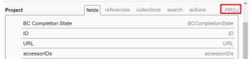

# EXISTS ステートメントを使用した複雑なテキストモードフィルターの作成

<!-- Audited: 01/2024 -->

<!--

(NOTE: do not EVER&nbsp;delete this article as long as Text Mode still exists in the system.&nbsp;Google ordered this article to be written and we wrote it with the help of consultants, so the use case is very complex and very hard to understand without this. It is also very much used by many customers)

-->

<!--

(NOTE:&nbsp;Alina: **~ Replace screen shot of icons when list/ reporting UI changes)

-->

>[!IMPORTANT]
>
>この記事は、Adobe Workfront API とテキストモードレポートインターフェイスに関する十分な知識を前提としています。Workfront API について詳しくは、[API の基本](../../../wf-api/general/api-basics.md)を参照してください。\
>テキストモードの使用について詳しくは、[テキストモードの概要](../../../reports-and-dashboards/reports/text-mode/understand-text-mode.md)を参照してください。

## Workfront のオブジェクト関係の概要

すべてのオブジェクトは、Workfront データベース内の他のオブジェクトにリンクされています。

オブジェクトの階層と相互依存関係を理解すると、レポートで参照できるオブジェクトを見つけるのに役立ちます。

Workfront内のオブジェクトと、その階層および相互依存関係について詳しくは、 [Adobe Workfrontオブジェクトの概要](../../../workfront-basics/navigate-workfront/workfront-navigation/understand-objects.md).

フィルターを作成する場合、標準のレポートインターフェイスを使用して、最大 2 レベルの関係内でフィルターのオブジェクトに接続されている他のオブジェクトを参照できます。

例えば、イシューフィルターでポートフォリオ ID を参照すると、標準インターフェイスを使用して、特定のポートフォリオに関連付けられている、プロジェクトのイシューのみを参照できます。この場合、ポートフォリオはイシューから 2 レベル離れています。

ただし、標準インターフェイスを使用してイシューフィルターでポートフォリオ所有者を参照し、所有者が特定のユーザーであるポートフォリオに関連付けられている、プロジェクトのイシューのみを表示することはできません。「Portfolio所有者名」フィールド（問題から 3 レベル離れた場所）にアクセスするには、テキストモードを使用する必要があります。

Workfront のオブジェクトの完全なリストについては、[API エクスプローラー](../../../wf-api/general/api-explorer.md)を参照してください。

API エクスプローラーの操作とオブジェクトの検索の方法については、[API エクスプローラーの使用](../../../wf-api/general/using-api-explorer.md)を参照してください。

フィルターを作成する場合は、テキストモードインターフェイスで複雑なステートメントを作成して、これらのタイプのオブジェクトを参照する必要があります。

複雑なフィルターの作成について詳しくは、 [EXISTS 文を使用する複雑なテキストモードフィルターの概要](#overview-of-complex-text-mode-filters-that-use-exists-statements) 」の節を参照してください。

## EXISTS 文を使用する複雑なテキストモードフィルターの概要 {#overview-of-complex-text-mode-filters-that-use-exists-statements}

オブジェクト階層の複数のレベルにまたがるフィルターや見つからないオブジェクトを絞り込むフィルターを作成する際は、次の点を考慮してください。

* フィルターオブジェクトに直接接続されていないオブジェクトを参照する場合は、複雑なフィルターを作成する必要があります。
* 以下を行うには、EXISTS 文を使用する必要があります。

   * 複数のレベルにまたがるフィルターの作成。
   * 見つからないオブジェクトを探すフィルターの作成。\
     例えば、ユーザーレポートを作成する際に、一定期間ログに記録していないユーザーを絞り込むことができます。

フィルターで EXISTS 文を使用する際は、次のルールを考慮してください。

* EXISTS フィルターで参照できるオブジェクトは次の 3 種類あります。

   * フィルターのオブジェクト（オリジナルオブジェクト）。
   * 参照するフィールドを持つオブジェクト（ターゲットオブジェクト）。
   * 元のオブジェクトとターゲットオブジェクトが相互に直接接続されていない場合に両者を接続するオブジェクト（リンクオブジェクト）。

* EXISTS を使用するフィルターには、等号でリンクされた 2 つの別個のステートメントが含まれます。

   * 等号の前のステートメントは、参照先のオブジェクト（リンクオブジェクトまたはターゲットオブジェクト）を指します。
   * 等号の後のステートメントは、参照元のオブジェクト（オリジナルオブジェクト）を指します。

* ステートメントを接続するには、リンクオブジェクトのオブジェクトコードを使用する必要があります。\
  すべてのオブジェクトのオブジェクトコードを API エクスプローラーで確認できます。\
  API エクスプローラーについては、[API エクスプローラー](../../../wf-api/general/api-explorer.md)を参照してください。

* オリジナルオブジェクトとターゲットオブジェクトが直接相互に接続されているので、リンクオブジェクトが見つからない場合は、リンクオブジェクトの代わりにターゲットオブジェクトのオブジェクトコードを使用できます。
* 同じオブジェクト（ターゲットオブジェクト）上で複数のフィールド（ターゲットフィールド）を参照できます。その場合、フィールドを参照する行を AND で接続する必要があります。\
  ターゲットオブジェクトに属する複数のフィールドのフィルタリングの例については、[例 4：複数のフィールドによるフィルター：ポートフォリオ所有者名別とポートフォリオ整合性スコアカード ID 別のタスク](#example-4-filter-by-multiple-fields-tasks-by-portfolio-owner-name-and-portfolio-alignment-scorecard-id)の節を参照してください。

* EXISTS 文でサポートされている修飾子は NOTEXISTS のみです。

## アクセス要件

この記事の手順を実行するには、次のアクセス権が必要です。

<table style="table-layout:auto"> 
 <col> 
 <col> 
 <tbody> 
  <tr> 
   <td role="rowheader">Adobe Workfront プラン</td> 
   <td> 
任意
 </td> 
  </tr> 
  <tr> 
   <td role="rowheader">Adobe Workfront ライセンス</td> 
   <td>
新規：標準

       
または

       
現在：プラン
 </td> 
  </tr> 
  <tr> 
   <td role="rowheader">アクセスレベル設定*</td> 
   <td> 
フィルター、ビュー、グループへのアクセスを編集
 
レポート、ダッシュボード、カレンダーへの編集アクセスとレポートのフィルターの編集
</td> 
  </tr> 
  <tr> 
   <td role="rowheader">オブジェクト権限</td> 
   <td> 
レポートの権限を管理してレポートのフィルターを編集
 
フィルターを編集する権限を管理
</td> 
  </tr> 
 </tbody> 
</table>

この表の情報の詳細については、 [Workfrontドキュメントのアクセス要件](/help/quicksilver/administration-and-setup/add-users/access-levels-and-object-permissions/access-level-requirements-in-documentation.md).

## オブジェクト階層の複数のレベルにまたがる複雑なテキストモードフィルターを作成

<!--

(NOTE: Alina: ***[This information is somewhat duplicated from the section below: Create Text-Mode Filters for Missing Objects])

-->

フィルターオブジェクトが存在するオブジェクト階層の複数のレベルにわたる、オブジェクトを参照するフィルターを作成できます。例えば、特定のポートフォリオ所有者に関連付けられていないプロジェクト上のイシューに対して、イシューフィルターを作成できます。

このフィルターを作成するには、常に EXISTS 文とテキストモードインターフェイスを使用する必要があります。

フィルターの例について詳しくは、この記事の[例 1：ポートフォリオ所有者名でイシューをフィルタリング](#example-1-filter-for-issues-by-portfolio-owner-name)の節を参照してください。

オブジェクト階層の複数のレベルにまたがるフィルターを作成するには、次に手順に従います。

1. フィルターのオブジェクトを特定します。このオブジェクトを、「元のオブジェクト」と呼びます。\
   例えば、イシューなどです。

1. フィルターに使用するフィールドを特定します。このオブジェクトを、ターゲットオブジェクトに属するターゲットフィールドと呼びます。\
   例えば、ownerID フィールド（ターゲットフィールド）は、Portfolio（ターゲットオブジェクト）に属します。

1. （条件付き）元のオブジェクト（イシュー）とターゲットフィールド（ownerID）が直接接続されていない場合、3 つ目のオブジェクト（これらのオブジェクトを接続するためのリンクオブジェクト（プロジェクト））を見つける必要があります。リンクオブジェクトには、元のオブジェクトの [ フィールド ] タブまたは [ 参照 ] タブから参照されるフィールドが少なくとも 1 つ必要です（元のオブジェクトに表示されるリンクフィールド）。また、リンクオブジェクトの [ フィールド ] タブまたは [ 参照 ] タブに表示される。 Linking Field は、Linking Object （または Linking Object に表示される Linking Field）に表示される Target Object に対して、Target Field と一致する必要があります。

   例えば、（プロジェクト）ID（元のオブジェクトに表示されるリンクフィールド）は、イシュー（元のオブジェクト）から参照されます。（ポートフォリオ）ownerID（ターゲットオブジェクトへのリンクフィールド）は、プロジェクト（リンクオブジェクト）の「フィールド」タブに表示されます。ポートフォリオの ownerID は、ターゲットオブジェクトのフィールド（ポートフォリオ）でもあります。リンクオブジェクトのリンクフィールドは、ターゲットフィールドと一致します。\
   

1. API エクスプローラーを使用して、リンクオブジェクト（プロジェクト）の&#x200B;**オブジェクトコード**&#x200B;を特定します。\
   たとえば、プロジェクトのオブジェクトコードは PROJ です。\
   

1. 元のオブジェクトのフィルターを作成します。\
   例えば、イシューフィルターを作成します。\
   フィルターの作成について詳しくは、 [フィルターの概要](../../../reports-and-dashboards/reports/reporting-elements/filters-overview.md).

1. 「**テキスト モードに切り替える**」をクリックします。
1. 次の数式の例を新しいフィルターのテキストモードインターフェイスに貼り付け、例のテキストを正しいオブジェクトとフィールドに置き換えます。

   `EXISTS:A:$$OBJCODE=<Object code of the Linking Object>`

   `EXISTS:A:<Linking Field on the Linking Object>=FIELD:<Linking Field displayed on the Original Object>`

   `EXISTS:A:<Target Object>:<Target Field>=<Your value for the Target Field>`

   上記で特定したフィールドの使用例について詳しくは、この記事の[例 1：ポートフォリオ所有者名でイシューをフィルタリング](#example-1-filter-for-issues-by-portfolio-owner-name)の節を参照してください。

1. 「**フィルターを保存**」をクリックします。

## 見つからないオブジェクトに対する複雑なテキストモードフィルターを作成

<!--

(NOTE: Alina: **^[This information is somewhat duplicated from the section above: Create Text-Mode Filters that Span Multiple Levels in the Object Hierarchy])

-->

見つからないオブジェクトを参照するフィルターを作成できます。例えば、Workfront に何時間もログインしていないユーザーを表示するユーザーフィルターを作成できます。

このフィルターを作成するには、常に *EXISTS* 文とテキストモードインターフェイスを使用する必要があります。

見つからないオブジェクトに対するフィルターの例について詳しくは、この記事の次の節を参照してください。

* [例 2：見つからないオブジェクトのフィルター：カスタムフォームに表示されないカスタムフィールド](#example-2-filter-for-missing-objects-custom-fields-that-do-not-appear-in-any-custom-forms)
* [例 3：見つからないオブジェクトのフィルター：特定の期間、時間をログに記録しなかったユーザー](#example-3-filter-for-missing-objects-users-who-did-not-log-time-for-a-certain-period-of-time)

見つからないオブジェクトを参照するフィルターを作成するには、次の手順に従います。

1. フィルターのオブジェクトを特定します。このオブジェクトを、「元のオブジェクト」と呼びます。\
   例えば、「パラメーター」や「カスタムフィールド」などです。

1. フィルターに使用するフィールドを特定します。このオブジェクトを、ターゲットオブジェクトに属するターゲットフィールドと呼びます。\
   例えば、カテゴリ（Target オブジェクト）に属する categoryID フィールド（ターゲットフィールド）。

1. 元のオブジェクト（パラメーター）とターゲットフィールド（categoryID）は直接接続されていないので、3 つ目のオブジェクト（これらのオブジェクトを接続するためのリンクオブジェクト（カテゴリパラメーター）を見つける必要があります。リンクオブジェクトには、元のオブジェクトの [ フィールド ] タブまたは [ 参照 ] タブから参照されるフィールドが少なくとも 1 つ必要です（元のオブジェクトに表示されるリンクフィールド）。また、リンクオブジェクトの [ フィールド ] タブまたは [ 参照 ] タブに表示される。 Linking Field は、Linking Object （または Linking Object に表示される Linking Field）に表示される Target Object に対して、Target Field と一致する必要があります。

   例えば、カテゴリパラメータ（元のオブジェクトに表示されるリンクフィールド）の ID は、パラメータ（元のオブジェクト）から参照されます。 parameterID（ターゲットオブジェクトへのリンクフィールド）は、カテゴリパラメーター（リンクオブジェクト）の「フィールド」タブに表示されます。リンクオブジェクトに表示されるターゲットオブジェクトへのリンクフィールドは、ターゲットフィールドと一致します。

1. API エクスプローラーを使用して、リンクオブジェクト（カテゴリパラメーター）の&#x200B;**オブジェクトコード**&#x200B;を特定します。\
   例えば、カテゴリパラメーターのオブジェクトコードは CTGYPA です。\
   

1. 元のオブジェクトのフィルターを作成します。\
   例えば、パラメーターフィルターを作成します。\
   フィルターの作成について詳しくは、 [フィルターの概要](../../../reports-and-dashboards/reports/reporting-elements/filters-overview.md).

1. 「**テキスト モードに切り替える**」をクリックします。
1. （条件付き）欠落しているオブジェクトをフィルタリングする場合は、次の式の例を新しいフィルタのテキスト・モード・インタフェースに貼り付け、サンプル・テキストを正しいオブジェクトおよびフィールドに置き換えます。

   `EXISTS:A:$$OBJCODE=<Object code of the Linking Object>`

   `EXISTS:A:<Linking Field displayed on the Linking Object>=FIELD:<Linking Field displayed on the Original Object> EXISTS:A:$$EXISTSMOD=NOTEXISTS`

   カスタムフォームに関連付けられていないカスタムフィールドのレポートの例については、[例 2：見つからないオブジェクトのフィルター：カスタムフォームに表示されないカスタムフィールド](#example-2-filter-for-missing-objects-custom-fields-that-do-not-appear-in-any-custom-forms)の節を参照してください。

1. 「**フィルターを保存**」をクリックします。

## オブジェクト階層の複数のレベルにまたがるテキストモードフィルターの例

以下の例を使用して、EXISTS 文でテキストモードフィルターを作成します。

### 例 1：ポートフォリオ所有者名によるイシューのフィルター {#example-1-filter-for-issues-by-portfolio-owner-name}

テキストモードインターフェイスを使用して、イシューのリストに対するフィルターを作成し、所有者が特定のユーザーである、ポートフォリオに関連付けられたプロジェクト上のイシューのみを表示できます。

イシューをポートフォリオ所有者名でフィルターするには：

1. イシューステータスを作成します。\
   フィルターの作成について詳しくは、 [フィルターの概要](../../../reports-and-dashboards/reports/reporting-elements/filters-overview.md).

1. 「**テキストモードへの切り替え**」をクリックします。
1. 次の汎用コードを参照してください。

   `EXISTS:A:$$OBJCODE=<Object code of the Linking Object>`

   `EXISTS:A:<Linking Field on the Linking Object>=FIELD:<Linking Field displayed on the Original Object> EXISTS:A:<Target Object>:<Target Field>=<Your value for the Target Field>`

1. 次のコードを&#x200B;**レポートのフィルタールールの設定**&#x200B;エリアにペーストして、上記の汎用コードを置き換えます。

   `EXISTS:A:$$OBJCODE=PROJ`

   `EXISTS:A:ID=FIELD:projectID`

   `EXISTS:A:portfolio:ownerID=4d94d7da001699b19edf50de15682221`

   >[!NOTE]
   >
   >* 元のオブジェクトは、「レポート：問題」のオブジェクトです。
   >* ターゲットオブジェクトはポートフォリオです。
   >* リンクオブジェクトはプロジェクトです。
   >* リンクオブジェクトから参照されるターゲットフィールドとターゲットオブジェクトへのリンクフィールドは、ownerID です。
   >* ここでのリンクオブジェクトのオブジェクトコードは PROJ です。
   >* 元のオブジェクトに表示されるリンクフィールドは projectID で、リンクフィールドは ID です。

1. 最後の文のターゲットフィールド（ownerID）の値を、環境のユーザー ID に置き換えます。
1. 「**フィルターを保存**」をクリックします。

### 例 2：見つからないオブジェクトのフィルター：カスタムフォームに表示されないカスタムフィールド {#example-2-filter-for-missing-objects-custom-fields-that-do-not-appear-in-any-custom-forms}

テキストモードインターフェイスを使用して、カスタムフォーム（カテゴリ）に関連付けられていないカスタムフィールド（パラメーター）を表示するフィルターを作成できます。このフィルターは、パラメーターをカテゴリにリンクします。これは、別のオブジェクト（カテゴリパラメーター）を通じて接続されます。2 つのフィールドは互いに直接接続されておらず、欠落した情報をフィルタリングするので、EXISTS 文を使用する必要があります。

>[!IMPORTANT]
>
>パラメーターとは、カスタムフォームで参照されるフィールドライブラリ内に存在するフィールドのことです。カテゴリパラメーターとは、特定のフォームに表示されるフィールドのバージョンのことです。例えば、5 つのフォームで同じフィールドが表示される場合、Workfrontデータベースには「 Parameter 」と「 Category Parameters 」が 1 つ、「 Parameter 」と「 5 Category Parameters 」があります。

カスタムフォームに関連付けられていないカスタムフィールドをフィルターするには：

1. パラメーターまたはカスタムフィールドフィルターを作成します。\
   フィルターの作成について詳しくは、 [フィルターの概要](../../../reports-and-dashboards/reports/reporting-elements/filters-overview.md).

1. 「**テキストモードへの切り替え**」をクリックします。
1. 次の汎用コードを参照してください。

   `EXISTS:A:$$OBJCODE=<Object code of the Linking Object>`

   `EXISTS:A:<Linking Field displayed on the Linking Object>=FIELD:<Linking Field displayed on the Original Object> EXISTS:A:$$EXISTSMOD=NOTEXISTS`

1. 次のコードを&#x200B;**レポートのフィルタールールの設定**&#x200B;エリアにペーストして、上記の汎用コードを置き換えます。

   `EXISTS:A:$$OBJCODE=CTGYPA`

   `EXISTS:A:parameterID=FIELD:ID`

   `EXISTS:A:$$EXISTSMOD=NOTEXISTS`

   >[!NOTE]
   >
   >* 元のオブジェクトは、「レポート：パラメーター」のオブジェクトです。
   >* ターゲットオブジェクトはカテゴリです。
   >* リンクオブジェクトはカテゴリパラメーターです。
   >* リンクオブジェクトのオブジェクトコードは CTGYPA です。
   >* Linking Object Table と Target Object Table の両方に parameterID が存在するので、Linking Field to the Target Object は parameterID です。
   >* 元のオブジェクトに表示されるリンクフィールドは、（カテゴリパラメーターの）ID です。

1. 「**フィルターを保存**」をクリックします。

### 例 3：見つからないオブジェクトのフィルター：特定の期間、時間をログに記録しなかったユーザー {#example-3-filter-for-missing-objects-users-who-did-not-log-time-for-a-certain-period-of-time}

テキストモードインターフェイスを使用して、特定の期間に時間を記録しなかったユーザーを表示するフィルターを作成できます。 このフィルターは、ユーザーを時間にリンクします。時間は、互いに直接接続されています。ただし、見つからない情報をフィルタリングするには、EXISTS 文とテキストモードインターフェイスを使用する必要があります。

先週のログに時間を記録しなかったユーザーをフィルタリングするには：

1. ユーザーフィルターを作成します。\
   フィルターの作成について詳しくは、 [フィルターの概要](../../../reports-and-dashboards/reports/reporting-elements/filters-overview.md).

1. 「**テキストモードへの切り替え**」をクリックします。
1. 次の汎用コードを参照してください。

   `EXISTS:A:$$OBJCODE=<Object code of the Linking Object>`

   `EXISTS:A:<Linking Field displayed on the Linking Object>=FIELD:<Linking Field displayed on the Original Object> EXISTS:A:$$EXISTSMOD=NOTEXISTS`

1. 次コードを&#x200B;**レポートのフィルタールールの設定**&#x200B;エリアにペーストして、上記の汎用コードを置き換えます。

   `EXISTS:A:$$OBJCODE=HOUR EXISTS:A:ownerID=FIELD:ID EXISTS:A:entryDate=$$TODAYb-1w EXISTS:A:entryDate_Range=$$TODAYe-1w EXISTS:A:entryDate_Mod=between EXISTS:A:$$EXISTSMOD=NOTEXISTS`

   >[!NOTE]
   >
   >* 元のオブジェクトは、「レポート：ユーザー」のオブジェクトです。
   >* ターゲットオブジェクトは「時間」です。
   >* ユーザーと時間は Workfront データベースで直接接続されるので、この例ではリンクオブジェクトは必要ありません。
   >* リンクオブジェクトがないので、ターゲットオブジェクトのオブジェクトコード（HOUR）を使用する必要があります。
   >* ターゲットオブジェクトへのリンクフィールドは ownerID です（元のオブジェクトに表示されます。リンクオブジェクトはありません）。
   >* 元のオブジェクトに表示されるリンクフィールドは、（時間の）ID です（Target オブジェクトに表示されます。リンクオブジェクトはありません）。
   >* EXISTS:A: entryDate ステートメントは、ターゲットオブジェクト（時間）を定義するフィールドを参照し、通常のフィルターステートメントと同じ構文を使用します。これにより、特定の期間（この場合は前週）の時間を記録しなかったユーザーのみが表示されます。
   >* NOTEXISTS 修飾子は、レポート（ユーザー）のオブジェクトに存在しない項目（時間）を検索していることを示します。

1. 「**フィルターの保存**」をクリックします。

### 例 4：複数のフィールドによるフィルター：ポートフォリオ所有者名とポートフォリオ整合性スコアカード ID 別タスク {#example-4-filter-by-multiple-fields-tasks-by-portfolio-owner-name-and-portfolio-alignment-scorecard-id}

テキストモードインタフェースを使用して、ターゲットオブジェクト上の複数のフィールドを参照するフィルタを作成できます。この場合、ターゲットフィールドを参照するフィルターステートメントは、AND で接続する必要があります。

例えば、タスクのリストをフィルターして、次の条件を満たすタスクのみを表示できます。

* 所有者が特定のユーザーであるポートフォリオに関連付けられたプロジェクトに含まれます。
* プロジェクトが特定の整合性スコアカードに関連付けられていない、ポートフォリオに関連付けられたプロジェクトに含まれています。

タスクをポートフォリオ所有者名とポートフォリオの整合性スコアカード ID でフィルタリングするには、次の手順に従います。

1. タスクフィルターを作成します。\
   フィルターの作成について詳しくは、 [フィルターの概要](../../../reports-and-dashboards/reports/reporting-elements/filters-overview.md).

1. 「**テキスト モードに切り替える**」をクリックします。
1. 次のコードを&#x200B;**レポートのフィルタールールの設定**&#x200B;エリアに貼り付けます。

   `EXISTS:A:$$OBJCODE=PROJ`
   `EXISTS:A:ID=FIELD:projectID`
   `EXISTS:A:portfolio:ownerID=4d80ce5200000528787d57807732a33f`
   `AND:A:EXISTS:A:$$EXISTSMOD=NOTEXISTS`
   `AND:A:EXISTS:A:$$OBJCODE=PROJ`
   `AND:A:EXISTS:A:ID=FIELD:projectID`
   `AND:A:EXISTS:A:portfolio:alignmentScoreCardID=4da387b00001cbc732bb259355c33dad`

   >[!NOTE]
   >
   >* 元のオブジェクトは、「フィルター：タスク」のオブジェクトです。
   >* ターゲットオブジェクトはポートフォリオです。
   >* 最初のターゲットフィールドは ownerID です。
   >* 2 つ目のターゲットフィールドは、整合性スコアカード ID です。
   >* リンクオブジェクトはプロジェクトです。
   >* リンクオブジェクトのオブジェクトコードは PROJ です。
   >* ターゲットオブジェクトへのリンクフィールドは、（ポートフォリオの）ID です。
   >* 元のオブジェクトに表示されるリンクフィールドは projectID です。
   >* ownerID を環境のユーザー ID に置き換えます。

1. 「**フィルターを保存**」をクリックします。
