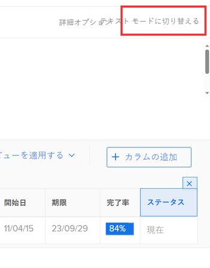

# テキストモードを使用したビューの編集

<!--

NOTE: add a section in this article: /Content/Reports and Dashboards/Reports/Reporting Elements/create-customize-views.html *** Also, draft this area in the Text Mode overview article) 

-->

テキストモードを使用してリストまたはレポートのビューを編集し、標準インターフェイスで使用できないフィールドにアクセスして、より複雑なビューを作成できます。

## アクセス要件

この記事の手順を実行するには、次のアクセス権が必要です。

<table style="table-layout:auto"> 
 <col> 
 <col> 
 <tbody> 
  <tr> 
   <td role="rowheader">Adobe Workfront plan*</td> 
   <td> 
任意
 </td> 
  </tr> 
  <tr> 
   <td role="rowheader">Adobe Workfront license*</td> 
   <td> 
計画 
 </td> 
  </tr> 
  <tr> 
   <td role="rowheader">アクセスレベル設定*</td> 
   <td> 
フィルター、ビュー、グループへのアクセスを編集
 
レポート、ダッシュボード、カレンダーへのアクセスを編集して、レポートのレポート要素を編集します
 
注意：まだアクセス権がない場合は、Workfront管理者に、アクセスレベルに追加の制限を設定しているかどうかを問い合わせてください。 Workfront管理者がアクセスレベルを変更する方法について詳しくは、 <a href="../../../administration-and-setup/add-users/configure-and-grant-access/create-modify-access-levels.md" class="MCXref xref">カスタムアクセスレベルの作成または変更</a>.
 </td> 
  </tr> 
  <tr> 
   <td role="rowheader">オブジェクト権限</td> 
   <td> 
レポートの表示を編集するためのレポートに対する権限を管理します
 
ビューに対する権限を管理して編集
 
追加のアクセス権のリクエストについて詳しくは、 <a href="../../../workfront-basics/grant-and-request-access-to-objects/request-access.md" class="MCXref xref">オブジェクトへのアクセスのリクエスト </a>.
 </td> 
  </tr> 
 </tbody> 
</table>

&#42;保有しているプラン、ライセンスの種類、アクセス権を確認するには、Workfront管理者に問い合わせてください。

## 前提条件

レポートまたはリストでテキストモードの使用を開始する前に、必ずWorkfrontのテキストモード構文に関する十分な知識を持っておく必要があります。

詳しくは、以下を参照してください。

* [テキストモードの概要](../../../reports-and-dashboards/reports/text-mode/understand-text-mode.md)
* [テキストモード構文の概要](../../../reports-and-dashboards/reports/text-mode/text-mode-syntax-overview.md)
* [カスタム・ビュー、フィルタ、グループ化のサンプル](../../../reports-and-dashboards/reports/custom-view-filter-grouping-samples/custom-view-filter-grouping-samples.md)

## ビューでのテキストモードの編集

テキストモードを使用したビューの編集は、レポートとリストで同じです。 レポートからのビューへのアクセス、またはリストからのビューへのアクセスは異なります。

>[!TIP]
>
>標準モードでできるだけ多くのビューを作成し、そのビューをテキストモードに変換して編集することをお勧めします。

ビューの構築について詳しくは、 [Adobe Workfrontの概要を表示](../../../reports-and-dashboards/reports/reporting-elements/views-overview.md).

レポートの作成について詳しくは、 [カスタムレポートの作成](../../../reports-and-dashboards/reports/creating-and-managing-reports/create-custom-report.md).

1. 次のいずれかの操作を行います。

   1. レポートからビューにアクセスするには、レポートに移動し、 **レポートのアクション** > **編集** > **列（表示）** タブをクリックします。
   1. リストからビューにアクセスするには、リストに移動し、 **表示** ドロップダウンメニューで、変更するビューの上にマウスを移動し、 **編集** アイコン .

      ビュービルダーが開きます。

1. ビューで列を選択します。

   または

   を選択します。 **列（表示）** 」タブをクリックし、列を選択します。

   >[!TIP]
   >
   >テキストモードを使用してビューを編集するには、一度に 1 列ずつ編集する必要があります。

1. クリック **テキストモードに切り替え** をクリックします。

   >[!NOTE]
   >
   >テキストモードで列を編集すると、Workfrontによって `textmode=true` コードの行を列に追加します。 これは、列がテキストモードで変更されたことを示します。

   

   次の表に、テキストモードビューでの主な行の概要を示します。

   <!--
   
(NOTE: make this a snippet and add it to the grouping article too)

   -->

   <table style="table-layout:auto"> 
    <col> 
    <col> 
    <thead> 
     <tr> 
      <th>横断抽出ライン</th> 
      <th>説明</th> 
     </tr> 
    </thead> 
    <tbody> 
     <tr> 
      <td> 
<strong>valuefield</strong>=
 </td> 
      <td> 
これは、データベースに表示される、オブジェクトまたはフィールドの名前です。 データベースでのオブジェクトおよびフィールドの表示の詳細については、 <a href="../../../wf-api/general/api-explorer.md" class="MCXref xref">API エクスプローラ</a>.
 
次のシナリオが存在します。
 
       <ol> 
        <li value="1"> 
 表示するフィールドの名前が単一名詞ではなくフレーズの場合、 <code>valuefield</code>. 例えば、タスクの計画開始日の場合、コードは次のようになります。 
 
Example: </b>"><b>例: </b><code>valuefield=plannedStartDate</code> 
 </li> 
        <li value="2"> 
カスタムフィールドを表示する場合は、 <code>valuefield</code> 「値」は、インターフェイスに表示されるフィールドの実際の名前です。 例えば、「More information」という名前のカスタムフィールドの場合、コードは次のようになります。
 
Example: </b>"><b>例: </b><code>valuefield=More information</code> 
 </li> 
        <li value="3"> 
ビュー内の他のオブジェクトに関連するオブジェクトを表示する場合は、 <code>valuefield</code> コードの行では、オブジェクトの名前と属性がコロンで区切られます。 
 
たとえば、タスクビューの列でPortfolioの所有者の名前を表示する場合、値フィールド行には次の値が設定されます。
 
Example: </b>"><b>例: </b><code>valuefield=project:portfolio:owner:name</code> 
 
これは、レポート（タスク）のオブジェクトから次の関連オブジェクト（プロジェクト）にアクセスし、そこからプロジェクト（ポートフォリオ）、ポートフォリオ所有者（所有者）、名前（名前）の順に次の関連オブジェクトにアクセスできることを示します。 
 </li> 
       </ol> 
オブジェクトが相互に接続する方法については、「 <a href="../../../workfront-basics/navigate-workfront/workfront-navigation/understand-objects.md#understanding-interdependency-and-hierarchy-of-objects" class="MCXref xref">オブジェクトの相互依存性と階層</a> in <a href="../../../workfront-basics/navigate-workfront/workfront-navigation/understand-objects.md" class="MCXref xref">Adobe Workfrontのオブジェクトについて</a>.
 
注意：標準インターフェイスで有効でないテキストモードのフィールドを選択した場合、列内の標準インターフェイスに戻すことはできません。
 </td> 
     </tr> 
     <tr> 
      <td><strong>valueformat=</strong> </td> 
      <td> 
この行は、 <code>valuefield</code>. この <code>valueformat</code> オブジェクトまたはフィールドをテキスト、数値、割合、日付のどれで表示するかを指定します。
 
次を使用することをお勧めします。 <code>HTML</code> の <code>valueformat</code>( 特に <code>valueexpression</code>を使用して、情報を最も正確に表示できます。 
 
この行の追加の値について詳しくは、 <a href="../../../reports-and-dashboards/reports/text-mode/use-conditional-formatting-text-mode.md" class="MCXref xref">テキストモードでの条件付き書式の使用</a>.
 </td> 
     </tr> 
     <tr> 
      <td> 
<strong>valueexpression=</strong> 
 </td> 
      <td> 
この行を追加して、 <code>valuefield</code>を指定します。
 
次を囲む必要があります。 <code>valuefield</code> を中括弧で囲んだオブジェクトの <code>valueexpression</code>.
 
次のシナリオが存在します。 
 
       <ol> 
        <li value="1"> 
フィールドを大文字で列に表示する場合は、次のように使用します。
 
Example: </b>"><b>例: </b><code>valueexpression=UPPER({valuefield})</code> 
 
この <code>valuefield</code> の値は、API エクスプローラーで表示されるとおりに入力されます。 
 </li> 
        <li value="2">複数の <code>valuefields</code> それらを一つにまとめて、ピリオドで区切る必要があります。</li> 
        <li value="3"> 
例えば、タスクのプライマリ担当者の名前を <code>valueexpression</code>を使用する場合は、次のようになります。
 
Example: </b>"><b>例: </b><code>valueexpreesion={assignedTo}.{name}</code> 
 </li> 
        <li value="4"> 
カスタムフィールドを <code>valueexpression</code> 行をフィールド名の前に指定する必要があります <code>DE:</code> をクリックして、カスタムフィールドであることを示します。 フィールドの名前は、インターフェイスで表示されるとおりに入力されます。 
 
重要：一部のユーザーに対する権限が制限されたカスタムフォームセクションに配置されたカスタムフィールドを使用する場合、値式の計算は、レポートでこの計算を表示する際に空白になります。 カスタムフォームセクションの権限の調整について詳しくは、 <a href="../../../administration-and-setup/customize-workfront/create-manage-custom-forms/create-or-edit-a-custom-form.md" class="MCXref xref">カスタムフォームの作成または編集</a>.
 
例えば、「開発者名」というラベルの付いたカスタムフィールドがあり、このフィールドを列で大文字で表示する場合は、次のように使用できます <code>valueexpression</code> 次のように指定します。
 
Example: </b>"><b>例: </b><code>valueexpression=UPPER({DE:Developer Name}</code>) 
 
Typeahead タイプのカスタムフィールドを参照する場合は、次の式を使用して、「開発者名」というラベルの付いたフィールドで選択されたオブジェクトの名前を参照します。
 
<code>valueexpression=UPPER({DE:Developer Name:name})</code> 
 </li> 
       </ol> </td> 
     </tr> 
     <tr> 
      <td> 
<strong>descriptionkey= / description=</strong> 
 </td> 
      <td> 
この行は、列の名前にマウスを合わせたときに表示されるツールヒントのテキストを定義します。 この場合、キーを使用して説明テキストの名前値を翻訳します。 説明を変更する場合は、次の行を次のように変更します。 
 
Example: </b>"><b>例: </b><code>description=Your Value</code>.
 </td> 
     </tr> 
     <tr> 
      <td><strong>namekey= / name=</strong> </td> 
      <td> 
この行は、列のラベルを定義します。 この場合、キーに基づく短縮値を使用します。
 
列名を変更する場合は、この値を次の値に変更できます。 
 
Example: </b>"><b>例: </b><code>name=Your Value</code> 
 
<code>Name</code> 列名に任意のテキストを入力できます。<code>namekey</code> では、列の名前を翻訳するために使用するキーを入力する必要があります。
 
列名を変更するには、 <code>displayname </code>行が存在しない場合は。
 </td> 
     </tr> 
     <tr> 
      <td><strong>displayname =</strong> </td> 
      <td> 
次の行を追加して、列の名前を変更できます。この行は、 <code>namekey/name</code> 値：
 
Example: </b>"><b>例: </b><code>displayname=Your Value</code> 
 </td> 
     </tr> 
     <tr> 
      <td><strong>querysort=</strong> </td> 
      <td>この行は、列ヘッダーがクリックされた場合の結果の並べ替え方法を定義します。 存在しない場合は、レポートの実行後に列を並べ替えることはできません。</td> 
     </tr> 
     <tr> 
      <td><strong>width=</strong> </td> 
      <td> 
この行は、列に使用されるピクセル数を表します。 行が省略された場合、または 0（ゼロ）に設定された場合、列はビューに表示されません。
 
テキストモードでこのフィールドを手動で変更する場合は、 <code>usewidths=true</code> の値を列に追加します。
 </td> 
     </tr> 
     <tr> 
      <td><strong>usewidths=true</strong> </td> 
      <td> 
この行は、 <code>width=</code> 行（列の幅をカスタマイズする場合） 
 </td> 
     </tr> 
     <tr> 
      <td><strong>makeFieldEditable=</strong> </td> 
      <td> 
この行は、列に表示される値がインラインで編集可能かどうかを定義します。 この行が <strong>true</strong>を指定した場合、列内の値はインラインで編集可能です。 この行が <code>false</code>の場合、列の値はインラインで編集できません。
 </td> 
     </tr> 
     <tr> 
      <td><strong>link.valuefield=</strong> </td> 
      <td> 
列に表示された値を、その列に関連付けられたオブジェクトにリンクする場合にのみ、この行を挿入します。 リンクをクリックすると、オブジェクトの詳細ページが開きます。 この値は <code>valuefield=</code> 行 これを挿入する場合は、 <code>link.valueformat=</code> 行 
 
 例えば、 <code>link.valuefield=priority</code> イシュー表示では、イシューの優先度がリンクとして表示されます。 このリンクをクリックすると、問題ページが開きます。
 </td> 
     </tr> 
     <tr> 
      <td><strong>link.valueformat=</strong> </td> 
      <td> 
この行は、 <code>link.valuefield</code> 行をクリックして、列の値にリンクを追加します。 リンクをクリックすると、オブジェクトの詳細ページが開きます。 この値は <code>valueformat=</code> 行とは、 <code>valuefield</code>. 
 
重要：組み込みの列（リンクも含む）でテキストモードを表示すると、そのリンクを参照する行が複数表示されています。 これらの行の一部は、テキストモードで独自のカスタム列を作成し、それにリンクステートメントを追加する際に、サポートされなくなったり不要になったりする場合があります。 リンクされた値を追加する際に必須となる行は次のとおりです。<code> link.valuefield</code> および <code>link.valueformat</code>. 
 </td> 
     </tr> 
     <tr> 
      <td><strong>aggregator.function=</strong> </td> 
      <td> 
これは、各列の値の要約方法を示します。 次で始まる行が複数あります： <code>aggregator.</code> これらはすべて、列の結果を要約した集約を参照します。 
 
原則として、 <code>aggregator.</code> 行は column オブジェクトの行と一致します。 
 
       
Example: </b>">
        <b>例: </b> 
        
Sum で要約されたタスクレポートの「計画時間」列は、次のようになります。 
 
        

         <pre>textmode=true</pre>
         <pre>valuefield=workRequired</pre>
         <pre>valueformat=compound</pre>
         <pre>aggregator.function=SUM</pre>
         <pre>aggregator.valuefield=workRequired</pre>
         <pre>aggregator.displayformat=minutesAsHoursString</pre>
         <pre>aggregator.valueformat=compound</pre>
         <pre>namekey=workRequired</pre>
         <pre>shortview=false</pre> 
        
 
       
 
       

        この <code>aggregator. </code>行には <code>valuefield </code>または <code>valueexpression</code>
       
 </td> 
     </tr> 
    </tbody> 
   </table>

1. クリック **適用** 変更を保存し、ビューの編集を続行する場合。
1. クリック **保存して閉じる** をクリックしてレポートを保存します。

   または

   クリック **ビューを保存** をクリックして、ビューをリストに保存します。
