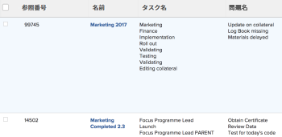
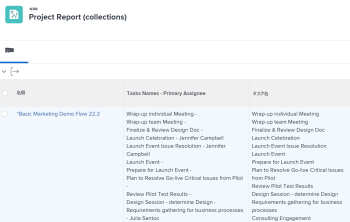
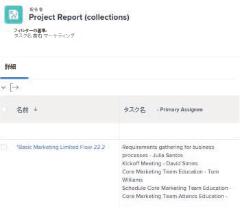

# レポート内のコレクションの参照

Adobe Workfrontでレポートを作成すると、一連のオブジェクト、それぞれのフィールド、またはリンクオブジェクトをリスト、グリッド、グラフ形式で表示できます。

Workfrontでのレポートの作成について詳しくは、 [カスタムレポートの作成](../../../reports-and-dashboards/reports/creating-and-managing-reports/create-custom-report.md).

## アクセス要件

この記事の手順を実行するには、次のアクセス権が必要です。

<table style="table-layout:auto"> 
 <col> 
 <col> 
 <tbody> 
  <tr> 
   <td role="rowheader">Adobe Workfront plan*</td> 
   <td> <p>任意</p> </td> 
  </tr> 
  <tr> 
   <td role="rowheader">Adobe Workfront license*</td> 
   <td> <p>計画 </p> </td> 
  </tr> 
  <tr> 
   <td role="rowheader">アクセスレベル設定*</td> 
   <td> <p>フィルター、ビュー、グループへのアクセスを編集</p> <p>レポート、ダッシュボード、カレンダーへのアクセスを編集</p> <p>注意：まだアクセス権がない場合は、Workfront管理者に、アクセスレベルに追加の制限を設定しているかどうかを問い合わせてください。 Workfront管理者がアクセスレベルを変更する方法について詳しくは、 <a href="../../../administration-and-setup/add-users/configure-and-grant-access/create-modify-access-levels.md" class="MCXref xref">カスタムアクセスレベルの作成または変更</a>.</p> </td> 
  </tr> 
  <tr> 
   <td role="rowheader">オブジェクト権限</td> 
   <td> <p>レポートに対する権限の管理</p> <p>ビュー、フィルターまたはグループ化に対する権限を管理 </p> <p>追加のアクセス権のリクエストについて詳しくは、 <a href="../../../workfront-basics/grant-and-request-access-to-objects/request-access.md" class="MCXref xref">オブジェクトへのアクセスのリクエスト </a>.</p> </td> 
  </tr> 
 </tbody> 
</table>

保有しているプラン、ライセンスの種類、アクセス権を確認するには、Workfront管理者に問い合わせてください。

## コレクションについて

コレクションは、別のオブジェクトにリンクされているオブジェクトのリストです。

Workfrontでは、オブジェクト間に次の 2 つの関係があります。

* **1 対 1 の関係**:1 つのオブジェクトは、一度に 1 つの他のオブジェクトにのみリンクできます。\
   例えば、1 つのプロジェクトを一度に 1 つのポートフォリオにのみリンクできるとします。

* **一対多の関係**:1 つのオブジェクトは、一度に複数の他のオブジェクトにリンクできます。\
   例えば、1 つのプロジェクトに複数のタスクを含めることができます。 この場合、タスクのリストはプロジェクトのコレクションとなります。

>[!IMPORTANT]
>
>標準の Report Builder を使用して、オブジェクト間の 1 対 1 の関係を示すレポートを作成できます。 ただし、Report Builder のテキストモードインターフェイスを使用して作成できるのは、オブジェクト間の 1 対多の関係を示すレポートのみです。

標準 Report Builder でのレポート作成について詳しくは、 [カスタムレポートの作成](../../../reports-and-dashboards/reports/creating-and-managing-reports/create-custom-report.md).

テキストモードインターフェイスを使用したレポートの作成について詳しくは、次を参照してください。

* [テキストモードの概要](../../../reports-and-dashboards/reports/text-mode/understand-text-mode.md)
* [テキストモードの一般的な使用例の概要](../../../reports-and-dashboards/reports/text-mode/understand-common-uses-text-mode.md).
* [テキストモード構文の概要](../../../reports-and-dashboards/reports/text-mode/text-mode-syntax-overview.md)

## API エクスプローラーでのコレクションオブジェクトとそのフィールドの検索 {#find-collection-objects-and-their-fields-in-the-api-explorer}

一部のコレクションをレポートできるわけではありません。

他のコレクションと関連付けることができるオブジェクトを理解するには、API エクスプローラーを使用する必要があります。\
API エクスプローラーテーブルについて詳しくは、 [API エクスプローラ](../../../wf-api/general/api-explorer.md).

レポートできるコレクションを確認するには、次の手順に従います。

1. 次に移動： [API エクスプローラ](../../../wf-api/general/api-explorer.md).
1. レポートのオブジェクトを検索します。
1. を選択します。 **コレクション** タブをクリックします。

   >[!NOTE]
   >
   >選択したオブジェクトのレポート内では、このタブにリストされたオブジェクトのみをコレクションとして表示できます。

1. コレクションをクリックして、コレクションのオブジェクトを展開します。
1. 表示されたリンクをクリックして、コレクションのオブジェクトに移動します。\
   これにより、 **フィールド** タブを使用して、コレクションのオブジェクトを表示できます。

   >[!NOTE]
   >
   >コレクションレポートで参照できるのは、このタブに表示されるフィールドのみです。また、このタブに表示されるオブジェクトに関連付けられたフィールドも参照できます。

## レポート内のコレクションの参照

次のレポート要素内のコレクションからオブジェクトを参照できます。

* ビュー
* フィルター
* プロンプト

次のレポート要素内のコレクションからオブジェクトを参照することはできません。

* グループ化
* グラフ

例えば、プロジェクトレポートからタスクや問い合わせコレクションを参照して、プロジェクトレベルでタスクや問い合わせ先の情報を表示することができます。

* [レポートの表示でのコレクションの参照](#reference-a-collection-in-the-view-of-a-report)
* [レポートのフィルターでコレクションを参照する](#reference-a-collection-in-the-filter-of-a-report)
* [レポートのカスタムプロンプトでコレクションを参照する](#reference-a-collection-in-the-custom-prompt-of-a-report)

### レポートの表示でのコレクションの参照 {#reference-a-collection-in-the-view-of-a-report}

レポートのビューでオブジェクトのコレクションを参照して、レポートのオブジェクトに関連付けられたオブジェクトの属性を表示できます。

たとえば、タスクのコレクション列を作成したり、レポートのビューで問題のコレクション列を作成したりして、プロジェクトレポートにタスクや問題の情報を表示できます。

名前、日付、主要担当者、完了率など、タスクや問題に関する情報をコレクションビューに表示できます。

ビューには、タスクまたはイシューの情報がリスト形式で表示されます。リストの各行は、タスクまたはイシューに関する情報を表します。 タスクまたはタスクとそのフィールドのリストは、タスクまたはタスクが属するプロジェクトと同じ行に表示されます。\


* [レポート表示にコレクション列を追加する](#add-a-collection-column-in-a-report-view)
* [コレクションの行を理解するテキストモードで表示](#understand-the-lines-of-a-collection-view-in-text-mode)
* [コレクション表示の制限](#limitations-of-a-collection-view)

### レポート表示にコレクション列を追加する {#add-a-collection-column-in-a-report-view}

レポートビューにコレクション列を追加するには：

1. 次をクリック： **メイン** メニュー を選択し、「 **レポート**.
1. クリック **新しいレポート**.
1. レポートのオブジェクトを選択します。
1. レポートから移動し、 [API エクスプローラ](../../../wf-api/general/api-explorer.md)を選択し、レポートに選択したオブジェクトに対して使用できるコレクションを指定します。

   コレクションのオブジェクトの選択について詳しくは、 [API エクスプローラーでのコレクションオブジェクトとそのフィールドの検索](#find-collection-objects-and-their-fields-in-the-api-explorer) 」を参照してください。\
   コレクションのオブジェクトの名前をメモしておきます。

1. の使用 [API エクスプローラ](../../../wf-api/general/api-explorer.md)、コレクションに表示するオブジェクトのフィールドのリストに移動します。

   コレクションのオブジェクトのフィールドの検索について詳しくは、 [API エクスプローラーでのコレクションオブジェクトとそのフィールドの検索](#find-collection-objects-and-their-fields-in-the-api-explorer) 」を参照してください。

   コレクションに表示するフィールドの名前をメモしておきます。

1. レポートに戻り、 **列（表示）** タブ、クリック **列を追加**.
1. クリック **テキストモードに切り替え**.
1. ダイアログボックスの上にマウスを移動して、 **クリックしてテキストを編集**.
1. 「 **テキストモード** コレクションオブジェクトのフィールドを参照する場合は、ダイアログボックスを削除してから、次のコードを貼り付けます。

   ```
   valueformat=HTML
   textmode=true
   type=iterate
   listdelimiter=<p>
   displayname=Column Name
   listmethod=nested(collection object name).lists
   valuefield=collection object field
   ```

1. 置換 **列名** を `displayname` 行
1. 置換 **コレクションオブジェクト名**&#x200B;を `listmethod` 行で、 [API エクスプローラ](../../../wf-api/general/api-explorer.md).

1. 置換 **コレクションオブジェクトフィールド** を `valuefield` 行で、 [API エクスプローラ](../../../wf-api/general/api-explorer.md).

   次を置換： **valuefield** と **valueexpression**&#x200B;を指定します。

   計算されたカスタム式について詳しくは、 [計算データ式](../../../reports-and-dashboards/reports/calc-cstm-data-reports/calculated-data-expressions.md).

   例えば、タスクのリストをプロジェクトレポートに表示する場合です。 このコレクションでは、 `valuefield` タスク名を参照する行。

   次のいずれかの操作を行います。

   * 次のコードを使用して、列を作成します。

      ```
      valueformat=HTML
      textmode=true
      type=iterate
      listdelimiter=<p>
      displayname=Project Tasks Names
      listmethod=nested(tasks).lists
      valuefield=name
      ```

   * 次のコードを使用して、レポートに問題のリストを表示します。

      ```
      displayname=Project Issues Names
      listdelimiter=<p>
      listmethod=nested(issues).lists
      textmode=true
      type=iterate
      valuefield=name
      valueformat=HTML
      ```

      コレクションでは、を使用する必要があります。 **問題** の **listmethod** の代わりに行 **opTasks** 問題のデータベース名です。 を使用するタイミングについて **問題** 使用するタイミング **opTask** 問題を参照する場合は、 [問題を参照する際には、「opTask」と「issue」を使用します](../../../manage-work/issues/issue-information/use-optask-instead-of-issue.md).

   * 主な担当者と共に、プロジェクトレポートにタスクのリストを表示する場合は、 **valueexpression** 主な担当者の名前の代わりに、主な担当者の名前に隣接するタスク名を参照する行 **valuefield**.

      次のコードを使用して、列を作成します。

      ```
      valueformat=HTML
      textmode=true
      type=iterate
      listdelimiter=<p>
      displayname=Tasks Names - Primary Assignee
      listmethod=nested(tasks).lists
      valueexpression=CONCAT({name},' - ',{assignedTo}.{name})
      ```

1. 次の列は、プロジェクトレポートに表示され、各プロジェクトのすべてのタスクが主な担当者と共に表示されます。

   

1. 「**保存**」をクリックします。
1. （オプション）レポートの編集を続けます。

   または

   クリック **保存して閉じる** をクリックしてレポートを保存します。

#### コレクションの行を理解するテキストモードで表示

コレクションのテキストモード表示の行の概要を次の表に示します。

<table style="table-layout:auto"> 
 <col> 
 <col> 
 <thead> 
  <tr> 
   <th><strong>横断抽出ライン</strong> </th> 
   <th><strong>説明</strong> </th> 
  </tr> 
 </thead> 
 <tbody> 
  <tr> 
   <td><code>valueformat=HTML</code> </td> 
   <td> <p>この行には様々な値を使用できますが、 <code style="font-weight: normal;">valueformat</code> コレクションリストの <strong>HTML。</strong></p>
   </td> 
  </tr> 
  <tr> 
   <td><code>textmode=true</code> </td> 
   <td> <p>この行は、列がテキストモードを使用して設定されたことを示します。 この行を削除すると、Workfrontはデフォルトでその行を再び追加します。</p> </td> 
  </tr> 
  <tr> 
   <td><code>type=iterate</code> </td> 
   <td> <p>この <code>type</code> のリストは常に <code>iterate</code>（ビューの作成時）</p> </td> 
  </tr> 
  <tr> 
   <td><code>listdelimiter=&lt;p&gt;</code> </td> 
   <td> <p>これは、リスト内の値を区切るために使用される区切り文字です。<br>使用をお勧めします。 <code>&lt;p&gt;</code> 値の間に改行を追加します。</p> <p>また、次も使用できます。</p> <p><code>&amp;zwj;</code> （ゼロ幅の結合子）。 コレクションの値は、それらの間に分離されません。<br><strong>,</strong> =コンマ区切り記号。 コレクションの値は、コンマで区切られ、その後にスペースは含まれません。<br><strong>/</strong> =スラッシュ区切り文字 コレクションの値はスラッシュで区切られます。<br><strong>-</strong> =ダッシュ区切り記号 コレクションの値はダッシュで区切られます。<br>この行を空のままにすると、デフォルトでは、コレクションの値の間にコンマとスペースが追加されます。</p> </td> 
  </tr> 
  <tr> 
   <td><code>displayname=</code><em>列名</em> </td> 
   <td> <p>置換 <strong>列名</strong> を新しい列の実際の名前に置き換えます。</p> </td> 
  </tr> 
  <tr> 
   <td><code>listmethod=nested(collection object name).list</code> </td> 
   <td> <p> この行は、参照するコレクションを定義します。</p> <p>置換 <strong>コレクションオブジェクト名</strong> コレクション内で参照するオブジェクトの名前 ( <a href="../../../wf-api/general/api-explorer.md" class="MCXref xref">API エクスプローラ</a>. この値は、通常、コレクションオブジェクト名の複数形式です。</p> </td> 
  </tr> 
  <tr> 
   <td><code>valuefield=collection object field</code> </td> 
   <td> <p>この行は、コレクションオブジェクトから参照するフィールドを定義します。</p> <p>置換 <strong>コレクションオブジェクトフィールド</strong> コレクション内で参照するオブジェクトのフィールドの名前 ( <a href="../../../wf-api/general/api-explorer.md" class="MCXref xref">API エクスプローラ</a>.</p> <p>この行を次に置き換えることができます。</p> <p><strong>valueexpression</strong>=計算済みコレクションオブジェクトフィールド/フィールド</p> <p>使用 <strong>valueexpression</strong>を使用すると、計算されたカスタム式を列に表示できます。</p> <p>のフォーマット方法の詳細 <strong>valueexpression</strong> 行、「 <a href="../../../reports-and-dashboards/reports/text-mode/text-mode-syntax-overview.md" class="MCXref xref">テキストモード構文の概要</a>.</p> </td> 
  </tr> 
 </tbody> 
</table>

#### コレクション表示の制限 {#limitations-of-a-collection-view}

コレクションビューを作成する際は、次の制限事項を考慮してください。

* コレクションデータの表示順序は制御できません。
* コレクションビューには条件付き書式を適用できません。
* コレクション内のオブジェクトをクリック可能なリンクにすることはできません。
* 別のコレクションのコレクション表示は作成できません。\
   例えば、各タスクのすべての担当者をプロジェクトレポートに表示することはできません。 主な担当者は、プロジェクトビューの各タスクに対してのみ表示できます。

### レポートのフィルターでコレクションを参照する {#reference-a-collection-in-the-filter-of-a-report}

レポートのフィルタでオブジェクトのコレクションを参照して、レポートのオブジェクトに関連付けられたオブジェクトの属性をフィルタリングできます。

たとえば、フィルタステートメントでタスクの属性やプロジェクトに関するタスクの問題を参照して、プロジェクトレポート内のタスクや問題の情報をフィルタリングできます。

レポートフィルターでコレクションへの参照を追加するには：

1. 次をクリック： **メイン** メニュー を選択し、「 **レポート**.
1. クリック **新しいレポート**.
1. レポートのオブジェクトを選択します。
1. レポートから移動し、 [API エクスプローラ](../../../wf-api/general/api-explorer.md)を選択し、レポートに選択したオブジェクトに対して使用できるコレクションを指定します。

   コレクションのオブジェクトの選択について詳しくは、 [API エクスプローラーでのコレクションオブジェクトとそのフィールドの検索](#find-collection-objects-and-their-fields-in-the-api-explorer) 」を参照してください。

   コレクションのオブジェクトの名前をメモしておきます。

1. の使用 [API エクスプローラ](../../../wf-api/general/api-explorer.md)、コレクションに表示するオブジェクトのフィールドのリストに移動します。

   コレクションのオブジェクトのフィールドの検索について詳しくは、 [API エクスプローラーでのコレクションオブジェクトとそのフィールドの検索](#find-collection-objects-and-their-fields-in-the-api-explorer) 」を参照してください。

   コレクションに表示するフィールドをメモしておきます。

1. レポートに戻り、 **フィルター** タブ、クリック **テキストモードに切り替え**.

1. 内 **レポートのフィルタールールの設定** 「 」領域に、次のコードを貼り付けます。

   ```
   collection object name:collection object field=collection object value
   collection object name:collection object field_Mod=value of the modifier
   ```

1. 置換 **コレクションオブジェクト名** を、 [API エクスプローラ](../../../wf-api/general/api-explorer.md). この値は、通常、コレクションオブジェクト名の複数形式です。

1. 置換 **コレクションオブジェクトフィールド** にコレクションオブジェクトのフィールド名を入力します。 [API エクスプローラ](../../../wf-api/general/api-explorer.md).

1. 置換 **コレクションオブジェクト値** コレクションオブジェクトの値がWorkfrontに表示される状態で、
1. 置換 **修飾子の値** を有効な修飾子で置き換えます。

   修飾子のリストについては、 [フィルターおよび条件修飾子](../../../reports-and-dashboards/reports/reporting-elements/filter-condition-modifiers.md).\
   例えば、名前に「マーケティング」が含まれるタスクのみを表示するプロジェクトレポートを作成するには、次のコードを使用します。

   ```
   tasks:name=Marketing
   tasks:name_Mod=cicontains
   ```

   このレポートには、名前に「marketing」という単語を含むタスクが 1 つ以上あるプロジェクトのみが表示されます。

   

1. 問題の名前をフィルタリングするには、次のコードを使用します。

   ```
   issues:name=Marketing
   issues:name_Mod=cicontains
   ```

   >[!TIP]
   >
   >を使用する必要があります。 `issues` コレクションオブジェクト名（ではなく） `optask` API エクスプローラーでの問題の発生方法を説明します。

1. クリック **完了**.
1. （オプション）レポートの編集を続けます。

   または

   クリック **保存して閉じる** をクリックしてレポートを保存します。

### レポートのカスタムプロンプトでコレクションを参照する {#reference-a-collection-in-the-custom-prompt-of-a-report}

レポートのカスタムプロンプトでオブジェクトのコレクションを参照し、レポートの結果をフィルタして、レポートのオブジェクトに関連付けられたオブジェクトの属性を調べることができます。

たとえば、プロジェクトのタスクの属性への参照を使用して、レポートのカスタムプロンプトでプロジェクトのタスクの属性に対する参照を使用して、プロジェクトレポートのタスク情報を求めることができます。

>[!NOTE]
>
>標準プロンプトでは、コレクションを参照できません。

カスタムプロンプトは、文がアンパサンド記号で結合されたカスタムフィルタです。 フィルターでステートメントを作成し、最初にアンパサンドを使用してステートメントの行を結合することをお勧めします。

コレクション参照を含むフィルターステートメントの作成について詳しくは、 [レポートのフィルターでコレクションを参照する](#reference-a-collection-in-the-filter-of-a-report) 」を参照してください。

レポートのカスタムプロンプトでコレクションへの参照を追加するには：

1. 次をクリック： **メイン** メニュー を選択し、「 **レポート**.
1. クリック **新しいレポート**.
1. レポートのオブジェクトを選択します。
1. コレクション参照を含むフィルターを作成します（「 」節を参照）。 [レポートのフィルターでコレクションを参照する](#reference-a-collection-in-the-filter-of-a-report) 」を参照してください。
1. クリック **レポート設定**.
1. クリック **レポートのプロンプト**.
1. クリック **プロンプトを追加**.
1. クリック **カスタムプロンプト**.
1. でプロンプトの名前を指定します。 **Field****name** フィールドに入力します。

1. を指定します。 **ドロップダウン項目のラベル**.
1. 次の項目を **条件** フィールド：

   ```
   collection object name:collection object field_Mod=value of the modifier
   ```

1. （オプション）この選択が既定でプロンプトに表示されるかどうかを指定します。
1. 置換 **コレクションオブジェクト名** を、 [API エクスプローラ](../../../wf-api/general/api-explorer.md). この値は、通常、コレクションオブジェクト名の複数形式です。
1. 置換 **コレクションオブジェクトフィールド** コレクションオブジェクトのフィールド名を指定します。 [API エクスプローラ](../../../wf-api/general/api-explorer.md).
1. 置換 **コレクションオブジェクト値** コレクションオブジェクトの値がWorkfrontに表示される状態で、

   例えば、タスク名に「マーケティング」が含まれるプロジェクトをフィルタリングする場合は、 **コレクションオブジェクト値** と **マーケティング**.

1. 置換 **修飾子の値** を有効な修飾子で置き換えます。

   修飾子のリストについては、  [フィルターおよび条件修飾子](../../../reports-and-dashboards/reports/reporting-elements/filter-condition-modifiers.md).

   **例：** たとえば、特定のユーザーに 1 つ以上のタスクが割り当てられているプロジェクトのみを表示するカスタムプロンプトでプロジェクトレポートを作成するには、次のコードを使用します。

   ```
   tasks:assignedToID=57cf1b7a000077c9f02f66cb09c8f86c&tasks:assignedToID_Mod=in
   ```

   これにより、リストされているすべてのプロジェクトに、GUID が 57cf1b7a000077c9f02f66cb09c8f86c のユーザーに割り当てられたタスクが 1 つ以上含まれるレポートが生成されます。

   >[!NOTE]
   >
   >タスクの主要担当者（「割り当て先」フィールド）の名前は、 [API エクスプローラ](../../../wf-api/general/api-explorer.md). 参照できるのは、プライマリ担当者の ID のみです。

   例えば、プロジェクトの問題が特定のユーザーに割り当てられたプロジェクトをフィルタするには、次のコードをカスタムプロンプトに使用します。

   ```
   issues:assignedToID=57cf1b7a000077c9f02f66cb09c8f86c&issues:assignedToID_Mod=in
   ```

   これにより、リストされているすべてのプロジェクトに、GUID が 57cf1b7a000077c9f02f66cb09c8f86c のユーザーに少なくとも 1 つの問題が割り当てられているレポートが生成されます。

   >[!NOTE]
   を使用する必要があります。 **問題** コレクションオブジェクト名。 現時点では、API エクスプローラーには問題のコレクションオブジェクト名は用意されていません。

1. クリック **完了**.
1. （オプション）レポートの編集を続けます。

   または

   クリック **保存して閉じる** をクリックしてレポートを保存します。
