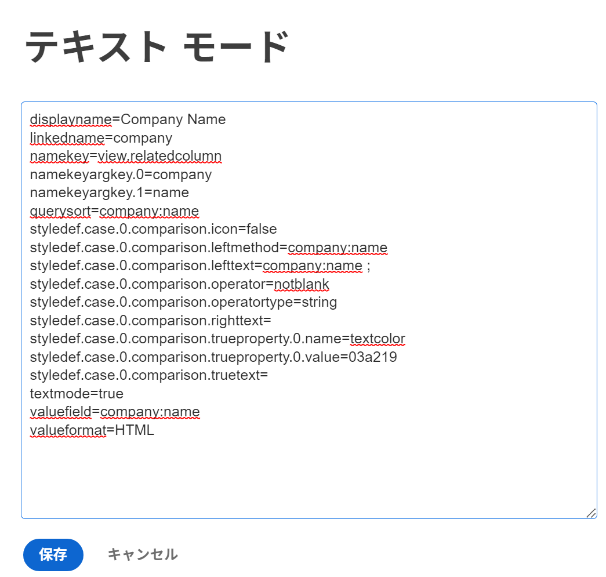
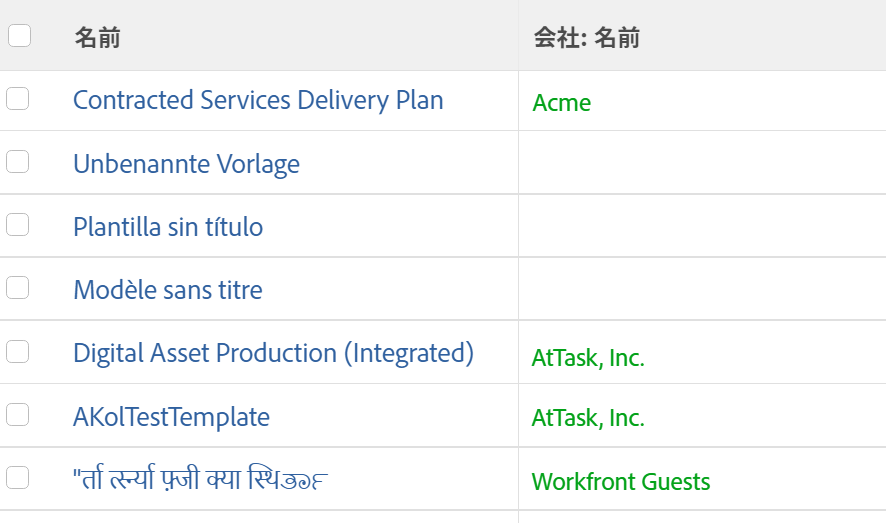
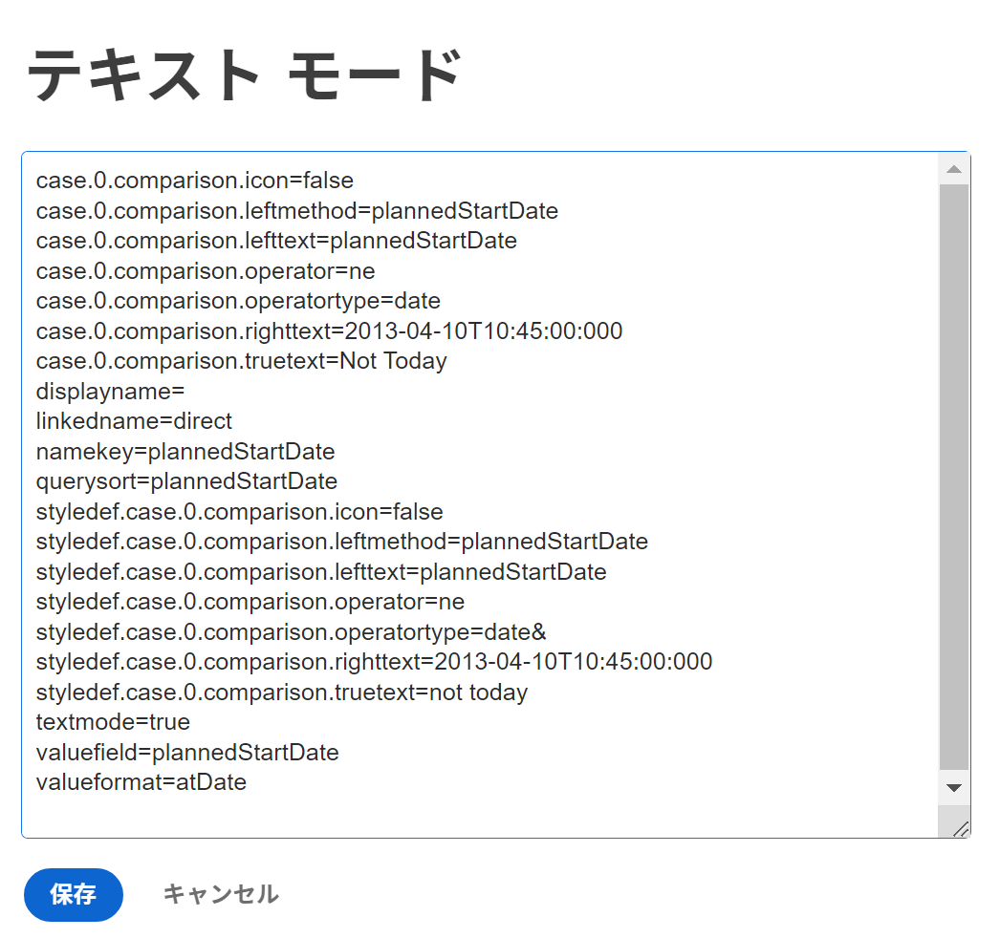
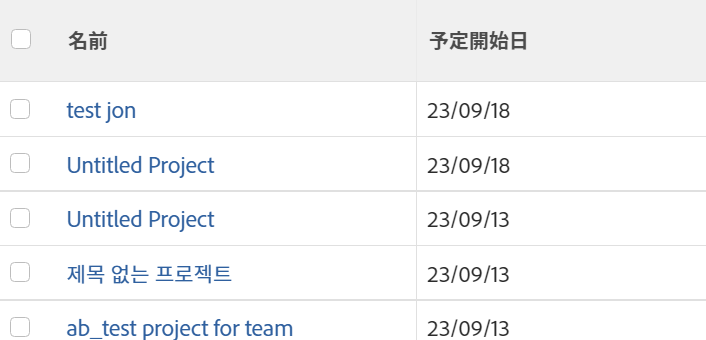
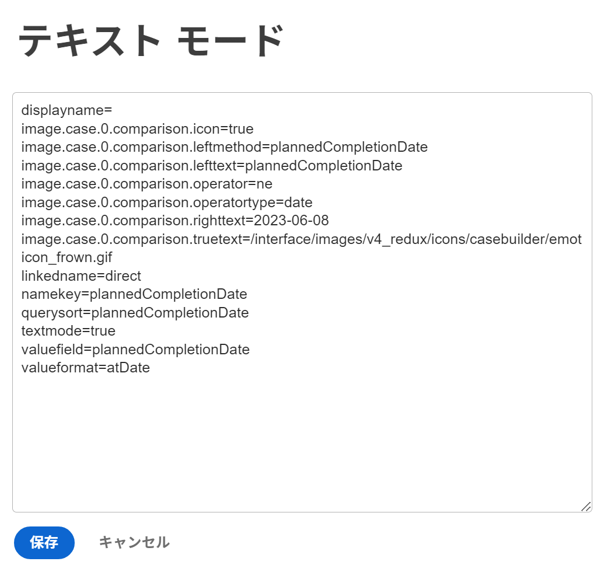
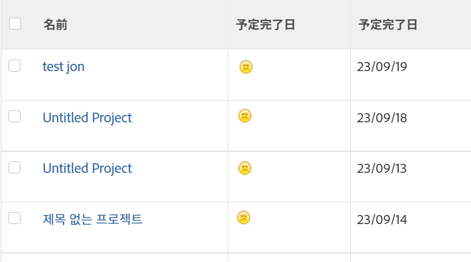

# テキストモードでの条件付き書式の使用

<!--Audited: 01/2024-->

<!--
(NOTE: Alina: this article might need to be split in its sections. Tony asked that numbers and dates should be in separate articles (??))
-->

標準のインターフェイスビルダーは、組織のニーズに合わせてレポート要素を作成する際に、様々な柔軟性を提供します。

標準インターフェイスを使用して、ビューに条件付き書式を適用できます。\
ビューへの条件付き書式の適用について詳しくは、 [ビューでの条件付き書式の使用](../../../reports-and-dashboards/reports/reporting-elements/use-conditional-formatting-views.md).

## アクセス要件

この記事の手順を実行するには、次のアクセス権が必要です。

<table style="table-layout:auto"> 
 <col> 
 <col> 
 <tbody> 
  <tr> 
   <td role="rowheader">Adobe Workfront plan*</td> 
   <td> <p>任意</p> </td> 
  </tr> 
  <tr> 
   <td role="rowheader">Adobe Workfront license*</td> 
   <td> <p>新規：標準 </p> 
   <p>現在：プラン</p> 
   </td> 
  </tr> 
  <tr> 
   <td role="rowheader">アクセスレベル設定*</td> 
   <td> <p>フィルター、ビュー、グループへのアクセスを編集</p> <p>レポート、ダッシュボード、カレンダーへのアクセスを編集して、レポートのビューを編集します</p> </td> 
  </tr> 
  <tr> 
   <td role="rowheader">オブジェクトの権限</td> 
   <td> <p>レポートの表示を編集するためのレポートに対する権限を管理します</p> <p>ビューに対する権限を管理して編集</p> </td> 
  </tr> 
 </tbody> 
</table>

&#42;保有するプラン、ライセンスの種類、アクセス権を確認するには、Workfront管理者に問い合わせてください。

*アクセス要件について詳しくは、 [Workfrontドキュメントのアクセス要件](/help/quicksilver/administration-and-setup/add-users/access-levels-and-object-permissions/access-level-requirements-in-documentation.md).

## テキストモードでの条件付き書式

テキストモードでは、標準インタフェースでは使用できないフィールドを使用できるようにすることで、より複雑なビュー、フィルタ、グループ化、プロンプトを作成できます。

すべてのレポート可能なフィールドの完全なリストについては、  [API エクスプローラ](../../../wf-api/general/api-explorer.md).

テキストモードの構文の使用について詳しくは、 [テキストモードの構文の概要](../../../reports-and-dashboards/reports/text-mode/text-mode-syntax-overview.md).

また、テキストモードを使用して、レポートやリストのビューの形式を設定することもできます。 条件付き書式を使用して、レポートの結果のフォントタイプと背景、アイコンおよびフラグを変更することで、レポートのビューを変更できます。 最初に標準インターフェイスを使用してビューを構築し、必要な場合にのみテキストモードインターフェイスに切り替えることをお勧めします。

>[!NOTE]
>
> CSS スタイルを使用した条件付き書式のカスタマイズはサポートされていません。 代わりに、Adobe Workfrontで使用できる事前設計済みの書式設定オプションを使用する必要があります。

## ビューへの条件付き書式の追加

標準ビルダーインターフェイスのビューに条件付き書式を適用する方法について詳しくは、 [ビューでの条件付き書式の使用](../../../reports-and-dashboards/reports/reporting-elements/use-conditional-formatting-views.md).

テキストモードインターフェイスでビューに条件付き書式を追加するには、次の手順を実行します。

1. オブジェクトのリストに移動します。
1. 条件付き書式を追加するビューのドロップダウンメニューを展開します。
1. クリック **表示をカスタマイズ**.
1. 条件付き書式を適用するビューの列をクリックします。
1. クリック **テキストモードに切り替え**.
1. Adobe Analytics の **この列に表示：** 領域、クリック **クリックしてテキストを編集**.
1. で提供されるコードサンプルを追加します。 [テキストモードを使用してビューを書式設定](#format-views-using-text-mode) をクリックします。
1. クリック **保存**&#x200B;を選択し、次に **ビューを保存**.

## テキストモードを使用してビューを書式設定 {#format-views-using-text-mode}

ビューの列に次のコンポーネントを追加して、テキストモードで条件付き書式を設定できます。

* [列設定](#column-settings)
* [列ルール](#column-rules)
* [値式を条件付きで書式設定する](#conditionally-format-a-valueexpression)

### 列設定 {#column-settings}

ビューに条件付き書式を追加する前に、テキストモードインターフェイスに関する知識が必要です。

ビューで条件付き書式を使用する場合、列の次の要素をカスタマイズできます。

* [列ヘッダー](#column-headers)
* [日付の書式設定](#format-dates)
* [数値の書式設定](#format-numbers)

#### 列ヘッダー {#column-headers}

表示される列ヘッダーを変更するには、列に次のコードを追加します。 `displayname= [Name of column]`. 例えば、列に「プロジェクト所有者」という名前を付ける場合、テキストコードは次のようになります。

`displayname=Project Owner`

#### 日付の書式設定 {#format-dates}

日付は様々な形式で表示するように設定できます。

詳しくは、 [テキストモードのレポートで日付を書式設定する](../../../reports-and-dashboards/reports/text-mode/format-dates-in-text-mode-reports.md).

<!--
<div data-mc-conditions="QuicksilverOrClassic.Draft mode"> 
<p data-mc-conditions="QuicksilverOrClassic.Draft mode">(NOTE: this is drafted and replaced by the article linked above)</p>
<p>To establish a date format, you must modify the <code>valueformat</code> line of the text mode code in the column.</p>
<pre>valueformat= [new date format]</pre>
<p>For example, if you wanted the Projected Completion Date to be displayed as MM/DD/YY the code would look like:</p>
<pre>valueformat=atDate<br>valuefield=projectedCompletionDate </pre>
<p>If you wanted to show the Planned Completion Date as <em>Mth, DD, Year</em>, the code would look like:</p>
<pre>valueformat=mediumAtdate<br>valuefield=plannedCompletionDate</pre>
<p>You can format dates using the following <code>valueformat</code> text mode values:</p>
<table style="table-layout:auto">
<col>
<col>
<col>
<thead>
<tr>
<th scope="col"><strong>Format</strong> </th>
<th scope="col">Example </th>
<th scope="col"><em><strong>valueformat=</strong></em> </th>
</tr>
</thead>
<tbody>
<tr>
<td>MM/DD/YY</td>
<td>10/11/18</td>
<td><pre>atDate</pre> </td>
</tr>
<tr>
<td>MM/DD/YY Time</td>
<td>10/11/18 12:00pm</td>
<td><pre>longAtDate</pre> </td>
</tr>
<tr>
<td>MM/DD/YY</td>
<td>10/11/18</td>
<td><pre>shortAtDate</pre> </td>
</tr>
<tr>
<td>Mth, DD, YR</td>
<td>Oct, 11, 2018</td>
<td><pre>mediumAtDate</pre> </td>
</tr>
<tr>
<td>DW, Mth, Day, YR</td>
<td>Mon, Oct, 11, 2018</td>
<td><pre>partialAtDate</pre> </td>
</tr>
<tr>
<td>DW, Mth, Day, YR Time</td>
<td>Mon, Oct, 11, 2018 12:00 pm</td>
<td><pre>fullAtDate</pre> </td>
</tr>
</tbody>
</table>
</div>
-->

#### 数値の書式設定 {#format-numbers}

数値を書式設定して、レポートのニーズに最も適した情報を表示できます。

詳しくは、 [テキストモードのレポートで数値、通貨、割合の値を書式設定します](../../../reports-and-dashboards/reports/text-mode/format-numbers-in-text-mode-reports.md).

<!--
<div data-mc-conditions="QuicksilverOrClassic.Draft mode">
<p>To modify the format of a numeric value, you must edit the <strong>valueformat</strong> line of your column.</p> 
<p data-mc-conditions="QuicksilverOrClassic.Draft mode">(NOTE: this is drafted and replaced by the article linked above) </p>
<p>For example, if you wanted to display the Budget column as $1000, the value format line would look like:</p>
<pre>valueformat=currencyStringCurrencyRounded<br>valuefield=budget</pre>
<p>You can format numbers using the following values for the <code>valueformat</code> line of your column:</p>
<table border="2" cellspacing="15" cellpadding="1">
<col>
<col>
<thead>
<tr>
<th scope="col"><strong>Example</strong> </th>
<th scope="col"><em><code>valueformat=</code></em> </th>
</tr>
</thead>
<tbody>
<tr>
<td>1234</td>
<td><pre>doubleAsString</pre> or <pre>int</pre></td>
</tr>
<tr>
<td>1,234</td>
<td><pre>doubleAsInt</pre> </td>
</tr>
<tr>
<td>$1,234</td>
<td><pre>currencyStringCurrencyRounded</pre> </td>
</tr>
<tr>
<td>1234.56</td>
<td><pre>doubleAsDouble</pre> </td>
</tr>
<tr>
<td>$1,234.56</td>
<td><pre>currencyStringCurrency</pre> </td>
</tr>
<tr>
<td>12%</td>
<td><pre>doubleAsPercentRounded</pre> </td>
</tr>
<tr>
<td>12.34%</td>
<td><pre>doubleAsPercent</pre> </td>
</tr>
<tr>
<td>(1,234.56)</td>
<td><pre>doubleAsFinancial</pre> </td>
</tr>
<tr>
<td>(1,234)</td>
<td><pre>doubleAsFiancialRounded</pre> </td>
</tr>
</tbody>
</table>
</div>
-->

### 列ルール {#column-rules}

列ルールを使用すると、ビュー内に画像、色、書式、テキストの上書きを追加できます。 列ルールは、個別に設定することも、1 つの列に複数の条件を含めることもできます。

* [条件付き書式](#conditional-formatting)
* [複数の条件付き書式](#multiple-conditional-formats)
* [テキストを適用](#apply-text)
* [行書式の適用](#apply-row-formats)
* [画像を適用](#apply-images)

#### 条件付き形式 {#conditional-formatting}

色や書式設定のテキストを組み込む場合は、特定のテキストモードステートメントを適用する必要があります。

>[!NOTE]
>
>条件付き書式は、結合された列ではサポートされない場合があります。\
>列とテキストモードの結合の詳細については、 [表示：1 つの共有列の複数の列から情報を結合](../../../reports-and-dashboards/reports/custom-view-filter-grouping-samples/view-merge-columns.md).

条件付き書式を追加する列に次のコードを挿入します。

```
styledef.case.0.comparison.leftmethod= [field name]
styledef.case.0.comparison.lefttext= [field name]
styledef.case.0.comparison.righttext= [field value]
styledef.case.0.comparison.operator= [qualifier]
styledef.case.0.comparison.operatortype= [data type]
styledef.case.0.comparison.icon=false
styledef.case.0.comparison.truetext= 
styledef.case.0.comparison.trueproperty.0.name= [format option]
styledef.case.0.comparison.trueproperty.0.value= [format style]
```

>[!NOTE]
>
>The `styledef.case.0.comparison.icon` 行は、アイコンを操作しない限り常に false です。
>
>The `styledef.case.0.comparison.truetext` 行は、上書きするテキストを処理するまで常に空白のままです。
>
>The `styledef.case.0.comparison.righttext` 行は、修飾子が空白でない場合は空白です。

例えば、プロジェクトレポートに会社名を緑色のテキストで表示する場合、次のコードを使用できます。

```
styledef.case.0.comparison.leftmethod=company:name
styledef.case.0.comparison.lefttext=company:name ;
styledef.case.0.comparison.righttext= 
styledef.case.0.comparison.operator=notblank
styledef.case.0.comparison.operatortype=string
styledef.case.0.comparison.icon=false
styledef.case.0.comparison.truetext=
styledef.case.0.comparison.trueproperty.0.name=textcolor
styledef.case.0.comparison.trueproperty.0.value=03a219
```

>[!NOTE]
>
>* この文は会社名の列に適用できますが、レポート上の他の列にも適用できます。 緑のテキストは、プロジェクトに会社が関連付けられている場合にのみ表示されます。 次を記憶する： `[field name]`, `[value]`、および `[qualifier]` 条件付けが最終的に列に表示されるかどうかをドライブします。
>* 修飾子を使用する場合、 `cicontains` ではなく `equal`. デフォルトでは、 `equal` は ID 番号を探します。 の使用 `cicontains` クオリファイア、名前でアイテムにアクセスできます。





テキストモードに [ テキストの色 ]、[ 整列 ]、[ フォントのスタイル ]、または [ 背景色 ] を適用する場合は、同じ文（上記）を使用します。

次の行は、列に必要な対応する書式設定を反映するように変更する必要があります。

```
styledef.case.0.comparison.trueproperty.0.name= [format option]
styledef.case.0.comparison.trueproperty.0.value= [format style]
```

次の表を使用して、修正する必要のある行と、列の形式スタイルを定義するために指定する必要のある値を特定します。

| **テキストの色** | **行： textcolor=** |
|---|---|
| 黒 | `000000` |
| 濃い青 | `0c6aca` |
| ティール | `1b878c` |
| 緑 | `03a219` |
| 紫 | `6408c4` |
| グレー | `767676` |
| 赤 | `d30519` |
| 黄 | `e19503` |

{style="table-layout:auto"}

| **整列** | **行： align=** |
|---|---|
| 左揃え | `left` |
| 右揃え | `right` |
| 中央揃え | `center` |

{style="table-layout:auto"}

| フォント | 行： ***fontstyle=*** |
|---|---|
| 太字 | `bold` |
| 斜体 | `italic` |

{style="table-layout:auto"}

| **背景色** | **行： bgcolor=** |
|---|---|
| ティール | `dcf6f7` |
| 緑 | `def6e2` |
| グレー | `e8e8e8` |
| 青 | `e8f1ff` |
| 紫 | `e9def4` |
| 赤 | `eac6c9` |
| 黄 | `feecc8` |
| 白 | `ffffff` |

{style="table-layout:auto"}

#### 複数の条件付き書式 {#multiple-conditional-formats}

1 つのステートメントに複数の書式設定スタイルを適用できます。 コア文は変更されず、その他の書式式も文に追加されます。

例えば、前の文を使用して、会社名を緑の太字のテキストで含めます。 この文は、次のコードを使用して記述されます。

```
styledef.case.0.comparison.leftmethod=company:name
styledef.case.0.comparison.lefttext=company:name
styledef.case.0.comparison.righttext=
styledef.case.0.comparison.operator=notblank
styledef.case.0.comparison.operatortype=string
styledef.case.0.comparison.icon=false
styledef.case.0.comparison.truetext= 
styledef.case.0.comparison.trueproperty.0.name=textcolor
styledef.case.0.comparison.trueproperty.0.value=03a219
styledef.case.0.comparison.trueproperty.1.name=fontstyle
styledef.case.0.comparison.trueproperty.1.value=bold
```

>[!NOTE]
>
>複数の条件付き書式式を含める場合は、ステートメント内の各式を数値で識別する必要があります。 式 0 と式 1 が識別されていることに注意してください。

#### テキストを適用 {#apply-text}

列に入力されるデフォルト値を任意の値に置き換える場合は、列にテキストを適用する際に置き換えることができます。

たとえば、プロジェクトレポートで、[ 計画開始日 ] 列の値を設定して、プロジェクトの計画開始日を表示せず、「今日ではありません」というテキストを表示します。 「計画開始日」列には、次のコードを使用します。

```
case.0.comparison.leftmethod=plannedStartDate
case.0.comparison.lefttext=plannedStartDate
case.0.comparison.righttext=2013-04-10T10:45:00:000
case.0.comparison.operator=ne
case.0.comparison.operatortype=date
case.0.comparison.icon=false
case.0.comparison.truetext=not today
styledef.case.0.comparison.leftmethod=plannedStartDate
styledef.case.0.comparison.lefttext=plannedStartDate
styledef.case.0.comparison.righttext=2013-04-10T10:45:00:000 
styledef.case.0.comparison.operator=ne
styledef.case.0.comparison.operatortype=date&
styledef.case.0.comparison.icon=false
styledef.case.0.comparison.truetext=not today
```

>[!NOTE]
>
>次で始まる行： `case.0.` テキストの使用方法を識別する場合は、使用例を比較します。 次で始まる行： `styledef.case.0.` は、 `truetext` 式。 必ず `truetext` を値に設定します。値は空白のままにするのではありません。





#### 行書式の適用 {#apply-row-formats}

行全体に条件を適用する場合は、次のコードを列コードと共に使用します。


```
styledef.case.0.comparison.icon=false
styledef.case.0.comparison.isrowcase=true
styledef.case.0.comparison.leftmethod= [field name]
styledef.case.0.comparison.lefttext= [field name]
styledef.case.0.comparison.operator= [qualifier]
styledef.case.0.comparison.operatortype= [data type]
styledef.case.0.comparison.righttext= [field value]
styledef.case.0.comparison.trueproperty.0.name= [format option]
styledef.case.0.comparison.trueproperty.0.value= [format style]
styledef.case.0.comparison.truetext=
row.0.styledef.applyallcases=true
row.0.styledef.case.0.comparison.icon=false
row.0.styledef.case.0.comparison.isrowcase=true
row.0.styledef.case.0.comparison.leftmethod= [field name]
row.0.styledef.case.0.comparison.lefttext= [field name]
row.0.styledef.case.0.comparison.operator= [qualifier]
row.0.styledef.case.0.comparison.operatortype= [data type]
row.0.styledef.case.0.comparison.righttext= [field value]
row.0.styledef.case.0.comparison.trueproperty.0.name= [format option]
row.0.styledef.case.0.comparison.trueproperty.0.value= [format style]
row.0.styledef.case.0.comparison.truetext=
```


#### 画像を適用 {#apply-images}

テキストの書式設定と同様に、画像を使用して、レポートに情報を表示できます。 Workfrontには、レポート設定で視覚的な情報を伝えるための組み込み画像が多数用意されています。 条件付き書式設定で画像を使用するには、次の文が必要です。

```
image.case.0.comparison.leftmethod= [field name]
image.case.0.comparison.lefttext= [field name]
image.case.0.comparison.righttext= [field value]
image.case.0.comparison.operator= [qualifier]
image.case.0.comparison.operatortype= [data type]
image.case.0.comparison.icon=true
image.case.0.comparison.truetext=
```

たとえば、プロジェクトレポートでは、今日の日付と等しくない計画完了日ごとに顔を表示する列を作成します。 次のテキストモードコードを使用して、列にアイコンを追加します。


```
image.case.0.comparison.leftmethod=plannedCompletionDate
image.case.0.comparison.lefttext=plannedCompletionDate
image.case.0.comparison.righttext=2013-04-10T13:00:00:000 
image.case.0.comparison.operator=ne 
image.case.0.comparison.operatortype=date
image.case.0.comparison.icon=true
image.case.0.comparison.truetext=/interface/images/v4_redux/icons/casebuilder/emoticon_frown.gif
```

>[!NOTE]
>
>文は、 `icon=true` 式。 また、この文は、他の条件付き書式設定文とは異なり、 `style.def` 形式とは異なり、一意の画像形式を使用する必要があります。





使用可能な画像を使用するには、次のコードと値を適用します。

| **アイコン** | **行： image.case.0.comparison.truetext=** |
|---|---|
| しかめ面  | =`/interface/images/v4_redux/icons/casebuilder/emoticon_frown.gif` |
| 幸せそうな顔  | =`/interface/images/v4_redux/icons/casebuilder/emoticon_smile.gif` |
| 青いフラグ   | =`/interface/images/v4_redux/icons/casebuilder/flag_blue.gif` |
| 緑の旗   | =`/interface/images/v4_redux/icons/casebuilder/flag_green.gif` |
| 赤いフラグ   | =`/interface/images/v4_redux/icons/casebuilder/flag_red.gif` |
| 黄旗   | =`/interface/images/v4_redux/icons/casebuilder/flag_yellow.gif` |
| 黒丸   | =`/interface/images/v4_redux/icons/casebuilder/light_black.gif` |
| 青い円  | =`/interface/images/v4_redux/icons/casebuilder/light_blue.gif` |
| 灰色の円  | =`/interface/images/v4_redux/icons/casebuilder/light_grey.gif` |
| 緑の円  | =`/interface/images/v4_redux/icons/casebuilder/light_green.gif` |
| オレンジの円  | =`/interface/images/v4_redux/icons/casebuilder/light_orange.gif` |
| ピンクの円  | =`/interface/images/v4_redux/icons/casebuilder/light_pink.gif` |
| 紫の円  | =`/interface/images/v4_redux/icons/casebuilder/light_purple.gif` |
| 赤い円  | =`/interface/images/v4_redux/icons/casebuilder/light_red.gif` |
| 白い円  | =`/interface/images/v4_redux/icons/casebuilder/light_white.gif` |
| 黄色い円  | =`/interface/images/v4_redux/icons/casebuilder/light_yellow.gif` |

{style="table-layout:auto"}

### 条件付きでの書式の設定 `valueexpression` {#conditionally-format-a-valueexpression}

列に計算値を表示するには、 `valuefield` 列内のコード行を `valueexpression`. 計算値を使用すると、同じオブジェクト上の 2 つの既存のフィールド間の計算に基づいて、オブジェクトの新しい値を表示できます。

をフォーマットする方法の詳細 `valueexpression line`を参照してください。 [テキストモードの構文の概要](../../../reports-and-dashboards/reports/text-mode/text-mode-syntax-overview.md).

を含む列を条件付きで書式設定することはできません。 `valueexpression` コードの行。 代わりに、計算カスタムフィールドをカスタムフォームに追加し、そのフィールドをレポートに表示するオブジェクトに関連付けることができます。 次に、このフィールドを表示する列を条件付きで書式設定できます。

計算カスタムフィールドの詳細については、 [計算データをカスタムフォームに追加する](../../../administration-and-setup/customize-workfront/create-manage-custom-forms/add-calculated-data-to-custom-form.md).

## 「テキストモード」列に集計値を追加する

最初にビルダーインターフェイスで列を作成し、そこに集計値を追加してから、テキストモードで列を編集することをお勧めします。

テキストモードで列に集約を追加する際は、次の点に注意してください。

* 列の値は、要約できる形式にする必要があります。 例えば、次のいずれかの形式にする必要があります。

   * 数値
   * 日付
   * 通貨

* 集計を計算を表示する列に追加できます。 集計値は、ビューまたはレポートのグループ化に表示されます。 詳しくは、 [グループ化：グループ化での複数の計算値の集計結果の表示](../../../reports-and-dashboards/reports/custom-view-filter-grouping-samples/grouping-calculation-between-two-fields-aggregated-in-grouping.md).
* 列の定義に使用するコード行は、集約を導入し、その前に「集約」が付くコード行と同じである必要があります。 たとえば、プロジェクトに予定時間を表示する列がある場合、列の主な行のテキストモードは次のようになります。

```
  valuefield=workRequired
  valueformat=compound
```

ビューのグループ化ですべての行の値を集計する場合、次のコードを追加して集計値を追加できます。

`aggregator.valuefield=workRequired` ( `aggregator.valuefield` 行は、 `valuefield` （列を説明する）

`aggregator.valueformat=compound` ( `aggregator.valueformat` 行は、 `valueformat` （列を説明する）

`aggregator.function=SUM` （これは、列を集計する方法を示す必須行です。この場合、個々の計画時間をグループ化行の 1 つの数値に追加します）

`aggregator.displayformat=minutesAsHoursString` ( 時間はWorkfrontに分単位で格納されるので、 `displayformat` 分単位で格納される時間 )
