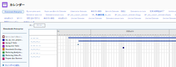

# インライン編集日により、カレンダーの表示がボックス外に移動

## 問題

オブジェクトのリスト内のインライン編集日の場合、カレンダーに表示される日付の数が正しくありません。 これにより、日がカレンダーボックスの外に表示されます。\

## 原因

100%を超えるズームレベルで表示されるようにブラウザウィンドウのビューを変更しました。

## 解決策

ブラウザーのズームレベルを 100%以下に変更する必要があります。

ブラウザーでのズームレベルの変更は、使用しているブラウザーによって異なります。

Google Chrome でズームレベルを変更するには：

1. ブラウザーウィンドウ内で、に移動します。 **表示**.
1. クリック **ズームイン** をクリックして、現在のブラウザウィンドウのズームレベルを下げます。\
   ブラウザーの表示領域が狭くなります。
