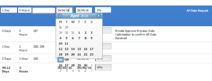

# 日付をインライン編集すると、カレンダーの表示がボックス外に移動する

## 問題

オブジェクトのリストの日付をインライン編集すると、カレンダーに必要以上の日付が表示されます。 これにより、日がカレンダーボックスの外に表示されます。\

## 原因

ブラウザーウィンドウの表示が、100％を超えるズームレベルで表示されるように変更されました。

## ソリューション

ブラウザーのズームレベルを 100％以下に変更する必要があります。

ブラウザーのズームレベルの変更は、使用しているブラウザーによって異なります。

Google Chrome でズームレベルを変更するには、以下の手順を実行します。

1. ブラウザーウィンドウ内で、「**表示**」に移動します。
1. 「**ズームイン**」をクリックして、現在のブラウザーウィンドウのズームレベルを下げます。\
   ブラウザーの表示エリアが狭くなります。
