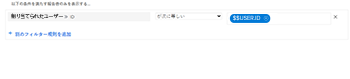
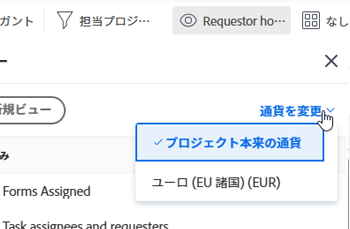

# レポートに関する FAQ

<!--

(NOTE: Alina: ***This is the ONE anchor article for all FAQs about Reporting. Add a new FAQ in the TOC at the top first, then add the answer as a section at the bottom.)

-->

レポートに関するよくある質問を次に示します。

## アクセス要件

この記事の手順を実行するには、次のアクセス権が必要です。

<table style="table-layout:auto"> 
 <col> 
 </col> 
 <col> 
 </col> 
 <tbody> 
  <tr> 
   <td role="rowheader">Adobe Workfront plan*</td> 
   <td> 
任意
 </td> 
  </tr> 
  <tr> 
   <td role="rowheader">Adobe Workfront license*</td> 
   <td> 
プラン、作業
 </td> 
  </tr> 
  <tr> 
   <td role="rowheader">アクセスレベル設定*</td> 
   <td> 
レポート、ダッシュボード、カレンダーへのアクセスを編集
 
注意：まだアクセス権がない場合は、Workfront管理者に、アクセスレベルに追加の制限が設定されているかどうかを問い合わせてください。 Workfront管理者がアクセスレベルを変更する方法について詳しくは、 <a href="../../../administration-and-setup/add-users/configure-and-grant-access/create-modify-access-levels.md" class="MCXref xref">カスタムアクセスレベルの作成または変更</a>.
 </td> 
  </tr> 
  <tr> 
   <td role="rowheader">オブジェクトの権限</td> 
   <td> 
レポートに対する権限の管理
 
追加のアクセス権のリクエストについて詳しくは、 <a href="../../../workfront-basics/grant-and-request-access-to-objects/request-access.md" class="MCXref xref">オブジェクトへのアクセスのリクエスト </a>.
 </td> 
  </tr> 
 </tbody> 
</table>

&#42;保有するプラン、ライセンスの種類、アクセス権を確認するには、Workfront管理者に問い合わせてください。

## 時間差のカスタム計算で列に正しい結果が表示されないのはなぜですか？

プロジェクト・レポートには、計画時間 (4) から実績時間 (2) を引く計算があります。 私が得た結果は 2 にするべき 120 です。\
私の計算は：
<pre>valueexpression=SUB(workRequired,actualWorkRequired)</pre>

### 回答

Workfrontで時間を使用するフィールドは、分単位で保存されます。 計算でこのフィールドを使用する場合、結果は分単位で表されます。 結果を時間単位で取得するには、計算結果を 60 で除算する必要があります。

正しい計算は次のとおりです。

<pre>valueexpression=SUB(workRequired,actualWorkRequired)/60</pre>

## レポート内の各グラフ要素の値がグラフに表示されないのはなぜですか？

### 回答

レポートグラフに 50 を超えるグラフ要素がある場合、各要素の値はグラフに表示されません。

グラフに要素が 50 個未満の場合、各要素の値がグラフに表示されます。 グラフの各要素に表示する項目数を制限するには、フィルターを追加するか、レポートのグループ化を変更することを検討してください。

## レポートの返される結果が多すぎてグラフを表示できないのはなぜですか？

グラフを含むレポートを実行すると、「Who there...」というエラーメッセージが表示されます。このレポートは、グラフを読み取れなくする多くのデータを返しました。 フィルターを追加したり、グラフのグループ化を変更したりして、結果を絞り込むことを検討してください。

### 回答

このエラーは、グラフに最大 618 個の個別の結果が含まれることを意味します。例えば、棒グラフに 618 個を超える棒が含まれる場合などです。 表示の問題を解決するには、現在のフィルターとグループ化の選択を変更して、結果を絞り込む必要があります。

フィルターとグループの変更について詳しくは、記事を参照してください [フィルターの概要](../../../reports-and-dashboards/reports/reporting-elements/filters-overview.md) および [Adobe Workfrontでのグループ化の概要](../../../reports-and-dashboards/reports/reporting-elements/groupings-overview.md).

## 同僚と同じレポート（またはカレンダー）にアクセスし、代わりにタスクが表示される場合、自分のタスク（または問題）が表示されるのはなぜですか？

### 回答

レポートまたはカレンダーには、ログインしたユーザーを指すワイルドカードフィルター変数が含まれている場合があります。 この場合、レポートには、ログインしたユーザーに基づく情報が表示されます。 フィルターを調整して、ログインしたユーザーを指すワイルドカードを削除します。\

ユーザーベースのワイルドカードフィルター変数の完全なリストについては、 [ワイルドカードフィルター変数の概要](../../../reports-and-dashboards/reports/reporting-elements/understand-wildcard-filter-variables.md).

## レポート内のデータが不完全だと思われるのはなぜですか。

### 回答

この問題は、ほとんどの場合、アクセスが制限されているため、システム内の項目が表示されない可能性があります。 また、表示する項目は共有されていません。

レポートの作成者は、レポートを編集して、システム管理者のアクセス権を持つユーザー、またはデータを表示するアクセス権を持つプランユーザーで実行できます。

詳しくは、 [別のユーザーのアクセス権を持つレポートの実行と配信](../../../reports-and-dashboards/reports/creating-and-managing-reports/run-deliver-report-access-rights-another-user.md).

## 自分が割り当てられたタスク（またはタスク）を、そのタスクの所有者かどうかに関係なくレポートする方法を教えてください。

### 回答

自分に割り当てられているすべてのタスクまたはタスクを、所有者 ( またはプライマリ担当者 ) であるかどうかに関わらず表示するには、タスクまたはタスクのレポートで次のフィルタを使用します。

1. タスクまたは問題報告にアクセスする。
1. 次の日： **フィルター** タブ、クリック **フィルタールールを追加する**.

1. Adobe Analytics の **フィールド名の入力を開始…** フィールド、入力を開始する **割り当てユーザー名**&#x200B;をクリックし、リストに表示されたら選択します。

   >[!NOTE]
   >
   >次を使用しない **割り当て先名** 「 」フィールドには、自分が「担当者」または「所有者」であるタスクとタスクに対してのみフィルターされるので、プライマリには適用されません。

1. を選択します。 **次と等しい** 修飾子
1. 入力を開始 *$$USER.ID* を選択し、表示されるドロップダウンリストから選択します。\
   これにより、ログインしたユーザーに割り当てられているすべてのタスクと問題を確認できます。 ワイルドカードを特定のユーザー名に置き換えることができます。\
   

1. 「**保存して閉じる**」をクリックします。

## プロジェクトの [ タスク ] と [ タスクの追加 ] の一覧の下部に [ タスクの追加 ]/[ タスクの追加 ] のリンクが表示されないのはなぜですか？

### 回答

まず、プロジェクトに問題とタスクを追加するための正しいアクセス権と権限があることを確認します。 この場合、 **問題の追加** および **タスクを追加** リンク **問題** および **タスク** リスト。

ただし、これらのリンクが表示されない可能性がある点がいくつかあります。

* これらのリストにクイックフィルターを適用している場合、リンクは表示されません。 クイックフィルターを削除すると、プロジェクトにイシューとタスクを追加できるようにリンクが表示されます。\
  クイックフィルターについて詳しくは、 [Adobe Workfrontでのリストの概要](../../../workfront-basics/navigate-workfront/use-lists/view-items-in-a-list.md).

* 次の場合、 **グループ化** これらのリストに適用されると、リンクは表示されません。 を削除します。 **グループ化** プロジェクトにイシューとタスクを追加できるように、リンクが表示されます。\
  グループ化の作成について詳しくは、 [Adobe Workfrontでのグループ化の概要](../../../reports-and-dashboards/reports/reporting-elements/groupings-overview.md).

* 次の場合、 **表示** プロジェクトの既定の通貨以外に選択された通貨を持つリストに適用すると、リンクは表示されません。 次を変更： **表示** から **プロジェクトの元の通貨** プロジェクトにイシューとタスクを追加できるように、リンクが表示されます。\
  ビューでの通貨の変更について詳しくは、 [一意の為替レートを使用した財務データレポートの作成](../../../reports-and-dashboards/reports/creating-and-managing-reports/create-financial-data-reports-unique-exchange-rates.md).

## レポートやダッシュボードの情報は自動的に更新されますか。

### 回答

レポートやダッシュボードの情報は、自動的に更新されません。

情報は、キャッシュされたレポートで手動で更新できます。\
キャッシュされたレポートの更新について詳しくは、 [レポートの実行](../../../reports-and-dashboards/reports/creating-and-managing-reports/run-report.md).

情報は、キャッシュされたダッシュボードで手動で更新できます。\
キャッシュされたダッシュボードの更新について詳しくは、 [ダッシュボードを表示](../../../reports-and-dashboards/dashboards/understanding-dashboards/get-started-dashboards.md#running-dashboards) 記事内 [ダッシュボードの概要](../../../reports-and-dashboards/dashboards/understanding-dashboards/get-started-dashboards.md).

## レポートの所有者を変更できますか？

### 回答

レポートの所有者は変更できません。 ただし、レポートを作成したユーザーは、他のユーザーがレポートを編集することを許可できます。 ユーザーがレポートを編集できるようにする方法は、ユーザーのタイプによって異なります。

* システム管理者は、プランライセンスを持つユーザーに対し、レポートの編集を許可できます。そのためには、「レポート」行の「編集」オプションを設定し、レポートの作成に対するアクセス権を含めます。\
  詳しくは、 [レポート、ダッシュボード、カレンダーへのアクセス権の付与](../../../administration-and-setup/add-users/configure-and-grant-access/grant-access-reports-dashboards-calendars.md).

* レポートの作成と共有のアクセス権を持つエンドユーザーは、他のユーザーが個々のレポートを共有し、他のユーザーに対する管理権限を付与することで、個々のレポートを編集できます。\
  詳しくは、 [Adobe Workfrontでのレポートの共有](../../../reports-and-dashboards/reports/creating-and-managing-reports/share-report.md).

レポートの表示または管理の権限を持っている場合は、レポートのコピーを作成することもできます。コピーは、デフォルトでの所有者になります。 レポートのコピーについて詳しくは、 [レポートのコピーの作成](../../../reports-and-dashboards/reports/creating-and-managing-reports/create-copy-report.md).

## 非アクティブなユーザーが所有するレポートにアクセスできないのはなぜですか？

### 回答

レポートの所有者が、 **このレポートを実行する際のアクセス権は次のとおりです。** フィールドに値を入力します。 次の場合、 **このレポートを実行する際のアクセス権は次のとおりです。** ユーザーが非アクティブになっている場合、レポートを共有しているユーザーのレポートは表示されなくなります。 この場合、 **このレポートを実行する権限は次のとおりです。** 空白にするか、「 」フィールドにアクティブなユーザーを入力します。

詳しくは、 **このレポートを実行する権限は次のとおりです。** フィールド：詳しくは、 [別のユーザーのアクセス権を持つレポートの実行と配信](../../../reports-and-dashboards/reports/creating-and-managing-reports/run-deliver-report-access-rights-another-user.md). 非アクティブなユーザーが所有するすべてのレポートの識別について詳しくは、 [レポートアクティビティに関するレポートの作成](../../../reports-and-dashboards/reports/report-usage/create-report-reporting-activities.md).

## 削除されたユーザーが所有するレポートを含むダッシュボードにアクセスするには、どうすればよいですか？

### 回答

ユーザーを削除しても、そのユーザーが作成した任意のレポートにアクセスできますが、そのレポートに含まれているダッシュボードも削除されます。 つまり、次の項目にアクセスできなくなりました。

* レポートを含むダッシュボード
* レポートのダッシュボードを含むカスタムセクション

ユーザーの削除の影響について詳しくは、 [ユーザーの削除](../../../administration-and-setup/add-users/create-and-manage-users/delete-a-user.md).

レポートに対する表示アクセス権を持っている場合は、次の操作を実行できます。

1. レポートのコピーを作成します。\
   レポートのコピーを作成する方法については、 [レポートのコピーの作成](../../../reports-and-dashboards/reports/creating-and-managing-reports/create-copy-report.md).

1. コピーしたレポートを含めるようにダッシュボードを更新します。\
   ダッシュボードの編集方法については、「 [ダッシュボードの編集](../../../reports-and-dashboards/dashboards/creating-and-managing-dashboards/edit-dashboard.md).
