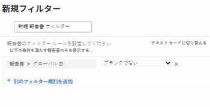

# Adobe Workfront の組み込みレポートを使用する

Adobe Workfront には、ユーザーが使用できる組み込みレポートの大量のリストが用意されています。

Workfront 管理者は、組み込みのレポートを非表示にして、ユーザーがアクセスできないようにすることができます。\
組み込みレポートを非表示にする方法について詳しくは、[組み込みレポートを非表示にする](../../../administration-and-setup/manage-workfront/configure-reports/hide-built-in-reports.md)を参照してください。

## アクセス要件

この記事の手順を実行するには、次のアクセス権が必要です。

<table style="table-layout:auto"> 
 <col> 
 <col> 
 <tbody> 
  <tr> 
   <td role="rowheader">Adobe Workfront プラン*</td> 
   <td> 
任意
 </td> 
  </tr> 
  <tr> 
   <td role="rowheader">Adobe Workfront ライセンス*</td> 
   <td> 
リクエスト以上
 </td> 
  </tr> 
  <tr> 
   <td role="rowheader">アクセスレベル設定*</td> 
   <td> 
フィルター、ビュー、グループへのアクセスを編集
 
レポート、ダッシュボード、カレンダーへのアクセス権を表示またはそれ以上の権限に設定する
 
メモ：まだアクセス権がない場合は、アクセスレベルに追加の制限が設定されていないかどうか Workfront 管理者にお問い合わせください。Workfront 管理者がアクセスレベルを変更する方法について詳しくは、<a href="../../../administration-and-setup/add-users/configure-and-grant-access/create-modify-access-levels.md" class="MCXref xref">カスタムアクセスレベルの作成または変更</a>を参照してください。
 </td> 
  </tr> 
  <tr> 
   <td role="rowheader">オブジェクト権限</td> 
   <td> 
レポートに対する権限を管理し、レポートに対するフィルターを追加または編集
 
フィルターに対する権限を管理し、リストで編集
 
追加のアクセス権のリクエストについて詳しくは、<a href="../../../workfront-basics/grant-and-request-access-to-objects/request-access.md" class="MCXref xref">オブジェクトへのアクセス権のリクエスト</a>を参照してください。
 </td> 
  </tr> 
 </tbody> 
</table>

&#42;保有するプラン、ライセンスタイプ、アクセス権を確認するには、Workfront 管理者に問い合わせてください。

## 組み込みレポートの概要 {#overview-of-built-in-reports}

組み込みのレポートをカスタマイズし、新しいレポートとして保存できます。組み込みレポートのカスタマイズについて詳しくは、[カスタムレポートの作成](../../../reports-and-dashboards/reports/creating-and-managing-reports/create-custom-report.md)を参照してください。

Workfront パッケージには、次のレポートが付属しています。これらのレポートは、最低でもアクセスレベルで組み込みレポートの表示権限を持つすべてのユーザーが利用可能です。

<table style="table-layout:auto"> 
 <col> 
 <col> 
 <thead> 
  <tr> 
   <th><strong>レポート名</strong> </th> 
   <th><strong>レポートの説明</strong> </th> 
  </tr> 
 </thead> 
 <tbody> 
  <tr> 
   <td>ポートフォリオ実コスト（プログラム別）</td> 
   <td>プロジェクトの予定コストと実際のコストを表示するプロジェクトレポート。レポートは、プログラム名（ポートフォリオ名でプロンプトが表示されます）でグループ化され、グラフが含まれます。</td> 
  </tr> 
  <tr> 
   <td>ポートフォリオ実コスト（プロジェクト別）</td> 
   <td>プロジェクトの予定コストと実際のコストを表示するプロジェクトレポート。レポートは、プロジェクト名（ポートフォリオ名でプロンプトが表示されます）でグループ化され、グラフを含みます。</td> 
  </tr> 
  <tr> 
   <td>ポートフォリオ実収益（プログラム別）</td> 
   <td>プロジェクトの予定コストと実績のコストをポートフォリオ別に表示するプロジェクトレポート。レポートは、プログラム名（ポートフォリオ名でプロンプトが表示されます）でグループ化され、グラフが含まれます。</td> 
  </tr> 
  <tr> 
   <td>ポートフォリオ実収益（プロジェクト別）</td> 
   <td>プロジェクトの予定コストと実績のコストをポートフォリオ別に表示するプロジェクトレポート。レポートは、プロジェクト名（ポートフォリオ名でプロンプトが表示されます）でグループ化され、グラフを含みます。</td> 
  </tr> 
  <tr> 
   <td>実収益 (会社)</td> 
   <td>プロジェクトの実収益と会社を表示するプロジェクトレポート。レポートは会社名でグループ化され、グラフが含まれます。</td> 
  </tr> 
  <tr> 
   <td>実収益（グループ別）</td> 
   <td>プロジェクトの実収益とグループを表示するプロジェクトレポート。レポートはグループ名でグループ化され、グラフが含まれます。</td> 
  </tr> 
  <tr> 
   <td>すべてのオープン タイムシート</td> 
   <td>オープンタイムシートを表示するタイムシートレポート。レポートには、タイムシートの日付範囲、所有者の名前、合計時間数、時間外、承認者の名前、ステータスの各フィールドが表示されます。</td> 
  </tr> 
  <tr> 
   <td>承認タイムシート (確認)</td> 
   <td>承認者付きの送信済みタイムシートまたは拒否されたタイムシートを表示するタイムシートレポート。レポートには、タイムシートの日付範囲、所有者、合計時間数、残業、承認者名およびステータスの各フィールドが表示されます。レポートは、タイムシート開始日、タイムシート終了日、タイムシート承認者名およびユーザー名によって要求されます。</td> 
  </tr> 
  <tr> 
   <td>危険プロジェクト</td> 
   <td>「状況」が「危険あり」または「トラブル発生中」の現行プロジェクトおよび計画プロジェクトを表示するプロジェクトレポート。レポートには、プロジェクトの説明、予定完了日、完了見込日、完了率、ステータスおよび優先度の各フィールドが表示されます。レポートはポートフォリオ名でグループ化されます。</td> 
  </tr> 
  <tr> 
   <td>請求収益（会社別）</td> 
   <td>プロジェクトの会社と請求収益を表示するプロジェクト報告書。レポートは会社名でグループ化され、グラフが含まれます。</td> 
  </tr> 
  <tr> 
   <td>請求収益（グループ別）</td> 
   <td>プロジェクトの請求収益とグループを表示するプロジェクトレポート。レポートはグループ名でグループ化され、グラフが含まれます。</td> 
  </tr> 
  <tr> 
   <td>請求収益（月別）</td> 
   <td>請求記録のプロジェクト名、プロジェクト請求収益および請求日を表示する請求記録レポート。このレポートは、請求レコードの請求日の月ごとにグループ化され、グラフが含まれます。</td> 
  </tr> 
  <tr> 
   <td>完了したイシュー（週別）</td> 
   <td>イシューの実際の完了日を表示するイシューレポート。レポートは、イシューの実際の完了日の週ごとにグループ化され、グラフが含まれます。</td> 
  </tr> 
  <tr> 
   <td>完了したイシュー（週別ユーザー別）</td> 
   <td>イシューの実際の完了日と割り当てを表示するイシューレポート。レポートは、プライマリ担当者別およびイシューの実際の完了日の週別にグループ化され、グラフが含まれます。</td> 
  </tr> 
  <tr> 
   <td>進行中のプロジェクト</td> 
   <td>現在のプロジェクトすべてを表示するプロジェクトレポート。レポートには、プロジェクトの説明、予定完了日、完了見込日、完了率、ステータスおよび優先度の各フィールドが表示されます。</td> 
  </tr> 
  <tr> 
   <td>時間コスト（ユーザーおよび月別）</td> 
   <td>ログ時間数とその実際のコストを表示するマトリックス時間レポート。レポートは、所有者名とその時間のエントリ日の月でグループ化されます。</td> 
  </tr> 
  <tr> 
   <td>時間数（ユーザー別）</td> 
   <td>記録された時間数を表示する時間レポート。レポートは所有者名でグループ化され、グラフが含まれます。</td> 
  </tr> 
  <tr> 
   <td>時間数（ユーザー別週別）</td> 
   <td>過去 4 週間のログ時間数とその時間のエントリを表示するマトリックス時間レポート。レポートは、その時間のエントリ日によってプロンプトが表示され、所有者名と、その時間のエントリ日の月でグループ化されます。</td> 
  </tr> 
  <tr> 
   <td>イシュー（ステータス別）</td> 
   <td>イシューのステータスを表示するイシューレポート。レポートは、イシューのステータス別にグループ化され、グラフが含まれます。</td> 
  </tr> 
  <tr> 
   <td>イシュー（ステータスおよびプロジェクト別）</td> 
   <td>現在のプロジェクトに含まれているイシューのステータスとプロジェクト名を表示するマトリックスイシューレポート。レポートは、イシューのプロジェクト名およびステータス別にグループ化されています。</td> 
  </tr> 
  <tr> 
   <td>労力コスト対費用コスト（ポートフォリオ別）</td> 
   <td>プロジェクトの予定労力コスト、実際の労力コスト、予定費用コストおよび実際の費用コストを表示するプロジェクトレポート。レポートはポートフォリオ名でグループ化され、グラフが含まれます。</td> 
  </tr> 
  <tr> 
   <td>労力コスト対費用コスト（プログラム別）</td> 
   <td>プロジェクトの予定労力コスト、実際の労力コスト、予定費用コストおよび実際の費用コストを表示するプロジェクトレポート。レポートは、ポートフォリオ名とプログラム名でグループ化され、グラフが含まれます。</td> 
  </tr> 
  <tr> 
   <td>月次ポートフォリオ予定コスト対実コスト（プロジェクト別）</td> 
   <td>プロジェクトの配分日、合計予定コスト、合計実際コストおよび合計コスト差異を表示するマトリックスプロジェクト（財務データ）レポート。レポートは、プロジェクト名、四半期および配分日の月でグループ化されます。</td> 
  </tr> 
  <tr> 
   <td>月次ポートフォリオ予定収益対実収益（プロジェクト別）</td> 
   <td>プロジェクトの配分日、予定収益の合計、実収益の合計および収益差異の合計を表示するマトリックスプロジェクト（財務データ）レポート。レポートは、プロジェクト名、四半期および配分日の月でグループ化されます。</td> 
  </tr> 
  <tr> 
   <td>月次プロジェクト予定コスト対実コスト</td> 
   <td>プロジェクトの配分日、合計予定コスト、合計実際コストおよび合計コスト差異を表示するマトリックスプロジェクト（財務データ）レポート。レポートは、プロジェクト名、四半期、配分日の月でグループ化され、プロジェクト名でプロンプトが表示されます。</td> 
  </tr> 
  <tr> 
   <td>月次プロジェクト予定収益対実収益</td> 
   <td>プロジェクトの配分日、予定収益の合計、実収益の合計および収益差異の合計を表示するマトリックスプロジェクト（財務データ）レポート。レポートは、プロジェクト名、四半期、配分日の月でグループ化され、プロジェクト名でプロンプトが表示されます。</td> 
  </tr> 
  <tr> 
   <td>マイドキュメント</td> 
   <td>ログインユーザーがアップロードしたドキュメントを表示する、ドキュメントレポート。レポートには、ドキュメントの所有者名、変更日、サイズ、バージョン数、ソースおよびタイプの各フィールドが表示されます。</td> 
  </tr> 
  <tr> 
   <td>お気に入り</td> 
   <td>ログインユーザーがお気に入りとしてマークしたオブジェクトの一覧を表示する、お気に入りレポート。レポートには、オブジェクトタイプおよびお気に入りの名前の各フィールドが表示されます。</td> 
  </tr> 
  <tr> 
   <td>マイイシュー</td> 
   <td>ログインユーザーに割り当てられた未完了のイシューを表示する、イシューレポート。レポートには、イシューのソース名、イシュータイプ、プライマリ担当者、エントリ日、ステータスおよび優先度の各フィールドが表示されます。</td> 
  </tr> 
  <tr> 
   <td>マイポートフォリオ</td> 
   <td>ログインユーザーがポートフォリオマネージャーであるアクティブなポートフォリオを表示する、ポートフォリオレポート。</td> 
  </tr> 
  <tr> 
   <td>マイプログラム</td> 
   <td>ログインユーザーがプログラムマネージャーであるプログラムおよびその説明を表示する、プログラムレポート。</td> 
  </tr> 
  <tr> 
   <td>マイプロジェクトのオープンイシュー</td> 
   <td>ログインユーザーが含まれるプロジェクトチームのプロジェクトで未完了のイシューを表示する、イシューレポート。レポートには、イシューのソース名、イシュータイプ、プライマリ担当者、エントリ日、ステータスおよび優先度の各フィールドが表示されます。</td> 
  </tr> 
  <tr> 
   <td>マイプロジェクト</td> 
   <td>ログインユーザーが含まれるプロジェクトチームの現在のプロジェクトを表示するプロジェクトレポート。レポートには、プロジェクトの説明、予定完了日、完了見込日、完了率、ステータスおよび優先度の各フィールドが表示されます。</td> 
  </tr> 
  <tr> 
   <td>自分で送信したイシュー</td> 
   <td>ログインユーザーが送信したイシューで、過去 3 か月間にクローズされたものおよび現在もオープンであるものを表示する、イシューレポート。レポートには、イシューのソース名、イシュータイプ、エントリ日、ステータスおよび優先度の各フィールドが表示されます。</td> 
  </tr> 
  <tr> 
   <td>マイタスク</td> 
   <td>現在のプロジェクトでログインユーザーに割り当てられた未完了のタスクを表示する、タスクレポート。レポートには、タスクの予定期間、プロジェクト名、プライマリ担当者、開始予定、完了予定、完了率、優先度の各フィールドが表示されます。</td> 
  </tr> 
  <tr> 
   <td>マイタイムシート</td> 
   <td>ログインユーザーのタイムシートをすべて表示する、タイムシートレポート。レポートには、タイムシートの日付範囲、所有者の名前、合計時間数、時間外、承認者の名前、ステータスの各フィールドが表示されます。</td> 
  </tr> 
  <tr> 
   <td>マイ未割り当てイシュー</td> 
   <td>ログインユーザーの担当業務のいずれかに割り当てられているが、そのユーザーには割り当てられていないオープンなイシューを表示する、イシューレポート。レポートには、イシューのソース名、イシュータイプ、エントリ日、ステータスおよび優先度の各フィールドが表示されます。</td> 
  </tr> 
  <tr> 
   <td>マイ未割り当てタスク</td> 
   <td>ログインユーザーの担当業務のいずれかに割り当てられているが、そのユーザーには割り当てられていない未完了のタスクを表示する、タスクレポート。レポートには、タスクの予定期間、プロジェクト名、プライマリ担当者、予定開始日、予定完了日、完了率および優先度の各フィールドが表示されます。</td> 
  </tr> 
  <tr> 
   <td>マイ予定タスク</td> 
   <td>今後 2 週間以内に開始する予定で、現在のプロジェクトに含まれており、ログインユーザーに割り当てられている未完了のタスクを表示する、タスクレポート。このレポートには、タスクのプロジェクト名、予定完了日、見込み完了日、完了率およびステータスの各フィールドが表示されます。</td> 
  </tr> 
  <tr> 
   <td>オープンタイムシート（確認）</td> 
   <td>オープンタイムシートを表示するタイムシートレポート。レポートには、タイムシートの日付範囲、所有者、合計時間数、残業、承認者名およびステータスの各フィールドが表示されます。レポートは、タイムシート開始日、タイムシート終了日、タイムシート承認者名およびユーザー名によって要求されます。</td> 
  </tr> 
  <tr> 
   <td>予算超過プロジェクト（ポートフォリオ別）</td> 
   <td>プロジェクトの予定コストと実際のコストを表示するプロジェクトレポート。レポートはポートフォリオ名でグループ化されます。</td> 
  </tr> 
  <tr> 
   <td>ポートフォリオ予定コスト（プログラム別）</td> 
   <td>プロジェクトの予定コストと実際のコストを表示するプロジェクトレポート。レポートには、ポートフォリオ名、プログラム名でグループ化されたグラフが表示されます。</td> 
  </tr> 
  <tr> 
   <td>ポートフォリオ計画コスト（プロジェクト別）</td> 
   <td>プロジェクトの予定コストと実際のコストを表示するプロジェクトレポート。レポートには、ポートフォリオ名、プロジェクト名でグループ化されたグラフが表示されます。</td> 
  </tr> 
  <tr> 
   <td>ポートフォリオ予定収益（プログラム別）</td> 
   <td>プロジェクトの予定収益と実収益をプログラム別に表示するプロジェクトレポート。レポートには、ポートフォリオ名、プログラム名でグループ化されたグラフが表示されます。</td> 
  </tr> 
  <tr> 
   <td>ポートフォリオ予定収益（プロジェクト別）</td> 
   <td>プロジェクトの予定収益と実収益をプログラム別に表示するプロジェクトレポート。レポートには、ポートフォリオ名、プロジェクト名でグループ化されたグラフが表示されます。</td> 
  </tr> 
  <tr> 
   <td>予定コスト対実コスト（ポートフォリオ別）</td> 
   <td>プロジェクトの予定コストと実際のコストをポートフォリオ別に表示するプロジェクトレポート。レポートはポートフォリオ名でグループ化され、グラフが含まれます。</td> 
  </tr> 
  <tr> 
   <td>予定コスト対実コスト（プログラム別）</td> 
   <td>プロジェクトの予定コストと実績のコストをポートフォリオ別に表示するプロジェクトレポート。レポートはポートフォリオ名でグループ化され、グラフが含まれます。</td> 
  </tr> 
  <tr> 
   <td>予定収益対実収益（ポートフォリオ別）</td> 
   <td>プロジェクトの予定コストと実績のコストをポートフォリオ別に表示するプロジェクトレポート。レポートはポートフォリオ名でグループ化され、グラフが含まれます。</td> 
  </tr> 
  <tr> 
   <td>予定収益対実収益（プログラム別）</td> 
   <td>プロジェクトの予定コストと実績のコストをポートフォリオ別に表示するプロジェクトレポート。レポートはプログラム名でグループ化され、グラフも含まれます。</td> 
  </tr> 
  <tr> 
   <td>ポートフォリオコスト（プログラム別月別）</td> 
   <td>プロジェクトの予算コスト、予算計上コスト、実際のコストを表示するマトリックスプロジェクトレポート。このレポートは、ポートフォリオ名、プログラム名およびプロジェクトの予定開始日の月でグループ化されます。</td> 
  </tr> 
  <tr> 
   <td>プロジェクト（プログラム別およびステータス別にグループ化）</td> 
   <td>プロジェクトの進捗状態を表示するプロジェクトレポート。レポートは、プログラム名とプロジェクトステータスでグループ化され、グラフも含まれます。</td> 
  </tr> 
  <tr> 
   <td>ポートフォリオプロジェクト（ステータスおよびポートフォリオ別にグループ化）</td> 
   <td>プロジェクトのポートフォリオ名とステータスを表示するプロジェクトレポート。レポートは、プロジェクトのポートフォリオ名とステータスでグループ化され、グラフも含まれます。</td> 
  </tr> 
  <tr> 
   <td>ポートフォリオ収益（プログラム別）</td> 
   <td>プロジェクトのポートフォリオ名、プログラム名、予定収益、および実収益を表示するプロジェクトレポート。レポートは、ポートフォリオ名とプログラム名でグループ化され、グラフも含まれます。</td> 
  </tr> 
  <tr> 
   <td>ポートフォリオ売上高（プログラム別および月別にグループ化）</td> 
   <td>予定収益、実収益、ポートフォリオ名、およびプログラム名を表示するマトリックスプロジェクトレポート。このレポートは、ポートフォリオ名、プログラム名およびプロジェクトの予定開始日の月でグループ化されます。</td> 
  </tr> 
  <tr> 
   <td>プロジェクトコストと売上高（タスクステータス別）</td> 
   <td>タスクの予定コスト、予定コスト、実際のコスト、予定収益、実収益、およびプロジェクト名を表示するマトリックスタスクレポート。レポートは、タスクのプロジェクト名とステータスでグループ化されます。</td> 
  </tr> 
  <tr> 
   <td>プロジェクトコストと売上高の比較（ポートフォリオ別）</td> 
   <td>プロジェクトのポートフォリオ名、実際のコスト、および実収益を表示するプロジェクトレポート。レポートはポートフォリオ名でグループ化され、グラフが含まれます。</td> 
  </tr> 
  <tr> 
   <td>プロジェクト費用８月および四半期別）</td> 
   <td>費用のエントリ日、予定金額、実際の金額、およびプロジェクトを表示するマトリックス費用レポート。レポートは、プロジェクト名、四半期、費用のエントリ日の月でグループ化されます。</td> 
  </tr> 
  <tr> 
   <td>プロジェクトの時間コスト（時間タイプおよび月別）</td> 
   <td>次のフィールドが表示されるマトリックス時間レポート：「時間」、「エントリ日」、「プロジェクトの実際のコスト」、「時間タイプ」、「プロジェクト名」。レポートは、プロジェクト名、時間のエントリ日の月および時間タイプでグループ化されます。</td> 
  </tr> 
  <tr> 
   <td>プロジェクト労力コストと費用コスト（月および四半期別)</td> 
   <td>プロジェクトの予定労力コスト、実際の労力コスト、予定費用コストおよび実際の費用コストを表示するマトリックスプロジェクトレポート。このレポートは、プロジェクト名、プロジェクトの四半期、実際の開始日の月でグループ化されます。</td> 
  </tr> 
  <tr> 
   <td>プロジェクトパフォーマンス</td> 
   <td>現在のプロジェクトの次のフィールドを表示するプロジェクトレポート：プロジェクトの期日、CPI、SPI、CSI、予定コスト、予算、EAC、および費用。</td> 
  </tr> 
  <tr> 
   <td>プロジェクトリクエスト</td> 
   <td>リクエストされたプロジェクトを表示するプロジェクトレポート。レポートには、プロジェクトの説明、予定完了日、完了見込日、完了率、ステータスおよび優先度の各フィールドが表示されます。</td> 
  </tr> 
  <tr> 
   <td>プロジェクト（状況別）</td> 
   <td>プロジェクトの状況を表示する、プロジェクトレポート。レポートは状況別にグループ化され、グラフが含まれます。</td> 
  </tr> 
  <tr> 
   <td>プロジェクト（状況およびグループ別）</td> 
   <td>プロジェクトの進捗ステータスとグループを表示する、プロジェクトレポート。レポートは、グループ名と進捗ステータス別にグループ化され、グラフが含まれます。</td> 
  </tr> 
  <tr> 
   <td>プロジェクト（優先度別）</td> 
   <td>プロジェクトの優先度を表示する、プロジェクトレポート。レポートは、優先度でグループ化され、グラフが含まれます。</td> 
  </tr> 
  <tr> 
   <td>プロジェクト（進捗ステータス別）</td> 
   <td>プロジェクトの進捗ステータスを表示する、プロジェクトレポート。レポートは、進捗ステータス別にグループ化され、グラフが含まれます。</td> 
  </tr> 
  <tr> 
   <td>タスク（進捗ステータス別）</td> 
   <td>現在のプロジェクトに含まれる全タスクの進捗ステータスを表示する、タスクレポート。レポートは、進捗ステータス別にグループ化され、グラフが含まれます。</td> 
  </tr> 
  <tr> 
   <td>タスク（ステータス別）</td> 
   <td>全タスクのステータスを表示する、タスクレポート。レポートは、ステータス別にグループ化され、グラフが含まれます。</td> 
  </tr> 
  <tr> 
   <td>確認用タイムシート</td> 
   <td>ログインユーザーが承認者である、送信済みタイムシートおよび拒否されたタイムシートを表示する、タイムシートレポート。レポートには、タイムシートの日付範囲、所有者、合計時間数、残業、承認者名およびステータスの各フィールドが表示されます。</td> 
  </tr> 
  <tr> 
   <td>問題タスク</td> 
   <td>進捗ステータスが「遅延」または「ハンドオフ日付が明日より前」になっていて、ログインユーザーがタスクが含まれるプロジェクトのプロジェクトチームの一員である未完了タスクを表示する、タスクレポート。レポートには、タスクの予定期間、プロジェクト名、プライマリ担当者、予定開始日、予定完了日、完了率および優先度の各フィールドが表示されます。</td> 
  </tr> 
  <tr> 
   <td>ユーザーログイン</td> 
   <td>ユーザーの一意の ID、ログイン回数（Workfront 起動以降にログインした回数）、最終ログイン日の各フィールドが表示される、ユーザーレポート。レポートは、ユーザーのアクセスレベル別にグループ化されます。</td> 
  </tr> 
 </tbody> 
 
 
 
</table>

## ビルトインレポートにアクセス

<!--

(NOTE: Section directly linked to "Getting Started with Workfront Reporting." Do not change/ rename.) 

-->

1. Adobe Workfront の右上隅にある&#x200B;**メインメニュー**&#x200B;アイコン  をクリックします。
1. 「**レポート**」をクリックします。
1. 「**すべてのレポート**」をクリックします。
1. **フィルター**&#x200B;のドロップダウンメニューを展開して、「**新規フィルター**」を選択します。

1. 「**フィルタールールを追加**」をクリックします。
1. 「**フィールド名の入力を開始**」フィールドで「**グローバル ID**」の入力を開始します。

1. 「**レポート**」オブジェクトの下で、「**グローバル ID**」を選択します。

1. フィルター修飾子のドロップダウンメニューで、「**空白でない**」を選択します。\
   

1. 「**フィルターを保存**」をクリックします。\
   レポートリストには、ビルトインレポートのみが表示されます。\
   使用可能なビルトインレポートについて詳しくは、[ビルトインレポートの概要](#overview-of-built-in-reports)を参照してください。
