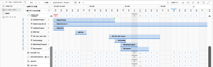

# Adobe Workfrontのリソーススケジュールツールの廃止

>[!IMPORTANT]
>  
>この記事で説明するスケジュール機能は、2023 年 1 月の 23.1 リリースから廃止され、Adobe Workfrontから削除されました。   
>  
>  この記事は、2023 年初頭の 23.1 リリースの直後にも削除されます。 現時点では、ブックマークを適宜更新することをお勧めします。 
> 
> これで、ワークロードバランサーを使用して、リソースの作業をスケジュールできます。 
>  
> ワークロード・バランサを使用したリソースのスケジュール設定の詳細は、「 [ワークロードバランサー](../../resource-mgmt/workload-balancer/workload-balancer.md). 

<!--
We are currently in the process of removing all Scheduling tools from Adobe Workfront and replacing them with the Workload Balancer.

>[!IMPORTANT]
>
>We are no longer implementing new feature functionality for the current Scheduling solution and we no longer consider nor prioritize defects for a fix in this area of Adobe Workfront.

This article describes the timeline for this deprecation and it compares the functionality of the Scheduling tools and that of the Workload Balancer to indicate which Scheduling capabilities are already supported in the Workload Balancer. 

We have been announcing a more exact timeline through the Announcement Center at key milestones during the deprecation process and this article has been updated as this process continues.

>[!NOTE]
>
>The changes described in this article do not affect any other resource management tools. For example, they do not affect the [!UICONTROL Resource Planner] or the [!UICONTROL Utilization] report.
-->

## 準備方法

スケジューリングとワークロード・バランサ間の移行の準備方法の詳細は、 [リソース・スケジュールからワークロード・バランサへの移行](../../resource-mgmt/resource-mgmt-overview/migrate-resource-scheduling-to-workload-balancer.md).

現在、スケジューリング・ツールを使用している場合は、それらを停止し、ワークロード・バランサの使用を開始することをお勧めします。

スケジューリング領域で以前に使用可能だった機能のほとんどは、ワークロードバランサーで使用できるようになりました。 詳しくは、 [機能の可用性](#feature-availability) 」を参照してください。 引き続き、ワークロードバランサーでのみ作業用にリソースをスケジュール設定できます。

## ワークロードバランサーに転送しない情報

次の情報は、スケジューリング・ツールからワークロード・バランサには転送されません。

* **ユーザーの日別の割り当て**:同じユーザー割り当てを調整する際に、スケジューリングとワークロードバランサーの両方を同時に使用しないでください。 スケジューリング・ツールでユーザー割り当てを管理している場合、調整された日次割り当てはワークロード・バランサに転送されません。 同様に、ワークロード・バランサでユーザーの割り当てを調整した場合は、スケジューリング・ツールに転送されません。 この移行に備えて、ワークロードバランサーで日次の割り当てが正確に行われるようにすることを強くお勧めします。 詳しくは、 [ワークロードバランサーでのユーザー割り当ての管理](../workload-balancer/manage-user-allocations-workload-balancer.md).
* **フィルター**:スケジューリング領域にフィルタを保存した場合、ワークロードバランサーに転送されません。 ワークロードバランサーでフィルタを再作成する必要があります。 詳しくは、 [ワークロードバランサーの情報のフィルタリング](../workload-balancer/filter-information-workload-balancer.md).

## 廃止タイムラインのハイライト

>[!IMPORTANT]
>
>この記事では、スケジュールツールを廃止するための最新のタイムラインについて説明します。 このタイムラインに対する更新は、この記事と Announcement Center のメッセージで伝えられます。

次に、リソーススケジュールツールの廃止プロセスのタイムラインを示します。

* [2020.4 リリース（2020 年 11 月）](#2020-4-release-november-2020)
* [2021.4 リリース（2021 年 10 月）](#2021-4-release-october-2021)
* [2022.4 - 2023.1 リリース（2022 年 10 月 — 2023 年 1 月）](#2022-4-2023-1-releases)

### 2020.4 リリース（2020 年 11 月） {#2020-4-release-november-2020}

* スケジュールソリューションの新機能は実装されなくなりました
* 修正に対しては、重大度の高い問題と重大度の問題のみが優先されます
* Workfrontに追加された新しいワークロードバランサー機能

### 2021.4 リリース（2021 年 10 月） {#2021-4-release-october-2021}

* ワークロードバランサーは、Workfrontの初回ユーザーのデフォルトとして設定されています
* 共有が可能なフィルターの強化と、追加のフィールドの追加

### 2022.4 - 2023.1 リリース（2022 年 10 月 — 2023 年 1 月） {#2022-4-2023-1-releases}

* 2022.4 または 2023.1 リリース以降の修正に関しては、問題は優先されません。
* すべての集計表領域がプレビュー環境から削除されます (**2022 年 10 月 21 日**)
* すべてのスケジュール領域が実稼動環境から削除されます (**2023 年 1 月**)
* ワークロードバランサーは、Workfrontで使用できる唯一のリソーススケジュールツールです ( **2023 年 1 月**)

## 機能の可用性 {#feature-availability}

特に指定のない限り、すべてのリソーススケジュール機能は、ワークロードバランサーで使用できるか、使用できるようになります。 ワークロード・バランサの詳細は、 [ワークロードバランサーの概要](../../resource-mgmt/workload-balancer/overview-workload-balancer.md).

既存の機能に加えて、次の表に示すように、ワークロードバランサーには、リソーススケジューリングツールに存在しない、または新しい機能があります。

<table style="table-layout:auto"> 
 <col> 
 <col> 
 <col> 
 <col> 
 <col> 
 <tbody> 
  <tr> 
   <td rowspan="2"><b>機能</b> </td> 
   <td rowspan="2"> <b>リソーススケジュールツールの機能の可用性</b></td> 
   <td colspan="3"><b>ワークロードバランサー機能の可用性</b></td> 
  </tr> 
  <tr> 
   <td><b>利用可能</b></td> 
   <td><b>近日中に利用可能</b></td> 
   <td><b>未計画</b></td> 
  </tr> 
  <tr> 
   <td> 
リソース領域からアクセスするツール
 </td> 
   <td>✓</td> 
   <td>✓</td> 
   <td> </td> 
   <td> </td> 
  </tr> 
  <tr> 
   <td>未割り当て作業と割り当て作業のエリアを分割</td> 
   <td>✓</td> 
   <td>✓</td> 
   <td> </td> 
   <td> </td> 
  </tr> 
  <tr> 
   <td>未割り当て作業と割り当て作業に対するフィルターの適用と作成</td> 
   <td>✓</td> 
   <td>✓</td> 
   <td> </td> 
   <td> </td> 
  </tr> 
  <tr> 
   <td>ツールから直接作業項目にアクセス</td> 
   <td>✓</td> 
   <td>✓</td> 
   <td> </td> 
   <td> </td> 
  </tr> 
  <tr> 
   <td>タスクとタスクの手動割り当てまたは割り当て解除</td> 
   <td>✓</td> 
   <td>✓</td> 
   <td> </td> 
   <td> </td> 
  </tr> 
  <tr> 
   <td>個々の配分を調整</td> 
   <td>✓</td> 
   <td>✓</td> 
   <td> </td> 
   <td> </td> 
  </tr> 
  <tr> 
   <td>発行時間を含める</td> 
   <td>✓</td> 
   <td>✓</td> 
   <td> </td> 
   <td> </td> 
  </tr> 
  <tr> 
   <td>推定日を表示 </td> 
   <td>✓</td> 
   <td>✓</td> 
   <td> </td> 
   <td> </td> 
  </tr> 
  <tr> 
   <td>完了した作業を表示</td> 
   <td>✓</td> 
   <td>✓</td> 
   <td> </td> 
   <td> </td> 
  </tr> 
  <tr> 
   <td>ユーザのタイムオフ、週末、およびスケジュールの例外を表示</td> 
   <td>✓</td> 
   <td>✓</td> 
   <td> </td> 
   <td> </td> 
  </tr> 
  <tr data-mc-conditions=""> 
   <td>役割に基づいてユーザーをすばやく割り当てる* </td> 
   <td>✓</td> 
   <td>✓ </td> 
   <td> </td> 
   <td> </td> 
  </tr> 
  <tr data-mc-conditions=""> 
   <td>ユーザーの迅速な置き換え* </td> 
   <td>✓</td> 
   <td>✓ </td> 
   <td> </td> 
   <td> </td> 
  </tr> 
  <tr data-mc-conditions=""> 
   <td>ユーザーの割り当てをすばやく解除* </td> 
   <td>✓</td> 
   <td>✓ </td> 
   <td> </td> 
   <td> </td> 
  </tr> 
  <tr> 
   <td>チームからツールにアクセス </td> 
   <td>✓</td> 
   <td>✓ </td> 
   <td> </td> 
   <td> </td> 
  </tr> 
  <tr> 
   <td>プロジェクトからツールにアクセス </td> 
   <td>✓</td> 
   <td>✓ </td> 
   <td> </td> 
   <td> </td> 
  </tr> 
  <tr>
   <td>ワークライセンスユーザーは、プロジェクトからワークロードバランサーにアクセスする際に、ユーザー割り当てを調整できます </td> 
   <td>✓</td> 
   <td>✓</td> 
   <td></td> 
   <td></td> 
  </tr> 
  <tr> 
   <td>未割り当て作業領域に問題を表示</td> 
   <td>✓</td> 
   <td>✓</td> 
   <td></td> 
   <td></td> 
  </tr> 
  <tr> 
   <td>ドラッグ&amp;ドロップ*によるタスクおよびタスクおよびタスクの割り当て解除 </td> 
   <td>✓</td> 
   <td>✓ </td> 
   <td> </td> 
   <td> </td> 
  </tr> 
  <tr> 
   <td>プロジェクトでリソースマネージャに指定されていないすべてのプランユーザに表示されます。</td> 
   <td> </td> 
   <td>✓</td> 
   <td> </td> 
   <td> </td> 
  </tr> 
  <tr> 
   <td>プロジェクト別に情報をグループ化</td> 
   <td> </td> 
   <td>✓</td> 
   <td> </td> 
   <td> </td> 
  </tr> 
  <tr> 
   <td>リソース領域にアクセスできないユーザーとワークロードバランサーを共有します</td> 
   <td> </td> 
   <td>✓</td> 
   <td> </td> 
   <td> </td> 
  </tr> 
  <tr> 
   <td>週別の配分の表示と調整</td> 
   <td> </td> 
   <td>✓</td> 
   <td> </td> 
   <td> </td> 
  </tr> 
  <tr> 
   <td>ツールから直接ユーザーにアクセス</td> 
   <td> </td> 
   <td>✓</td> 
   <td> </td> 
   <td> </td> 
  </tr> 
  <tr data-mc-conditions=""> 
   <td>[ 概要 ] パネル*を使用して、移動せずに作業項目の詳細にアクセスできます。</td> 
   <td> </td> 
   <td>✓</td> 
   <td> </td> 
   <td> </td> 
  </tr> 
  <tr> 
   <td>配分を割合値として表示および調整する </td> 
   <td> </td> 
   <td>✓</td> 
   <td> </td> 
   <td> </td> 
  </tr> 
  <tr> 
   <td>使用可能な時間と割り当てられた時間の差を表示</td> 
   <td> </td> 
   <td>✓</td> 
   <td> </td> 
   <td> </td> 
  </tr> 
  <tr> 
   <td>グラフにユーザーの可用性を表示する</td> 
   <td> </td> 
   <td>✓</td> 
   <td> </td> 
   <td> </td> 
  </tr> 
  <tr> 
   <td>プロジェクトステータス別の色分け作業項目とプロジェクト</td> 
   <td> </td> 
   <td>✓</td> 
   <td> </td> 
   <td> </td> 
  </tr> 
  <tr> 
   <td>（単純期間タイプのタスクの）ユーザー配分を調整すると、計画時間が自動的に更新されます</td> 
   <td> </td> 
   <td>✓</td> 
   <td> </td> 
   <td> </td> 
  </tr> 
  <tr> 
   <td>ユーザーの割り当てパターン、既存の役割、またはチームの割り当てに基づいて割り当てを提案 </td> 
   <td> </td> 
   <td>✓ </td> 
   <td> </td> 
   <td> </td> 
  </tr> 
  <tr> 
   <td>共有が可能なフィルターの強化と、追加のフィールドの追加</td> 
   <td> </td> 
   <td>✓</td> 
   <td> </td> 
   <td> </td> 
  </tr> 
  <tr> 
   <td>高度な割り当てを行う </td> 
   <td> </td> 
   <td>✓ </td> 
   <td> </td> 
   <td> </td> 
  </tr>

<tr> 
   <td>プロジェクトとプロジェクトのステータス別の色分け作業項目 </td> 
   <td> </td> 
   <td>✓ </td> 
   <td> </td> 
   <td> </td>

<tr> 
   <td>プロジェクトチームにユーザーを追加する ( <b>人</b> （プロジェクトのタブ） </td> 
   <td>✓</td> 
   <td>✓</td> 
   <td></td> 
   <td> </td>

</tr>
   <tr> 
   <td>タスクとタスクを自動的に割り当てる</td> 
   <td>✓</td> 
   <td> </td> 
   <td> </td> 
   <td>✓</td> 
  </tr>

</tbody> 
</table>

*これらの機能は、新しいAdobe Workfrontエクスペリエンスでのみ使用できます。
