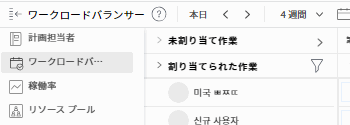

# リソースから移行 [!UICONTROL スケジュール] から [!UICONTROL ワークロードバランサー]

このページで強調表示されている情報は、まだ一般に利用できない機能を示しています。 これは、プレビュー環境でのみ使用できます。

<!-- drafted for res scheduling deprecation blurb for PREVIEW release - Oct 2022 - CHANGE THIS BLURB TO SOMETHING ELSE AT PRODUCTION:-->

>[!CAUTION]
>  
>  
> スケジュール領域は、プレビュー環境から削除され、 **2023 年 1 月**. \
>  2023 年 1 月以降は、ワークロードバランサーでリソースをスケジュールする必要があります。 
>  
> ワークロード・バランサを使用したリソースのスケジュール設定の詳細は、「 [ワークロードバランサー](../../resource-mgmt/workload-balancer/workload-balancer.md).

この記事の情報は、リソースでリソースのスケジュールを管理した場合にのみ適用されます [!UICONTROL スケジュール] Adobe Workfrontの領域。 Workfrontは、 [!UICONTROL スケジュール] 2020 年 11 月のツールで、を [!UICONTROL ワークロードバランサー].

の廃止計画について詳しくは、 [!UICONTROL リソーススケジュール] ツールと、 [!UICONTROL ワークロードバランサー]を参照してください。 [Adobe Workfrontのリソーススケジュールツールの廃止](../../resource-mgmt/resource-mgmt-overview/deprecate-resource-scheduling.md).

移行計画の設計を支援し、作業の中断をできるだけ少なく抑えていただきたいと考えています。 以下の手順は、チームのトレーニングを受け、 [!UICONTROL ワークロードバランサー].

## リソーススケジュールツールを探します。

自分とチームがリソースの一部を使用している可能性があります [!UICONTROL スケジュール] ツールは、Workfrontの次の領域にあります。

* この [!UICONTROL スケジュール] セクション [!UICONTROL リソース] 領域
* この [!UICONTROL スケジュール] プロジェクトのセクション
* この [!UICONTROL スケジュール] チームのセクション

この廃止により、 [!UICONTROL ワークロードバランサー] を  [!UICONTROL リソーススケジュール] 上記のすべての領域のツール。

## 手順 1:チームのトレーニングを受ける

トレーニングを受ける [新しいAdobe Workfrontエクスペリエンスのためのリソース管理プログラム](https://one.workfront.com/s/resource-management-program-nwe) （75 分）Workfront1。

コースへのログインやアクセスが困難な場合は、カスタマーサポートにお問い合わせください。 詳しくは、 [カスタマーサポートに連絡](../../workfront-basics/tips-tricks-and-troubleshooting/contact-customer-support.md).

## 手順 2:移行に最適な時期の決定 {#step-2-determine-the-best-time-to-migrate}

移行に最適なタイミングを判断するには、次の手順に従います。

1. リソース内の機能の決定 [!UICONTROL スケジュール] チームが最も多く使用するツールを使用し、それらの機能が [!UICONTROL ワークロードバランサー]. 現在、 [!UICONTROL ワークロードバランサー]詳しくは、この記事の「機能の可用性」の節を参照してください [Adobe Workfrontのリソーススケジュールツールの廃止](../../resource-mgmt/resource-mgmt-overview/deprecate-resource-scheduling.md).

   >[!IMPORTANT]
   >
   >スケジューリングツールのほとんどの機能は、現在、ワークロードバランサーに含まれています。

1. チームが割り当てに対するユーザー割り当てを管理するかどうかを決定します。 ユーザー割り当てを調整または変更するとは、作業項目の期間中に、各ユーザーの 1 日あたりの予定時間を変更することを意味します。

   スケジューリング・ツールで編集された割り当ては、ワークロード・バランサに転送されません。 デフォルトでは、1 つの作業項目の計画時間の合計は、その項目の全期間に均等に配分されます。

   ワークロード・バランサで割り当てを手動で管理し、割り当てがスケジューリング・ツールでの割り当てと一致するようにする必要があります。 詳しくは、 [ワークロードバランサーでのユーザー割り当ての管理](../workload-balancer/manage-user-allocations-workload-balancer.md).

1. スケジューリング領域に保存されたフィルタは、ワークロードバランサーに自動的に転送されません。 ワークロードバランサーで必要なフィルターを作成する時間を作成します。 ワークロードバランサーでのフィルタの作成の詳細は、 [ワークロードバランサーの情報のフィルタリング](../workload-balancer/filter-information-workload-balancer.md).

<!--
1. Using the information gathered from Steps 1 and Step 2, decide which version of Step 3 you should continue with based on the needs of your organization.
-->

## 手順 3:への移行 [!UICONTROL ワークロードバランサー]{#step-3-migrate-to-the-workload-balancer}

手順 2 の結果に応じて、この手順で次のバージョンを特定しました。

* [手順 3a:自分やチームが [!UICONTROL スケジュール] ツールを使用しますが、ユーザー割り当ては変更しません。](#step-3a-you-or-your-teams-use-the-scheudling-tools-but-do-not-modify-user-allocation)
* [手順 3b:自分やチームが [!UICONTROL スケジュール] ツール](#step-3b-you-or-your-teams-manage-user-allocations-in-the-scheduling-tools)

### 手順 3a:自分やチームが [!UICONTROL スケジュール] ツールを使用しますが、ユーザー割り当ては変更しません。

自分またはチームが作業割り当ての日次時間割り当てを変更しない場合は、スケジュールリソースを [!UICONTROL ワークロードバランサー].

次の操作を実行します。

* 遷移日を選択します。

   >[!TIP]
   >
   >移行日の前に、ワークロードバランサーの使用に関するトレーニングをチームが受ける時間を提供します。 トレーニングについて詳しくは、 [リソース・スケジュールからワークロード・バランサへの移行](#migrate-from-resource-uicontrol-scheduling-to-the-uicontrol-workload-balancer) 」を参照してください。

* チームを支援するには、次のガイドラインに従います。

   * チームに次のサイトにアクセスするよう促す [の概要 [!UICONTROL ワークロードバランサー]](../../resource-mgmt/workload-balancer/overview-workload-balancer.md) ページとそこからリンクされたすべてのページを参照し、 [!UICONTROL ワークロードバランサー] は機能します。
   * 移行前の週の質問に回答し、切り替えを行い、次に別の FAQ 会議を開いて、フォローアップの質問に回答するための FAQ 会議を開催します。
   * 上部のツールバーにある「フィードバック」ボタンを使用して、Workfrontにフィードバックを送信します。 アドビの製品開発者は、 [!UICONTROL ワークロードバランサー] より多くの価値を提供する。

### 手順 3b:自分やチームが [!UICONTROL スケジュール] ツール

ワークフローがこのシナリオと一致する場合は、移行計画でより戦略的な作業を行う必要があります。 に表示される日別の配分 [!UICONTROL スケジュール] ツールは、 [!UICONTROL ワークロードバランサー]. つまり、リソースで行う日次割り当ての調整です [!UICONTROL スケジュール] ツールは、 [!UICONTROL ワークロードバランサー].

>[!CAUTION]
>
>まで **2023 年 1 月** スケジューリング領域からのユーザー割り当てが、実稼働環境のワークロードバランサーの割り当てと一致するようにします。 この時点で、スケジュールツールを実稼動環境から削除します。 スケジューリング・ツールの割り当てに合わせて、ワークロード・バランサの割り当てを手動で調整する必要があります。 スケジュールツールは、既にプレビュー環境から削除されています。

を [!UICONTROL ワークロードバランサー] この [!UICONTROL スケジュール] 機能：

* 内の割り当て管理を保留します [!UICONTROL スケジュール] リソースマネージャが切り替える際に使用するツール。 手順は次のとおりです。

   * 現在のプロジェクトでのタスクの平均期間を確認し、ユーザー割り当ての管理を保留する必要がある期間を決定する際に、その期間を考慮に入れます。

      >[!TIP]
      >
      >現在のプロジェクトまたは計画プロジェクト（チームが積極的に割り当てを行い、日次割り当てを管理するプロジェクト）のみを確認する必要があります。

   * タスクレポートを作成し、ビューにタスクの「期間」フィールドを追加して、プロジェクト名でグループ化します。 「表示」の「期間」列を「平均」で要約し、レポートを保存します。

      レポートの作成について詳しくは、 [カスタムレポートの作成](../../reports-and-dashboards/reports/creating-and-managing-reports/create-custom-report.md) .

   * タスクレポートを分析します。 例えば、平均タスク期間が 3 日の場合は、1 週間の移行が最適です。 チームが 1 週間のユーザー割り当ての管理を中止するように指示します。 次の週に、チームを [!UICONTROL ワークロードバランサー] 次の週にユーザー割り当ての管理を開始します。
   >[!NOTE]
   >
   >この提案は、平均タスク期間がスケジュールツールの削除までの残り時間より長い場合は機能しない可能性があります。

   

   >[!TIP]
   >
   >遷移期間中も、引き続きタスクや問題の割り当てをおこなうことができます。 実行された割り当ては、リソーススケジューラと [!UICONTROL ワークロードバランサー].

* 数百のプロジェクトのリソースを管理するチームを持つ大規模な組織の場合は、 [!UICONTROL スケジュール] ツールを [!UICONTROL ワークロードバランサー] 一度に 1 つのポートフォリオ。 段階的なロールアウトを検討するには、 [!UICONTROL ワークロードバランサー] 特定のポートフォリオを一度に見る

* リソースマネージャがチームを組むのを許可する：～で 1 人の人が割り当てをレビューする  [!UICONTROL リソーススケジュール] ツールと 1 つは、 [!UICONTROL ワークロードバランサー]. 2 つのツールのチームが両方のツールを調整したら、ワークフローを [!UICONTROL ワークロードバランサー].

## さらにサポートが必要

この移行に関する追加情報が必要な場合は、カスタムサポートにお問い合わせください。 サポートへの問い合わせについて詳しくは、 [カスタマーサポートに連絡](../../workfront-basics/tips-tricks-and-troubleshooting/contact-customer-support.md).
