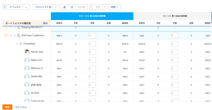
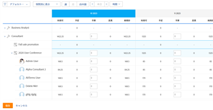
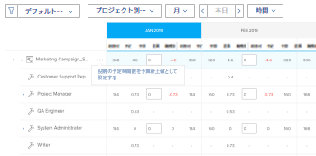

# 「プロジェクト」ビューと「ロール」ビューを使用する、リソースプランナーの予算リソース

<!--
<p data-mc-conditions="QuicksilverOrClassic.Draft mode">(NOTE: broken off of another larger article (Planning in the RP); reformat, restructure, relink)</p>
-->

リソースプランナーの主な機能は、プロジェクトで完了する必要のある作業に対してリソースを予算設定することです。

>[!IMPORTANT]
>
>リソースを予算できるのは、 **プロジェクト別に表示** または **ロール別に表示** リソース・プランナへのビュー。

リソース・プランナで予算情報を開始する前に、次の記事を参照してください。

* [リソースプランナーの概要](../../resource-mgmt/resource-planning/get-started-resource-planner.md)
* [Adobe Workfrontの予算リソースに必要なアクセス](../../resource-mgmt/resource-planning/access-needed-to-budget-resources.md)
* [リソースプランナーのプロジェクトビューとロールビューの時間、工数、コスト情報の概要](../../resource-mgmt/resource-planning/overview-of-planner-hour-fte-cost-information-in-role-project-views.md)

## アクセス要件

この記事の手順を実行するには、次のアクセス権が必要です。

<table style="table-layout:auto"> 
 <col> 
 <col> 
 <tbody> 
  <tr> 
   <td role="rowheader">Adobe Workfront plan*</td> 
   <td> <p>Pro 以降</p> </td> 
  </tr> 
  <tr> 
   <td role="rowheader">Adobe Workfront license*</td> 
   <td> <p>計画 </p> </td> 
  </tr> 
  <tr> 
   <td role="rowheader">アクセスレベル設定*</td> 
   <td> <p>リソース・プランナの編集優先度と予算時間へのアクセスを含むリソース管理へのアクセスを編集します</p> <p>コスト別の予算リソースへの財務データへのアクセスを編集</p> <p>プロジェクトおよびユーザーへのアクセスを編集</p> <p><b>メモ</b>

まだアクセス権がない場合は、Workfront管理者に、アクセスレベルに追加の制限を設定しているかどうかを問い合わせてください。 Workfront管理者がアクセスレベルを変更する方法について詳しくは、 <a href="../../administration-and-setup/add-users/configure-and-grant-access/create-modify-access-levels.md" class="MCXref xref">カスタムアクセスレベルの作成または変更</a>.</p> </td>
</tr> 
  <tr> 
   <td role="rowheader">オブジェクト権限</td> 
   <td> <p>情報を予算するプロジェクトに対する権限を管理します</p> <p>追加のアクセス権のリクエストについて詳しくは、 <a href="../../workfront-basics/grant-and-request-access-to-objects/request-access.md" class="MCXref xref">オブジェクトへのアクセスのリクエスト </a>.</p> </td> 
  </tr> 
 </tbody> 
</table>

&#42;保有しているプラン、ライセンスの種類、アクセス権を確認するには、Workfront管理者に問い合わせてください。

## リソースプランナーの予算リソース

* [プロジェクトビューの予算リソース](#budget-resources-in-the-project-view)
* [役割ビューの予算リソース](#budget-resources-in-the-role-view)
* [予算リソースの一括処理](#budget-resources-in-bulk)

### プロジェクトビューの予算リソース {#budget-resources-in-the-project-view}

<!--
<p data-mc-conditions="QuicksilverOrClassic.Draft mode">(NOTE: this section is linked to the Budgeting Project Resources in the Business Case article)</p>
-->

1. 次をクリック： **メインメニュー** アイコン  Adobe Workfrontの右上隅にある

1. クリック **リソース**.
1. この **プランナー** はデフォルトで表示されます。
1. （条件付き） **プロジェクト別に表示** 表示
1. プロジェクトとジョブの役割を展開して、プロジェクト、ジョブの役割、またはユーザーの割り当てを管理します。
1. ユーザーの予算配賦を行う手順は、次のいずれかです。

   * 内 **BDG** 列には、ユーザーの予算時間数、FTE またはコストを手動で指定します。

   * 次をクリック： **詳細** ユーザーのジョブロールのメニューで、 **ユーザーの予定時間を予算として設定**.\
      各ユーザーの予算時間は、次の式を使用して計算されます。

      ```
      User Budgeted Hours = User Planned Hours
      ```

1. 役職の配賦を予算するには、次のいずれかを実行します。

   * 内 **BDG** 列を手動で指定し、ジョブロールの予算時間数、FTE またはコストを手動で指定します。

      >[!NOTE]
      >
      >役割の予算時間は、プロジェクトの予算時間に追加されます。

   * （条件付き）ユーザーに予算を割り当てた時間がある場合、 **詳細** ジョブロールのメニューで、 **ロールに関するユーザーの予算時間の合計**.\
      各役割の予算時間は、次の式を使用して計算されます。

      ```
      Role Budgeted Hours = SUM(User Budgeted Hours)
      ```

   * 次をクリック： **詳細** プロジェクトのメニューで、 **役割の計画時間を予算として設定**.\
      各役割の予算時間は、次の式を使用して計算されます。\
      *

      ```
      Role Budgeted Hours = Role Planned Hours
      ```

      >[!NOTE]
      >   
      >* 役割の予算時間は、プロジェクトの予算時間に追加されます。
      >* ユーザーは、「その他」（または「セカンダリ」）ロールと「プライマリ」(Other) ロールの両方に対して予算を設定できます。
      >* この **FTE の可用性の割合** ユーザーのロールの場合は、使用可能時間数に対して、ジョブ・ロールのリソース・プランナに値を表示するには、0%以外の数値を指定する必要があります。 ユーザーが 0%を持つ役割に関連付けられている場合 **FTE の可用性の割合**&#x200B;の場合、そのジョブの役割の Available Hours の値は 0 です。 この場合、役割に否定的な値が表示される可能性があります **正味値**.\
         >詳しくは、 **FTE の可用性の割合** 役割については、この記事を参照してください。 [ユーザーのプロファイルの編集](../../administration-and-setup/add-users/create-and-manage-users/edit-a-users-profile.md).


   * 内 **BDG** 列には、プロジェクトの予算時間数、工数、またはコストを手動で指定します。 プロジェクトの予算時間数が、プロジェクトの下の各役割に配分されます。 次のシナリオが存在します。

      * プロジェクトの予算時間数がプロジェクトの計画時間数と等しい場合、役割の予算時間は役割の計画時間数と一致します。
      * 指定したプロジェクトの予算時間数がプロジェクトの計画時間数と等しくない場合、役割の予算時間は、各役割に必要な計画時間の割合に従って配分されます。\
         たとえば、プロジェクトに計画時間が 20 時間あり、2 つの役割（コンサルタントが 12 時間計画時間を要し、エンジニアが 8 時間計画時間を要する）の間に配布され、プロジェクトに 30 時間を予算する場合、時間は次のように配布されます。コンサルタントの役割に 18 の予算時間が割り当てられ、エンジニアの役割に 12 の予算時間が割り当てられます。

1. プロジェクトの予算配分を行うには、次のいずれかの操作を行います。

   * 手順 7 の説明に従って、プロジェクトのロールを予算化します。\
      プロジェクトの予算時間は、次の式で計算されます。

      ```
      Project Budgeted Hours = SUM(Role Budgeted Hours)
      ```

   * 内 **BDG** 列には、プロジェクトの予算時間数、工数、またはコストを手動で指定します。\
      手順 7 に従って、役割の予算時間が更新されます。\
      

1. 「**保存**」をクリックします。\
   リソース・プランナでリソースを予算した後、リソースの予算時間とそれに関連するコストが、各プロジェクトのビジネス・ケースに表示されます。\
   ビジネス事例の「生産資源予算設定」領域の詳細は、この記事の「生産資源予算設定」の項を参照してください [ビジネス事例の領域の概要](../../manage-work/projects/define-a-business-case/areas-of-business-case.md).

1. （オプション）各ユーザーの「使用可能時間」と「予定時間」の間のユーザーの割り当て超過または過少使用に注意するには、「ユーザー」ビューを選択します。 予算時間は、[ ユーザー ] ビューには表示されません。

   Workfrontがユーザーの可用性を計算する方法について詳しくは、 [リソース管理環境設定の指定](../../administration-and-setup/set-up-workfront/configure-system-defaults/configure-resource-mgmt-preferences.md).

### 役割ビューの予算リソース {#budget-resources-in-the-role-view}

<!--
<div data-mc-conditions="QuicksilverOrClassic.Draft mode">
<p>(NOTE: THIS IS WRONG - I LOGGED A BUG TO FIX THIS LINK - IT SHOULD GO TO"ACCESS NEEDED TO BUDGET IN THE RP":</p>
<p>Planning in the resource planner has links to the UI - ensure Flare notes are there for this: https://workfront.zendesk.com/hc/en-us/articles/115006356928 - the "Budgeting resources in the role view" is linked to this tooltip: ***This is linked to the product in the RP when the user does not have Manage rights on one of the projects under the role. This tool tip is linked here: "You don't have Manage permissions for all projects. Budget hours by individual project instead. Learn more...")</p>
</div>
-->

リソース・プランナでリソースを予算化するには、プロジェクトに対する「リソース管理」および「財務データの編集」および「財務の管理」の権限が必要です。 ジョブロールの下に表示される少なくとも 1 つのプロジェクトに対するビューアクセス権のみを持っている場合は、ロールビューのロールに対する予算割り当てを行うことはできません。 引き続き、管理権限を持つプロジェクトの割り当てを予算できます。

予算リソースの割り当てに必要なアクセスの詳細については、この記事を参照してください [Adobe Workfrontの予算リソースに必要なアクセス](../../resource-mgmt/resource-planning/access-needed-to-budget-resources.md).

「****ロール」ビューの「リソース・プランナ」で予算配賦を行う手順は、次のとおりです。

1. 次をクリック： **メインメニュー** アイコン  Adobe Workfrontの右上隅にある

1. クリック **リソース**.
1. この **プランナー** はデフォルトで表示されます。
1. （条件付き） **ロール別に表示** 表示
1. ジョブの役割とプロジェクトを展開して、プロジェクト、ジョブの役割、またはユーザーの割り当てを管理します。
1. ユーザーの予算配分を行うには、次のいずれかの操作を行います。

   * 内 **BDG** 列には、ユーザーの予算時間数、FTE またはコストを手動で指定します。
   * 次をクリック： **詳細** プロジェクトのメニューで、 **ユーザーの予定時間を予算として設定**.\
      各ユーザーの予算時間は、次の式を使用して計算されます。

      ```
      User Budgeted Hours = User Planned Hours
      ```

1. 役職の配賦を予算するには、次のいずれかを実行します。

   * 内 **BDG** 列に、ジョブの役割の予算時間数、FTE またはコストを手動で指定します。\
      これにより、管理するアクセス権のあるプロジェクトの役割予算時間がプロジェクト予算時間に配分されます。

   * 次をクリック： **詳細** 「**プロジェクトの計画時間を予算として設定」をクリックします。**役割の予算時間は、次の式を使用して計算されます。\
      *

      ```
      Role Budgeted Hours = SUM(Project Budgeted Hours)
      ```

      *プロジェクトの予算時間は、次の式を使用して計算されます。

      ```
      Project Budgeted Hours = Project Planned Hours
      ```

   * 内 **BDG** 」列に、ジョブの役割でリストされたプロジェクトの予算時間数、FTE、またはコストを手動で指定します。\
      これにより、プロジェクトの予算時間数がロールに追加されます。
   >[!NOTE]
   >
   >ユーザーは、「その他」（または「セカンダリ」）ロールと「プライマリ」(Other) ロールの両方に対して予算を設定できます。 この **FTE の可用性の割合** ユーザーのロールの場合は、使用可能時間数に対して、ジョブ・ロールのリソース・プランナに値を表示するには、0%以外の数値を指定する必要があります。 ユーザーが 0%を持つ役割に関連付けられている場合 **FTE の可用性の割合**&#x200B;の場合、そのジョブの役割の Available Hours の値は 0 です。 この場合、役割に否定的な値が表示される可能性があります **正味値**.\
   >詳しくは、 **FTE の可用性の割合** 役割については、この記事を参照してください。 [ユーザーのプロファイルの編集](../../administration-and-setup/add-users/create-and-manage-users/edit-a-users-profile.md).

1. プロジェクトの予算配分を行うには、次のいずれかの操作を行います。

   * 内 **BDG** 列に、プロジェクトの予算時間数、工数、または原価を手動で指定します。\
      これにより、プロジェクトがリストされているロールの予算時間も更新されます。

   * 次をクリック： **詳細** ジョブロールのメニューで、 **プロジェクトの計画時間を予算として設定**.\
      プロジェクトの予算時間は、次の式で計算されます。

      ```
      Project Budgeted Hours = Project Planned Hours
      ```

      プロジェクトの予算時間が役割の予算時間に追加されます。

   * （条件付き）ユーザーに時間を予算設定した場合、 **詳細** プロジェクトのメニューで、 **プロジェクトに関するユーザーの予算時間の合計**.\
      プロジェクトの予算時間は、次の式を使用して計算されます。

      ```
      Project Budgeted Hours = SUM(User Budgeted Hours)
      ```

      

1. 「**保存**」をクリックします。\
   リソース・プランナでリソースを予算した後、リソースの予算時間とそれに関連するコストが、各プロジェクトのビジネス・ケースに表示されます。\
   ビジネス事例のリソース予算領域の理解の詳細は、この記事を参照してください [ビジネス事例の予算リソース](../../manage-work/projects/define-a-business-case/budget-resources-in-business-case.md).

1. （オプション） **ユーザー別に表示** 「」を表示して、各ユーザーの「使用可能」と「計画時間」の間のユーザーの割り当て超過または過少使用を確認します。 予算時間は、「ユーザー別の表示」ビューに表示されません。

### 予算リソースの一括処理 {#budget-resources-in-bulk}

クイックリンクを使用する際に、リソースの予算割り当てを一括でおこなうことができます。 クイックリンクは、プロジェクトビューとロールビューに対してのみ使用できます。



>[!NOTE]
>
>リソースの予算割り当てのクイックリンクを使用すると、予算は自動的に画面に表示される期間にのみ適用されます。 プロジェクトのタイムラインが画面に表示されるタイムラインより長い期間にわたる場合は、左から右にスクロールし、クイックリンクを使用してリソースを自動的に予算設定する必要があります。

リソースを一括で予算設定するには、次の手順に従います。

1. に移動します。\
   リソース・プランナへのアクセスの詳細は、この記事の「リソース・プランナへのアクセス」の節を参照してください [リソースプランナーの概要](../../resource-mgmt/resource-planning/get-started-resource-planner.md).\
   管理できるプロジェクトのリストがリストに表示されます。

1. （オプション）各プロジェクトを展開して、関連付けられているジョブの役割のリストを表示します。\
   または
1. （オプション）「 」を選択します。 **ロール別に表示**&#x200B;次に、各役割を展開して、関連付けられているプロジェクトのリストを表示します。
1. プロジェクトまたはジョブの役割の名前の上にマウスポインターを置きます。
1. 次をクリック： **詳細** アイコン プロジェクト名または役割名の右端に表示されます。

1. 使用可能なオプションの 1 つをクリックして、他のオブジェクトの予算時間 (BDG) を自動的に指定します。

   プロジェクトで「その他」アイコンをクリックしたか、ロールをクリックしたかに応じて、一括で予算を作成する際のオプションは異なります。 次の表に、プロジェクトとロールで使用できるオプションを示します。

   <table style="table-layout:auto"> 
    <col> 
    <col> 
    <col> 
    <tbody> 
     <tr> 
      <td> </td> 
      <td><strong>プロジェクト ビュー</strong> </td> 
      <td><strong>ロール表示</strong> </td> 
     </tr> 
     <tr> 
      <td>プロジェクトオプション</td> 
      <td> 
       <ul> 
        <li><strong>役割の計画時間を予算として設定</strong>:役割の予算時間を計画時間と同じにするには、このオプションを選択します。 プロジェクトの予算時間に対して役割の予算時間の合計が表示されます。 </li> 
        <li><strong>予算作成日の調整</strong> :予算時間を別の期間に移動する場合は、このオプションを選択します。<br>予算作成日の調整の詳細については、「 <a href="../../resource-mgmt/resource-planning/adjust-budgeting-dates.md" class="MCXref xref">リソース・プランナで予算作成日を調整</a>.</li> 
       </ul> </td> 
      <td> 
       <ul> 
        <li><strong>ユーザーの予定時間を予算として設定</strong>:このオプションを選択すると、ユーザーの予算時間が計画時間と同じになります。 </li> 
        <li><strong>プロジェクトに関するユーザーの予算時間の合計</strong>:このオプションを選択すると、すべてのユーザーの予算時間が一緒に追加され、合計がプロジェクトの予算時間と役割の予算時間として表示されます。 ユーザーに手動で予算を作成した後、または前のオプションを最初に使用した後に、このオプションを使用することをお勧めします。 </li> 
       </ul> </td> 
     </tr> 
     <tr> 
      <td>役割のオプション</td> 
      <td> 
       <ul> 
        <li><strong>ユーザーの予定時間を予算として設定</strong>:このオプションを選択すると、ユーザーの予算時間が計画時間と同じになります。 </li> 
        <li><strong>ロールに関するユーザーの予算時間の合計</strong>:このオプションを選択すると、ユーザーの予算時間がすべて追加され、合計が役割とプロジェクトの予算時間として表示されます。 ユーザーに手動で予算を作成した後、または前のオプションを最初に使用した後に、このオプションを使用することをお勧めします。 </li> 
       </ul> </td> 
      <td> 
       <ul> 
        <li><strong>プロジェクトの計画時間を予算として設定</strong>:プロジェクトの予算時間をプロジェクトの計画時間と同じにするには、このオプションを選択します。 </li> 
       </ul> </td> 
     </tr> 
    </tbody> 
   </table>

   >[!NOTE]
   >
   >リソース・プランナでの作業の前提条件の一部が欠落している場合は、一部のオプションが表示されない場合があります。
   >
   >
   >リソース・プランナで正確な予算編成を行うために満たす必要がある前提条件の詳細は、「リソース・プランナでの作業の前提条件」の項を参照してください。 [リソースプランナーの概要](../../resource-mgmt/resource-planning/get-started-resource-planner.md) 記事。\
   >例えば、次のシナリオでは、一部のオプションが表示されない場合があります。
   >
   >   
   >   
   >   * プロジェクトがリソースプールに関連付けられていない場合
   >   * プロジェクトに関連付けられたリソースプールにユーザーが含まれていない場合
   >   * プロジェクトに関連付けられたリソースプールに、ジョブロールが関連付けられていないユーザーが含まれる場合。

