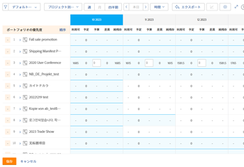

# リソースプランナーでコストを計算する

<!--
<p data-mc-conditions="QuicksilverOrClassic.Draft mode">(Alina: ***Linked to the Planning in the Resource Planner article, Understanding areas of the Resource Planner. - do not move/ change/ delete.)</p>
-->

Adobe Workfront Resource Planner でリソースを予算設定するには、Hours 値や FTE 値の代わりにコスト値を使用します。 コスト値は、**ユーザー別に表示** 「生産資源プランナ」で表示します。

>[!IMPORTANT]
>
>リソース・プランナにコスト情報を表示するには、ユーザーとジョブの役割を時間単価に関連付ける必要があります。\
>時間単価のジョブロールとの関連付けの詳細は、 [ジョブの役割の作成と管理](../../administration-and-setup/set-up-workfront/organizational-setup/create-manage-job-roles.md).\
>時間単価をユーザーに関連付ける方法の詳細は、 [ユーザーのプロファイルの編集](../../administration-and-setup/add-users/create-and-manage-users/edit-a-users-profile.md).

リソースを予算設定する前に、実行する必要のある作業（計画時間、工数、原価）と、ユーザーが作業できる時間（利用可能時間、工数、原価）を十分に把握しておく必要があります。\
時間または工数で予算を作成する場合のリソース・プランナの情報の理解の詳細は、次を参照してください： [リソースプランナーのプロジェクトビューとロールビューの時間、工数、コスト情報の概要](../../resource-mgmt/resource-planning/overview-of-planner-hour-fte-cost-information-in-role-project-views.md).

## アクセス要件

以下が必要です。

<table style="table-layout:auto"> 
 <col> 
 <col> 
 <tbody> 
  <tr> 
   <td role="rowheader">Adobe Workfront plan*</td> 
   <td> <p>Pro 以降</p> </td> 
  </tr> 
  <tr> 
   <td role="rowheader">Adobe Workfront license*</td> 
   <td> <p>計画 </p> </td> 
  </tr> 
  <tr> 
   <td role="rowheader">アクセスレベル設定*</td> 
   <td> <p>リソース・プランナの編集優先度と予算時間へのアクセスを含むリソース管理へのアクセスを編集します</p> <p>財務データ、プロジェクト、ユーザーへのアクセスを編集</p> <p><b>メモ</b>

まだアクセス権がない場合は、Workfront管理者に、アクセスレベルに追加の制限を設定しているかどうかを問い合わせてください。 Workfront管理者がアクセスレベルを変更する方法について詳しくは、 <a href="../../administration-and-setup/add-users/configure-and-grant-access/create-modify-access-levels.md" class="MCXref xref">カスタムアクセスレベルの作成または変更</a>.</p> </td>
</tr> 
  <tr> 
   <td role="rowheader">オブジェクト権限</td> 
   <td> <p>財政を管理する機能を持つ、予算情報を作成するプロジェクトに対する権限を管理します</p> <p>追加のアクセス権のリクエストについて詳しくは、 <a href="../../workfront-basics/grant-and-request-access-to-objects/request-access.md" class="MCXref xref">オブジェクトへのアクセスのリクエスト </a>.</p> </td> 
  </tr> 
 </tbody> 
</table>

&#42;保有しているプラン、ライセンスの種類、アクセス権を確認するには、Workfront管理者に問い合わせてください。

## リソースプランナにコスト別の情報を表示

デフォルトでは、稼働状況および配賦情報は、リソース・プランナの「時間」に表示されます。

生産資源プランナに原価別の使用可能、計画および予算の情報を表示する手順は、次のとおりです。

1. 次をクリック： **メインメニュー** アイコン  Adobe Workfrontの右上隅にある

1. クリック **リソース**.
1. に移動します。
1. （条件付き）選択 **プロジェクト別に表示** または **ロール別に表示**.\
   デフォルト **プロジェクト別に表示** が選択されている。\
   配分および稼動状況の情報は、「時間」に表示されます。

1. 次の **時間** ドロップダウンメニューで、「 **コスト**.

   アクセス・レベルで財務データにアクセスできない場合、このオプションは使用できません。\
   プロジェクトの通貨がシステム通貨と異なる場合、これらのプロジェクトの原価はシステムの通貨で換算されたリソース・プランナに表示されます。 システム管理者がシステム通貨を定義します。\
   Workfrontでのシステム通貨とコンバージョン率の設定について詳しくは、 [為替レートの設定](../../administration-and-setup/manage-workfront/exchange-rates/set-up-exchange-rates.md).\
   

## リソース・プランナでの使用可能原価の計算

「生産資源プランナ」に使用可能原価値を表示するには、次の条件を満たす必要があります。

* ユーザーおよびロールの時間あたりのコスト率
* ユーザーの可用性に関する情報です。

   ユーザーの可用性に関する情報の取得方法は、Workfront管理者がリソース管理環境設定を設定する方法によって異なります。\
   ユーザーの可用性の計算とリソース管理プリファレンスの設定の詳細は、 [リソース管理環境設定の指定](../../administration-and-setup/set-up-workfront/configure-system-defaults/configure-resource-mgmt-preferences.md).

次の表に、生産資源プランナでの使用可能原価の計算方法を示します。

<table style="table-layout:auto"> 
 <col> 
 <col> 
 <thead> 
  <tr> 
   <th><strong>利用可能なコスト</strong> </th> 
   <th><strong>計算</strong> </th> 
  </tr> 
 </thead> 
 <tbody> 
  <tr> 
   <td>ユーザー利用可能コスト</td> 
   <td> <p>「使用可能なユーザーあたりのコスト」は、次の式で計算されます。</p> <p><code>Available User Cost = User Available Hours * User Cost per Hour Rate</code> </p> <p><b>メモ</b>

ユーザーのプロファイルに時間あたりのコスト率がない場合は、表示されるジョブロールの時間あたりのコスト率が計算で使用されます。 ユーザーにロールが関連付けられていない場合、使用可能なユーザーコストは$0 です。 </p> </td>
</tr> 
  <tr> 
   <td>役割使用可能コスト</td> 
   <td> <p>「使用可能なロールあたりのコスト」は、次の式を使用して計算されます。</p> <p><code>Available Role Cost = Role Available Hours * Role Cost per Hour Rate</code> </p> <p><b>メモ</b>

ロールに時間あたりのコスト率がない場合、使用可能なロールコストは$0 になります。</p> </td>
</tr> 
  <tr> 
   <td>プロジェクトの利用可能なコスト</td> 
   <td> <p>「使用可能なプロジェクトあたりのコスト」は、次の式で計算されます。</p> <p><code>Available Project Cost = SUM(User Available Hours * User Cost per Hour Rate)</code> </p> </td> 
  </tr> 
 </tbody> 
</table>

## 生産資源プランナでの計画原価の計算

リソース・プランナではタスク情報を表示できませんが、ユーザー、ロールおよびプロジェクトの計画原価は、次のタスク情報を考慮して計算されます。

* タスクの割り当ての種類を指定します。\
   タスクの割り当てを解除するか、タスクに次のエンティティを割り当てることができます。

   * ユーザー（ジョブロールの有無）
   * 役割
   * チーム\
      チームに割り当てられたタスクは、リソースプランナーの観点から未割り当てと見なされます。

* この **コストタイプ** プロジェクト上のタスクの\
   タスクのコストタイプの詳細については、 [コストの追跡](../../manage-work/projects/project-finances/track-costs.md).

>[!NOTE]
>
>ユーザー計画原価はプロジェクト計画原価に影響しません。 「役割計画原価」のみが、資源プランナのプロジェクト計画原価に影響を与えます。

ユーザー、役割およびプロジェクトの計画原価を計算する場合は、次のシナリオが存在します。

* 次の場合に **コストタイプ** は**ユーザーが 1 時間ごと**で、 **割り当てなし** タスクの

   * **役割とユーザーの計画コスト**:

      役割およびユーザーの計画コストは$0.00 です。

   * **プロジェクト計画コスト**:

      プロジェクトの計画コストは$0.00 です。

* 次の場合に **コストタイプ** が **1 時間ごとのユーザー** そしてそこに **ユーザー割り当て** タスクの

   * **役割とユーザーの計画コスト**:

      「ユーザー計画原価」は、次の式を使用して計算されます。


      ```
      User Planned Cost Rate = User Planned Hours * User Cost per Hour Rate
      ```

      ユーザーのプロファイルにコスト・レートが含まれている場合、そのレートを使用して「計画コスト」が計算されます。 それ以外の場合は、システムレベルのプライマリロールの 1 時間あたりのコスト率が使用されます。

      >[!NOTE]
      >
      >ユーザーは、セカンダリジョブの役割の 1 つを持つタスクに割り当てることができますが、代わりに、プライマリジョブの役割の割合がここで使用されます。

      「ロール計画原価」は、次の式を使用して計算されます。

      ```
      Role Planned Cost = SUM(User Planned Cost)
      ```

   * **プロジェクト計画コスト**:

      プロジェクトの計画コストは$0.00 です。

* 次の場合に **コストタイプ** が **1 時間ごとのユーザー** そしてそこに **ジョブロールの割り当て** タスクの

   * **役割とユーザーの計画コスト**:

      ユーザーの計画コストは$0.00 です。

      「ロール計画原価」は、次の式を使用して計算されます。

      ```
      Role Planned Cost = Role Planned Hours * Role Cost per Hours
      ```

      タスクに割り当てられたジョブロールのシステム・レベルの 1 時間あたりのコスト率は、計画原価の計算に使用されます。

   * **プロジェクト計画コスト**:

      プロジェクトの計画コストは$0.00 です。

* 次の場合に **コストタイプ** が **1 時間ごとの役割** そしてそこに **割り当てなし** タスクの

   * **役割とユーザーの計画コスト**:

      役割およびユーザーの計画コストは$0.00 です。

   * **プロジェクト計画コスト**:

      プロジェクトの計画コストは$0.00 です。

* 次の場合に **コストタイプ** が **1 時間ごとの役割** そしてそこに **ユーザー割り当て** タスクの

   * **役割とユーザーの計画コスト**:

      ユーザーの計画コストは$0.00 です。

      「ロール計画原価」は、次の式で計算されます。

      ```
      Role Planned Cost = Role Planned Hours * Role Cost per Hours
      ```

      Workfrontは、ユーザーがタスクで実行する役割を調べて、役割の計画原価を計算します。

      ユーザーがタスク上の役割に関連付けられていない場合、計画コストは$0.00 になります。

   * **プロジェクト計画コスト**:

      プロジェクト計画原価は、次の式を使用して計算されます。

      ```
      Project Planned Cost = SUM(Role Planned Costs)
      ```

* 次の場合に **コストタイプ** が **1 時間ごとの役割** そしてそこに **ジョブロールの割り当て** タスクの

   * **役割とユーザーの計画コスト**:

      ユーザーの計画コストは$0.00 です。

      「ロール計画原価」は、次の式で計算されます。

      ```
      Role Planned Cost = Role Planned Hours * Role Cost per Hours
      ```

      Workfrontは、ユーザーがタスクで実行する役割を調べて、役割の計画原価を計算します。

   * **プロジェクト計画コスト**:

      プロジェクト計画原価は、次の式を使用して計算されます。

      ```
      Project Planned Cost = SUM(Role Planned Costs)
      ```

<!--
<p data-mc-conditions="QuicksilverOrClassic.Draft mode">(table below ideal but drafted because it does not display correctly in Markdown)</p>
-->

<!--
<table style="table-layout:auto">
<col>
<col>
<col>
<col>
<col>
<col>
<col>
<tbody>
<tr>
<td rowspan="2">&nbsp;</td>
<td colspan="3"> <p><strong>Cost Type = User Hourly</strong> </p><strong>User Planned Cost</strong> </td>
<td colspan="3"> <p><strong>Cost Type = Role Hourly</strong> </p><strong>Role Planned Cost</strong> </td>
</tr>
<tr>
<td> <p><strong>No Assignment</strong> </p> </td>
<td> <p><strong>User Assignment</strong> </p> </td>
<td> <p><strong>Job Role Assignment</strong> </p> </td>
<td> <p><strong>No Assignment</strong> </p> </td>
<td> <p><strong>User Assignment</strong> </p> </td>
<td> <p><strong>Job Role Assignment</strong> </p> </td>
</tr>
<tr>
<td> <p><strong>User and Role Planned Cost</strong> </p> <p> </p> </td>
<td> <p>The Role and User Planned Costs are $0.00.</p> </td>
<td> <p> The User Planned Cost is calculated using the following formula: </p> <p><code> User Planned Cost Rate = User Planned Hours * User Cost per Hour Rate </code> </p> <p> If a user has a cost rate in their profile, then that rate is used to calculate Planned Cost. Otherwise, the system-level Cost per Hour rate of their Primary Role is used. <br><note type="note">
The user can be assigned to the task with one of their secondary job roles, but the rate of the primary job role is used here instead.
</note></p> <p> The Role Planned Cost is calculated using the following formula: </p> <p><code>Role Planned Cost = SUM(User Planned Cost)</code> </p> </td>
<td> <p> The User Planned Cost is $0.00. </p> <p> The Role Planned Cost is calculated using the following formula: </p> <p><code> Role Planned Cost = Role Planned Hours * Role Cost per Hours </code> </p> <p> The system-level Cost per Hour rate of the job role assigned to the task is used to calculate Planned Cost. </p> </td>
<td> <p>The Role and User Planned Costs are $0.00.</p> </td>
<td> <p> The User Planned Cost is $0.00. </p> <p> The Role Planned Cost is calculated by the following formula: </p> <p><code>Role Planned Cost = Role Planned Hours * Role Cost per Hours</code> </p> <p>Workfront looks at the job role that the user fulfills on the task to calculate the Planned Cost for the role. </p> <p> If the user is not associated with any role on the task, the Planned Cost is $0.00. </p> </td>
<td> <p> The User Planned Cost is $0.00. </p> <p> The Role Planned Cost is calculated by the following formula: </p> <p><code>Role Planned Cost = Role Planned Hours * Role Cost per Hours</code> </p> <p>Workfront looks at the job role that the user fulfills on the task to calculate the Planned Cost for the role. </p> <p> </p> <p> </p> </td>
</tr>
<tr>
<td rowspan="2"> <p><strong>Project Planned Cost</strong> </p> <p> </p> </td>
<td> <p>The Project Planned Cost is $0.00.</p> </td>
<td> <p>The Project Planned Cost is $0.00.</p> </td>
<td> <p>The Project Planned Cost is $0.00.</p> </td>
<td> <p>The Project Planned Cost is $0.00.</p> </td>
<td colspan="2"> <p> The Project Planned Cost is calculated using the following formula: </p> <p><code> Project Planned Cost = SUM(Role Planned Costs) </code> </p> <p> </p> </td>
</tr>
<tr>
<td colspan="6"> <note type="note">
User Planned Costs do not influence the Project Planned Cost. Only the Role Planned costs affect the Project Planned Costs, in the Resource Planner.
</note> </td>
</tr>
</tbody>
</table>
-->

## リソース・プランナの予算原価の計算

予算原価の値を生産資源プランナに表示するには、次の条件を満たす必要があります。

* 役割、ユーザーおよびプロジェクトの予算時間。
* ユーザーおよびロールの時間あたりのコスト率。

>[!NOTE]
>
>プロジェクトの予算時間は、ユーザーの予算時間ではなく、役割の予算時間に基づいて計算されます。

次の表に、生産資源プランナでの予算原価の計算方法を示します。

<table style="table-layout:auto"> 
 <col> 
 <col> 
 <thead> 
  <tr> 
   <th><strong>予算計上コスト</strong> </th> 
   <th><strong>計算</strong> </th> 
  </tr> 
 </thead> 
 <tbody> 
  <tr> 
   <td>ユーザーの予算コスト</td> 
   <td> <p>ユーザーあたりの予算原価は、次の式を使用して計算されます。</p> <p><code>Budgeted User Cost = User Budgeted Hours * User Cost per Hour Rate</code> </p> <p> <p><b>メモ</b>

ユーザーのプロファイルに「時間当たりのコスト」レートがない場合、予算ユーザーコストは$0.00 になります。</p> </p> </td>
</tr> 
  <tr> 
   <td>ロールの予算コスト</td> 
   <td> <p>役割の予算原価は、次の式を使用して計算されます。</p> <p><code>Role Budgeted Cost = Role Budgeted Hours * Role Cost per Hour Rate</code> </p> <p> <p><b>メモ</b>

役割に時間あたりのコスト率がない場合、予算ロールコストは$0.00 です。</p> </p> </td>
</tr> 
  <tr> 
   <td>プロジェクト予算計上コスト</td> 
   <td> <p>プロジェクトあたりの予算原価は、次の式を使用して計算されます。</p> <p><code>Project Budgeted Cost = SUM(Role Budgeted Cost). </code> </p> </td> 
  </tr> 
 </tbody> 
</table>
