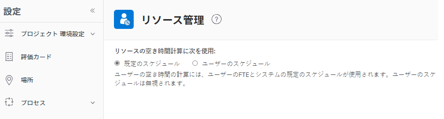
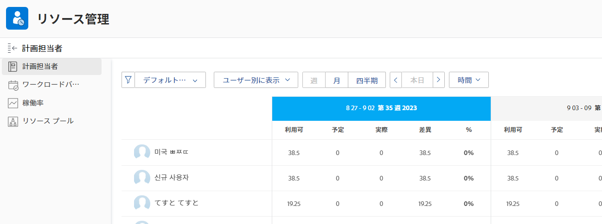
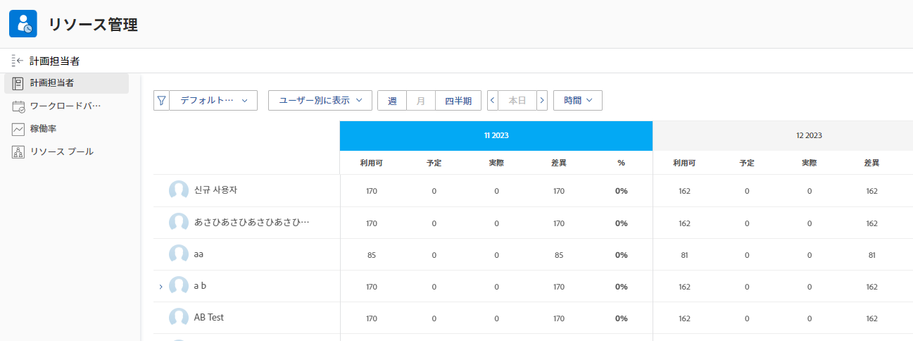

# リソースプランナーでのユーザーと役割に対する時間と FTE の計算の概要

<!--

(NOTE: Alina:KEEP THIS:***Linked to: Configuring My Settings, Editing User Accounts, Planning in the Resource Planner -- *** Some of this documentation is also duplicated in this article (Scheduling): https://support.workfront.com/hc/en-us/articles/360000557174)

-->

リソースプランナーで、リソースの割り当てとリソースの空き時間を時間、FTE、コストのいずれかで表示できます。\
リソースプランナーでのコストの計算について詳しくは、[リソースプランナーでのコストの計算](../../resource-mgmt/resource-planning/calculate-costs-resource-planner.md)を参照してください。

「FTE」は、フルタイム換算を表します。ユーザーまたは担当業務ごとに、1 日または 1 週間の実際の作業に費やされる時間を表す時間の単位です。

次のリソース情報のセットは、リソースプランナーでは異なる方法で計算されます。

* 空き時間または FTE の値は、システム管理者がシステムでリソース管理環境設定を設定する方法に基づいて計算されます。\
  空き時間と FTE の値の計算方法について詳しくは、[リソースプランナーでユーザーおよび担当業務の空き時間または FTE を計算](#calculate-available-hours-or-fte-for-users-and-job-roles-in-the-resource-planner)を参照してください。\
  Adobe Workfront システムのリソース管理環境設定の定義について詳しくは、[リソース管理環境設定の指定](../../administration-and-setup/set-up-workfront/configure-system-defaults/configure-resource-mgmt-preferences.md)を参照してください。

* その他のすべての FTE 値は、システムのデフォルトのスケジュールに基づいて計算されます。\
  FTE を使用する場合に、他のすべての値がリソースプランナーにどのように表示されるかについて詳しくは、この記事の[リソースプランナーでユーザーおよび担当業務のその他すべての時間および FTE 値を計算](#calculate-all-other-hour-and-fte-values-for-users-and-job-roles-in-the-resource-planner)の節を参照してください。

各ユーザーとその担当業務に対する FTE の内容を理解し、リソースを作業に割り当てる際にリソースを正確に管理することが重要です。

## リソースプランナーでユーザーおよび担当業務の空き時間または FTE を計算 {#calculate-available-hours-or-fte-for-users-and-job-roles-in-the-resource-planner}

* [リソースプランナーでユーザーの空き時間と FTE を計算](#calculate-the-available-hours-and-fte-for-a-user-in-the-resource-planner)
* [リソースプランナーで担当業務の空き時間と FTE を計算](#calculate-the-available-hours-and-fte-for-a-job-role-in-the-resource-planner)
* [リソースプランナーでユーザーの空き時間と FTE を計算（例）](#calculate-the-available-hours-and-fte-for-a-user-in-the-resource-planner-example)

### リソースプランナーでユーザーの空き時間と FTE を計算 {#calculate-the-available-hours-and-fte-for-a-user-in-the-resource-planner}

Workfront 管理者は、設定のリソース管理領域で次のいずれかを使用するように選択することで、ユーザーの空き時間を計算する方法を決定します。

* システムのデフォルトのスケジュールとユーザーの FTE。
* ユーザーのスケジュール。

>[!NOTE]
>
>これにより、システムレベルでのリソースの空き時間を計算する方法が決まります。システムのリソース管理環境設定の定義について詳しくは、[リソース管理環境設定の指定](/help/quicksilver/administration-and-setup/set-up-workfront/configure-system-defaults/configure-resource-mgmt-preferences.md)を参照してください。

この設定の構成に基づいて、リソースプランナーでのユーザーの空き時間（時間数および FTE の空き時間）は、次の方法で計算されます。

* **デフォルトのスケジュール**：システムのデフォルトのスケジュールとユーザーの FTE を使用して、リソースプランナーのユーザーの空き時間数と FTE 値を決定します。ユーザーのスケジュールは無視されます。この場合、次のようになります。

   * リソースプランナーの&#x200B;**空き時間数**&#x200B;は、次の式を使用して計算されます。

     `User Available Hours = Default Schedule Hours * User FTE value`

     例えば、デフォルトのスケジュールで空き時間が週に 40 時間、ユーザー FTE が 0.5 の場合、ユーザーはリソースプランナーで週 20 時間作業することができます。

     デフォルトのスケジュールを含むスケジュールについて詳しくは、[スケジュールの作成](/help/quicksilver/administration-and-setup/set-up-workfront/configure-timesheets-schedules/create-schedules.md)を参照してください。

   * リソースプランナーでのユーザーの&#x200B;**利用可能 FTE**&#x200B;は、ユーザー設定で指定されたユーザー FTE と同じです。

     例えば、ユーザー設定でユーザー FTE が 0.5 の場合、ユーザーの利用可能な FTE は、リソースプランナーで 0.5 となります。ユーザー設定に表示されるユーザー FTE の値について詳しくは、[ユーザーのプロファイルの編集](/help/quicksilver/administration-and-setup/add-users/create-and-manage-users/edit-a-users-profile.md)を参照してください。

* **ユーザーのスケジュール**：ユーザーのスケジュールは、リソースプランナーでのユーザーの空き時間を決定するために使用されます。ユーザーの FTE の値は無視されます。この場合、次のようになります。

   * リソースプランナーの&#x200B;**空き時間数**&#x200B;は、ユーザーのスケジュールの時間数と同じです。

     例えば、ユーザーのスケジュールで空き時間が週に 40 時間の場合、ユーザーはリソースプランナーで週 40 時間作業することができます。

   * リソースプランナーの&#x200B;**利用可能な FTE** は、次の式で計算されます。

     `User Available FTE = Hours from the Schedule of the User/ Default Schedule Hours`

     例えば、ユーザーのスケジュールで空き時間が 20 時間、Workfront のデフォルトのスケジュールで空き時間が 40 時間の場合、ユーザー FTE は 0.5 になります。

     デフォルトのスケジュールを含むスケジュールについて詳しくは、[スケジュールの作成](/help/quicksilver/administration-and-setup/set-up-workfront/configure-timesheets-schedules/create-schedules.md)を参照してください。

>[!NOTE]
>
>ユーザーがスケジュールに関連付けられていない場合、ユーザーの空き時間数はデフォルトのスケジュールを使用して計算されます。

### リソースプランナーで担当業務の空き時間と FTE を計算 {#calculate-the-available-hours-and-fte-for-a-job-role-in-the-resource-planner}

最初にユーザーの空き時間を計算し、次に各担当業務の空き時間を計算する必要があります。

リソースプランナーでの担当業務の空き時間は、ユーザーの空き時間の合計と、ユーザーの各役割に関連する **FTE の空き時間の割合**&#x200B;を考慮します。\

ユーザーの担当業務に **FTE の空き時間の割合**&#x200B;の値を関連付ける方法について詳しくは、[ユーザープロファイルの編集](../../administration-and-setup/add-users/create-and-manage-users/edit-a-users-profile.md)を参照してください。

例えば、ユーザーの空き時間数の値が 40 で、プライマリ役割を果たすのに費やせる時間が 75%、その他の役割を果たすのに費やせる時間が 25% である場合、リソースプランナーでは、プライマリ役割に費やせる 1 週間の&#x200B;**空き時間数**&#x200B;の値は 30 時間で、その他の役割に費やせる 1 週間の&#x200B;**空き時間数**&#x200B;の値は 10 時間となります。この場合、プライマリ役割の FTE は 0.75、その他の役割の FTE は 0.25 となります。

>[!NOTE]
>
>ユーザーの空き時間の合計は、この記事の[リソースプランナーでユーザーの空き時間と FTE を計算](#calculate-the-available-hours-and-fte-for-a-user-in-the-resource-planner)の節で説明されている、2 つの方法のいずれかによって計算されます。

役割ビューでリソースプランナーを表示する場合、1 つの担当業務の空き時間は、その担当業務を果たすことができるすべてのユーザーの空き時間の合計です。\
リソースプランナーでのリソースの空き時間について詳しくは、[リソースプランナーの概要](../../resource-mgmt/resource-planning/get-started-resource-planner.md)を参照してください。

### リソースプランナーでユーザーの空き時間と FTE を計算（例） {#calculate-the-available-hours-and-fte-for-a-user-in-the-resource-planner-example}

リソース管理の環境設定でシステム管理者が FTE 計算に使用する方法に応じて、ユーザーの利用可能時間数と利用可能な FTE がリソースプランナーでどのように計算されるかを、次の表に示します。

この例では、以下の数値を使用します。

* システムのデフォルトのスケジュール：40 時間
* ユーザーのスケジュール：20 時間
* ユーザーの FTE：0.8

| FTE の計算方法（システム設定） | **ユーザーのスケジュールからの時間数** | **デフォルトのスケジュールからの時間数** | **「ユーザーの FTE」フィールド** | **リソースプランナーでの利用可能時間数** | **リソースプランナーでの利用可能な FTE** |
|---|---|---|---|---|---|
| **デフォルトのスケジュール** | 無視 | 40 | 0.8 | **32**（計算値） | **0.8** |
| **ユーザーのスケジュール** | 20 | 40 | 無視 | **20** | **0.5**（計算値） |

スケジュール例外と休暇が、予定時間数または FTE の値に影響を与える可能性があります。詳しくは、[リソース管理の環境設定](../../administration-and-setup/set-up-workfront/configure-system-defaults/configure-resource-mgmt-preferences.md)を参照してください。

ユーザーおよび時間数別のリソースプランナービューの例：

ユーザーおよび FTE 別のリソースプランナービューの例：

## リソースプランナーでユーザーおよび担当業務の他のすべての時間数および FTE の値を計算 {#calculate-all-other-hour-and-fte-values-for-users-and-job-roles-in-the-resource-planner}

利用可能時間数や FTE に加えて、以下の時間情報もリソースプランナーに表示されます。

* 予定時間数
* 予算計上時間数
* 時間差異
* 正味時間数\
  これらの値について詳しくは、[リソースプランナーのプロジェクトビューと役割ビューにおける時間数、FTE およびコスト情報の概要](../../resource-mgmt/resource-planning/overview-of-planner-hour-fte-cost-information-in-role-project-views.md)を参照してください。

* 時間差\
  この値が表す内容について詳しくは、[リソースプランナーのプロジェクトビューと役割ビューにおける時間数、FTE およびコスト情報の概要](../../resource-mgmt/resource-planning/overview-of-planner-hour-fte-cost-information-in-role-project-views.md)を参照してください。

リソースプランナーでは、同じ情報を FTE として表示することも時間数として表示することもできます。

Workfront では、リソースプランナーで他のすべての値を FTE として表示する場合、次の式を使用します。

`FTE = Resource Planner Hours/ Default Schedule Hours`

>[!NOTE]
>
>リソースプランナーでは、利用可能な（AVL）FTE の値を除くすべての値の FTE を計算する際に、ユーザーのスケジュールは無視されます。計算にはデフォルトのスケジュールのみが考慮されます。

この計算は次の値に適用されます。

* 予定 FTE（PLN）
* 予算計上 FTE（BDG）
* FTE の差（VAR）
* 正味 FTE
* FTE の差（DIF）
