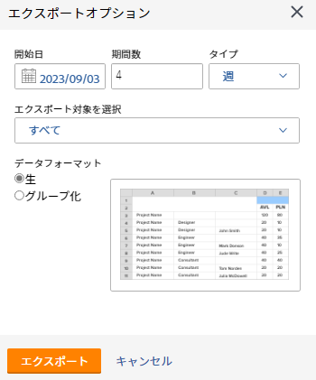

# リソースプランナーからの情報のエクスポート

リソースプランナーの任意のビューから、お使いのコンピューターに保存されている Excel(.xlsx) ファイルに情報を書き出すことができます。

>[!IMPORTANT]
>
>表示する情報と、リソース・プランナからエクスポートできる情報には、制限があります。 これらの制限について詳しくは、 [リソース・プランナの表示制限](../../resource-mgmt/resource-planning/resource-planner-display-limitations.md)

## アクセス要件

以下が必要です。

<table style="table-layout:auto"> 
 <col> 
 <col> 
 <tbody> 
  <tr> 
   <td role="rowheader">Adobe Workfront plan*</td> 
   <td> 
Pro 以降
 </td> 
  </tr> 
  <tr> 
   <td role="rowheader">Adobe Workfront license*</td> 
   <td> 
レビュー以上 <!--
      <MadCap:conditionalText data-mc-conditions="QuicksilverOrClassic.Draft mode">
       (this seems to be the case in NWE only, not classic. Waiting on Vazgen's response for this)
      </MadCap:conditionalText>
     -->
 </td> 
  </tr> 
  <tr> 
   <td role="rowheader">アクセスレベル設定*</td> 
   <td> 
プロジェクト、ユーザー、およびリソース管理へのアクセス権を表示または高くします
 
<b>メモ</b>

まだアクセス権がない場合は、Workfront管理者に、アクセスレベルに追加の制限を設定しているかどうかを問い合わせてください。 Workfront管理者がアクセスレベルを変更する方法について詳しくは、 <a href="../../administration-and-setup/add-users/configure-and-grant-access/create-modify-access-levels.md" class="MCXref xref">カスタムアクセスレベルの作成または変更</a>.
 </td>
</tr> 
  <tr> 
   <td role="rowheader">オブジェクト権限</td> 
   <td> 
プロジェクトの権限以上を表示
 
追加のアクセス権のリクエストについて詳しくは、 <a href="../../workfront-basics/grant-and-request-access-to-objects/request-access.md" class="MCXref xref">オブジェクトへのアクセスのリクエスト </a>.
 </td> 
  </tr> 
 </tbody> 
</table>

&#42;保有しているプラン、ライセンスの種類、アクセス権を確認するには、Workfront管理者に問い合わせてください。

## リソースプランナーからの情報のエクスポート

1. 次をクリック： **メインメニュー** アイコン  Adobe Workfrontの右上隅にある

1. クリック **リソース**. この **プランナー** はデフォルトで表示されます。

1. プランナーのビューを選択します。 次のいずれかのオプションを選択できます。

   * ユーザー別に表示
   * プロジェクト別に表示
   * 役割別に表示

1. クリック **書き出し**.

   [ 書き出しオプション ] ダイアログボックスが表示されます。

   

1. 次の情報を指定します。\
   **開始日**:エクスポートの開始日。 エクスポートされたファイルには、割り当てと可用性に関する情報が含まれます。割り当ては、ここで指定した日を含む週の最初の曜日から始まります。\
   **期間数**:ファイルに含める期間の数。 デフォルトは 4 つのピリオドです。\
   **タイプ**:エクスポートされたファイルに情報を表示する期間のタイプ（週、月、四半期）。\
   エクスポートできる最大期間は次のとおりです。

   * 52 週間
   * 36 か月
   * 12 四半期

   **書き出し用に選択**:選択したビューに応じて、画面に表示されるすべてのオブジェクトまたは特定のオブジェクトの可用性と予算の情報をエクスポートすることを選択できます。
次の情報の書き出しを選択できます。

   * プロジェクトビューで、書き出しを選択します。

      * プロジェクト
      * プロジェクトと役割
      * すべて（これはデフォルトのオプションです）
   * ユーザービューで、書き出しを選択します。

      * ユーザー
      * ユーザーとプロジェクト
      * すべて（これはデフォルトのオプションです）
   * ロールビューで、書き出す項目を選択します。

      * 役割
      * 役割とプロジェクト
      * すべて（これはデフォルトのオプションです）

   **データの書式設定**:Excel ファイルの表示方法に応じて、次のオプションを選択します。

   * **生**:Excel ファイル内のオブジェクトによって、可用性と割り当て情報のグループ化が解除された状態を表示する場合に選択します。 （これはデフォルトのオプションです）
   * **グループ化**:選択すると、属するオブジェクトごとにグループ化された可用性と割り当て情報が表示されます。 書き出された情報が、画面に表示された状態で表示されます。

   [ 書き出しオプション ] ダイアログボックスには、書き出したファイルでの情報の見え方のサンプルが表示されます。

1. クリック **書き出し** をクリックして、リソース・プランナから情報をエクスポートします。\
   保存した情報のみが書き出されます。

1. （条件付き）[ 役割 ] ビューまたは [ プロジェクト ] ビューに未保存の予算時間がある場合は、 **保存して続行します。**
Excel(.xlsx) ファイルがコンピューターにダウンロードされます。
\
   ファイルのダウンロード準備中は、リソースプランナーからのエクスポートは使用できません。\
   （条件付き）大量のデータを書き出すと、ファイルをダウンロードできるリンクが記載された電子メールが届きます。\
   

1. （条件付き）エクスポートしたファイルが記載された電子メールを受信したら、 **ダウンロード** をクリックして、ファイルをダウンロードします。\
   これにより、Workfrontに戻り、ファイルをダウンロードできます。\
   ダウンロードを完了するには、Workfrontにログインする必要があります。\
   ファイルの配信時にダウンロードしなかった場合、ダウンロードリンクは、エクスポートを開始してから 7 日間アクティブのままです。
