# リソースプランナーで情報をフィルタリング

<!--

(AL:*Iterate on this article: filtering by custom data. Other enhancements? Special characters caveat might change - follow the story to know when. It originally came in Beta 3 17.3.)

-->

フィルターを使用すると、システムに保存されているすべての情報から、リソースプランナーに表示される情報を変更できます。

## アクセス要件

以下が必要です。

<table style="table-layout:auto"> 
 <col> 
 <col> 
 <tbody> 
  <tr> 
   <td role="rowheader">Adobe Workfront プラン*</td> 
   <td> 
Pro 以上
 </td> 
  </tr> 
  <tr> 
   <td role="rowheader">Adobe Workfront ライセンス*</td> 
   <td> 
レビュー以上<!--
      <MadCap:conditionalText data-mc-conditions="QuicksilverOrClassic.Draft mode">
        (this seems to be the case in NWE only, not classic. Waiting on Vazgen's response for this)
      </MadCap:conditionalText>
     -->
 </td> 
  </tr> 
  <tr> 
   <td role="rowheader">アクセスレベル設定*</td> 
   <td> 
プロジェクト、ユーザー、およびリソース管理に対する、表示以上のアクセス権 
 
<b>メモ</b>

まだアクセス権がない場合は、Workfront 管理者に問い合わせて、アクセスレベルに追加の制限が設定されているかどうかを確認してください。Workfront 管理者がアクセスレベルを変更する方法について詳しくは、「<a href="../../administration-and-setup/add-users/configure-and-grant-access/create-modify-access-levels.md" class="MCXref xref">カスタムアクセスレベルの作成または変更</a>」を参照してください。
 </td>
</tr> 
  <tr> 
   <td role="rowheader">オブジェクト権限</td> 
   <td> 
プロジェクトに対する、表示以上の権限
 
追加のアクセス権のリクエストについて詳しくは、<a href="../../workfront-basics/grant-and-request-access-to-objects/request-access.md" class="MCXref xref">オブジェクトへのアクセス権のリクエスト</a>を参照してください。
 </td> 
  </tr> 
 </tbody> 
</table>

*保有するプラン、ライセンスタイプまたはアクセス権を確認するには、Workfront 管理者にお問い合わせください。

## リソースプランナーのフィルターの概要

リソースプランナーに表示される情報量を最小限に抑えるために、Adobe Workfront には事前設定された条件を持つデフォルトのフィルターが用意されています。デフォルトのフィルターについて詳しくは、[リソースプランナーのデフォルトのフィルターの概要](#overview-of-the-default-filter-in-the-resource-planner)を参照してください。

カスタマイズしたフィルターを作成することもできます。リソースプランナーのフィルターのカスタマイズについて詳しくは、[リソースプランナーのフィルターを作成](#create-resource-planner-filters)の節を参照してください。

リソースプランナーでフィルターを使用する際は、次の点に注意してください。

* 作成したフィルターは、自分にのみ表示されます。フィルターを共有して、他のユーザーが利用できるようにすることができます。
* Workfront 管理者は、自分が作成したフィルター、または自分が共有しているフィルターのみを表示できます。
* リソースプランナーに対して別のビューを選択した場合、フィルタリングされた結果は変更されません。\
  リソースプランナーでのビューの変更について詳しくは、[リソースプランナーのナビゲーションの概要](../../resource-mgmt/resource-planning/resource-planner-navigation.md)の、プロジェクト／役割／ユーザービューの選択の節を参照してください。

* フィルターを適用しても、プロジェクト、リソースプランナーでの役割またはユーザーの配分および空き時間のデータは変更されません。フィルターによって変更するのは、リソースプランナーに表示されるオブジェクトの数のみです。
* フィルタリングは、リソースプランナーに同時に表示されるすべてのオブジェクトに適用されます。例えば、特定のユーザーに対してフィルターを適用すると、リソースプランナーには次の結果のみが表示されます。

   * そのユーザーがリソースプールに属しているプロジェクト（プロジェクトビューと役割ビューの場合）、またはユーザーに割り当てがあるプロジェクト（ユーザービューの場合）
   * これらのプロジェクトでユーザーに関連付けられた役割\
     ユーザーが関連付けられているプロジェクト上の、その他の役割またはユーザーは表示されません。

## リソースプランナーのデフォルトのフィルターの概要 {#overview-of-the-default-filter-in-the-resource-planner}

リソースプランナーを初めて開いた際、Workfront によってデフォルトのフィルターが適用されます。デフォルトのフィルターを編集して、表示する項目だけをフィルタリングできます。フィルターの変更について詳しくは、[リソースプランナーでのフィルターの編集](#edit-a-filter-in-the-resource-planner)を参照してください。

デフォルトのフィルターを使用する際は、次の点に注意してください。

* デフォルトのフィルターは、次の情報を持つプロジェクトからのみ情報を取得します。

   * 現在の月の最初の日付より後に発生する予定完了日
   * 現在の日付から 4 か月目の最終日の前に発生する予定開始日
   * 現在または計画中のステータス

  >[!IMPORTANT]
  >
  >デフォルトのフィルターでは、リソースプランナーで表示する期間に関係なく、常に現在の月の最初の日から 4 か月以内に発生するプロジェクトから情報を取得します。

* ユーザービューでは、システム内のすべてのユーザーが表示されますが、フィルタリングされたプロジェクトに関連付けられたユーザーのみに時間の情報が表示されます。
* デフォルトのフィルターを保存しなくても、その内容を編集できます。
* デフォルトのフィルターを複製して編集し、そのフィルター内の条件を変更して、新しいフィルターとして保存できます。
* デフォルトのフィルターを削除または共有することはできません。

  

## リソースプランナーでのフィルターの作成 {#create-resource-planner-filters}

<!--

(Alina: **^ This section is somewhat duplicated (format more than content) from the "Filtering Utilization Information" section in "Viewing Utilization Information for Projects, Programs, and Portfolios.")

-->

リソースプランナーでのフィルターの作成は、すべてのビューで同じです。

フィルターを作成する前に、リソースプランナーで正しい情報を表示するための前提条件が設定されていることを確認します。\
リソースプランナーでの作業に必要な前提条件については、[リソースプランナーの概要](../../resource-mgmt/resource-planning/get-started-resource-planner.md)の記事にある「リソースプランナーでの作業の前提条件」の節を参照してください。

フィルターを作成する際は、次の点に注意してください。

* 一度にフィルタリングできるオブジェクトの数に制限はありません。
* フィルターに追加できるフィールドは、リソースプランナーに適用するビューのオブジェクトに応じて変化します。たとえば、イシューフィールドとタスクフィールドは、ユーザービューにのみ表示されるので、ユーザービューでのみフィルター処理できます。ユーザービューでイシューまたはタスクのフィルターを作成し、それをプロジェクトビューまたは役割ビューに適用した場合、プロジェクトビューまたは役割ビューにフィールドが存在しないので、このフィルターは無視されます。この場合、フィルターは使用できません。

リソースプランナーでフィルターを作成する手順は、次の通りです。

1. Adobe Workfront の右上隅にある&#x200B;**メインメニュー**&#x200B;アイコン  をクリックします。

1. 「**リソース**」をクリックします。

   「**計画担当者**」がデフォルトで表示されます。

   デフォルトでは、リソースプランナーに初めてアクセスすると、<strong>デフォルトのフィルター</strong>が適用されます。 デフォルトのフィルターについて詳しくは、記事内の<a href="#overview-of-the-default-filter-in-the-resource-planner" class="MCXref xref">リソースプランナーのデフォルトフィルターの概要</a>の節を参照してください。

1. の左上隅で、**フィルター**&#x200B;アイコンをクリックします。\
   \
   または\
   **フィルター**&#x200B;ドロップダウンメニューを展開し、「**新規フィルターを追加**」をクリックします。\
   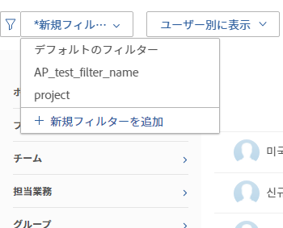

1. ビルトインの条件を使用してフィルターを作成するには、次のいずれかのフィールドを指定します。

   * **ポートフォリオ**：リソースプランナーに入れる情報を含むポートフォリオ名を入力し、リストに表示されたら名前をクリックします。\
     複数のポートフォリオの情報を含めるには、この手順を繰り返します。

   * **プロジェクトのステータス**：プロジェクトのステータスドロップダウンメニューを展開し、リストから 1 つ以上のプロジェクトのステータスを選択します。
   * **チーム**：表示するプロジェクトのタスクに割り当てられたユーザーに関連付けられた 1 つ以上のチームの名前を入力します。
   * **担当業務**：表示するプロジェクトのタスクに割り当てられたユーザーに関連付けられた 1 つ以上の担当業務の名前を入力します。
   * **プール**：プロジェクト（プロジェクトビューの場合）もしくはユーザー（ユーザービューの場合）に関連付けられている 1 つ以上のリソースプールの名前、または表示するプロジェクトとユーザーの両方（役割ビューの場合）に関連付けられている 1 つ以上のリソースプールの名前を入力します。
   * **グループ**：表示するユーザー（ユーザービューの場合）またはプロジェクト（プロジェクトビューおよび役割ビューの場合）に関連付けられた 1 つ以上のグループの名前を入力します。

1. 「**フィルタールールを追加**」をクリックし、**入力して項目をフィルタリング**&#x200B;ボックスでフィルター処理するフィールド名を入力します。フィールドが使用可能な場合は、関連付けることが可能な各オブジェクトに対してが設定されます。

   >[!IMPORTANT]
   >
   >カスタムフィールドを参照する場合は、フィールドラベルではなくフィールド名を入力する必要があります。フィールドラベルは、オブジェクトに添付されたカスタムフォームに表示されます。ラベルとカスタムフィールドの名前の違いについて詳しくは、[カスタムフォームの作成と編集](../../administration-and-setup/customize-workfront/create-manage-custom-forms/create-or-edit-a-custom-form.md)を参照してください。

1. フィールドの名前をクリックして、リストに表示される場合はフィルターに追加します。\
   リストに表示されるフィールドについて詳しくは、[Adobe Workfront の用語集](../../workfront-basics/navigate-workfront/workfront-navigation/workfront-terminology-glossary.md)を参照してください。

1. （オプション）フィルターおよびフィルターの条件修飾子を選択します。使用可能な修飾子については、[フィルターおよび条件修飾子](../../reports-and-dashboards/reports/reporting-elements/filter-condition-modifiers.md)で説明されています。

   ユーザーベースまたは日付ベースのワイルドカードを使用して、ログインしているユーザーに関連する情報をフィルタリングできます。\
   フィルターでサポートされるワイルドカードについて詳しくは、 [ワイルドカードフィルター変数の概要](../../reports-and-dashboards/reports/reporting-elements/understand-wildcard-filter-variables.md).

1. 「**保存**」をクリックして、フィルタールールを保存します。
1. （オプション）「**フィルタールールを追加**」をクリックして、別のオブジェクトまたはフィールドに新しいルールを追加します。
1. 「**適用**」をクリックして、保存せずにフィルターを適用します。

   または

   「**フィルターを保存**」をクリックして、フィルターを保存します。\
   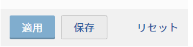

1. （条件付き）「**保存**」をクリックした後、**フィルターを保存**&#x200B;ダイアログボックス内の&#x200B;**フィルター名**&#x200B;ボックスでフィルターの名前を指定します。必須フィールドです。\
   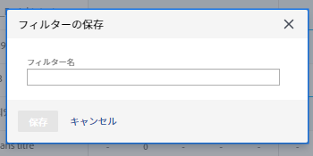

   >[!NOTE]
   >
   >フィルター名に特殊文字が含まれる場合は、次の文字のみを使用します。
   >
   >* コンマ
   >* スラッシュ
   >* ハイフン
   >* アンダースコア

1. 「**保存**」をクリックします。

   リソースプランナーの結果は、フィルタールールに含めた情報でフィルタリングされます。

## 既存のフィルターを適用

リソースプランナーへのアクセス権を持つユーザーがフィルターを保存すると、そのフィルターはリソースプランナーを使用するすべてのユーザーが使用できるようになります。

既存のフィルターを適用するには：

1. リソースプランナーに移動します。
1. 左上隅で、**フィルター**&#x200B;ドロップダウンメニューを展開します。

   このメニューでは、自分が作成したフィルターや、他のユーザーが作成し共有されたフィルターを確認できます。\
   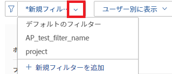

1. ドロップダウンメニューでフィルターを選択します。このメニューで、自分または他のユーザーが作成したフィルターを表示できます。\
   フィルターを選択すると、リソースプランナーに表示される情報の量が自動的に削減されます。

## リソースプランナーでのフィルターの編集 {#edit-a-filter-in-the-resource-planner}

次のいずれかの操作を行うと、リソースプランナーでフィルターを編集できます。

* [フィルターの名前を変更](#rename-a-filter)
* [フィルターの情報を編集](#edit-the-information-in-a-filter)
* [フィルターを複製](#duplicate-a-filter)

フィルターを編集すると、リソースプランナーにアクセスできるシステム内のすべてのユーザーに対して、フィルターが更新されます。

### フィルターの名前を変更する {#rename-a-filter}

条件を変更せずに、フィルターの名前を変更できます。フィルターは他のユーザーにも表示されるので、システム内の他のユーザーにこの変更について知らせることをお勧めします。この変更は、リソースプランナーを表示できるすべてのユーザーのフィルターのリストに影響します。

1. リソースプランナーに移動し、「**フィルター**」ドロップダウンメニューを展開して、保存済みフィルターを選択します。
1. **フィルター**&#x200B;ドロップダウンメニューを展開します。名前を変更するフィルターを見つけ、その名前の上にポインタを合わせます。
1. フィルター名の横にある「**フィルター名を変更**」アイコンを選択します。

   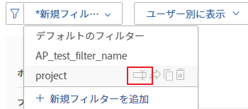

1. 「**フィルター名**」ボックスで、フィルターの新しい名前を指定します。
1. 「**保存**」をクリックします。\
   フィルターに含まれる情報は同じで、名前が更新されます。

### フィルターの情報を編集する {#edit-the-information-in-a-filter}

名前を変更せずに、フィルターに含める情報を変更できます。フィルターは他のユーザーにも表示されるので、システム内の他のユーザーにこの変更について知らせることをお勧めします。この変更は、リソースプランナーを表示できるすべてのユーザーのフィルターのリストに影響します。

1. リソースプランナーに移動し、左上隅にある&#x200B;**フィルター**&#x200B;ドロップダウンメニューを展開します。
1. 編集する既存のフィルターを選択します。
1. **フィルター**&#x200B;アイコンをクリックします。\
   

1. フィルターに新しいフィールドを追加します。\
   フィルターの作成について詳しくは、[リソースプランナーフィルターの作成](#create-resource-planner-filters)を参照してください。

1. フィルター用に選択された既存のフィールドの上にポインタを合わせて、**編集**&#x200B;アイコンをクリックして別のフィールドを選択するか、**削除**&#x200B;アイコンをクリックしてフィールドを削除します。\
   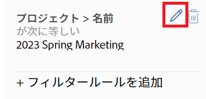

1. （オプション）「**フィルタールールを追加**」をクリックして、新しいフィールドをフィルターに追加します。\
   フィルター条件の定義について詳しくは、[リソースプランナーフィルターの作成](#create-resource-planner-filters)を参照してください。

1. 「**適用**」をクリックして、保存せずにフィルターを適用します。

   または

   「**保存**」をクリックして、フィルターを保存します。\
   フィルターは、同じ名前で、新しいフィルター条件で保存されます。

### フィルターを複製 {#duplicate-a-filter}

既存のフィルターを複製できます。元のフィルター条件は、複製されたフィルターでも同じままで、新しいフィルターを新しい名前で保存できます。

1. リソースプランナーに移動し、左上隅にある&#x200B;**フィルター**&#x200B;ドロップダウンメニューを展開します。
1. 複製する保存済みフィルターの名前の上にポインタを合わせます。
1. **複製**&#x200B;アイコンをクリックします。

   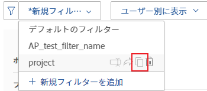\
   「フィルターを複製」ボックスが表示されます。

1. 「**フィルター名**」フィールドで、複製したフィルターの新しい名前を指定します。\
   新しいフィルターのデフォルト名は、*`<Original Filter Name>`（コピー）*&#x200B;です。

1. 「**保存**」をクリックします。新しいフィルターは、元のフィルターと同じ条件と新しい名前で作成されます。

   >[!NOTE]
   >
   >同じ名前で同じ条件を持つ 2 つのフィルターを使用できますが、混乱を避けるために、一意のフィルター条件と名前を持つフィルターをリソースプランナーに保存することをお勧めします。

## フィルターを削除

不要になったフィルターは削除できます。デフォルトのフィルターは削除できません。

デフォルトのフィルターについては、この記事の[リソースプランナーのデフォルトフィルターの概要](#overview-of-the-default-filter-in-the-resource-planner)の節を参照してください。

フィルターを削除すると、リソースプランナーにアクセスできるすべての Workfront ユーザーのフィルターが削除されます。削除する前に、削除するフィルターが、リソースプランナーで作業している他のユーザーによって使用されていないことを確認します。削除したフィルターは復元できません。

フィルターを削除するには：

1. リソースプランナーに移動します。
1. **フィルター**&#x200B;ドロップダウンメニューを展開します。
1. 削除するフィルターを見つけ、その名前にポインタを合わせます。
1. フィルターの名前の横にある&#x200B;**フィルターの削除**&#x200B;アイコンを選択します。

   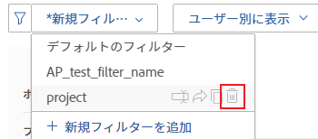

1. **フィルターの削除**&#x200B;ダイアログボックスで、「**削除**」をクリックします。

1. フィルターが削除され、リソースプランナーから削除されます。

## フィルターを共有

自分で作成したフィルターや、他のユーザーと共有するためのアクセス権を持つフィルターを共有できます。デフォルトのフィルターは共有できませんが、複製してコピーを共有することはできます。

>[!NOTE]
>
>Workfront の管理者を含むすべてのユーザーは、自分が作成したフィルターまたは自分と共有しているフィルターにのみアクセスできます。フィルターを特定のユーザーと共有すると、すべてのリソースプランナーユーザーがフィルターを使用できるようにできます。

デフォルトのフィルターについては、この記事の[リソースプランナーのデフォルトフィルターの概要](#overview-of-the-default-filter-in-the-resource-planner)の節を参照してください。

フィルターの複製については、[フィルターを複製](#duplicate-a-filter)の節を参照してください。

1. リソースプランナーに移動します。
1. **フィルター**&#x200B;ドロップダウンメニューを展開します。
1. 共有するフィルターを見つけ、その名前にポインタを合わせます。
1. フィルターの名前の横にある&#x200B;**フィルターの共有**&#x200B;アイコンを選択します。

   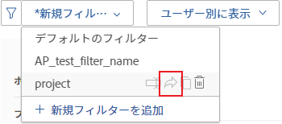

   フィルターのアクセス権限ダイアログボックスが表示されます。

1. （オプション）フィルターをリソースプランナーのすべてのユーザーが使用できるようにするには、**設定**&#x200B;アイコンをクリックし、「**Workfront 内のすべてのユーザーが確認できるようシステム全体で表示する**」を選択します。

   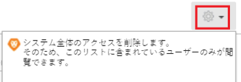

1. 「**リソースプランナーフィルターへのアクセス権を次に付与**」ボックスに、フィルターを共有するユーザー、チーム、役割、グループまたは会社の名前を入力していきます。
1. 次の権限レベルから選択します。

   * 表示
   * 管理

     Workfront での権限については、[オブジェクトに対する権限の共有の概要](../../workfront-basics/grant-and-request-access-to-objects/sharing-permissions-on-objects-overview.md)を参照してください。

1. （オプション）「**詳細設定**」をクリックして、各レベルの権限を選択して追加するか、各レベルの権限を選択解除して削除します。

   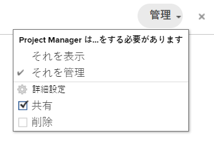

1. 「**保存**」をクリックします。

   フィルターが、選択したエンティティと共有され、「**自分と共有**」エリアに表示されます。

   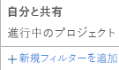
