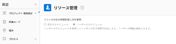
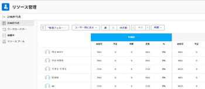

# リソースプランナーの概要

<!--

(Alina: this used to be the beginning of Planning in the Resource Planner - consider restructuring it further? Merging some of this information with information about Understanding Navigation in the RP?!)

-->

割り当て先のプロジェクトに対する生産資源の割当を見積もり、予算を作成し、「生産資源プランナ」を使用して、将来の作業に対する生産資源の使用可能性を予測できます。

Adobe Workfrontのリソース計画の概要については、この記事を参照してください。 [リソース計画の概要](../../resource-mgmt/resource-planning/get-started-resource-planning.md).

## リソースプランナーの概要

リソースプランナーを使用すると、ユーザーとジョブの役割の可用性、およびプロジェクトの作業を完了するのに必要な予定時間を簡単に理解できます。 その後、使用可能な時間に基づいて、割り当て先のプロジェクトにユーザーとそのジョブの役割を割り当てる方法を決定できます。

>[!IMPORTANT]
>
>リソース・プランナを使用して、実績作業時間（タスクとタスク）をユーザーに割り当てることはできません。 割り当てられているタスクや問題に関係なく、ユーザーやジョブの役割がプロジェクトを完了するのに必要な時間のみを見積もることができます。\
>実際の作業をユーザーに割り当てるには、ワークロード・バランサを使用する必要があります。 ワークロード・バランサの詳細は、 [ワークロードバランサーの概要](../../resource-mgmt/workload-balancer/overview-workload-balancer.md).

リソース・プランナの情報は、3 つの異なるビューを使用して表示できます。 各ビューを使用して、次のいずれかの目的を満たすことができます。

* [ プロジェクト ] ビューと [ 役割 ] ビューを使用して、実行する必要のある作業に対するリソースの時間やコストを予算化する。 これは、リソースプランナーの主な目的です。\
   リソース・プランナでの予算編成の詳細は、この記事を参照してください。 [「プロジェクト」ビューと「ロール」ビューを使用する、リソースプランナーの予算リソース](../resource-planning/budget-resources-project-role-views-resource-planner.md).

* ユーザービューを使用して次の情報を表示するには：

   * スケジュールに従ったユーザーの可用性
   * プロジェクト計画に従って作業を完了するのに必要な予定時間。
   * ユーザーが実際の作業項目に既にログオンした時間。

   リソース・プランナでのユーザーの「使用可能時間」、「計画時間」、「実績時間」または「実績時間」の表示の詳細は、この記事を参照してください [ユーザー・ビューを使用する場合は、リソース・プランナで「使用可能」、「計画済」、「実績時間」または「工数」を表示します](../../resource-mgmt/resource-planning/view-hours-fte-user-view-resource-planner.md#using).

## リソースプランナーの考慮事項

* 作業中のプロジェクトに優先順位を付け、その優先順位に従ってリソースの割り当てを予算して、最も重要なプロジェクトに最初にリソースを割り当てることができます。

   リソース・プランナのプロジェクトの優先順位付けの詳細は、 [リソースプランナーのプロジェクトに優先順位を付ける](../../resource-mgmt/resource-planning/prioritize-projects-resource-planner.md).

* プロジェクトのタスクと問題から時間、工数、コストの情報を表示できます。

   >[!NOTE]
   >
   >タスクと懸案事項は、リソースプランナーには表示されません。 ただし、タスク上のリソース割り当ての時間、工数および原価情報は、プロジェクトの総数としてリソースプランナーに表示されます。

* 親タスクの時間、工数および原価情報は、リソース・プランナに表示されるプロジェクトから除外されます。 リソースプランナーでリソースの時間やコストを管理する場合は、子タスクにのみリソースを割り当てることをお勧めします。

   親タスクの詳細については、次の記事を参照してください。

   * [タスクの概要](../../manage-work/tasks/task-information/tasks-overview.md)
   * [サブタスクを作成](../../manage-work/tasks/create-tasks/create-subtasks.md)

   >[!TIP]
   >
   >親タスクには、子タスクの時間とコストの合計が表示されます。 このため、子タスクと親タスクから時間、工数、コストを計上すると、これらの金額が 2 回カウントされます。 親タスクの情報がリソース・プランナから除外されるのは、このためです。

* リソース・プランナにタスクや問題があるプロジェクトでは、チームの割り当てを管理できません。
* 複数のプロジェクトに対する生産資源は、「生産資源計画担当」を使用して一度に予算できます。また、ビジネス・ケースの「生産資源予算」領域を使用して、1 つのプロジェクトに対して予算できます。 1 つのプロジェクトに予算を設定した情報は、リソースプランナーにも表示されます。

   単一のプロジェクトにリソースを予算設定する方法については、「 [ビジネス事例の予算リソース](../../manage-work/projects/define-a-business-case/budget-resources-in-business-case.md).

   一度に複数のプロジェクトのリソースプランナーでリソースを予算設定する方法の詳細は、この記事の「リソースプランナーの予算リソース」の節を参照してください [「プロジェクト」ビューと「ロール」ビューを使用する、リソースプランナーの予算リソース](../../resource-mgmt/resource-planning/budget-resources-project-role-views-resource-planner.md).

## リソース・プランナでの作業の前提条件 {#prerequisites-for-working-in-the-resource-planner}

<!--

(<b>THIS SECTION IS LINKED TO ALL RES PLANNING ARTICLES. DO NOT RENAME OF DELETE THIS!</b> - do NOT ADD the variable here, because it might break this link!)

-->

リソースの予算作成にリソース・プランナを正しく使用するには、まず、自分、プロジェクト、タスクが一連の前提条件を満たしていることを確認する必要があります。 これらの前提条件は、リソースプランナーに正しい情報を表示し、リソースを正確に管理するために必須です。

>[!IMPORTANT]
>
>次の前提条件が満たされていない場合は、配分に関する情報の一部、またはリソースの可用性に関する情報が欠落している、またはゼロの値が設定されている可能性があります。\
>フィールドにデータがないか、値がゼロの理由を理解するには、フィールドの上にマウスポインターを置きます。

>[!NOTE]
>
>次の前提条件は、プロジェクト別または職務ロール別の生産資源プランナを表示する場合、またはプロジェクトのビジネス・ケースで生産資源を予算設定する場合にのみ必要です。

プロジェクト別またはロール別に表示する場合、リソース・プランナの正しい機能を正しく行うには、次のタイプの前提条件が必要です。

* [ユーザーの前提条件](#user-prerequisites)
* [プロジェクトの前提条件](#project-prerequisites)
* [タスクと問題の前提条件](#tasks-and-issues-prerequisites)
* [システムレベルの前提条件](#system-level-prerequisites)

### ユーザーの前提条件 {#user-prerequisites}

リソース・プランナの使用を開始する前に、次のユーザー設定が存在することを確認します。

* 予算リソースに正しくアクセスできます。

   予算リソースに必要なアクセスの詳細については、「 [Adobe Workfrontの予算リソースに必要なアクセス](../../resource-mgmt/resource-planning/access-needed-to-budget-resources.md).

* タスクに割り当てられたユーザーは、プロジェクトに関連付けられたリソースプールに追加されます。

   リソースプールにユーザーを追加する方法については、 [リソースプールとユーザーの関連付け](../../resource-mgmt/resource-planning/resource-pools/associate-resource-pools-with-users.md).

   >[!NOTE]
   >
   >ユーザーが資源プールに追加されない場合、次のシナリオが存在する可能性があります。
   >
   >   
   >   
   >   * ユーザーは、プロジェクトのタスクに割り当てられる場合がありますが、リソースプランナーには表示されません。
   >   * 関連付けられているタスクに予定時間がある場合、ユーザーがそれらのタスクの役割にも関連付けられていない限り、それらの時間はリソースプランナーのプロジェクトに表示されません。
   >   * ユーザーがプロジェクトのタスクのジョブ・ロールに関連付けられている場合、そのジョブ・ロールのリソース・プランナに「計画時間」が表示されますが、ジョブ・ロールは予算化できません。

* 作業および資源プールに割り当てられるユーザーのプロファイルには、スケジュールとジョブの役割が関連付けられている必要があります。

   スケジュールおよびジョブ・ロールとユーザーの関連付けについては、 [ユーザーのプロファイルの編集](../../administration-and-setup/add-users/create-and-manage-users/edit-a-users-profile.md).

   >[!NOTE]
   >
   >スケジュールに関連付けられていないが、プロジェクトの資源プールに存在するユーザーは、資源プランナーで予算を作成できません。

* 正確な使用可能時間情報を得るには、ユーザーに関連付けられたスケジュールの例外とタイムオフが更新されていることを確認します。

   >[!NOTE]
   >
   >ユーザーがスケジュールに関連付けられていない場合、Workfrontシステムのデフォルトスケジュールは、リソースプランナーの目的で、デフォルトでユーザーに関連付けられます。

   スケジュールの作成について詳しくは、この記事を参照してください。 [スケジュールの作成](../../administration-and-setup/set-up-workfront/configure-timesheets-schedules/create-schedules.md).

* 「原価」で生産資源を予算する場合は、「役職」ロールを「原価/人」に関連付ける必要があります。 料金。 リソースプール内のユーザーに割り当てられたジョブロールに関連付けられたコストは、プロジェクトの予算人件費と予算原価の計算に使用されます。\
   ジョブの役割とレートの関連付けについて詳しくは、「 [ジョブの役割の作成と管理](../../administration-and-setup/set-up-workfront/organizational-setup/create-manage-job-roles.md).\
   予算労務費の計算の詳細は、この記事を参照してください [プロジェクトの予算労務費と予算時間の把握](../../manage-work/projects/project-finances/budgeted-labor-cost.md).\
   予算原価の計算の詳細は、「 [予算コストの計算](../../manage-work/projects/project-finances/budgeted-cost.md).

### プロジェクトの前提条件 {#project-prerequisites}

リソース・プランナの使用を開始する前に、次のプロジェクト設定が存在することを確認します。

* プロジェクトは資源プールに関連付けられています。\
   プロジェクトへのリソースプールの追加の詳細については、 [リソースプールとプロジェクトおよびテンプレートの関連付け](../../resource-mgmt/resource-planning/resource-pools/associate-resource-pools-with-projects-and-templates.md).

   >[!IMPORTANT]
   >
   >資源プールのないプロジェクトでは、計画時間や割り当て情報は「資源プランナ」に表示されません。

### タスクと問題の前提条件 {#tasks-and-issues-prerequisites}

リソースプランナーにタスクとイシューを表示することはできませんが、その情報はリソースプランナーに表示されるプロジェクトに転送されます。

リソース・プランナで予算リソースを開始する前に、次のタスクと問題の設定が存在することを確認します。

* リソースを予算設定するプロジェクトのタスクまたは問題は、次のエンティティの 1 つに割り当てられます。

   * プロジェクトのリソースプール内のユーザーで、ジョブの役割にも関連付けられているユーザー
   * 担当業務

   >[!NOTE]
   >
   >ジョブ・ロールに割り当てられたタスクの計画時間とタスクのタスクは「リソース・プランナ」に表示されますが、ジョブ・ロールに関連付けられたユーザーがプロジェクトに関連付けられたリソース・プールにリストされていない場合、これらの時間は予算化できません。

* 親タスクは、ユーザーやロールに割り当てないでください。

   親タスクに関連付けられたユーザーまたはロールのリソース・プランナに時間情報を表示するには、子タスクにも割り当てる必要があります。 「生産資源プランナ」には、親タスクの情報は表示されません。

* タスクとタスクには、計画時間の値が 0 より大きい値が設定されます。
* タスクとタスクの期間には 0 より大きい値が設定されます。
* 問題の計画日は、プロジェクトのタイムライン内に表示されます。

### システムレベルの前提条件 {#system-level-prerequisites}

Workfrontのインスタンスが、システムのリソース管理環境設定に従ってユーザーの可用性を計算する方法を理解する必要があります。 Workfrontでは、ユーザープロファイルページで定義されたユーザーのスケジュール、またはシステムのデフォルトスケジュールを使用して、ユーザーの可用性を計算できます。

Workfront管理者がリソース管理環境設定を構成します。

詳しくは、 [リソース管理環境設定の指定](../../administration-and-setup/set-up-workfront/configure-system-defaults/configure-resource-mgmt-preferences.md).

## リソース・プランナの検索

<!--

(This became another standalone article; drfat this section here when article is live.)

-->

リソースプランナーは、複数のプロジェクトに対してリソースを予算するか、1 つのプロジェクトに対してのみ予算を割り当てるかに応じて、Workfrontの 2 つの領域に配置できます。

リソース・プランナの検索の詳細は、 [リソース・プランナの検索](../../resource-mgmt/resource-planning/locate-resource-planner.md).

<!--

(this is drafted and moved to its own article: locate-resource-planner) 

Ensure that all prerequisites are met before starting to use the Resource Planner. This way, you ensure that the Resource Planner displays the correct information before you start budgeting your resources. For information about the prerequisites that must be met before you can start using the Resource Planner, see the <a href="#prerequisites-for-working-in-the-resource-planner" class="MCXref xref">Prerequisites for working in the Resource Planner</a> section in this article. 

You can locate the Resource Planner in two areas of Workfront, depending on whether you want to budget your resources for multiple projects, or for just one project.

<ul>
<li><a href="#use-the-resource-planner-for-multiple-projects" class="MCXref xref">Use the Resource Planner for multiple projects</a> </li>
<li> 
<a href="#use-the-resource-planner-for-one-project" class="MCXref xref">Use the Resource Planner for one project</a> 
 </li>
</ul>

<strong>Use the Resource Planner for multiple projects</strong>

When using the Resource Planner for multiple projects, the allocation numbers for your resources represent numbers across multiple projects. 

To access the  Planner section  in the  Resourcing area: 

<ol>
<li value="1">  Click the <strong>Main Menu</strong> icon  in the upper-right corner of Adobe Workfront.  </li>
<li value="2"> 
  Click <strong>Resourcing</strong>. The Resource Planner displays by default.  For information about budgeting resources in the Resource Planner, see the article <a href="../../resource-mgmt/resource-planning/budget-resources-project-role-views-resource-planner.md" class="MCXref xref">Budget resources in the Resource Planner using the Project and Role views</a>. 
 
  
 </li>
<li value="3">  Hover over the left panel, and click <strong>Resource Pools</strong>.  For information about creating new resource pools, see <a href="../../resource-mgmt/resource-planning/resource-pools/create-resource-pools.md" class="MCXref xref">Create resource pools</a>.</li>
</ol>

<strong>Use the Resource Planner for one project</strong>

When using the Resource Planner for one project, the allocation numbers for your resources represent numbers for the selected project. 

<ol>
<li value="1"> 
Go to a project you want to budget resources for.
 </li>
<li value="2"> 
Click <strong>Business Case</strong> in the left panel.
 </li>
<li value="3"> 
Scroll to the <strong>Resource Budgeting</strong> section of the Business Case.
 </li>
<li value="4"> 
Click <strong>Edit Resource Budgeting</strong> to add resource pools to your project and start budgeting your resources. 
 <note type="tip">
You can only add a resource pool in the Resource Budgeting area of the Business Case when the project has no resource pools associated with it. When the project already has a resource pool, the users in the pool and their job roles display in the Resource Budgeting area by default.
</note> 
  
 
For information about budgeting resources for one project, see the article <a href="../../manage-work/projects/define-a-business-case/budget-resources-in-business-case.md" class="MCXref xref">Budget resources in the Business Case</a>.
 </li>
</ol>

-->

## リソースプランナーの領域

次の情報を表示したり、リソース・プランナで次の処理を実行したりできます。

* 一般的なタイムラインの「リソースプランナー」でプロジェクトに割り当てられたリソースに関する情報です。
* リソース・プランナのリソースの過剰割り当てまたは過少使用
* 手動または自動で作業するためにリソースを予算設定します。

リソースプランナーに表示される領域の詳細と、それらの領域に表示される情報の設定方法については、この記事を参照してください [リソースプランナーのナビゲーションの概要](../../resource-mgmt/resource-planning/resource-planner-navigation.md).

## リソース・プランナに情報を表示する際の制限

パフォーマンスを向上させるため、Workfrontでは、リソースプランナーに表示できる品目の数を制限します。

これらの制限について詳しくは、 [リソース・プランナの表示制限](../../resource-mgmt/resource-planning/resource-planner-display-limitations.md) .

## 資源プランナでの工数の計算

生産資源計画担当に、稼働状況、配賦および計画値を「時間」、「工数」または「原価」で表示できます。

リソース・プランナに表示する情報の変更の詳細は、「 [時間別、工数別、コスト別の情報の表示](../../resource-mgmt/resource-planning/resource-availability-allocation-resource-planner.md#display-by-hour-or-fte-menu) 記事内 [Adobe Workfront Resource Planner を使用したリソースの可用性と割り当てのレビュー](../../resource-mgmt/resource-planning/resource-availability-allocation-resource-planner.md).

Workfrontでのユーザーおよび役割の時間と工数の計算方法について詳しくは、この記事を参照してください。 [リソース・プランナのユーザーとロールの時間と工数の計算の概要](../../resource-mgmt/resource-planning/calculate-hours-fte-for-users-roles-resource-planner.md).

## リソースプランナーでのコストの計算

リソース・プランナのコスト別に情報を表示するには、プロジェクトに対する財務データの表示および財務の表示権限が必要です。

生産資源計画担当の稼働状況、配賦および計画値を「時間」および「工数」で表示するほか、原価別に表示することもできます。

>[!TIP]
>
>リソース・プランナのコスト別に情報を表示するには、ユーザーとジョブ・ロールを時間単価に関連付ける必要があります。

時間単価とジョブの役割の関連付けの詳細については、「 [ジョブの役割の作成と管理](../../administration-and-setup/set-up-workfront/organizational-setup/create-manage-job-roles.md).\
時間単価とユーザーの関連付けの詳細については、「 [ユーザーのプロファイルの編集](../../administration-and-setup/add-users/create-and-manage-users/edit-a-users-profile.md).

生産資源プランナで原価別に情報を表示する際は、次の点を考慮します。

* 各時間タイプの原価（計画済、使用可能、予算、ユーザー、役割またはプロジェクトの実績）は、異なる原価率を使用して計算されます。
* 計画原価は、プロジェクトのタスクの原価タイプの影響を受けます。
* ユーザー・ビューをリソース・プランナに適用する場合、配賦と稼動性の情報を原価別に表示することはできません。

ユーザーおよびロールのリソース・プランナでのコストの計算方法の詳細は、この記事を参照してください [リソースプランナーでコストを計算する](../../resource-mgmt/resource-planning/calculate-costs-resource-planner.md).

<!--

<h2>Use the User View to view Available, Planned, and Actual Hours or FTE </h2>

(this information is repeated from above where it exists in shorter form. Drafted to simplify the amount of info of this article.) 

You can use the User View of the Resource Planner to display information about the Planned, Available, and Actual Hours or FTE values for projects and resources. 

For information about using the Resource Planner to review the Available, Planned, and Actual Hours and FTE for resources, see the article <a href="../../resource-mgmt/resource-planning/view-hours-fte-user-view-resource-planner.md" class="MCXref xref">View Available, Planned, and Actual Hours or FTE in the Resource Planner when using the User view</a>.

<strong>Use the Project and Role Views to budget resources </strong>

 The main function of the Resource Planner is to budget your resources for the work that needs to be completed on the projects that you can manage. 

 You can budget your resources only if you apply the <strong>View by Project</strong> or <strong>View by Role</strong> views to the Resource Planner.

For information about budgeting resources using the Project and Role views in the Resource Planner, see the article <a href="../../resource-mgmt/resource-planning/budget-resources-project-role-views-resource-planner.md"><a href="../../resource-mgmt/resource-planning/budget-resources-project-role-views-resource-planner.md" class="MCXref xref">Budget resources in the Resource Planner using the Project and Role views</a></a>.

-->

## リソースプランナーの情報のフィルタリング

フィルタを作成することで、リソース・プランナに表示されるプロジェクト、ロールまたはユーザーの数を減らすことができます。\
詳しくは、 [リソースプランナーの情報のフィルタリング](../../resource-mgmt/resource-planning/filter-resource-planner.md).
