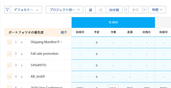
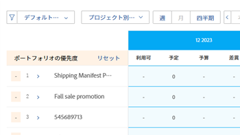

# リソースプランナーのプロジェクトに優先順位を付ける

プロジェクトは、最も重要なプロジェクトが一番上にある「リソース・プランナ」に優先順にリストされます。

## アクセス要件

以下が必要です。

<table style="table-layout:auto"> 
 <col> 
 <col> 
 <tbody> 
  <tr> 
   <td role="rowheader">Adobe Workfront plan*</td> 
   <td> 
Pro 以降
 </td> 
  </tr> 
  <tr> 
   <td role="rowheader">Adobe Workfront license*</td> 
   <td> 
計画 
 </td> 
  </tr> 
  <tr> 
   <td role="rowheader">アクセスレベル設定*</td> 
   <td> 
リソース・プランナの編集優先度と予算時間へのアクセスを含むリソース管理へのアクセスを編集します
 
財務データ、プロジェクト、ユーザーへのアクセスを編集
 
<b>メモ</b>

まだアクセス権がない場合は、Workfront管理者に、アクセスレベルに追加の制限を設定しているかどうかを問い合わせてください。 Workfront管理者がアクセスレベルを変更する方法について詳しくは、 <a href="../../administration-and-setup/add-users/configure-and-grant-access/create-modify-access-levels.md" class="MCXref xref">カスタムアクセスレベルの作成または変更</a>.
 </td>
</tr> 
  <tr> 
   <td role="rowheader">オブジェクト権限</td> 
   <td> 
財政を管理する機能を持つ、予算情報を作成するプロジェクトに対する権限を管理します
 
追加のアクセス権のリクエストについて詳しくは、 <a href="../../workfront-basics/grant-and-request-access-to-objects/request-access.md" class="MCXref xref">オブジェクトへのアクセスのリクエスト </a>.
 </td> 
  </tr> 
 </tbody> 
</table>

&#42;保有しているプラン、ライセンスの種類、アクセス権を確認するには、Workfront管理者に問い合わせてください。

## リソースプランナーのプロジェクトのデフォルトの順序

デフォルトでは、プロジェクトは、次の基準を考慮して、リソースプランナーのプロジェクトビューにリストされます。

>[!IMPORTANT]
>
>プロジェクトは、リソース・プランナを初めて開いたときにのみ、次の 3 つの基準に従ってリストされます。 ただし、このデフォルトの優先度は自動的にカスタムの優先度になり、次のいずれかの操作を行うと、いつでも元の優先度に戻すことはできません。
>
>* [ 保存 ] をクリックすると、いつでも [ 保存 ] をクリックできます。
>* プロジェクト計画の優先順位を手動で変更する場合。 プロジェクト計画の優先順位を手動で変更する方法については、「 [プロジェクト計画優先度を手動で変更する](#manually-change-the-project-planning-priority) 」を参照してください。
>
>プロジェクトの優先度がカスタムの優先度になった後は、プロジェクト情報を変更しても、これらの条件を使用したプロジェクトの順序に影響を与えなくなります。 その後は、手動でのみプロジェクトに優先順位を付けることができます。

プロジェクトビューにプロジェクトを一覧表示するための元の既定の基準は、次の順序です。

1. プロジェクトの線形スコア別。\
   プロジェクトの線形スコアの詳細については、 [プロジェクトにスコアカードを適用し、線形スコアを生成する](../../manage-work/projects/define-a-business-case/apply-scorecard-to-project-to-generate-alignment-score.md) .

1. プロジェクトの計画開始日（「整列」フィールドが null または複数のプロジェクトで同じ場合）
1. アルファベット順（「整列」フィールドが null または同じで、計画開始日が複数のプロジェクトで同じ場合）。

リソース・プランナでプロジェクト優先度を使用する際は、次の点に注意してください。

* プロジェクトビューを適用する場合にのみ、手動でプロジェクト優先度をカスタマイズできます。 これにより、リソースプランナーのプロジェクトの順序も変更されます。
* リソース・プランナで「ロール」または「ユーザー」ビューを適用すると、プロジェクトは、プロジェクト・ビューで設定された優先順位と同じ順序で表示されます。
* リソースプランナー内のプロジェクトの順序は、ユニークです。 他のユーザーは、同じプロジェクトを「生産資源プランナ」に表示できますが、異なる順序で表示できます。 「プロジェクト計画優先度」フィールドに関するレポートは作成できません。 これはリソースプランナーにのみ表示され、プロジェクトを優先順位付けするフラグの役割を果たします。

ポートフォリオに関連付けられたプロジェクトは、ポートフォリオレベルで優先される場合があります。 リソース・プランナの優先度に加えて、リソース・プランナのプロジェクトのポートフォリオ優先度の表示を有効にできます。 また、ポートフォリオの優先順位に従ってプロジェクトを並べ替えることもできます。

## プロジェクト計画優先度を手動で変更する {#manually-change-the-project-planning-priority}

リソース・プランナでプロジェクトを並べ替えるには、「リソース管理」および「プロジェクトに対する管理」権限への編集アクセス権が必要です。

プロジェクトに新しい優先順位を付けることで、重要度の順にランク付けできます。

プロジェクト計画優先度を編集する手順は、次のとおりです。

1. 次に移動： **リソースプランナー**.

1. 番号を含むプロジェクト名の左側のフィールド内をクリックし、番号を入力して Planning Priority を変更し、Enter キーを押します。\
   \
   または\
   プロジェクトの名前の上にマウスポインターを置き、プロジェクト名の左側のインジケーターをクリックし、プロジェクトをドラッグして正しい場所にドロップし、優先度を変更します。

   

   プロジェクトに優先順位を付ける数値を選択する場合、優先度が高い（より重要な）場合は小さい数値を選択し、優先度が低い（より重要でない）場合は大きい数値を選択します。 プロジェクトの優先度を低い数値（優先度が高い）に変更すると、リソースプランナー内の他のすべてのプロジェクトがリストの下に移動します（重要度が低くなります）。\
   プロジェクトの優先度を高い（優先度が低い）値に変更すると、リソースプランナー内の他のすべてのプロジェクトがリスト上に移動します（より重要になります）。

1. 「**保存**」をクリックします。\
   プロジェクトの順序は、選択内容に応じて変更され、リソースプランナーでカスタムプロジェクトの優先順位になります。 他のユーザーは、リソース・プランナで同じプロジェクトを表示できる場合がありますが、リソース・プランナでは、そのプロジェクトの優先順位を表示できません。

## リソース・プランナのPortfolio優先度に従ってプロジェクトを順序付け

>[!IMPORTANT]
>
>会社は、Business Manager 内のプロジェクトを優先順位付けするWorkfront以上の計画を持っている必要があります。
>
>Workfrontの計画について詳しくは、 [アドビの計画](https://www.workfront.com/plans).
>
>Project Optimizer でのプロジェクトの優先順位付けの詳細については、「Portfolio・オプティマイザ」を参照してください。 [Adobe Manager でのプロジェクトの優先順位Portfolio](../../manage-work/portfolios/portfolio-optimizer/prioritize-projects-in-portfolio-optimizer.md).

1. を開きます。 **リソースプランナー** 内 **プロジェクトビュー**.
1. 次をクリック： **設定** アイコン
1. を有効にします。 **Portfolio優先度の表示** 割り当て先のPortfolioに従ってプロジェクトの優先度を表示する設定 ポートフォリオに応じたプロジェクトの優先度が、「生産資源プランナ」の優先度の横に表示されます。 この設定は、デフォルトでは無効です。

   <!--
   
(NOTE: check screen shot to see if this is accurate still - should say Order, and not Sort:)

   -->

   

   プロジェクトのポートフォリオ優先度は、リソースプランナーの [ プロジェクト ] ビューにのみ表示されます。

1. クリック **注文** ポートフォリオの優先順位に従ってプロジェクトを並べ替える。

   複数のポートフォリオに属するプロジェクトがある場合、同じポートフォリオを持つ複数のプロジェクトが「リソース・プランナ」に表示されます。 この場合、同じポートフォリオ優先のプロジェクトは、次の条件に従ってこの順序で一覧表示されます。

   1. 整合性スコア
   1. 予定開始日
   1. プロジェクト名

   

1. 「**保存**」をクリックします。

## プロジェクト計画優先度の変更がユーザーの使用可能時間に与える影響

プロジェクト計画の優先順位は、利用可能なユーザーの時間に影響を与えます。 最も優先度の高いプロジェクトに関連付けられたユーザーは、スケジュールに従って、このプロジェクトの [ 利用可能な時間 (AVL)] 列で最もフル可用性を示します。

2 つ目のプロジェクトに優先順に関連付けられた同じユーザーには、「使用可能時間」の値が表示されます。この値は、「使用可能時間」の全額と、「予算時間」列の 1 つ目のプロジェクトで既に予算設定されている予算との差です。 リソース・プランナでのリソース予算作成の詳細は、 [「プロジェクト」ビューと「ロール」ビューを使用する、リソースプランナーの予算リソース](../../resource-mgmt/resource-planning/budget-resources-project-role-views-resource-planner.md).

ユーザーの最初のプロジェクトに予算が作成されていないが、同じユーザーの 2 番目のプロジェクトに予算が作成されている場合、両方のプロジェクトで使用可能な時間の全額が表示されます。

ユーザーの「予算時間」列は、リソース・プランナのプロジェクトの順序で更新し、常にユーザーの「使用可能時間」を正確に表示できるようにすることをお勧めします。

>[!NOTE]
>
>プロジェクト計画優先度は、すべてのリソースマネージャに固有なので、2 番目の優先度のプロジェクトは、別のユーザーがリソースプランナーで同じプロジェクトを表示する場合の 1 番目の優先度のプロジェクトになります。 別のリソースマネージャーが最初のプロジェクトのリソースを予算する場合、その変更に基づいて、最初のプロジェクトのリソースに対する「使用可能な時間数」が減少します。
>
>時間を予算するユーザーは、最初にそのリソースを割り当て、システム全体でそのリソースの使用可能時間数を減らします。 「使用可能時間」の値は、生産資源プランナの生産資源に対して予算時間が保存されるとすぐに、すべてのユーザーに対して更新されます。
>
>利用可能な時間について詳しくは、 [リソースの可用性と割り当て](../../resource-mgmt/resource-planning/resource-availability-allocation-resource-planner.md#availability-and-allocation-of-resources).
