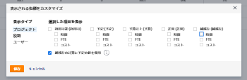

# Adobe Workfront Resource Planner を使用したリソースの可用性と割り当てのレビュー

リソースの可用性、およびプロジェクトの計画作業時間や予算作業量をリソース・プランナで表示できます。 これらの値は、時間、工数（全期間相当）または原価の金額で表示され、列に整理されます。

## アクセス要件

この記事の手順を実行するには、次のアクセス権が必要です。

<table style="table-layout:auto"> 
 <col> 
 <col> 
 <tbody> 
  <tr> 
   <td role="rowheader">Adobe Workfront plan*</td> 
   <td> <p>Pro 以降</p> </td> 
  </tr> 
  <tr> 
   <td role="rowheader">Adobe Workfront license*</td> 
   <td> <p>レビュー以上 </p> </td> 
  </tr> 
  <tr> 
   <td role="rowheader">アクセスレベル設定*</td> 
   <td> <p>次の項目へのアクセス権を表示または高くします。</p> 
    <ul> 
     <li> <p>リソース管理</p> </li> 
     <li> <p>財務データ</p> </li> 
     <li> <p>ユーザー</p> </li> 
     <li> <p>プロジェクト</p> </li> 
    </ul> <p><b>メモ</b>

まだアクセス権がない場合は、Workfront管理者に、アクセスレベルに追加の制限を設定しているかどうかを問い合わせてください。 Workfront管理者がアクセスレベルを変更する方法について詳しくは、 <a href="../../administration-and-setup/add-users/configure-and-grant-access/create-modify-access-levels.md" class="MCXref xref">カスタムアクセスレベルの作成または変更</a>.</p> </td>
</tr> 
  <tr> 
   <td role="rowheader">オブジェクト権限</td> 
   <td> <p>リソースプランナーで表示するプロジェクトに対する権限を表示するか、それ以上に設定します</p> <p>追加のアクセス権のリクエストについて詳しくは、 <a href="../../workfront-basics/grant-and-request-access-to-objects/request-access.md" class="MCXref xref">オブジェクトへのアクセスのリクエスト </a>.</p> </td> 
  </tr> 
 </tbody> 
</table>

*保有するプラン、ライセンスの種類、アクセス権を確認するには、Workfront管理者にお問い合わせください。

<!--note from the table about the license: Review or higher: 
      <MadCap:conditionalText data-mc-conditions="QuicksilverOrClassic.Draft mode">
       (waiting on Vazgen to confirm - working differenly in classic)
      </MadCap:conditionalText>
     -->

## 前提条件

リソース・プランナを使用するには、必要なすべての前提条件を満たす必要があります。 詳しくは、 [リソースプランナーの概要](../../resource-mgmt/resource-planning/get-started-resource-planner.md).

>[!IMPORTANT]
>
>生産資源プランナの正しい機能に必要な前提条件が欠落している場合は、一部の数値がゼロになるか、予算時間が淡色表示になる場合があります。

## リソースの可用性と割り当て

リソースの使用可否と割り当てを表示する列は、リソース・プランナに適用するビューに応じて変わります。 プロジェクト別、ロール別またはユーザー別のリソース・プランナの情報の表示の詳細は、次を参照してください。 [リソースプランナーのナビゲーションの概要](../../resource-mgmt/resource-planning/resource-planner-navigation.md).

表示をリソース・プランナに変更する際は、次の点に注意してください。

* を適用する際に、 **プロジェクト別に表示** または&#x200B;**ロール別に表示** ビューには、次の列が表示されます。

   <!--
  <MadCap:conditionalText data-mc-conditions="QuicksilverOrClassic.Draft mode">
  (NOTE: Alina: (some of the information in this area is also covered in Calculating Costs in the RP - https://workfront.zendesk.com/hc/en-us/articles/115004186433 - update this article also, when changes here occur)
  </MadCap:conditionalText>
  -->


   * 利用可能な時間数、工数、コスト
   * 計画時間、工数またはコスト
   * 予算時間、工数またはコスト
   * 時間、工数または原価差異
   * 正味時間数、工数、コスト

* を適用する際に、 **ユーザー別に表示** 表示では、次の列を確認できます。

   * 利用可能な時間または工数
   * 計画時間または工数
   * 時間または工数の差異
   * 計画時間配賦率

>[!TIP]
>
>この情報は、 **ユーザー別に表示** 「生産資源プランナ」に表示します。
>
>各列に何が表示されるかの詳細は、数値が表示される列の名前にマウスを移動します。\
>
>
>各列に表示されるデータの詳細については、次の記事を参照してください。
>
>* [リソースプランナーのプロジェクトビューとロールビューの時間、工数、コスト情報の概要](../../resource-mgmt/resource-planning/overview-of-planner-hour-fte-cost-information-in-role-project-views.md)
>* [ユーザー・ビューを使用する場合は、リソース・プランナで「使用可能」、「計画済」、「実績時間」または「工数」を表示します](../../resource-mgmt/resource-planning/view-hours-fte-user-view-resource-planner.md)
>


## 時間別、工数別、コスト別の情報の表示

1. 「生産資源プランナ」に移動します。

   デフォルトでは、情報は「生産資源プランナ」に「時間」別に表示されます。

1. ドロップダウンメニューを展開します。\
   

1. 次のオプションから選択します。

   <table style="table-layout:auto"> 
    <col> 
    <col> 
    <tbody> 
     <tr> 
      <td role="rowheader">時間</td> 
      <td>可用性と割り当て情報を時間単位で表示します。</td> 
     </tr> 
     <tr> 
      <td role="rowheader">FTE</td> 
      <td> <p>可用性と割り当て情報を FTE で表示します。</p> <p>リソース・プランナでの FTE の計算方法の詳細は、 <a href="../../resource-mgmt/resource-planning/calculate-hours-fte-for-users-roles-resource-planner.md" class="MCXref xref">リソース・プランナのユーザーとロールの時間と工数の計算の概要</a>. </p> </td> 
     </tr> 
     <tr> 
      <td role="rowheader">コスト</td> 
      <td> <p>[ プロジェクト ] ビューまたは [ ロール ] ビューで [ リソースプランナ ] を表示している場合は、コスト別に可用性と割り当て情報を表示します。 この情報は、システムの通貨で値を表示します。 システム通貨はWorkfront管理者が定義します。 Workfrontでのシステム通貨の設定について詳しくは、 <a href="../../administration-and-setup/manage-workfront/exchange-rates/set-up-exchange-rates.md" class="MCXref xref">為替レートの設定</a>.</p> <p><b>メモ</b>

   リソース・プランナにコスト情報を表示するには、ユーザーとジョブの役割を時間単価に関連付ける必要があります。<br style="font-style: italic;">時間単価のジョブロールとの関連付けの詳細は、 <a href="../../administration-and-setup/set-up-workfront/organizational-setup/create-manage-job-roles.md" class="MCXref xref">ジョブの役割の作成と管理</a>.<br style="font-style: italic;">時間単価をユーザーに関連付ける方法の詳細は、 <a href="../../administration-and-setup/add-users/create-and-manage-users/edit-a-users-profile.md" class="MCXref xref">ユーザーのプロファイルの編集</a>.<br style="font-style: italic;">リソース・プランナでのコストの計算方法の詳細は、 <a href="../../resource-mgmt/resource-planning/calculate-costs-resource-planner.md" class="MCXref xref">リソースプランナーでコストを計算する </a>.</p> </td>
   </tr> 
     <tr> 
      <td role="rowheader">カスタマイズ</td> 
      <td>リソースプランナーに表示される列のカスタムビューを作成します。 次の手順に従って、リソース・プランナに表示するオプションを選択します。 </td> 
     </tr> 
    </tbody> 
   </table>

1. （条件付き） **カスタマイズ**&#x200B;は、 **表示される指標のカスタマイズ** ボックスを使用してカスタムビューを設定します。

   

1. 内 **表示タイプ** 左側の列で、次のいずれかのビューを選択します。

   * プロジェクト
   * 役割
   * ユーザー

1. 内 **選択した項目を表示** 「 」セクションで、選択したビューの列に表示する情報のタイプを選択します。 次の表に、各ビューで使用可能なオプションを示します。

   | **オプション** | ユーザー ビュー | プロジェクト ビュー | ロール表示 |
   |---|---|---|---|
   | 利用可能 | ✔ | ✔ | ✔ |
   | 予定 | ✔ | ✔ | ✔ |
   | 予算計上 |   | ✔ | ✔ |
   | 差異 |   | ✔ | ✔ |
   | 純残存 |   | ✔ | ✔ |
   | 実際 | ✔ |   |   |
   | 差異 | ✔ |   |   |
   | パーセント | ✔ |   |   |

1. 選択 **NET 計算で計画 (PLN) 値を使用** 「プロジェクト」ビューと「役割」ビューで正味値を計算する際に、予算情報の代わりに計画情報を使用する場合。

   このオプションを選択する場合、Workfrontは次の式を使用して Net 値を計算します。

   ```
   Net = Available - Planned
   ```

   >[!TIP]
   >
   >**このオプションは、[ 選択した項目を表示 ] セクションで表示をカスタマイズするための 1 つ以上のオプションを選択した場合にのみ適用されます。**

1. 「**保存**」をクリックします。

   選択した列を含むカスタマイズされたビューが表示されます。

   「生産資源プランナ」は、「時間」ドロップダウン・メニューに、カスタマイズ・ビューを「カスタム」としてリストします。

   >[!NOTE]
   >
   >カスタマイズされたビューは 1 つだけです。

   

## ユーザー割り当てグラフの表示

ユーザーの可用性に対する計画配分をグラフに表示できます。

ユーザーの配分をグラフに表示するには、次の手順に従います。

1. 「生産資源プランナ」に移動します。

   リソース・プランナへのアクセスの詳細は、 [リソース・プランナの検索](../../resource-mgmt/resource-planning/get-started-resource-planner.md#accessing-the-resource-planner) 記事のセクション [リソースプランナーの概要](../../resource-mgmt/resource-planning/get-started-resource-planner.md).

1. 選択 **ユーザー別に表示**.

   >[!TIP]
   >
   >ユーザー割り当てグラフは、ユーザービューでのみ表示できます。

1. 次をクリック： **ユーザー配分グラフ** アイコン  次の情報を表示するには：

   <table style="table-layout:auto"> 
    <col> 
    <col> 
    <tbody> 
     <tr> 
      <td role="rowheader">全ユーザーの割り当て超過なしの空き時間率 (%)</td> 
      <td>すべてのユーザーがある期間で作業に使用できる時間を示します。合計使用可能時間に対する割合が表示されます。 </td> 
     </tr> 
     <tr> 
      <td role="rowheader">全ユーザーの割り当て超過率 (%) </td> 
      <td> <p>ある期間にユーザーが過剰に割り当てられた時間を示します。合計使用可能時間に対する割合が示されます。</p> <p><b>メモ</b>

   計画時間が使用可能時間よりも多い場合は、割り当て超過が発生します。 </p> </td>
   </tr> 
     <tr> 
      <td role="rowheader">全ユーザーの過少使用率 (%)</td> 
      <td> <p>これは、ある期間でユーザーの使用率が低い時間を示し、使用可能な合計時間に対する割合で示されます。</p> <p><b>メモ</b>

   未使用は、計画時間が使用可能時間よりも短い場合に発生します。 </p> </td>
   </tr> 
     <tr> 
      <td role="rowheader">この期間中に少なくとも 1 名のユーザーで割り当が超過しています。</td> 
      <td>これは、全ユーザーの合計時間がその期間に割り当て超過ではないにもかかわらず、少なくとも 1 人のユーザーに対する割り当て超過があることを示しています。<br>ユーザーのリストをスクロールする必要があり、割り当て超過のユーザーの時間は赤でハイライト表示されます。</td> 
     </tr> 
    </tbody> 
   </table>

   

1. （オプション） **すべてのユーザーの割り当て超過率** 領域を選択します。\
   割り当て超過のユーザーはすべて赤で強調表示されます。
1. （オプション） **すべてのユーザーの使用率が低い%** 領域を選択します。\
   使用率が低いユーザーはすべて青色で強調表示されます。

1. （オプション）インジケーターアイコン  少なくとも 1 人のユーザーが割り当て超過になっている場所を示す\
   割り当て超過のユーザーは赤で強調表示されます。

1. （オプション）ページを更新して、グラフを折りたたみます。
