# リソースプランナーのナビゲーションの概要

Adobe Workfront Resource Planner を使用すると、リソースの使用可否と、プロジェクトでの作業を完了するのに必要な予定時間を簡単に把握できます。 その後、ユーザーが割り当てられているプロジェクトでのユーザーとそのジョブの役割の割り当てを管理できます。

>[!TIP]
>
>チームの割り当ては、リソース・プランナで割り当てられたタスクに対して管理できません。

リソース・プランナを完全に使用するために必要な前提条件を満たす必要があります。 リソース・プランナの詳細は、 [リソースプランナーの概要](../../resource-mgmt/resource-planning/get-started-resource-planner.md).

次の項では、リソース・プランナのすべての領域の概要を説明します。

## プロジェクトのタイムライン

「リソース・プランナ」の上部にあるカレンダを使用して、表示中のプロジェクトのタイムラインに移動します。 タイムラインは、デフォルトで今日の月から始まります。\
リソースプランナーに表示するタイムラインの期間の変更の詳細は、「 [期間の選択](#timeframe-selection) 」を参照してください。

## 期間の選択  {#timeframe-selection}

デフォルトでは、リソース・プランナには、現在の月から始まる 3 ヶ月または 4 ヶ月のリソース情報が一度に表示されます。 表示される期間の数は、画面の幅によって異なります。

>[!TIP]
>
>リソース・プランナには、一度に 4 つを超える期間を表示できません。

タイムラインに移動するには：

1. 前後の矢印をクリックして、タイムライン上で前後に移動します。
1. 適切なボタンをクリックして、「リソース・プランナ」で次の日付範囲オプションから選択します。

   <table style="table-layout:auto"> 
    <col> 
    <col> 
    <tbody> 
     <tr> 
      <td role="rowheader">週</td> 
      <td>情報を週別に表示します。 週の数は、列ヘッダーの日付の横に表示されます。 </td> 
     </tr> 
     <tr> 
      <td role="rowheader">月</td> 
      <td> 月別に情報を表示します。</td> 
     </tr> 
     <tr> 
      <td role="rowheader">四半期</td> 
      <td>四半期別に情報を表示します。 四半期の数は、列ヘッダーの日付の横に表示されます。 カスタム四半期は、リソースプランナーには表示されません。 </td> 
     </tr> 
     <tr> 
      <td role="rowheader">今日</td> 
      <td>今日の月、週または四半期に戻ります。</td> 
     </tr> 
    </tbody> 
   </table>

## プロジェクト/役割/ユーザー表示の選択

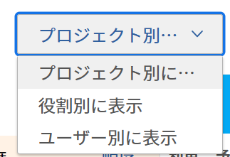

情報の表示方法に応じて、リソースプランナーのビューを変更できます。

デフォルトでは、リソース・プランナはユーザー・ビューに表示されます。 ビューは、プロジェクトビューまたはロールビューに変更できます。 別のビューに変更すると、選択したビューがデフォルトのビューになります。

ビューを変更すると、次の情報も変更されます。

* オブジェクトの階層（リソースプランナーの行の情報）。
* 時間割り当て情報（リソースプランナーの列の情報）。

   選択した表示に応じて、列がリソース・プランナに表示される内容の詳細は、次を参照してください： [Adobe Workfront Resource Planner を使用したリソースの可用性と割り当てのレビュー](../../resource-mgmt/resource-planning/resource-availability-allocation-resource-planner.md).

リソース・プランナに正確な情報を表示するには、一連の前提条件を満たす必要があります。 前提条件の詳細は、 [リソースプランナーの概要](../../resource-mgmt/resource-planning/get-started-resource-planner.md) 記事。  リソース・プランナのビューを変更する手順は、次のとおりです。

1. 次に移動： **リソースプランナー**.\
   リソース・プランナへのアクセスの詳細は、 [リソース・プランナの検索](../../resource-mgmt/resource-planning/get-started-resource-planner.md#accessing-the-resource-planner) セクション [リソースプランナーの概要](../../resource-mgmt/resource-planning/get-started-resource-planner.md) 記事。

1. 内&#x200B;**表示基準** ドロップダウンメニューから、次のビューの 1 つを選択します。

   * [プロジェクト別に表示](#view-by-project)
   * [役割別に表示](#view-by-role)
   * [ユーザー別に表示](#view-by-user)

### プロジェクト別に表示 {#view-by-project}

リソース・プランナでプロジェクト・ビューを選択する際は、次の点に注意してください。

* 少なくとも表示する権限を持つプロジェクトを表示できます。
* 初めてリソース・プランナにアクセスすると、デフォルト・フィルタでフィルタされたプロジェクトを表示できます。\
   リソース・プランナの情報のフィルタリングの詳細は、 [リソースプランナーの情報のフィルタリング](../../resource-mgmt/resource-planning/filter-resource-planner.md).

* パフォーマンスを向上させるために、プロジェクトビューから表示または書き出しできる項目の数は制限されています。\
   プロジェクトビューでリソースプランナーを表示する際の制限の詳細は、 [プロジェクトビューの制限](../../resource-mgmt/resource-planning/resource-planner-display-limitations.md#project-view-limits) セクション [リソース・プランナの表示制限](../../resource-mgmt/resource-planning/resource-planner-display-limitations.md) 記事。

* プロジェクトは、プロジェクトビューで優先順に表示されます。\
   リソース・プランナのプロジェクト優先度の詳細は、 [プロジェクト計画の優先順位](#project-planning-priority) 」の節を参照してください。

* 各プロジェクトを展開する際に、関連付けられているジョブの役割を表示できます。\
   各役割を展開すると、その役割に関連付けられているユーザーを表示できます。\
   スクロールして、各プロジェクトの下にさらに多くの役割とユーザーを読み込みます。

* このビューを適用すると、役割時間、工数、または原価がプロジェクト時間、工数、原価に加算されます。\
   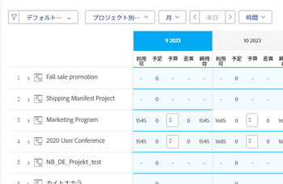

* 次の時間、工数、またはコストの情報をプロジェクトビューに表示できます。

   * 利用可能
   * 予定
   * 予算計上
   * 差異
   * 純残存

      詳しくは、 [「プロジェクト」ビューと「ロール」ビューを使用する、リソースプランナーの予算リソース](../../resource-mgmt/resource-planning/budget-resources-project-role-views-resource-planner.md).

### 役割別に表示 {#view-by-role}

リソース・プランナで「ロール・ビュー」を選択する際は、次の点に注意してください。

* これらのプロジェクトに関連付けられた役割を表示するには、少なくともリソース管理への表示アクセス権と、プロジェクトに対する表示権限が必要です。
* 各役割を展開してプロジェクトのリストを表示し、各プロジェクトを展開して、プロジェクトでそれらの役割を満たすユーザーのリストを表示できます。
* パフォーマンスを向上させるために、ロールビューから表示またはエクスポートできる項目の数は制限されています。\
   ロール・ビューでリソース・プランナを表示する際の制限の詳細は、 [ロールビューの制限](../../resource-mgmt/resource-planning/resource-planner-display-limitations.md#role-view-limits) セクション [リソース・プランナの表示制限](../../resource-mgmt/resource-planning/resource-planner-display-limitations.md) .

* プロジェクトは、ジョブロールの下に、プロジェクトビューに表示されるのと同じ優先順位で表示されます。
* このビューを適用すると、プロジェクト時間、工数、または原価が役割時間、工数、原価に合計されます。\
   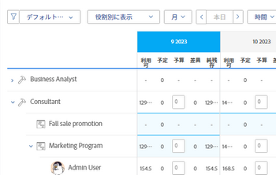

* 次の時間、工数、または原価の情報は、「役割」ビューで表示できます。

   * 利用可能
   * 予定
   * 予算計上
   * 差異
   * 純残存

      詳しくは、 [「プロジェクト」ビューと「ロール」ビューを使用する、リソースプランナーの予算リソース](../../resource-mgmt/resource-planning/budget-resources-project-role-views-resource-planner.md).

### ユーザー別に表示 {#view-by-user}

「ユーザー・ビュー」に「生産資源プランナ」を表示して、計画済とユーザーの使用可能時間または工数の違いを理解したり、ユーザーがログに記録した実績時間数を表示したりできます。

リソース・プランナにユーザー・ビューを適用する際に、リソースを予算できません。 [ プロジェクト ] ビューまたは [ ロール ] ビューを使用してリソースを予算設定し、[ ユーザ ] ビューを使用して、予定作業に関するユーザの割り当てと可用性を確認する必要があります。* *

「ユーザー・ビュー」は、リソース・プランナのデフォルト・ビューです。

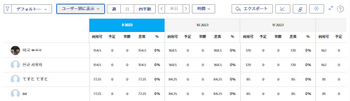

リソース・プランナでユーザー・ビューを選択する際は、次の点に注意してください。

* 表示する権限を持つすべてのユーザー（最大 2,000 人のユーザー）がアクティブで、Adobe Workfrontに少なくとも 1 回ログインしていることを確認できます。\
   チーム、ジョブの役割、またはプールでユーザーリストをフィルタして、それらのエンティティに関連付けられたユーザーのみを表示します。
* ユーザーのリストをプロジェクトでフィルターした場合、フィルターを適用したプロジェクトに関連付けられたユーザーのみを展開し、時間情報も表示できます。\
   リソース・プランナの情報のフィルタリングの詳細は、 [リソースプランナーの情報のフィルタリング](../../resource-mgmt/resource-planning/filter-resource-planner.md) .

* パフォーマンスを向上させるために、ユーザービューから表示または書き出しできる項目の数は制限されています。\
   ユーザービューでリソースプランナーを表示する際の制限の詳細については、 [ユーザービューの制限](../../resource-mgmt/resource-planning/resource-planner-display-limitations.md#user-view-limits) セクション [リソース・プランナの表示制限](../../resource-mgmt/resource-planning/resource-planner-display-limitations.md) .

* プロジェクトは、プロジェクトビューに表示されるのと同じ優先順位で、ユーザー名の下に表示されます。\
   リソース・プランナのプロジェクト優先度の詳細は、 [プロジェクト計画の優先順位](#project-planning-priority) 」の節を参照してください。

* ユーザーにジョブロールが関連付けられていない場合は、「時間」または「工数」の値が **ロールなし** 」セクションに入力します。
* このビューを適用すると、プロジェクトの時間または工数がユーザー時間または工数に加算されます。

   >[!TIP]
   >
   >ユーザービューには、ユーザーの配分と可用性をコスト別に表示できません。

* プロジェクトとタスクに対する権限によって、ユーザービューに表示されるユーザー名の下に何が表示されるかが決まります。\
   次のシナリオが存在します。

   * リソース・プランナに表示されるユーザーに割り当てられたプロジェクトとタスクまたはタスクを表示する権限を持っていない場合、それらの項目は、 **アクセスできない項目** セクション。 この **アクセスできない項目** この場合、「プロジェクト」セクションまたは「タスク」セクションは「タスク」セクションに置き換えられます。

   * プロジェクトを表示する権限を持っていないが、プロジェクトのタスクやタスクを表示するアクセス権を持っている場合、プロジェクト、タスク、およびタスクは、割り当てられたユーザーの名前の下に表示されます。
   * プロジェクトを表示する権限を持っているが、プロジェクトに対するタスクやタスクが存在しない場合、プロジェクト名が表示され、タスクやタスクが **アクセスできない項目** 」セクションに入力します。\
      Workfrontの権限について詳しくは、 [オブジェクトに対する共有権限の概要](../../workfront-basics/grant-and-request-access-to-objects/sharing-permissions-on-objects-overview.md).

      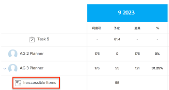
    

* 次の時間および FTE 情報は、User ビューで表示できます。

   * 利用可能
   * 予定
   * 実際
   * 計画済と実績の差異
   * 計画配分の割合

      詳しくは、 [ユーザー・ビューを使用する場合は、リソース・プランナで「使用可能」、「計画済」、「実績時間」または「工数」を表示します](../../resource-mgmt/resource-planning/view-hours-fte-user-view-resource-planner.md)

## プロジェクト名

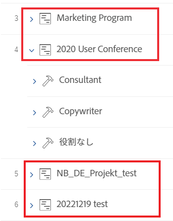

リソース・プランナには、次のプロジェクトが表示されます。

* 少なくとも表示する権限を持つプロジェクトです。

   また、少なくともアクセスレベルの「リソース管理の表示」に対するアクセス権も持っている必要があります。

   リソース・プランナの使用に必要なアクセスの詳細は、次を参照してください。 [Adobe Workfrontの予算リソースに必要なアクセス](../../resource-mgmt/resource-planning/access-needed-to-budget-resources.md).

* リソースプランナーに適用するフィルターによって制限されるプロジェクトです。

   リソース・プランナの情報のフィルタリングの詳細は、 [リソースプランナーの情報のフィルタリング](../../resource-mgmt/resource-planning/filter-resource-planner.md).

   >[!NOTE]
   >
   >フィルタを使用して、リソースプランナーに表示するプロジェクトの数を減らすことをお勧めします。

## プロジェクト計画の優先順位 {#project-planning-priority}

プロジェクトは、最も重要なプロジェクトが一番上にある「リソース・プランナ」に優先順にリストされます。 優先度は、プロジェクト名の前に数字で示されます。

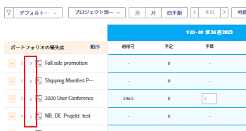

また、ポートフォリオに関連付けられている場合に、ポートフォリオに応じてプロジェクトの優先度を表示する設定を有効にすることもできます。 プロジェクトの優先順位付けとリソースプランナーでのポートフォリオ優先度の表示については、 [リソースプランナーのプロジェクトに優先順位を付ける](../../resource-mgmt/resource-planning/prioritize-projects-resource-planner.md).

## 担当業務名

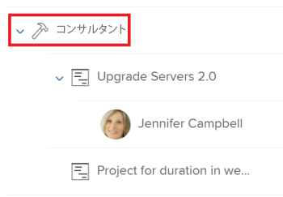

次のカテゴリの役職ロールが、リソース・プランナにリストされます。

* タスクに割り当てられるジョブの役割。
* タスクに割り当てられていないが、プロジェクトの資源プールに関連付けられたユーザーの主要なジョブロールであるジョブロール。
* ジョブロール内のタスクに割り当てられているユーザーのセカンダリジョブロール。
* 有効な **FTE の可用性の割合** プロファイル内で\
   詳しくは、 **FTE の可用性の割合** ジョブの役割については、 [ユーザーのプロファイルの編集](../../administration-and-setup/add-users/create-and-manage-users/edit-a-users-profile.md) .

>[!NOTE]
>
>問題に割り当てられたジョブの役割も、 **問題からの時間を含める** の設定が有効になっています。 リソースプランナーで問題発生時間を有効にする方法の詳細は、 [設定](#settings) 」セクションに入力します。

## ユーザー名

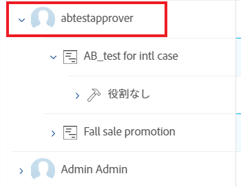

リソースプランナーの「プロジェクト」ビューと「ロール」ビューに表示されるユーザーは、プロジェクトに関連付けられたリソースプールに属します。\
ユーザーを使用したリソースプールの生成の詳細については、「 [リソースプールとユーザーの関連付け](../../resource-mgmt/resource-planning/resource-pools/associate-resource-pools-with-users.md).

View にアクセスできるユーザーと、Workfrontに少なくとも 1 回ログインしたユーザーがすべて User View に表示されます。

プロジェクトビューとロールビューでは、次の種類のジョブロールの下にユーザーが表示される場合があります。

* 主な職務
* 次のシナリオでのセカンダリジョブの役割：

   * セカンダリジョブの役割に **FTE の可用性の割合** 」と入力します。
   * ユーザーがそれらの役割のタスクに割り当てられている場合。

詳しくは、 **FTE の可用性の割合** 役割については、 [ユーザーのプロファイルの編集](../../administration-and-setup/add-users/create-and-manage-users/edit-a-users-profile.md) .

## 「役割なし」および「ユーザーなし」セクション

* [「役割なし」セクション](#no-role-section)
* [「ユーザーなし」セクション](#no-user-section)

### 「役割なし」セクション  {#no-role-section}

ユーザーがプロジェクトに関連付けられたリソースプールに属しているが、ジョブの役割が関連付けられていない場合は、 **ロールなし** セクション内に配置されます。

ユーザーの時間を予算できません： **ロールなし** 」セクションに入力します。 作業の予算を作成するには、少なくとも 1 つのジョブロールが関連付けられている必要があります。\
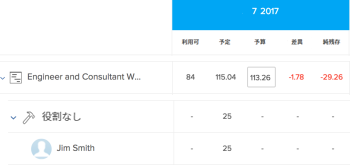

### 「ユーザーなし」セクション  {#no-user-section}

タスクをチームに割り当てるか、割り当てを解除すると、[ 予定時間 ] が [ **ユーザーなし** の下に表示されるセクション **ロールなし** 」セクションを使用します。 これらのタスクは、 **ユーザー別に表示** 表示

プロジェクト上のタスクに属する計画時間数を **ユーザーなし** 」セクションに表示されますが、これらの割当てに予算を設定することはできません。

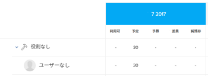

 

## フィルター

フィルタを使用すると、リソース・プランナに表示する情報を制限できます。

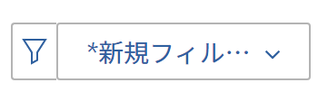

リソース・プランナでのフィルタリングの詳細は、 [リソースプランナーの情報のフィルタリング](../../resource-mgmt/resource-planning/filter-resource-planner.md) .

## 設定 {#settings}

「設定」領域で、リソース・プランナの情報を表示または非表示にするオプションを有効または無効にできます。

リソース・プランナで設定を有効にする手順は、次のとおりです。

1. 「生産資源プランナ」を開きます。
1. 次をクリック： **設定** アイコン

   

   「生産資源プランナ設定」ボックスが表示されます。

   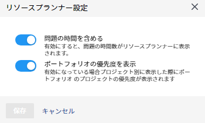

1. を有効にします。 **問題からの時間数を含める** 設定を使用して、リソース・プランナの問題からの計画時間を表示します。 この設定は、デフォルトでは無効です。

   この設定を有効にする際は、次の点を考慮してください。

   * 問題に割り当てられたユーザーの名前は、問題に関連付けられたジョブの役割の下に表示され、ユーザーの予算時間と、プロジェクトビューと役割ビューでのジョブの役割を指定できます。
   * ユーザーに割り当てられた問題は、ユーザービューのジョブロールの名前に表示されます。

      >[!IMPORTANT]
      >
      >**発行の「計画開始日」と「完了日」がプロジェクトのタイムライン外にある場合、発行の「計画時間」は、発行日に応じて表示されます。 例えば、プロジェクトのタイムラインが 1 月から 3 月の間で、問題のタイムラインが 8 月の場合、問題の予定時間は 8 月の期間に表示されます。**

1. （条件付きおよびオプション）[ プロジェクト ] ビューを選択した場合、[Portfolioの優先度を表示 ] 設定を有効にして、割り当て先のPortfolioに応じてプロジェクトの優先度を表示します。 ポートフォリオに応じたプロジェクトの優先度が、「生産資源プランナ」の優先度の横に表示されます。 この設定は、デフォルトでは無効です。

   リソース・プランナのプロジェクトの優先順位付けの詳細は、 [リソースプランナーのプロジェクトに優先順位を付ける](../../resource-mgmt/resource-planning/prioritize-projects-resource-planner.md).

## フルスクリーンオプション

リソース・プランナをフル・スクリーンで表示して、画面に表示できる情報の量を大きくすることができます。

情報を全画面表示で表示するオプションは、リソース・プランナのすべてのビューで使用できます。

リソース・プランナを全画面表示にする手順は、次のとおりです。

1. 次に移動： **リソースプランナー**.
1. 次をクリック： **全画面表示アイコン** をクリックして、「リソース・プランナ」を全画面表示にします。\
   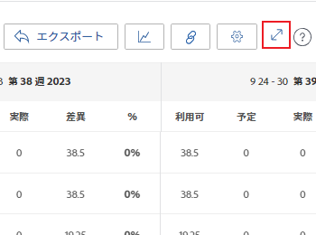\
   リソースプランナーが拡張され、ブラウザーウィンドウ全体を占有し、アイコンが **全画面表示を閉じる** 表示オプション。

1. （オプション） **全画面表示を閉じるアイコン** をクリックして、前の表示に戻します。

## 書き出しオプション

リソースプランナーの任意のビューから Excel(.xlsx) ファイルに情報を書き出すことができます。\
リソース・プランナからの情報のエクスポートの詳細は、 [リソースプランナーからの情報のエクスポート](../../resource-mgmt/resource-planning/export-resource-planner.md).

書き出したファイルの情報量や表示を管理できます。\
リソースプランナーからエクスポートできる情報と、エクスポートされたファイルの外観を管理する方法については、 [リソース・プランナの表示制限](../../resource-mgmt/resource-planning/resource-planner-display-limitations.md).
