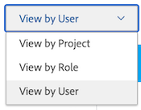
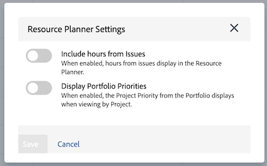

# リソースプランナーのナビゲーションの概要

<!-- Audited: 5/2025 -->

Adobe Workfront リソースプランナーを使用すると、リソースの空き時間や、プロジェクトの作業を完了するために必要な予定時間を簡単に把握できます。 その後、ユーザーの割り当て、およびユーザーが割り当てられているプロジェクトでの担当業務を管理できます。

>[!TIP]
>
>リソース プランナでチームに割り当てられたタスクのチーム割り当てを管理することはできません。

リソースプランナーを完全に使用するには、必要な前提条件を満たす必要があります。リソースプランナーについて詳しくは、[リソースプランナーの概要](../../resource-mgmt/resource-planning/get-started-resource-planner.md)を参照してください。

以下の節では、リソースプランナーのすべてのエリアの概要を説明します。

## プロジェクトのタイムライン

リソースプランナーの上部にあるカレンダーを使用して、表示しているプロジェクトのタイムラインに移動します。タイムラインは、デフォルトで今月から始まります。

リソースプランナーに表示しているタイムラインの期間の変更に関して詳しくは、この記事にある[期間の選択](#timeframe-selection)の節を参照してください。

## 期間の選択  {#timeframe-selection}

デフォルトでは、リソースプランナーは今月を起点として、一度に 3 か月または 4 か月のリソース情報を表示します。 表示される期間の数は、画面の幅によって異なります。

>[!TIP]
>
>リソース プランナに一度に表示できる期間は 4 つまでです。

タイムラインを移動するには、戻る矢印と進む矢印をクリックして、タイムライン上を前後に移動します。 その後、該当するボタンをクリックして、リソースプランナーの次の日付範囲オプションから選択できます。

<table style="table-layout:auto"> 
    <col> 
    <col> 
    <tbody> 
     <tr> 
      <td role="rowheader">週</td> 
      <td>情報を週別に表示します。 週の数は、列ヘッダーの日付の横に表示されます。 </td> 
     </tr> 
     <tr> 
      <td role="rowheader">月</td> 
      <td> 月別に情報を表示します。</td> 
     </tr> 
     <tr> 
      <td role="rowheader">四半期</td> 
      <td>四半期別に情報を表示します。 四半期の数は、列ヘッダーの日付の横に表示されます。 カスタム四半期は、リソースプランナーには表示されません。 </td> 
     </tr> 
     <tr> 
      <td role="rowheader">今日</td> 
      <td>今日の月、週または四半期に戻ります。</td> 
     </tr> 
    </tbody> 
   </table>

## プロジェクト／役割／ユーザービューの選択

情報の表示方法に応じて、リソースプランナーの表示を変更できます。

デフォルトでは、リソースプランナーはユーザービューに表示されます。ビューは、プロジェクトビューまたは役割ビューに変更できます。別のビューに変更すると、選択したビューがデフォルトのビューになります。

ビューを変更すると、以下の情報も変更されます。

* オブジェクトの階層（リソースプランナーの行の情報）。
* 時間割り当て情報（リソースプランナーの列の情報）。

  選択したビューに応じて、リソースプランナーに表示される列の内容に関して詳しくは、[Adobe Workfront リソースプランナーを使用したリソースの空き時間と割り当てをレビュー](../../resource-mgmt/resource-planning/resource-availability-allocation-resource-planner.md)を参照してください。

リソースプランナーに正確な情報を表示するには、一連の前提条件を満たす必要があります。前提条件について詳しくは、「リソースプランナーの概要 [&#x200B; 記事のリソースプランナーでの作業の前提条件を参照し &#x200B;](../../resource-mgmt/resource-planning/get-started-resource-planner.md) ください。

リソースプランナーのビューを変更するには、「ビュー別」ドロップダウンメニューで次のいずれかのビューを選択します。

* [プロジェクト別に表示](#view-by-project)
* [役割別に表示](#view-by-role)
* [ユーザー別に表示](#view-by-user)

### プロジェクト別に表示 {#view-by-project}

リソースプランナーでプロジェクトビューを選択する際は、以下の点にご注意ください。

* 表示権限のあるプロジェクトを表示できます。
* 初めてリソースプランナーにアクセスする場合、デフォルトフィルターでフィルターされたプロジェクトを表示できます。\
  詳しくは、[&#x200B; リソースプランナーでの情報のフィルタリング &#x200B;](../../resource-mgmt/resource-planning/filter-resource-planner.md) を参照してください。

* 表示する項目の数、またはプロジェクト ビューからエクスポートできる項目の数は、パフォーマンスを向上させるために制限されています。\
  詳細については、「リソース プランナの表示制限 [&#x200B; に関する記事のプロジェクト ビューの制限事項を参照し &#x200B;](../../resource-mgmt/resource-planning/resource-planner-display-limitations.md) ください。

* プロジェクトは、優先度順でプロジェクトビューに表示されます。\
  詳細については、この記事の [&#x200B; プロジェクト計画の優先度 &#x200B;](#project-planning-priority) セクションを参照してください。

* 各プロジェクトを展開すると、そのプロジェクトに関連付けられている担当業務を表示できます。

* 各役割を展開すると、それに関連付けられているユーザーを表示できます。 スクロールして、各プロジェクトの下にさらに多くの役割とユーザーを読み込みます。

* このビューを適用すると、役割時間、FTE またはコストが、プロジェクト時間、FTE またはコストに加算されます。

* プロジェクトビューでは、次の時間、FTE またはコストの情報を表示できます。

   * 利用可能
   * 予定
   * 予算計上
   * 差異
   * 純価

     詳しくは、[プロジェクトビューと役割ビューを使用したリソースプランナーでのリソースの予算計上](../../resource-mgmt/resource-planning/budget-resources-project-role-views-resource-planner.md)を参照してください。

### 役割別に表示 {#view-by-role}

リソースプランナーで役割ビューを選択する際は、次の点に注意してください。

* これらのプロジェクトに関連付けられた役割を表示するには、少なくともリソース管理に対する表示アクセス権と、プロジェクトに対する表示権限が必要です。
* 各役割を展開すると、プロジェクトのリストを表示でき、各プロジェクトを展開すると、プロジェクトでそれらの役割を果たすことのできるユーザーのリストを表示できます。
* パフォーマンスを向上させるために、役割ビューから表示または書き出せる項目の数は制限されています。\
  詳しくは、[&#x200B; リソースプランナーの表示制限 &#x200B;](../../resource-mgmt/resource-planning/resource-planner-display-limitations.md) の役割ビューの制限事項を参照してください。

* プロジェクトは、プロジェクトビューに表示されるのと同じ優先順位で、担当業務の下に表示されます。
* このビューを適用すると、プロジェクト時間、FTE またはコストが、役割時間、FTE またはコストに加算されます。
* 役割ビューでは、次の時間、FTE またはコストの情報を表示できます。

   * 利用可能
   * 予定
   * 予算計上
   * 差異
   * 純価

     詳しくは、[プロジェクトビューと役割ビューを使用したリソースプランナーでのリソースの予算計上](../../resource-mgmt/resource-planning/budget-resources-project-role-views-resource-planner.md)を参照してください。

### ユーザー別に表示 {#view-by-user}

リソースプランナーをユーザービューで表示すると、予定時間と利用可能な時間の違いやユーザーの FTE を理解したり、ユーザーがログに記録した実際の時間数を表示したりできます。

ユーザービューをリソース プランナに適用する際、リソースの予算を立てることはできません。 プロジェクトビューまたは役割ビューを使用してリソースを計上し、ユーザービューを使用して、予定作業に関してユーザーの割り当てと空き時間を確認する必要があります。

ユーザービューは、リソースプランナーのデフォルトビューです。

リソースプランナーでユーザービューを選択する際は、次の点に注意してください。

* 表示権限を持つすべてのユーザー（最大 2,000 人のユーザー）がアクティブで、Adobe Workfrontに少なくとも 1 回ログインしたことを確認できます。 チーム、担当業務またはプールでユーザーリストをフィルターして、それらのエンティティのみに関連付けられたユーザーを表示します。
* ユーザーのリストをプロジェクト別にフィルタリングした場合は、フィルタリングされたプロジェクトに関連付けられているユーザーのみを展開でき、時間情報を表示できます。\
  詳しくは、[&#x200B; リソースプランナーでの情報のフィルタリング &#x200B;](../../resource-mgmt/resource-planning/filter-resource-planner.md) を参照してください。

* 表示する項目またはユーザービューからエクスポートできる項目の数は、パフォーマンスを向上させるために制限されています。\
  詳しくは、[&#x200B; リソースプランナーの表示制限 &#x200B;](../../resource-mgmt/resource-planning/resource-planner-display-limitations.md) のユーザービューの制限事項を参照してください。

* プロジェクトは、ユーザーの名前の下に、[ プロジェクト ビュー ] に表示されているのと同じ優先順位で一覧表示されます。\
  詳細については、この記事の [&#x200B; プロジェクト計画の優先度 &#x200B;](#project-planning-priority) セクションを参照してください。

* ユーザーに担当業務が関連付けられていない場合、時間または FTE の値は「役割なし」セクションに表示されます。
* このビューを適用すると、プロジェクト時間または FTE が、ユーザー時間または FTE に加算されます。

  >[!TIP]
  >
  >ユーザービューで、ユーザーの割り当てと空き時間をコスト別に表示することはできません。

* プロジェクトとタスクの権限によって、ユーザービューに表示されるユーザー名の下に表示される内容が決まります。

  次のシナリオが存在します。

   * リソースプランナーに表示されるユーザーに割り当てられたプロジェクトやタスクまたは問題を表示する権限がない場合、それらの項目は「アクセスできない項目」セクションに表示されます。 この場合、これらのセクションは、プロジェクトセクションまたはタスクセクションを置き換えます。

   * プロジェクトを表示する権限がなくても、プロジェクトのタスクやイシューを表示するアクセス権がある場合、プロジェクト、タスク、イシューは、割り当てられたユーザーの名前の下に一覧表示されます。
   * プロジェクトを表示する権限があるが、プロジェクト上のタスクや問題を表示する権限がない場合、プロジェクト名が表示され、タスクと問題は「アクセスできない項目」セクションに表示されます。

     詳しくは、[オブジェクトに対する共有権限の概要](../../workfront-basics/grant-and-request-access-to-objects/sharing-permissions-on-objects-overview.md)を参照してください。

* ユーザービューでは、次の時間および FTE の情報を表示できます。

   * 利用可能
   * 予定
   * 実際
   * 予定と実際の差
   * 予定配分の割合

     詳しくは、[ユーザービュー使用時のリソースプランナーでの利用可能な時間数、予定時間数、実際の時間数または FTE の表示](../../resource-mgmt/resource-planning/view-hours-fte-user-view-resource-planner.md)を参照してください。

## プロジェクト名

リソースプランナーには、次のプロジェクトが表示されます。

* 表示権限のあるプロジェクト。 また、アクセスレベルでリソース管理を表示するアクセス権が必要です。

  詳しくは、[Adobe Workfrontでリソースを計上するために必要なアクセス &#x200B;](../../resource-mgmt/resource-planning/access-needed-to-budget-resources.md) を参照してください。

* リソースプランナーに適用するフィルターによって制限されるプロジェクト。

  詳しくは、[&#x200B; リソースプランナーでの情報のフィルタリング &#x200B;](../../resource-mgmt/resource-planning/filter-resource-planner.md) を参照してください。

  >[!NOTE]
  >
  >フィルターを使用して、リソースプランナーに表示するプロジェクトの数を減らすことをお勧めします。

## プロジェクト計画の優先度 {#project-planning-priority}

プロジェクトは、リソースプランナー内に優先度に従ってリストされ、最も重要なプロジェクトが最上位に表示されます。優先度は、プロジェクト名の前に数字で示されます。

また、設定を有効にして、ポートフォリオに関連付けられている場合に、ポートフォリオに従ってプロジェクトの優先度を表示することもできます。 詳しくは、[&#x200B; リソースプランナーでプロジェクトの優先順位を付ける &#x200B;](../../resource-mgmt/resource-planning/prioritize-projects-resource-planner.md) を参照してください。

## 担当業務名

以下のカテゴリの担当業務が、リソースプランナーにリストされます。

* タスクに割り当てられる担当業務。
* タスクに割り当てられていないが、プロジェクトのリソースプールに関連付けられたユーザーのプライマリ担当業務である担当業務。
* 担当業務内のタスクに割り当てられているユーザーのセカンダリ担当業務。
* プロファイルに FTE 可用性の有効な割合があるユーザーのセカンダリ担当業務。\
  担当業務の FTE 可用性の割合について詳しくは、[&#x200B; ユーザープロファイルの編集 &#x200B;](../../administration-and-setup/add-users/create-and-manage-users/edit-a-users-profile.md) を参照してください。

>[!NOTE]
>
>「イシューからの時間を含める」設定が有効になっている場合は、イシューに割り当てられた担当業務も一覧表示されます。 リソースプランナーでのイシュー時間数の有効化に関して詳しくは、[設定](#settings)の節を参照してください。

## ユーザー名

リソースプランナーのプロジェクトビューと役割ビューに表示されるユーザーは、プロジェクトに関連付けられたリソースプールに属します。\
詳細については、[&#x200B; リソース プールとユーザーの関連付け &#x200B;](../../resource-mgmt/resource-planning/resource-pools/associate-resource-pools-with-users.md) を参照してください。

すべてのユーザー（お持ちのアクセス権の対象になっているユーザーと、Workfront に 1 回以上ログインしたユーザー）がユーザービューに表示されます。

プロジェクトビューと役割ビューでは、以下タイプの担当業務の下にユーザーが表示される場合があります。

* ユーザーのプライマリ担当業務
* セカンダリ担当業務は、以下のシナリオでは次のように行います。

   * セカンダリ担当業務のユーザープロファイルに、FTE 可用性の割合に対する有効な数値がある場合。
   * これらの役割のタスクにユーザーが割り当てられているかどうか。
担当業務の FTE 可用性の割合について詳しくは、[&#x200B; ユーザープロファイルの編集 &#x200B;](../../administration-and-setup/add-users/create-and-manage-users/edit-a-users-profile.md) を参照してください。

## 「役割なし」および「ユーザーなし」セクション

### 役割セクションなし  {#no-role-section}

ユーザーがプロジェクトに関連付けられたリソースプールに属しているものの、担当業務が関連付けられていない場合、特定の担当業務の下ではなく、「役割なし」セクションに表示されます。

「役割なし」セクション内のユーザーの時間を予算に計上することはできません。 作業の予算を計上するには、ユーザーには担当業務が 1 つ以上関連付けられている必要があります。

### ユーザーセクションなし  {#no-user-section}

タスクをチームに割り当てるか、未割り当てのままにすると、予定時間数はリソースプランナーの「役割なし」セクションに表示される「ユーザーなし」セクションの下に表示されます。 これらのタスクは、[ ユーザー別に表示 ] ビューを使用するときにリソース プランナに表示されません。

リソースプランナーの「ユーザーなし」セクションで、プロジェクトのタスクに起因する予定時間数を確認できますが、これらの割り当てを予算に計上することはできません。

## フィルター

フィルターを使用すると、リソースプランナーに表示する情報を制限できます。

リソースプランナーでのフィルタリングに関して詳しくは、[リソースプランナーの情報をフィルタリング](../../resource-mgmt/resource-planning/filter-resource-planner.md)を参照してください。

## 設定 {#settings}

「設定」領域で、リソースプランナー内の情報の表示/非表示を切り替えるオプションを有効または無効にすることができます。 「リソースプランナー設定」ダイアログボックスを開くには、ページの右上隅にある「設定」アイコンをクリックします。

ここから、次の設定の一方または両方を有効にできます。

* **問題の時間数を含める**：問題の予定時間数を表示します。

  この設定を有効にする際は、以下の点を考慮してください。

   * イシューに割り当てられたユーザーの名前は、イシューに関連付けられた担当業務の下に表示されます。 プロジェクト ビューと役割ビューで、ユーザーおよび担当業務の予算計上時間数を指定できます。
   * ユーザーに割り当てられたイシューは、ユーザービューの担当業務名の下に表示されます。

     >[!IMPORTANT]
     >
     >問題の予定開始日と完了日がプロジェクトのタイムライン外にある場合、問題の予定時間数は問題の日付に従って表示されます。 例えば、プロジェクトタイムラインが 1 月から 3 月の間にあるが、イシューのタイムラインが 8 月である場合、イシューの予定時間数は 8 月の期間に表示されます。

* **Portfolioの優先度を表示**：割り当てられているPortfolioに従ってプロジェクトの優先度を表示します。

  リソースプランナーでのプロジェクトの優先順位付けについては、[リソースプランナーでのプロジェクトの優先順位付け](../../resource-mgmt/resource-planning/prioritize-projects-resource-planner.md)を参照してください。

  

## 全画面オプション

リソースプランナーを全画面表示すると、画面に表示できる情報量を拡大できます。 このオプションは、すべてのビューで使用できます。

リソースプランナーをフルスクリーンで表示するには、ページの右上隅にある「フルスクリーン」アイコンをクリックします。

画面が展開されたら、「全画面表示を閉じる」アイコンをクリックして、以前の表示に戻すことができます。

## 書き出しオプション

リソースプランナーの任意のビューから Excel（.xlsx）ファイルに情報を書き出すことができます。

リソースプランナーからの情報の書き出しについて詳しくは、[リソースプランナーからの情報の書き出し](../../resource-mgmt/resource-planning/export-resource-planner.md)を参照してください。

書き出したファイルの情報量を表示を管理することができます。

リソースプランナーから書き出せる情報と、書き出したファイルのルックアンドフィールを管理する方法については、[リソースプランナーの表示制限](../../resource-mgmt/resource-planning/resource-planner-display-limitations.md)を参照してください。
