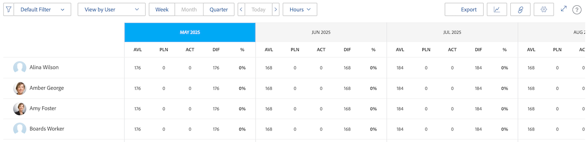
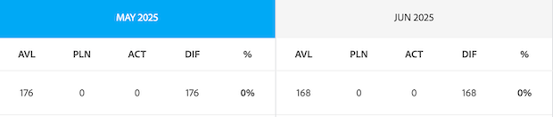
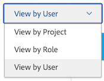
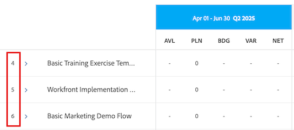
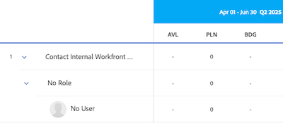
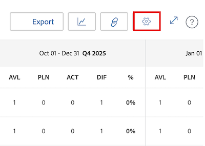
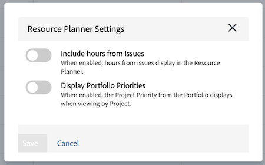
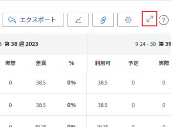
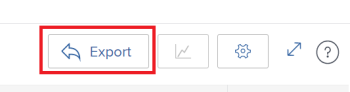

# リソースプランナーのナビゲーションの概要

<!-- Audited: 5/2025 -->

Adobe Workfront Resource Plannerを使用すると、リソースの可用性と、プロジェクトの作業を完了するために必要な予定時間を簡単に把握できます。 次に、割り当てられたプロジェクトに対するユーザーの割り当てと担当業務を管理できます。

>[!TIP]
>
>リソースプランナーで割り当てられたタスクに対するチームの割り当てを管理することはできません。

リソースプランナーを完全に使用するには、必要な前提条件を満たす必要があります。 リソースプランナーについて詳しくは、[リソースプランナーの概要](../../resource-mgmt/resource-planning/get-started-resource-planner.md)を参照してください。

以下の節では、リソースプランナーのすべてのエリアの概要を説明します。

## プロジェクトのタイムライン

リソースプランナーの上部にあるカレンダーを使用して、表示しているプロジェクトのタイムラインに移動します。 タイムラインは、デフォルトで今月から始まります。

リソースプランナーに表示しているタイムラインの期間の変更に関して詳しくは、この記事にある[期間の選択](#timeframe-selection)の節を参照してください。

## 期間の選択  {#timeframe-selection}

デフォルトでは、リソースプランナーには、現在の月から始まる、一度に3か月または4か月のリソース情報が表示されます。 表示される期間の数は、画面の幅によって異なります。

>[!TIP]
>
>リソースプランナーでは、一度に4つ以上の期間を表示することはできません。

タイムラインを移動するには、タイムライン上で前後に移動する矢印をクリックします。 次に、リソースプランナーの次の日付範囲オプションから、適切なボタンをクリックして選択できます。

<table style="table-layout:auto"> 
    <col> 
    <col> 
    <tbody> 
     <tr> 
      <td role="rowheader">週</td> 
      <td>情報を週別に表示します。 週の数は、列ヘッダーの日付の横に表示されます。 </td> 
     </tr> 
     <tr> 
      <td role="rowheader">月</td> 
      <td> 月別に情報を表示します。</td> 
     </tr> 
     <tr> 
      <td role="rowheader">四半期</td> 
      <td>四半期別に情報を表示します。 四半期の数は、列ヘッダーの日付の横に表示されます。 カスタム四半期は、リソースプランナーには表示されません。 </td> 
     </tr> 
     <tr> 
      <td role="rowheader">今日</td> 
      <td>今日の月、週または四半期に戻ります。</td> 
     </tr> 
    </tbody> 
   </table>

## プロジェクト／役割／ユーザービューの選択

情報の表示方法に応じて、リソースプランナーの表示を変更できます。

デフォルトでは、リソースプランナーはユーザービューに表示されます。 ビューは、プロジェクトビューまたは役割ビューに変更できます。 別のビューに変更すると、選択したビューがデフォルトのビューになります。

ビューを変更すると、以下の情報も変更されます。

* オブジェクトの階層（リソースプランナーの行の情報）。
* 時間割り当て情報（リソースプランナーの列の情報）。

  選択したビューに応じて、リソースプランナーに表示される列の内容に関して詳しくは、[Adobe Workfront リソースプランナーを使用したリソースの空き時間と割り当てをレビュー](../../resource-mgmt/resource-planning/resource-availability-allocation-resource-planner.md)を参照してください。

リソースプランナーに正確な情報を表示するには、一連の前提条件を満たす必要があります。 前提条件について詳しくは、[ リソースプランナーの概要](../../resource-mgmt/resource-planning/get-started-resource-planner.md)記事の「リソースプランナーでの作業の前提条件」セクションを参照してください。

リソースプランナーのビューを変更するには、「表示による表示」ドロップダウンメニューで次のいずれかのビューを選択します。

* [プロジェクト別に表示](#view-by-project)
* [役割別に表示](#view-by-role)
* [ユーザー別に表示](#view-by-user)

### プロジェクト別に表示 {#view-by-project}

リソースプランナーでプロジェクトビューを選択する際は、以下の点にご注意ください。

* 表示する権限を持つプロジェクトを表示できます。
* 初めてリソースプランナーにアクセスする場合、デフォルトフィルターでフィルターされたプロジェクトを表示できます。\
  詳しくは、「リソースプランナー](../../resource-mgmt/resource-planning/filter-resource-planner.md)」の「[ フィルター情報」を参照してください。

* プロジェクトビューから表示または書き出すことができるアイテムの数は、パフォーマンスを向上させるために制限されています。\
  詳しくは、[ リソースプランナー表示の制限](../../resource-mgmt/resource-planning/resource-planner-display-limitations.md)記事の「プロジェクトビュー」セクションの制限を参照してください。

* プロジェクトは、優先度順でプロジェクトビューに表示されます。\
  詳しくは、この記事の「[ プロジェクト計画の優先度](#project-planning-priority)」の節を参照してください。

* 各プロジェクトを展開すると、そのプロジェクトに関連付けられている担当業務を表示できます。

* 各役割を展開すると、それに関連付けられているユーザーを表示できます。 スクロールして、各プロジェクトの下にさらに多くの役割とユーザーを読み込みます。

* このビューを適用すると、役割時間、FTE またはコストが、プロジェクト時間、FTE またはコストに加算されます。

* プロジェクトビューでは、次の時間、FTE またはコストの情報を表示できます。

   * 利用可能
   * 予定
   * 予算計上
   * 差異
   * 純価

     詳しくは、[プロジェクトビューと役割ビューを使用したリソースプランナーでのリソースの予算計上](../../resource-mgmt/resource-planning/budget-resources-project-role-views-resource-planner.md)を参照してください。

### 役割別に表示 {#view-by-role}

リソースプランナーで役割ビューを選択する際は、次の点に注意してください。

* これらのプロジェクトに関連付けられた役割を表示するには、少なくともリソース管理に対する表示アクセス権と、プロジェクトに対する表示権限が必要です。
* 各役割を展開すると、プロジェクトのリストを表示でき、各プロジェクトを展開すると、プロジェクトでそれらの役割を果たすことのできるユーザーのリストを表示できます。
* パフォーマンスを向上させるために、役割ビューから表示または書き出せる項目の数は制限されています。\
  詳しくは、[ リソースプランナー表示の制限](../../resource-mgmt/resource-planning/resource-planner-display-limitations.md)の役割ビューのセクションの制限を参照してください。

* プロジェクトは、プロジェクトビューに表示されるのと同じ優先順位で、担当業務の下に表示されます。
* このビューを適用すると、プロジェクト時間、FTE またはコストが、役割時間、FTE またはコストに加算されます。
* 役割ビューでは、次の時間、FTE またはコストの情報を表示できます。

   * 利用可能
   * 予定
   * 予算計上
   * 差異
   * 純価

     詳しくは、[プロジェクトビューと役割ビューを使用したリソースプランナーでのリソースの予算計上](../../resource-mgmt/resource-planning/budget-resources-project-role-views-resource-planner.md)を参照してください。

### ユーザー別に表示 {#view-by-user}

リソースプランナーをユーザービューで表示すると、予定時間と利用可能な時間の違いやユーザーの FTE を理解したり、ユーザーがログに記録した実際の時間数を表示したりできます。

ユーザービューをリソースプランナーに適用する場合、リソースを予算化することはできません。 プロジェクトビューまたは役割ビューを使用してリソースを計上し、ユーザービューを使用して、予定作業に関してユーザーの割り当てと空き時間を確認する必要があります。

ユーザービューは、リソースプランナーのデフォルトビューです。

リソースプランナーでユーザービューを選択する際は、次の点に注意してください。

* 表示する権限を持つユーザー（最大2,000人）のうち、アクティブで、Adobe Workfrontに少なくとも1回ログインしているすべてのユーザーを表示できます。 チーム、担当業務またはプールでユーザーリストをフィルターして、それらのエンティティのみに関連付けられたユーザーを表示します。
* プロジェクト別にユーザーのリストをフィルタリングした場合、フィルタリングされたプロジェクトに関連付けられているユーザーのみが拡張され、時間情報が表示されます。\
  詳しくは、「リソースプランナー](../../resource-mgmt/resource-planning/filter-resource-planner.md)」の「[ フィルター情報」を参照してください。

* ユーザービューから表示または書き出すことができる項目の数は、パフォーマンスを向上させるために制限されています。\
  詳しくは、「[ リソースプランナーの表示制限](../../resource-mgmt/resource-planning/resource-planner-display-limitations.md)」の「ユーザービュー」セクションの制限を参照してください。

* プロジェクトは、プロジェクトビューに表示されるのと同じ優先順位で、ユーザー名の下に表示されます。\
  詳しくは、この記事の「[ プロジェクト計画の優先度](#project-planning-priority)」の節を参照してください。

* ユーザーにジョブロールが関連付けられていない場合、時間またはFTE値は「ロールなし」セクションに一覧表示されます。
* このビューを適用すると、プロジェクト時間または FTE が、ユーザー時間または FTE に加算されます。

  >[!TIP]
  >
  >ユーザービューでは、コスト別にユーザーの割り当てと可用性を表示することはできません。

* プロジェクトとタスクの権限によって、ユーザービューに表示されるユーザー名の下に表示される権限が決まります。

  次のシナリオが存在します。

   * リソースプランナーに表示されるユーザーに割り当てられているプロジェクトとタスクまたはイシューを表示する権限がない場合、これらのアイテムは「アクセスできないアイテム」セクションに一覧表示されます。 この場合、これらのセクションは「プロジェクト」セクションまたは「タスク」セクションに置き換わります。

   * プロジェクトを表示する権限がないが、プロジェクトのタスクまたはイシューを表示するアクセス権がある場合、プロジェクト、タスク、イシューは、割り当てられたユーザーの名前の下に表示されます。
   * プロジェクトを表示する権限があるが、プロジェクト上のタスクやイシューがない場合、プロジェクト名が表示され、タスクとイシューは「アクセスできないアイテム」セクションに一覧表示されます。

     詳しくは、[オブジェクトに対する共有権限の概要](../../workfront-basics/grant-and-request-access-to-objects/sharing-permissions-on-objects-overview.md)を参照してください。

* ユーザービューでは、次の時間および FTE の情報を表示できます。

   * 利用可能
   * 予定
   * 実際
   * 予定と実際の差
   * 予定配分の割合

     詳しくは、[ユーザービュー使用時のリソースプランナーでの利用可能な時間数、予定時間数、実際の時間数または FTE の表示](../../resource-mgmt/resource-planning/view-hours-fte-user-view-resource-planner.md)を参照してください。

## プロジェクト名

リソースプランナーには、次のプロジェクトが表示されます。

* 表示する権限を持っているプロジェクト。 また、アクセスレベルでリソース管理を表示するためのアクセス権が必要です。

  詳しくは、「[Adobe Workfrontのリソースを予算化するために必要なアクセス権](../../resource-mgmt/resource-planning/access-needed-to-budget-resources.md)」を参照してください。

* リソースプランナーに適用するフィルターによって制限されるプロジェクト。

  詳しくは、「リソースプランナー](../../resource-mgmt/resource-planning/filter-resource-planner.md)」の「[ フィルター情報」を参照してください。

  >[!NOTE]
  >
  >フィルターを使用して、リソースプランナーに表示するプロジェクトの数を減らすことをお勧めします。

## プロジェクト計画の優先度 {#project-planning-priority}

プロジェクトは、リソースプランナー内に優先度に従ってリストされ、最も重要なプロジェクトが最上位に表示されます。 優先度は、プロジェクト名の前に数字で示されます。

また、設定を有効にして、ポートフォリオに関連付けられている場合に、ポートフォリオに応じてプロジェクトの優先順位を表示することもできます。 詳しくは、「[ リソースプランナーでのプロジェクトの優先順位付け](../../resource-mgmt/resource-planning/prioritize-projects-resource-planner.md)」を参照してください。

## 担当業務名

以下のカテゴリの担当業務が、リソースプランナーにリストされます。

* タスクに割り当てられる担当業務。
* タスクに割り当てられていないが、プロジェクトのリソースプールに関連付けられたユーザーのプライマリ担当業務である担当業務。
* 担当業務内のタスクに割り当てられているユーザーのセカンダリ担当業務。
* プロファイル内のFTEの有効利用率を持つユーザーのセカンダリジョブの役割。\
  担当業務のFTE可用性の割合について詳しくは、[ ユーザーのプロファイルの編集](../../administration-and-setup/add-users/create-and-manage-users/edit-a-users-profile.md)を参照してください。

>[!NOTE]
>
>イシューに割り当てられたジョブロールは、「イシューからの時間を含める」設定が有効になっている場合にも一覧表示されます。 リソースプランナーでのイシュー時間数の有効化に関して詳しくは、[設定](#settings)の節を参照してください。

## ユーザー名

リソースプランナーのプロジェクトビューと役割ビューに表示されるユーザーは、プロジェクトに関連付けられたリソースプールに属します。\
詳しくは、[ リソースプールをユーザーに関連付ける](../../resource-mgmt/resource-planning/resource-pools/associate-resource-pools-with-users.md)を参照してください。

すべてのユーザー（お持ちのアクセス権の対象になっているユーザーと、Workfront に 1 回以上ログインしたユーザー）がユーザービューに表示されます。

プロジェクトビューと役割ビューでは、以下タイプの担当業務の下にユーザーが表示される場合があります。

* ユーザーのプライマリ担当業務
* セカンダリ担当業務は、以下のシナリオでは次のように行います。

   * セカンダリジョブの役割に、ユーザープロファイルのFTEの可用性の割合に対する有効な番号がある場合。
   * ユーザーがその役割のタスクに割り当てられている場合。
担当業務に対するFTEの可用性の割合について詳しくは、[ ユーザーのプロファイルの編集](../../administration-and-setup/add-users/create-and-manage-users/edit-a-users-profile.md)を参照してください。

## 「役割なし」セクションと「ユーザーなし」セクション

### 「役割なし」セクション  {#no-role-section}

ユーザーがプロジェクトに関連付けられたリソースプールに属しているが、そのユーザーに関連付けられたジョブロールがない場合、特定のジョブロールの下ではなく、「役割なし」セクションに表示されます。

「役割なし」セクションでは、ユーザーの時間を予算化することはできません。 作業の予算を計上するには、ユーザーには担当業務が 1 つ以上関連付けられている必要があります。

### ユーザーセクションなし  {#no-user-section}

チームにタスクを割り当てたり、タスクを未割り当てのままにすると、予定時間は、リソースプランナーの「役割なし」セクションに表示される「ユーザーなし」セクションの下に表示されます。 これらのタスクは、ユーザー別に表示ビューを使用する場合、リソースプランナーには表示されません。

プロジェクトのタスクに起因する予定時間数は、リソースプランナーの「ユーザーなし」セクションに表示されますが、これらの割り当てを予算化することはできません。

## フィルター

フィルターを使用すると、リソースプランナーに表示する情報を制限できます。

リソースプランナーでのフィルタリングに関して詳しくは、[リソースプランナーの情報をフィルタリング](../../resource-mgmt/resource-planning/filter-resource-planner.md)を参照してください。

## 設定 {#settings}

「設定」領域で、リソースプランナーの情報を表示または非表示にするオプションを有効または無効にできます。 リソースプランナー設定ダイアログボックスを開くには、ページの右上隅にある設定アイコンをクリックします。

ここから、次のいずれかの設定または両方の設定を有効にできます。

* **イシューの時間を含める**：イシューの予定時間が表示されます。

  この設定を有効にする際は、以下の点を考慮してください。

   * イシューに割り当てられたユーザーの名前は、イシューに関連付けられたジョブロールの下に表示されます。 プロジェクトおよび役割ビューで、ユーザーおよび担当業務の予算計上時間数を指定できます。
   * ユーザーに割り当てられたイシューは、ユーザービューの担当業務名の下に表示されます。

     >[!IMPORTANT]
     >
     >イシューの予定開始日と完了日がプロジェクトのタイムライン外の場合、イシューの予定時間はイシューの日付に従って表示されます。 例えば、プロジェクトのタイムラインが1月から3月の間で、問題のタイムラインが8月の場合、問題の予定時間数は8月の期間に表示されます。

* **Portfolioの優先度を表示**：割り当てられたPortfolioに従って、プロジェクトの優先度を表示します。

  リソースプランナーでのプロジェクトの優先順位付けについては、[リソースプランナーでのプロジェクトの優先順位付け](../../resource-mgmt/resource-planning/prioritize-projects-resource-planner.md)を参照してください。

  

## 全画面オプション

リソースプランナーをフルスクリーンで表示して、画面に表示できる情報の量を大きくすることができます。 このオプションは、すべてのビューで使用できます。

リソースプランナーをフルスクリーンで表示するには、ページの右上隅にあるフルスクリーンアイコンをクリックします。

画面が展開したら、「フルスクリーンを閉じる」アイコンをクリックして、前の表示に戻すことができます。

## 書き出しオプション

リソースプランナーの任意のビューから Excel（.xlsx）ファイルに情報を書き出すことができます。

リソースプランナーからの情報の書き出しについて詳しくは、[リソースプランナーからの情報の書き出し](../../resource-mgmt/resource-planning/export-resource-planner.md)を参照してください。

書き出したファイルの情報量を表示を管理することができます。

リソースプランナーから書き出せる情報と、書き出したファイルのルックアンドフィールを管理する方法については、[リソースプランナーの表示制限](../../resource-mgmt/resource-planning/resource-planner-display-limitations.md)を参照してください。
