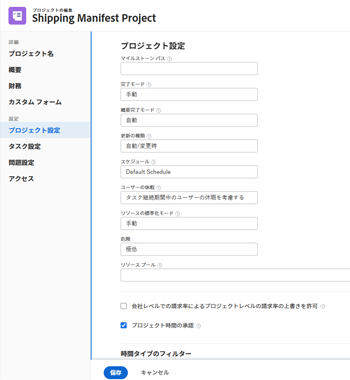
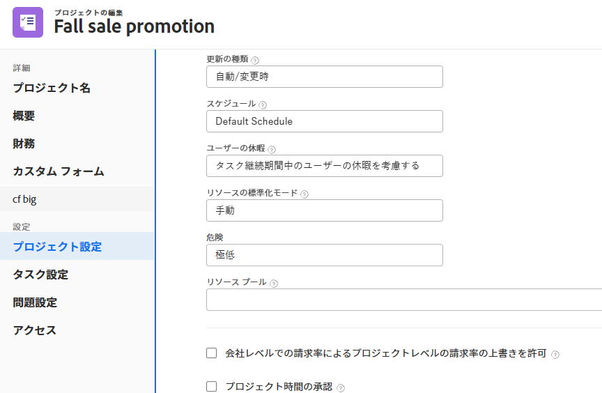

# リソースプールとプロジェクトおよびテンプレートの関連付け

<!-- drafted for bulk editing projects: keep this in yellow till this releases to ALL customers - May 1, 2023

Also - take out all the references to Preview and Prod at prod final
-->

<!--The highlighted information on this page refers to functionality not yet generally available. It is available for all customers in the Preview environment and for a select group of customers in the Production environment.-->

<!--

The sections about how to add resource pools to templates, projects are duplicated from the articles listed in those sections (Editing Projects, Creating a Template, etc).

***I decided to keep these steps here, though, because it's hard to parse through those much lunger articles for just updating this one field.)

-->

リソースプールは、Adobe Workfrontでのリソースの管理に役立つユーザーの集まりです。

資源プールを作成した後、プロジェクトまたはテンプレートに関連付けて、後でプロジェクトの資源を予算できます。

事前にリソースプールを作成し、プロジェクトに関連付け、プロジェクトを開始する前にリソースを予算設定することをお勧めします。

リソースプールの詳細については、 [リソースプールの概要](../../../resource-mgmt/resource-planning/resource-pools/work-with-resource-pools.md).

リソースプールの作成の詳細については、 [資源プールの作成](../../../resource-mgmt/resource-planning/resource-pools/create-resource-pools.md).

## アクセス要件

以下が必要です。

<table style="table-layout:auto"> 
 <col> 
 <col> 
 <tbody> 
  <tr> 
   <td role="rowheader">Adobe Workfront plan*</td> 
   <td> 
Pro 以降
 </td> 
  </tr> 
  <tr> 
   <td role="rowheader">Adobe Workfront license*</td> 
   <td> 
計画 
 </td> 
  </tr> 
  <tr> 
   <td role="rowheader">アクセスレベル設定*</td> 
   <td> 
リソースプールの管理へのアクセスを含むリソース管理へのアクセスを編集
 
プロジェクト、テンプレート、ユーザーへのアクセスを編集
 
注意：まだアクセス権がない場合は、Workfront管理者に、アクセスレベルに追加の制限を設定しているかどうかを問い合わせてください。 Workfront管理者がアクセスレベルを変更する方法について詳しくは、 <a href="../../../administration-and-setup/add-users/configure-and-grant-access/create-modify-access-levels.md" class="MCXref xref">カスタムアクセスレベルの作成または変更</a>.
 </td> 
  </tr> 
  <tr data-mc-conditions=""> 
   <td role="rowheader">オブジェクト権限</td> 
   <td> 
リソースプールを関連付けるプロジェクト、テンプレート、およびユーザーの権限を管理します
 
追加のアクセス権のリクエストについて詳しくは、 <a href="../../../workfront-basics/grant-and-request-access-to-objects/request-access.md" class="MCXref xref">オブジェクトへのアクセスのリクエスト </a>.
 </td> 
  </tr> 
 </tbody> 
</table>

&#42;保有しているプラン、ライセンスの種類、アクセス権を確認するには、Workfront管理者に問い合わせてください。

## リソースプールを 1 つのプロジェクトまたはテンプレートに関連付ける

リソースプールをプロジェクトに関連付けるのと同じ方法で、テンプレートにリソースプールを関連付けることができます。 この記事では、リソースプールをプロジェクトに関連付ける方法について説明します。

1. プロジェクトに移動し、 **詳細** アイコン プロジェクト名の横にある **編集**.

1. クリック **プロジェクト設定**.

1. でリソースプールの名前を入力し始めます。 **リソースプール** 」フィールドを選択し、リストが表示されたら選択します。\
   複数のリソースプールを 1 つのプロジェクトまたはテンプレートに関連付けることができます。

   

1. 「**保存**」をクリックします。

プロジェクトを編集し、それをリソースプールに関連付ける方法の詳細については、「 [プロジェクトを編集](../../../manage-work/projects/manage-projects/edit-projects.md).

テンプレートを編集し、それをリソースプールに関連付ける方法の詳細については、「 [プロジェクトテンプレートの編集](../../../manage-work/projects/create-and-manage-templates/edit-templates.md).

## リソースプールを複数のプロジェクトまたはテンプレートに一括で関連付ける

複数のプロジェクトまたはテンプレートを一括で編集し、同じリソースプールをすべて同時に関連付けることができます。

資源プールをプロジェクトに関連付けるのと同じ方法で、資源プールをテンプレートに関連付けることができます。

リソースプールを複数のプロジェクトに一括で関連付けるには、次の手順に従います。

1. プロジェクトのリストに移動します。
1. 複数のプロジェクトを選択し、 **編集** アイコン  をクリックします。

1. クリック **設定**.
1. でリソースプールの名前を入力し始めます。 **リソースプール** 」フィールドを選択し、リストが表示されたら選択します。\
   複数のリソースプールをプロジェクトまたはテンプレートに関連付けることができます。

   >[!NOTE]
   >
   >* 一括でテンプレートを編集する場合、選択したすべてのテンプレートに共通するリソースプールのみがこのフィールドに表示されます。 選択したテンプレートに共有リソースプールがない場合、このフィールドは空です。 ここで指定したリソースプールは、プロジェクトまたはテンプレートの個々のリソースプールを上書きします。
   >
   >* プロジェクトを一括で編集する場合、選択したプロジェクトに異なるリソースプールがある場合は、「複数値」インジケータが表示されます。 プロジェクトの資源プールを一括で追加する場合、すべてのプールが選択したプロジェクトに追加され、元の資源プールが上書きされます。

   

1. 「**変更を保存**」をクリックします。\
   資源プールがプロジェクトまたはテンプレートに関連付けられている場合、資源プランナー内のプロジェクトに対するユーザー割り当てを予算できます。\
   リソース・プランナの詳細は、 [リソースプランナーの概要](../../../resource-mgmt/resource-planning/get-started-resource-planner.md).

プロジェクトを一括編集する方法について詳しくは、 [プロジェクトを編集](../../../manage-work/projects/manage-projects/edit-projects.md).

テンプレートを一括編集する方法について詳しくは、 [プロジェクトテンプレートの編集](../../../manage-work/projects/create-and-manage-templates/edit-templates.md).
