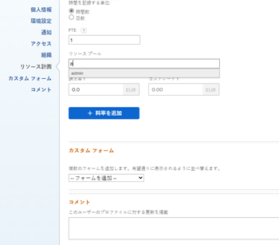

# リソースプールとユーザーを関連付ける

<!--

(NOTE: The info about how to add resource pools to users, are duplicated from the articles listed in those sections (Creating Users, etc). I decided to keep the steps here because those articles are too long to rummage through for updating just this one field.)

-->

リソースプールは、Adobe Workfront でのリソースの管理に役立つ、ユーザーのコレクションです。

リソースプールをユーザーに関連付ける前に、リソースプールを作成する必要があります。

リソースプールを作成すると、ユーザーをリソースプールに関連付けることができます。

ユーザーを設定せずにリソースプールを作成した場合は、後で新しいユーザーを編集または作成するときに、リソースプールにユーザーを関連付けることができます。

リソースプールについて詳しくは、[リソースプールの概要](../../../resource-mgmt/resource-planning/resource-pools/work-with-resource-pools.md)を参照してください。

リソースプールの作成について詳しくは、[リソースプールの作成](../../../resource-mgmt/resource-planning/resource-pools/create-resource-pools.md)を参照してください。

## アクセス要件

+++ 展開すると、この記事の機能のアクセス要件が表示されます。

<table style="table-layout:auto"> 
 <col> 
 <col> 
 <tbody> 
  <tr> 
   <td>Adobe Workfront パッケージ</td> 
   <td>
任意
</td> 
  </tr> 
  <tr> 
   <td>Adobe Workfront プラン</td> 
   <td>
標準

   
プラン
</td>
  </tr> 
  <tr> 
   <td>アクセスレベル設定</td> 
   <td> 
リソースプールを管理するアクセス権を含むリソース管理へのアクセス権の編集
 
プロジェクト、テンプレート、ユーザーへのアクセスの編集
</td> 
  </tr> 
  <tr> 
   <td>オブジェクト権限</td> 
   <td>リソースプールを関連付けるプロジェクト、テンプレート、ユーザーの権限を管理します</td> 
  </tr> 
 </tbody> 
</table>

詳しくは、[Workfront ドキュメントのアクセス要件](/help/quicksilver/administration-and-setup/add-users/access-levels-and-object-permissions/access-level-requirements-in-documentation.md)を参照してください。

+++

## リソースプールを 1 人のユーザーに関連付ける

{{step-1-to-users}}

1. リストのユーザー名の横にあるボックスをオンにし、「**編集**」をクリックします。
1. 「**リソース計画**」をクリックします。
1. ユーザーに関連付けるリソースプールの名前を「**リソースプール**」フィールドに入力し始め、表示されたらリストから選択します。\
   複数のリソースプールを 1 人のユーザーに関連付けることができます。\
   

1. 「**変更を保存**」をクリックします。

ユーザーの編集について詳しくは、[ユーザーのプロファイルの編集](../../../administration-and-setup/add-users/create-and-manage-users/edit-a-users-profile.md)を参照してください。

新しいユーザーの作成について詳しくは、[ユーザーの追加](../../../administration-and-setup/add-users/create-and-manage-users/add-users.md)を参照してください。

## リソースプールとユーザーの一括関連付け

複数のユーザーを一括で編集し、すべてのユーザーを同じリソースプールに同時に関連付けることができます。

リソースプールを複数のユーザーに一括で関連付けるには：

{{step-1-to-users}}

1. リストから複数のユーザーを選択し、「**編集**」をクリックします。
1. 「**リソース計画**」をクリックします。
1. ユーザーに関連付けるリソースプールの名前を&#x200B;**リソースプール**&#x200B;フィールドに入力し始め、表示されたらリストから選択します。\
   複数のリソースプールを複数のユーザーに関連付けることができます。

   >[!NOTE]
   >
   >このフィールドには、選択したすべてのユーザーに共通するリソースプールのみが表示されます。 選択したユーザーに共有のリソースプールがない場合、このフィールドは空になります。 このフィールドが空の場合、ここで指定したリソースプールは、個々のリソースプールを上書きします。

1. 「**変更を保存**」をクリックします。

ユーザーを一括編集する方法について詳しくは、[ユーザープロファイルの一括編集](../../../administration-and-setup/add-users/create-and-manage-users/edit-user-profiles-in-bulk.md)を参照してください。
