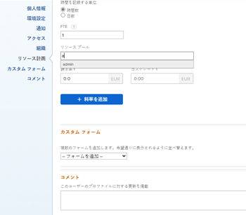

# リソースプールとユーザーの関連付け

<!--

(NOTE: The info about how to add resource pools to users, are duplicated from the articles listed in those sections (Creating Users, etc). I decided to keep the steps here because those articles are too long to rummage through for updating just this one field.)

-->

リソースプールは、Adobe Workfrontでのリソースの管理に役立つユーザーの集まりです。

リソースプールをユーザーに関連付ける前に、リソースプールを作成する必要があります。

リソースプールを作成する際に、ユーザーをリソースプールに関連付けることができます。

ユーザーを使用して資源プールを作成せずに、新しいユーザーを編集または作成する際に、後でその資源プールをユーザーに関連付けることができます。

リソースプールの詳細については、 [リソースプールの概要](../../../resource-mgmt/resource-planning/resource-pools/work-with-resource-pools.md).

リソースプールの作成の詳細については、 [資源プールの作成](../../../resource-mgmt/resource-planning/resource-pools/create-resource-pools.md).

## アクセス要件

以下が必要です。

<table style="table-layout:auto"> 
 <col> 
 <col> 
 <tbody> 
  <tr> 
   <td role="rowheader">Adobe Workfront plan*</td> 
   <td> 
Pro 以降
 </td> 
  </tr> 
  <tr> 
   <td role="rowheader">Adobe Workfront license*</td> 
   <td> 
計画 
 </td> 
  </tr> 
  <tr> 
   <td role="rowheader">アクセスレベル設定*</td> 
   <td> 
リソースプールの管理へのアクセスを含むリソース管理へのアクセスを編集
 
プロジェクト、テンプレート、ユーザーへのアクセスを編集
 
注意：まだアクセス権がない場合は、Workfront管理者に、アクセスレベルに追加の制限を設定しているかどうかを問い合わせてください。 Workfront管理者がアクセスレベルを変更する方法について詳しくは、 <a href="../../../administration-and-setup/add-users/configure-and-grant-access/create-modify-access-levels.md" class="MCXref xref">カスタムアクセスレベルの作成または変更</a>.
 </td> 
  </tr> 
  <tr data-mc-conditions=""> 
   <td role="rowheader">オブジェクト権限</td> 
   <td> 
リソースプールを関連付けるプロジェクト、テンプレート、およびユーザーの権限を管理します
 
追加のアクセス権のリクエストについて詳しくは、 <a href="../../../workfront-basics/grant-and-request-access-to-objects/request-access.md" class="MCXref xref">オブジェクトへのアクセスのリクエスト </a>.
 </td> 
  </tr> 
 </tbody> 
</table>

&#42;保有しているプラン、ライセンスの種類、アクセス権を確認するには、Workfront管理者に問い合わせてください。

## リソースプールを 1 人のユーザーに関連付け

1. 次をクリック： **メインメニュー** アイコン  Adobe Workfrontの右上隅にある

1. クリック **ユーザー**.
1. リストのユーザー名の横にあるボックスをオンにし、 **編集**.
1. クリック **リソース計画**.
1. ユーザーに関連付けるリソースプールの名前を **リソースプール** フィールドに値を入力し、リストから選択します。\
   複数のリソースプールを 1 人のユーザーに関連付けることができます。\
   

1. クリック **変更を保存**.

ユーザーの編集について詳しくは、 [ユーザーのプロファイルの編集](../../../administration-and-setup/add-users/create-and-manage-users/edit-a-users-profile.md).

新しいユーザーの作成について詳しくは、 [ユーザーを追加](../../../administration-and-setup/add-users/create-and-manage-users/add-users.md).

## リソースプールとユーザーの一括関連付け

複数のユーザーを一括で編集し、同じリソースプールをすべてのユーザーに同時に関連付けることができます。

リソースプールを複数のユーザーに一括で関連付けるには、次の手順に従います。

1. 次をクリック： **メインメニュー** アイコン  Adobe Workfrontの右上隅にある

1. クリック **ユーザー**.
1. リストから複数のユーザーを選択し、 **編集**.
1. クリック **リソース計画**.
1. ユーザーに関連付けるリソースプールの名前を **リソースプール** フィールドに値を入力し、リストから選択します。\
   複数のリソースプールを複数のユーザーに関連付けることができます。

   >[!NOTE]
   >
   >このフィールドには、選択したすべてのユーザーに共通するリソースプールのみが表示されます。 選択したユーザーに共有リソースプールがない場合、このフィールドは空になります。 このフィールドが空の場合、ここで指定したリソースプールは、個々のリソースプールを上書きします。

1. クリック **変更を保存**.

ユーザーを一括編集する方法について詳しくは、 [ユーザープロファイルの一括編集](../../../administration-and-setup/add-users/create-and-manage-users/edit-user-profiles-in-bulk.md).
