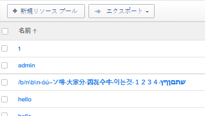
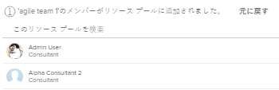

# 資源プールの作成

リソースプールは、Adobe Workfrontでリソースをより簡単に管理するのに役立つユーザーの集まりです。 リソースプールの詳細については、 [リソースプールの概要](../../../resource-mgmt/resource-planning/resource-pools/work-with-resource-pools.md).

## アクセス要件

以下が必要です。

<table style="table-layout:auto"> 
 <col> 
 <col> 
 <tbody> 
  <tr> 
   <td role="rowheader">Adobe Workfront plan*</td> 
   <td> 
Pro 以降
 </td> 
  </tr> 
  <tr> 
   <td role="rowheader">Adobe Workfront license*</td> 
   <td> 
計画 
 </td> 
  </tr> 
  <tr> 
   <td role="rowheader">アクセスレベル設定*</td> 
   <td> 
リソースプールの管理へのアクセスを含むリソース管理へのアクセスを編集
 
ユーザー、プロジェクト、テンプレートへのアクセスを編集
 
注意：まだアクセス権がない場合は、Workfront管理者に、アクセスレベルに追加の制限を設定しているかどうかを問い合わせてください。 Workfront管理者がアクセスレベルを変更する方法について詳しくは、 <a href="../../../administration-and-setup/add-users/configure-and-grant-access/create-modify-access-levels.md" class="MCXref xref">カスタムアクセスレベルの作成または変更</a>.
 </td> 
  </tr> 
  <tr data-mc-conditions=""> 
   <td role="rowheader">オブジェクト権限</td> 
   <td> 
リソースプールを関連付けるプロジェクトおよびテンプレートの権限を管理します
 
追加のアクセス権のリクエストについて詳しくは、 <a href="../../../workfront-basics/grant-and-request-access-to-objects/request-access.md" class="MCXref xref">オブジェクトへのアクセスのリクエスト </a>.
 </td> 
  </tr> 
 </tbody> 
</table>

&#42;保有しているプラン、ライセンスの種類、アクセス権を確認するには、Workfront管理者に問い合わせてください。

## リソースプールの作成 {#create-a-resource-pool}

1. リソースプールを編集するためのアクセス権を持つユーザーとしてログインします。\
   詳しくは、 [リソースプールの作成](#create-a-resource-pool).

1. 次をクリック： **メインメニュー** アイコン  Adobe Workfrontの右上隅にある

1. クリック **リソース**.
1. クリック **リソースプール** をクリックします。\
   

1. クリック **新しいリソースプール**.
1. 以下を指定します。

   <table style="table-layout:auto">
    <col>
    <col>
    <tbody>
     <tr>
      <td role="rowheader"><strong>名前</strong></td>
      <td>リソースプールの名前です。</td>
     </tr>
     <tr>
      <td role="rowheader"><strong>説明</strong></td>
      <td>これは、このリソースプールに関する簡単な説明です。 例えば、使用する目的を指定できます。</td>
     </tr>
     <tr>
      <td role="rowheader"><strong>プールのメンバー</strong></td>
      <td>
 ユーザーを個別にリソースプールに追加します。 または  リソースプールに一度に大量のユーザーを追加する場合。 ユーザーまたはユーザーのコレクションに関連付けられた次のエンティティの 1 つを追加できます。
        <ul>
         <li><strong>チーム</strong>:チームのすべてのメンバーがリソースプールに追加されます。</li>
         <li><strong>グループ</strong>:グループのすべてのメンバーは、リソースプールに追加されます。</li>
         <li><strong>役割</strong>:その役割に関連付けられているすべてのユーザーが、リソースプールに追加されます。</li>
         <li><strong>会社</strong>:会社内のすべてのユーザーがリソースプールに追加されます。</li>
        </ul>
ヒント：追加できるのは、アクティブなユーザー、チーム、 役割、 または会社。

注意：ユーザーがグループ、チーム、会社のメンバーになった場合、またはグループ、チーム、会社、またはジョブの役割がリソースプールに追加された後にジョブの役割に関連付けられた場合、新しいメンバはリソースプールに自動的に追加されません。  ユーザーが追加するチーム、グループ、会社、およびジョブの役割に属している場合、同時に、ユーザーはリソースプールに 1 回だけ追加されます。 リソースプールに追加した後に非アクティブ化されたユーザーは、ユーザーの一覧で灰色表示に表示され、非アクティブ化済みとマークされます。

</td>
     </tr>
    </tbody>
   </table>

1. （オプション） **取り消し** グループ、チーム、会社、またはジョブの役割を通じて追加されたユーザーを削除するためのリンク。

   >[!NOTE]
   >
   >リソースプール内のユーザー数に制限はありません。 ただし、リソース管理が課題になる可能性があるので、リソースプールに多くのユーザーを追加しすぎないようにすることをお勧めします。 ユーザーのリストには、リソースプール内の最初の 2,000 人のユーザーのみが表示され、アルファベット順に表示されます。

   

1. （オプション）ユーザー名の右にある X アイコンをクリックして、ユーザーを削除します。 リソースプールからユーザーを削除する方法の詳細については、「 [リソースプールからユーザーを削除する](../../../resource-mgmt/resource-planning/resource-pools/remove-users-from-resource-pool.md).
1. （オプション） **検索** オプションを使用して、リソースプール内のユーザーを検索します。
1. 「**作成**」をクリックします。
