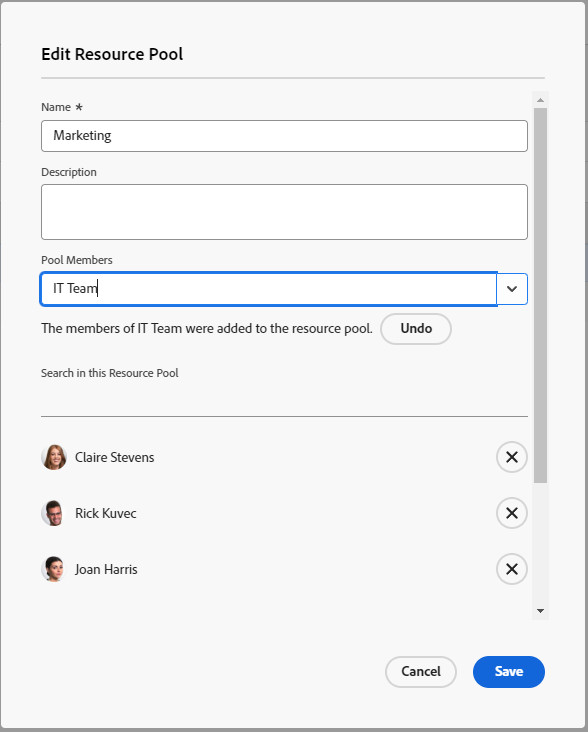

# リソースプールを作成する {#create-resource-pools}

>[!CONTEXTUALHELP]
>id="wf_resource_pools"
>title="リソース プール"
>abstract="リソースプールとは、プロジェクトの完了に同時に必要なユーザーのコレクションです。リソースプールを作成したら、それをプロジェクトとテンプレートに関連付けることができます。"

リソースプールは、Adobe Workfront でリソースをより簡単に管理するのに役立つユーザーのコレクションです。リソースプールについて詳しくは、[&#x200B; リソースプールの概要](../../../resource-mgmt/resource-planning/resource-pools/work-with-resource-pools.md)を参照してください。

## アクセス要件

+++ 展開すると、この記事の機能のアクセス要件が表示されます。

この記事の手順を実行するには、次のアクセス権が必要です。

<table style="table-layout:auto"> 
 <col> 
 <col> 
 <tbody> 
  <tr> 
   <td role="rowheader">Adobe Workfront プラン</td> 
   <td>
新規：任意

       
または

       
現在：Pro 以上
 </td> 
  </tr> 
  <tr> 
   <td role="rowheader">Adobe Workfront プラン</td> 
   <td>
新規：標準

       
または

       
現在：プラン
</td>
  </tr> 
  <tr> 
   <td role="rowheader">アクセスレベル設定</td> 
   <td> 
リソース プール管理へのアクセスを含むリソース管理へのアクセスを編集します
 
プロジェクト、テンプレート、ユーザーへのアクセスの編集
</td> 
  </tr> 
  <tr data-mc-conditions=""> 
   <td role="rowheader">オブジェクト権限</td> 
   <td>リソース プールを関連付けるプロジェクト、テンプレート、およびユーザーの権限の管理</td> 
  </tr> 
 </tbody> 
</table>

この表の情報について詳しくは、[Workfront ドキュメントのアクセス要件](/help/quicksilver/administration-and-setup/add-users/access-levels-and-object-permissions/access-level-requirements-in-documentation.md)を参照してください。

+++

## リソースプールの作成 {#create-a-resource-pool}

{{step1-to-resourcing}}

1. 左側のパネルで「**リソースプール**」をクリックします。
1. 「**新しいリソースプール**」をクリックします。

   

1. 以下を指定します。

   <table style="table-layout:auto">
    <col>
    <col>
    <tbody>
     <tr>
      <td role="rowheader"><strong>名前</strong></td>
      <td>これは、リソースプールの名前です。</td>
     </tr>
     <tr>
      <td role="rowheader"><strong>説明</strong></td>
      <td>これは、このリソースプールに関する簡単な説明です。例えば、どのような目的でそれを使用するかを指定できます。</td>
     </tr>
     <tr>
      <td role="rowheader"><strong>プールのメンバー</strong></td>
      <td>
 ユーザーを個別にリソースプールに追加します。 または リソースプールに多数のユーザーを一度に追加する場合。ユーザーまたはユーザーのコレクションに関連付けられた次のエンティティの 1 つを追加できます。
        <ul>
         <li><strong>チーム</strong>：チームのすべてのメンバーはリソースプールに追加されます。</li>
         <li><strong>グループ</strong>：グループのすべてのメンバーはリソースプールに追加されます。</li>
         <li><strong>役割</strong>：その役割に関連付けられているすべてのユーザーが、リソースプールに追加されます。</li>
         <li><strong>会社</strong>：会社のすべてのユーザーはリソースプールに追加されます。</li>
        </ul>
ヒント：アクティブなユーザー、チーム、役割、または会社のみを追加できます。
  場合によっては、ダイアログで下にスクロールして、リソースプール内のすべてのユーザーを表示する必要があります。
        
メモ：ユーザーがグループ、チーム、会社のメンバーになった場合、またはグループ、チーム、会社、または担当業務がリソースプールに追加された後に担当業務に関連付けられた場合、新しいメンバーはリソースプールに自動的に追加されません。 追加するチーム、グループ、会社および担当業務に、ユーザーが属している場合、ユーザーは同時に、リソースプールに一度だけ追加されます。 リソースプールに追加した後に非アクティブ化されたユーザーは、ユーザーのリストでグレー表示になり、非アクティブ化とマークされます。

</td>
     </tr>
    </tbody>
   </table>

1. （オプション）グループ、チーム、会社、または担当業務を通じて追加されたユーザーを削除するための&#x200B;**取り消し**&#x200B;リンクを使用します。

   >[!NOTE]
   >
   >リソースプール内のユーザー数に制限はありません。ただし、リソース管理が課題になる可能性があるので、リソースプールに多くのユーザーを追加しすぎないようにすることをお勧めします。ユーザーのリストには、リソースプール内の最初の 2,000 人のユーザーがアルファベット順で表示されます。

   

1. （オプション）ユーザーを削除するには、ユーザー名の右側にある「X」アイコンをクリックします。 リソース プールからユーザーを削除する方法の詳細については、「[&#x200B; リソース プールからユーザーを削除する &#x200B;](../../../resource-mgmt/resource-planning/resource-pools/remove-users-from-resource-pool.md)」を参照してください。
1. （オプション）「**検索**」オプションを使用して、リソースプール内のユーザーを検索します。
1. 「**作成**」をクリックします。
