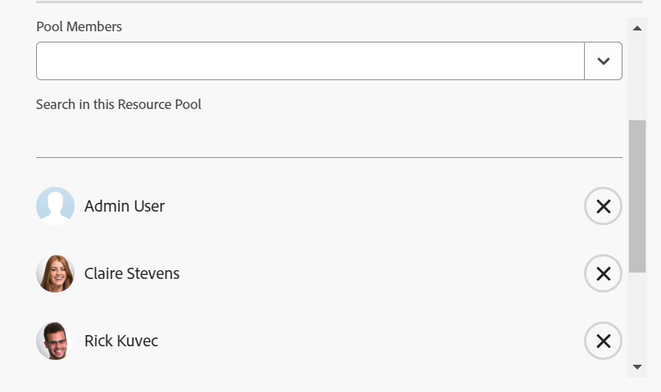

# リソースプールを作成する

{{highlighted-preview}}

リソースプールは、Adobe Workfront でリソースをより簡単に管理するのに役立つユーザーのコレクションです。リソースプールについて詳しくは、[ リソースプールの概要](../../../resource-mgmt/resource-planning/resource-pools/work-with-resource-pools.md)を参照してください。

## アクセス要件

+++ 展開すると、この記事の機能のアクセス要件が表示されます。

以下が必要です。

<table style="table-layout:auto"> 
 <col> 
 <col> 
 <tbody> 
  <tr> 
   <td role="rowheader">Adobe Workfront プラン*</td> 
   <td> 
Pro 以上
 </td> 
  </tr> 
  <tr> 
   <td role="rowheader">Adobe Workfront ライセンス*</td> 
   <td> 
プラン 
 </td> 
  </tr> 
  <tr> 
   <td role="rowheader">アクセスレベル設定*</td> 
   <td> 
リソース プール管理へのアクセスを含むリソース管理へのアクセスを編集します
 
ユーザー、プロジェクトおよびテンプレートへの編集アクセス権
 
メモ：まだアクセス権がない場合は、アクセスレベルに追加の制限が設定されていないかどうか Workfront 管理者にお問い合わせください。Workfront 管理者がアクセスレベルを変更する方法について詳しくは、<a href="../../../administration-and-setup/add-users/configure-and-grant-access/create-modify-access-levels.md" class="MCXref xref">カスタムアクセスレベルの作成または変更</a>を参照してください。
 </td> 
  </tr> 
  <tr data-mc-conditions=""> 
   <td role="rowheader">オブジェクト権限</td> 
   <td> 
リソースプールを関連付けるプロジェクトおよびテンプレートの管理権限
 
追加のアクセス権のリクエストについて詳しくは、<a href="../../../workfront-basics/grant-and-request-access-to-objects/request-access.md" class="MCXref xref">オブジェクトへのアクセス権のリクエスト</a>を参照してください。
 </td> 
  </tr> 
 </tbody> 
</table>

&#42;保有するプラン、ライセンスタイプ、アクセス権を確認するには、Workfront 管理者に問い合わせてください。

+++

## リソースプールの作成 {#create-a-resource-pool}

{{step1-to-resourcing}}

1. 左側のパネルで「**リソースプール**」をクリックします。

    プレビュー環境のサンプル画像：
   

   実稼動環境のサンプル画像：
   

1. 「**新しいリソースプール**」をクリックします。
1. 以下を指定します。

   <table style="table-layout:auto">
    <col>
    <col>
    <tbody>
     <tr>
      <td role="rowheader"><strong>名前</strong></td>
      <td>これは、リソースプールの名前です。</td>
     </tr>
     <tr>
      <td role="rowheader"><strong>説明</strong></td>
      <td>これは、このリソースプールに関する簡単な説明です。例えば、どのような目的でそれを使用するかを指定できます。</td>
     </tr>
     <tr>
      <td role="rowheader"><strong>プールのメンバー</strong></td>
      <td>
 ユーザーを個別にリソースプールに追加します。 または リソースプールに多数のユーザーを一度に追加する場合。ユーザーまたはユーザーのコレクションに関連付けられた次のエンティティの 1 つを追加できます。
        <ul>
         <li><strong>チーム</strong>：チームのすべてのメンバーはリソースプールに追加されます。</li>
         <li><strong>グループ</strong>：グループのすべてのメンバーはリソースプールに追加されます。</li>
         <li><strong>役割</strong>：その役割に関連付けられているすべてのユーザーが、リソースプールに追加されます。</li>
         <li><strong>会社</strong>：会社のすべてのユーザーはリソースプールに追加されます。</li>
        </ul>
ヒント：アクティブなユーザー、チーム、役割、または会社のみを追加できます。
  場合によっては、ダイアログで下にスクロールして、リソースプール内のすべてのユーザーを表示する必要があります。
        
メモ：ユーザーがグループ、チーム、会社のメンバーになった場合、またはグループ、チーム、会社、または担当業務がリソースプールに追加された後に担当業務に関連付けられた場合、新しいメンバーはリソースプールに自動的に追加されません。 追加するチーム、グループ、会社および担当業務に、ユーザーが属している場合、ユーザーは同時に、リソースプールに一度だけ追加されます。 リソースプールに追加した後に非アクティブ化されたユーザーは、ユーザーのリストでグレー表示になり、非アクティブ化とマークされます。

</td>
     </tr>
    </tbody>
   </table>

1. （オプション） **取り消し** リンクを使用して、グループ、チーム、会社、担当業務を通じて追加されたユーザーを削除します。  （プレビュー環境では、取り消し機能は一時的に使用できません） 

   >[!NOTE]
   >
   >リソースプール内のユーザー数に制限はありません。ただし、リソース管理が課題になる可能性があるので、リソースプールに多くのユーザーを追加しすぎないようにすることをお勧めします。ユーザーのリストには、リソースプール内の最初の 2,000 人のユーザーがアルファベット順で表示されます。

    プレビュー環境のサンプル画像：
   

   実稼動環境のサンプル画像：
   

1. （オプション）ユーザーを削除するには、ユーザー名の右側にある「X」アイコンをクリックします。 リソース プールからユーザーを削除する方法の詳細については、「[ リソース プールからユーザーを削除する ](../../../resource-mgmt/resource-planning/resource-pools/remove-users-from-resource-pool.md)」を参照してください。
1. （オプション）「**検索**」オプションを使用して、リソースプール内のユーザーを検索します。
1. 「**作成**」をクリックします。
