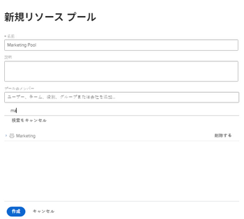

# リソースプールからのユーザーの削除

リソースプールに含めることのできるユーザー数に制限はありませんが、ユーザーのリストには最初の 2000 ユーザーのみが、アルファベット順に表示されます。

すべてのリソースプールで常に正確なユーザーのリストを確保できるように、非アクティブ化されたユーザー、役割や部門を移動したユーザーを削除することをお勧めします。

リソースプールについて詳しくは、[ リソースプールの概要](../../../resource-mgmt/resource-planning/resource-pools/work-with-resource-pools.md)を参照してください。

## アクセス要件

以下が必要です。

<table style="table-layout:auto"> 
 <col> 
 <col> 
 <tbody> 
  <tr> 
   <td role="rowheader">Adobe Workfront プラン*</td> 
   <td> 
Pro 以上
 </td> 
  </tr> 
  <tr> 
   <td role="rowheader">Adobe Workfront ライセンス*</td> 
   <td> 
プラン 
 </td> 
  </tr> 
  <tr> 
   <td role="rowheader">アクセスレベル設定*</td> 
   <td> 
リソースプールの管理へのアクセスを含む、リソース管理への編集アクセス権
 
ユーザーに対する表示以上のアクセス権
 
メモ：まだアクセス権がない場合は、アクセスレベルに追加の制限が設定されていないかどうか Workfront 管理者にお問い合わせください。Workfront 管理者がアクセスレベルを変更する方法について詳しくは、<a href="../../../administration-and-setup/add-users/configure-and-grant-access/create-modify-access-levels.md" class="MCXref xref">カスタムアクセスレベルの作成または変更</a>を参照してください。
 </td> 
  </tr> <!--
   <tr data-mc-conditions="QuicksilverOrClassic.Draft mode"> 
    <td role="rowheader">Object permissions</td> 
    <td> 
(NOTE:&nbsp;I don't think this is needed for removing users from the pool)
 
Manage permissions for the projects, templates, and users you associate the Resource Pools with
 
For information on requesting additional access, see <a href="../../../workfront-basics/grant-and-request-access-to-objects/request-access.md" class="MCXref xref">Request access to objects </a>.
 </td> 
   </tr>
  --> 
 </tbody> 
</table>

&#42;保有するプラン、ライセンスタイプ、アクセス権を確認するには、Workfront 管理者に問い合わせてください。

## リソースプールからユーザーを削除

ユーザーがリソースプールで不要になった場合は、そのユーザーをリソースプールから削除できます。

リソースプールからユーザーを削除するには、次の手順に従います。

1. Adobe Workfront の右上隅にある&#x200B;**メインメニュー**&#x200B;アイコン  をクリックします。

1. 「**リソース**」をクリックします。
1. 左側のパネルで「**リソースプール**」をクリックします。
1. リソースプールを選択し、「**編集」をクリックします。**または\
   リソースプールの名前をクリックします。

1. 削除するユーザーの名前を「**このリソースプール内を検索**」フィールドに入力します。\
   または\
   エンティティに関連付けられているすべてのユーザーを削除する場合は、会社、担当業務、チーム、またはグループの名前を入力します。\
   

1. ユーザーレベルで「x」アイコンをクリックして、リソースプールからユーザーを削除します。 それらは、表示されるすべてのリストから削除されます。\
   または\
   担当業務、グループ、チーム、または会社に関連付けられているすべてのユーザーを削除するには、担当業務、グループ、チームレベル、または会社レベルで「**削除**」をクリックします。これにより、その担当業務、グループ、チーム、または会社に関連付けられているすべてのユーザーが、リソースプールから削除されます。

1. 「**保存**」をクリックします。
